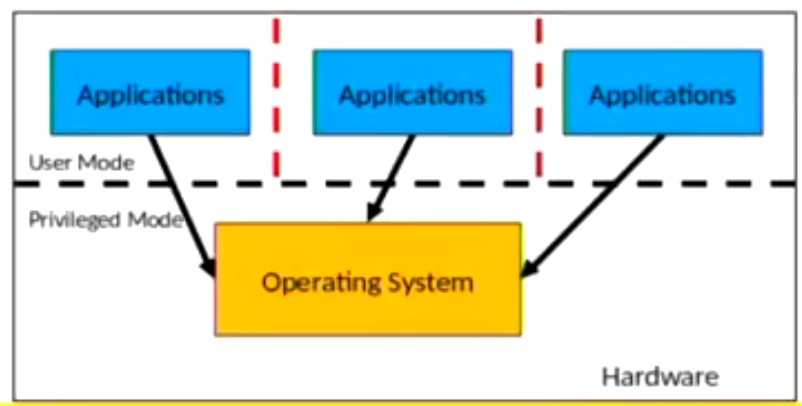
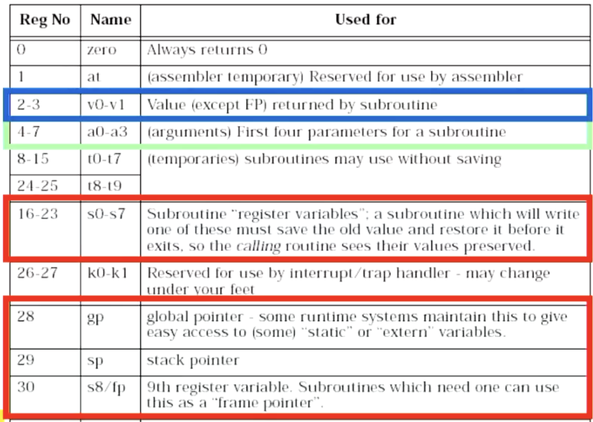

# COMP3231: Operating Systems

- [COMP3231: Operating Systems](#comp3231-operating-systems)
  - [A high level understanding of operating systems](#a-high-level-understanding-of-operating-systems)
    - [Operating system kernel](#operating-system-kernel)
    - [The structure of a computer system](#the-structure-of-a-computer-system)
      - [Privliege-less OS](#privliege-less-os)
      - [System libraries](#system-libraries)
      - [So what is OS software?](#so-what-is-os-software)
    - [The structure of an operating system](#the-structure-of-an-operating-system)
  - [Processes and threads](#processes-and-threads)
    - [Heap](#heap)
    - [Stack and stack frames](#stack-and-stack-frames)
    - [The process model](#the-process-model)
    - [The different combinations of processes and thread models](#the-different-combinations-of-processes-and-thread-models)
    - [The creation and termination of processes](#the-creation-and-termination-of-processes)
    - [Implementation of processes](#implementation-of-processes)
    - [Process and thread states](#process-and-thread-states)
    - [Scheduler (dispatcher)](#scheduler-dispatcher)
    - [The ready queue](#the-ready-queue)
    - [The thread model](#the-thread-model)
      - [What is a program counter?](#what-is-a-program-counter)
      - [Threads in processes](#threads-in-processes)
      - [Why threads over a finite state machine?](#why-threads-over-a-finite-state-machine)
    - [User level and kernel level threads](#user-level-and-kernel-level-threads)
      - [User level threads](#user-level-threads)
      - [Kernel level threads](#kernel-level-threads)
  - [Implementation of processes and threads](#implementation-of-processes-and-threads)
    - [MIPS R3000](#mips-r3000)
      - [MIPS R3000 Assembly Instructions](#mips-r3000-assembly-instructions)
      - [Load and store INSTRUCTIONS](#load-and-store-instructions)
      - [Arithmetic operations](#arithmetic-operations)
      - [Immediate operands](#immediate-operands)
      - [Reading disassembler code](#reading-disassembler-code)
      - [MIPS Registers](#mips-registers)
      - [Branching and jumping](#branching-and-jumping)
      - [Jump and link instructions](#jump-and-link-instructions)
      - [Compiler register conventions](#compiler-register-conventions)
      - [Pipelining](#pipelining)
    - [Context switch](#context-switch)
      - [Example context switch in `OS/161`](#example-context-switch-in-os161)
      - [A simplified `OS/161` thread switch](#a-simplified-os161-thread-switch)
  - [System Calls](#system-calls)
    - [A stripped down shell](#a-stripped-down-shell)
    - [System call implementation](#system-call-implementation)
      - [Memory address space](#memory-address-space)
      - [How a system call changes contexts from `user` to `kernel`](#how-a-system-call-changes-contexts-from-user-to-kernel)
      - [What is a coprocessor?](#what-is-a-coprocessor)
    - [Coprocessor 0 (CP0) and dealing with exceptions](#coprocessor-0-cp0-and-dealing-with-exceptions)
      - [`c0_cause`](#c0_cause)
      - [`c0_status`](#c0_status)
      - [`c0_epc`](#c0_epc)
      - [Hardware exception handling](#hardware-exception-handling)
    - [`OS/161` system call conventions](#os161-system-call-conventions)
    - [So what happens during a system call?](#so-what-happens-during-a-system-call)
      - [User side](#user-side)
      - [Kernel side](#kernel-side)
  - [Concurrency and synchronisation](#concurrency-and-synchronisation)
    - [A demonstrative example](#a-demonstrative-example)
    - [Critical region](#critical-region)
      - [A simple (non)-solution](#a-simple-non-solution)
      - [What about taking turns?](#what-about-taking-turns)
      - [Disabling interrupts](#disabling-interrupts)
      - [Hardware support for mutual exclusion](#hardware-support-for-mutual-exclusion)
    - [Producer-consumer problem (a.k.a bounded buffer problem)](#producer-consumer-problem-aka-bounded-buffer-problem)
      - [Implementation details](#implementation-details)
    - [Semaphores](#semaphores)
      - [Semaphore operations](#semaphore-operations)
      - [Using semaphores to implement mutexes](#using-semaphores-to-implement-mutexes)
      - [Using semaphores to solve the producer-consumer problem](#using-semaphores-to-solve-the-producer-consumer-problem)
      - [A few notes on programming with semaphores](#a-few-notes-on-programming-with-semaphores)
    - [Monitor](#monitor)
      - [Condition variable](#condition-variable)
      - [Monitor implementation of the producer-consumer problem](#monitor-implementation-of-the-producer-consumer-problem)
    - [OS/161 implementations of locks, sempahores and condition variables](#os161-implementations-of-locks-sempahores-and-condition-variables)
    - [Deadlocks](#deadlocks)
      - [Dealing with deadlocks](#dealing-with-deadlocks)
      - [Starvation](#starvation)
      - [Livelock](#livelock)
  - [File Management](#file-management)
    - [Conventions for files](#conventions-for-files)
      - [File names](#file-names)
      - [File structures](#file-structures)
      - [File types](#file-types)
      - [File access types](#file-access-types)
    - [File system calls](#file-system-calls)
    - [File organisation from the programmer's perspective](#file-organisation-from-the-programmers-perspective)
    - [Hierarchical tree structures and directories](#hierarchical-tree-structures-and-directories)
    - [File sharing](#file-sharing)
      - [Access rights](#access-rights)
      - [Simultaneous access of files](#simultaneous-access-of-files)
    - [UNIX storage stack](#unix-storage-stack)
    - [Kinds of storage devices](#kinds-of-storage-devices)
    - [File systems](#file-systems)
      - [Devices and locality](#devices-and-locality)
    - [Implementing a file system](#implementing-a-file-system)
      - [Contiguous allocation](#contiguous-allocation)
      - [Dynamic allocation](#dynamic-allocation)
      - [Inode expansion pointers](#inode-expansion-pointers)
      - [Implementing directories](#implementing-directories)
      - [Trade off in file system block size](#trade-off-in-file-system-block-size)
    - [Virtual file systems (VFS)](#virtual-file-systems-vfs)
      - [VFS Interface](#vfs-interface)
      - [`OS/161` VFS](#os161-vfs)
      - [`vnode` operations](#vnode-operations)
    - [File descriptors](#file-descriptors)
      - [Implementation of file descriptors](#implementation-of-file-descriptors)
    - [Buffer cache](#buffer-cache)
      - [Buffering disc blocks](#buffering-disc-blocks)
      - [`UNIX` buffer cache](#unix-buffer-cache)
      - [Replacement policy](#replacement-policy)
    - [Aside: `Memory Hierarchy` and caching](#aside-memory-hierarchy-and-caching)
      - [CPU Cache](#cpu-cache)
    - [Case study: `ext2` file system](#case-study-ext2-file-system)
      - [`ext2` inodes](#ext2-inodes)
      - [Max file size](#max-file-size)
      - [Finding block numbers](#finding-block-numbers)
      - [`ext2` inode summary and disk partitioning](#ext2-inode-summary-and-disk-partitioning)
      - [Superblocks](#superblocks)
      - [`ext2fs` directories, files and filetypes](#ext2fs-directories-files-and-filetypes)
      - [File system reliability](#file-system-reliability)
    - [Case study: `ext3` file system](#case-study-ext3-file-system)
      - [Concurrency in file systems](#concurrency-in-file-systems)
      - [Journaling Block Device (`JBD`)](#journaling-block-device-jbd)
  - [Memory management](#memory-management)
    - [Basic Memory Management](#basic-memory-management)
    - [Pre-virtual memory, memory management techniques](#pre-virtual-memory-memory-management-techniques)
      - [`Static/fixed partitioning`](#staticfixed-partitioning)
      - [`Dynamic partitioning`](#dynamic-partitioning)
      - [`Compaction`](#compaction)
      - [Hardware support for runtime binding and protection](#hardware-support-for-runtime-binding-and-protection)
      - [Base and limit registers](#base-and-limit-registers)
      - [Swapping](#swapping)
    - [Virtual memory](#virtual-memory)
      - [Paging and page tables](#paging-and-page-tables)
      - [Memory management unit](#memory-management-unit)
      - [Virtual address space layout for a process](#virtual-address-space-layout-for-a-process)
      - [Demand paging: saving pages on disk](#demand-paging-saving-pages-on-disk)
      - [Shared pages](#shared-pages)
      - [Address translation and virtual memory addresses](#address-translation-and-virtual-memory-addresses)
      - [Page tables](#page-tables)
      - [Inverted page table](#inverted-page-table)
      - [Hashed Page Table](#hashed-page-table)
      - [Virtual memory implementation issues](#virtual-memory-implementation-issues)
      - [Translation Look-aside Buffer (`TLB`)](#translation-look-aside-buffer-tlb)
      - [Management policies](#management-policies)
      - [Least Recently Used (`LRU`) approximations](#least-recently-used-lru-approximations)
    - [MIPS `R3000` Virtual Memory](#mips-r3000-virtual-memory)
      - [MIPS Address segmentation](#mips-address-segmentation)
      - [MIPS TLB Entries](#mips-tlb-entries)
      - [MIPS TLB Handing](#mips-tlb-handing)
      - [MIPS VM Related Exceptions](#mips-vm-related-exceptions)
      - [MIPS `TLB` Miss Handling](#mips-tlb-miss-handling)
    - [Demand paging](#demand-paging)
      - [Why demand paging?](#why-demand-paging)
      - [`Principle of Locality`](#principle-of-locality)
      - [Working set](#working-set)
      - [Thrashing](#thrashing)
  - [Multiprocessor Systems](#multiprocessor-systems)
    - [Amdahl's Law](#amdahls-law)
    - [Bus-Based Uniform Memory Access (`UMA`) Multiprocessors (Single shared bus)](#bus-based-uniform-memory-access-uma-multiprocessors-single-shared-bus)
      - [Multiprocessor caches](#multiprocessor-caches)
      - [Multi-core processor with shared-bus](#multi-core-processor-with-shared-bus)
      - [Drawbacks](#drawbacks)
    - [Symmetric Multiprocessing (`SMP`)](#symmetric-multiprocessing-smp)
      - [Dealing with synchronisation for `SMP`](#dealing-with-synchronisation-for-smp)
    - [Multiprocessor synchronisation](#multiprocessor-synchronisation)
      - [Test-and-set](#test-and-set)
      - [Spinning versus blocking](#spinning-versus-blocking)
      - [Pre-emption (pausing) and spinlocks](#pre-emption-pausing-and-spinlocks)
      - [A *hybrid* lock](#a-hybrid-lock)
  - [Scheduling](#scheduling)
    - [`CPU and I/O`-bound](#cpu-and-io-bound)
    - [Scheduling events and types of scheduling](#scheduling-events-and-types-of-scheduling)
    - [Scheduling algorithms](#scheduling-algorithms)
      - [The goals of scheduling algorithms](#the-goals-of-scheduling-algorithms)
    - [`Round-robin` scheduling](#round-robin-scheduling)
      - [Adding priority to `round-robin`](#adding-priority-to-round-robin)
      - [Starvation](#starvation-1)
    - [Traditional `UNIX` scheduler](#traditional-unix-scheduler)
    - [Multiprocessor scheduling](#multiprocessor-scheduling)
      - [Single-shared ready queue](#single-shared-ready-queue)
      - [Multiple queue SMP scheduling](#multiple-queue-smp-scheduling)


## A high level understanding of operating systems

An operating system serves multiple roles, to make the complex machine of software driven machines work.
`
> **Role 1:** The operating system is an abstract machine.
>  - Extends the basic hardware with added functionality (like an API)
> - Provides high level abstractions (more programmer friendly)
> - Hides (abstracts) the details of the hardware

So operating systems are an *abstraction of hardware functionality*.

> **Role 2:** The operating system is a resource manager
> - Responsible for allocating resources to users and processes
> - Must ensure a few things
>   - No starvation
>   - Efficiency of usage
>   - Allocation of resources w.r.t policy (FIFO, etc.)

> **Role 3:** Ensure that multiple **processes** can run at the same time
> - Multiprocessing ensures efficiency. 

So operating systems manage the many resources that exist on hardware.

### Operating system kernel

- The kernel is the portion of the operating system that is running in privilieged mode
- Contains **fundamental functionality**
  - What is required to implement other services
  - What is required to provide security
- Contains most-frequently used functions
- Also called the **nucleus** or **supervisor**.
- **Applications should not be able to interfere or bypass the operating system**.

<center>  </center>

### The structure of a computer system

<center>  </center>

- Operating systems are able to get a full picture of the memory in privilieged mode.
- Applications interact with the operating system with **system calls**.

#### Privliege-less OS
- Some embedded OSs have no privilieged component
- This means that OS functionality can be implemented, but not enforced
- All software runs together - there exists no isolation

#### System libraries

> **Functions are divided into three categories:**
> 1. Pure library functions
>   - All of the functionality is done in user space; that is, it does not require kernel mode.
> 2. Hybrid library functions
>   - Parts of the functionality are completed in user space, and other parts are completed in kernel space.
> 3. System calls
>   - The functionality is purely done in kernel space.
> 
> They are differentiated on their need of *priviliege* to complete the function's task.

- System libraries are *just libraries*. They are library of support functions.
- Only a **subset of library functions** are actually system calls.
  - `strcmp, memcpy` are **pure library functions**
    - they are not direct system calls, and manipulate memory in application
  - `open, close, read, write` are **system calls**
    - They cross the user-kernel boundary (i.e read from disk)
    - The user-level syscall implementation is focused on passing requests to the OS
  - `fprintf, malloc` are **hybrids**
    - only perform system calls where necessary

#### So what is OS software?
- Fundamentally, OS functions the same way as **ordinary computer software**
  - It is machine code that is executed (the same as any other application)
  - **But,** it has more privilieges (extra instructions and access)
- Operating system relinquishes control of the processor to execute other programs
  - Restablishes control after
    - System calls
    - Interrupts (like timer interrupts)

### The structure of an operating system
In an ideal world, there exists a nicely layered operating system structure, that goes outwards:
1. Processor allocation and multi-programming
2. Memory management
3. Devices
4. File systems
5. Users (also known as the shell)

> In reality however, operating systems tend to be *spaghetti nests*. Each layer is tangled up with other layers. The division of layers is not entirely clear in modern operating systems.

## Processes and threads

> **Process** (or tasks/jobs)
> - Also called a task or job
> - Memory image of an individual program
> - "Owner" of resources allocated for program execution
>   - So "owns" some stuff - like access to a file, etc.
> - Encompasses one or more threads
> - Contain *atleast* three segments:
>
>   1.`Text` (contains the code)
> 
>   2.`Data` (global variables)
> 
>   3.`Stack` (activation records of procedures/function/method)
>
> <center>  </center>
>
> > **The stack grows downwards, and the data (heap) grows upwards**.

> **Threads**
> - Unit of execution
> - Can be traced
>   - List the sequence of instructions that execute
> - Belongs to a process
>   - Executes within it
> - Has a *stack*

### Heap
> **Heap**
>
> The heap is a dynamically allocated portion of memory used by programs for manual memory allocation.
>
> The `memory allocator` is a part of the system responsible for managing the heap. The memory allocator (called by `malloc` in C), finds free memory to assign to your desired memory address.
> - It keeps tracks of used portions of the heap.
> - Avoids fragmented heaps; and so combines free blocks and splits big ones to adhere to smaller requests
> - Allows for the freeing of memory, which marks portions of the heap for reuse

### Stack and stack frames
> **Stack**
>
> The stack is a portion of memory that is reserved for a single thread. This memory is alloacted by the process, and is dynamic in size.
>
> **Stack frames**
>
> Stack frames are specific portions of the stack which are created for **each** function call. Stack frames consist of resources that are required by the functions
> - Function parameters
> - Local variables
> - Return address (where the function returns to)
> - Saved registers (for function returns)
>
> <center> </center>
> Stack frames are defined by two main pointers:
> 1. Frame pointer: start of current stack frame
> 2. Stack pointer: end of current stack frame
> 
> ```c
> void foo(int x) {
>   int y = 5;
>   printf("%d\n", y);
>   return x;
> }
> 
> int main(void) {
>   int x = 10;
>   foo(x);
> 
>   return 0;
> }
> ```
> ```
>| Stack Frame for foo()  |
>|------------------------|
>| local y = 5            |
>| parameter x = 10       |
>| return addr to main()  |
>|------------------------|
>| Stack Frame for main() |
>```
> In the above program, we see the `main()` function calls a `foo()` function - and the `foo()` function's stack frame is inserted on top of the stack.
> Once the `foo` function finishes running, the function will return to the memory address of the `main` function. The returned value will be stored in a register, which can be accessible by the `main` function (but is currently not accesed).

### The process model
- Given that multiple processes wish to run at the same time, machines are constrained by their hardware.
- To simulate the *simultaneous running* of these processes, the **dispatcher** decides to switch processes
- Since these switching events happen at tiny time frames - the processes appear to be running simultaneously.

<center> </center>

### The different combinations of processes and thread models

1. Single process, single thread
   1. MSDOS, simple embedded systems
2. Single process, multiple threads
   1. OS/161 (as used in `COMP3231`)
3. Multiple processes, single threads
   1. Traditional UNIX
4. Multiple processes, multiple threads
   1. Modern UNIX, Windows

### The creation and termination of processes

> The following events are key events that spawn processes
> 1. System initialisation
>   1. Foreground processes 
>      - showing the user what it's doing
>   2. Background processes (also called **daemon**) 
>      - not showing the user what it's doing
> 2. Execution of a process creation system call by a running process
>   1. New login shell for an incoming ssh connection
> 3. User request to create a new process
> 4. Initiation of a batch job

> **Conditions which terminate processes**
> 1. Normal exit (voluntary)
> 2. Error exit (voluntary)
> 3. Fatal error (involuntary)
> 4. Killed by another process (involuntary)

### Implementation of processes
A processes' information is stored in a process control block (PCB). 
- The PCBs form a **process table**
- Reality can be more complex (hashing, chaining, etc.)

Within the process table, the entries hold **information about the processes and their state**.
<center> </center>

### Process and thread states

<center> </center>

1. `Running -> Ready` 
    - Occurs generally when the CPU blocks the processes
    - Could be done by `Yield()` - which yields the resources for other processes
2. `Running -> Blocked`
    - Waiting for input
      - File, network
    - Waiting for a timer (alarm signal)
    - Waiting for a resource to become available

### Scheduler (dispatcher)
> **Schedulers have to choose which process to run next - how does it do this?**
>
> In general, a *queue* is used - see below for it's iterations.

### The ready queue
<center>  </center>

The most simple implementation of a scheduler is a queue. But what about **blocking** and **unblocking** events? If there is a blocked process in front of the queue - this could slow down the queue. So we extend the idea to **two queues** - one for ready processes and another for blocked ones.

<center> </center>

But *many more events* than blocking can occur. So rather, for $n$ events, we create $n$ different queues for each of these events. 

<center>  </center>

### The thread model

What is the difference between three single-thread processes and one multi-threaded process? **Not much**, atleast to the kernel.

> **Per-process items:**
> - Address space
> - Global variables (**heap**)
> - Open files
> - Child processes
> - Pending alarms
> - Signals and signal handlers
> - Accounting information
>
> **Per-thread items:**
> - Program counter
> - Registers
> - Stack
> - State

*Per-process* items are shared by threads, whereas per-thread items are associated with each thread.

> **Thread model example**
> <center>  </center>
>
> In the above example of a burger restaurant, there exists the different threads that may exist - these jobs are isolated to single threads. 

#### What is a program counter?

> A program counter is a special *register* that keeps track of which memory address to execute at next.
>
> The program counter increments during normal execution by 4 bytes.
>
> During a *jump* - then return address is stored in another special register, and the program counter jumps to the specified location (and also increments there). 

#### Threads in processes

> **Threads in processes**
> <center>  </center>
>
> - Each thread has it's own stack, which holds their own local variables. 
> - Stacks are *not* necessarily sequential in a multi-threaded process.
>   - They are in fact often spread far apart in memory.
>   - Stack memory can also create **race conditions** - as two threads can attempt to malloc the same portion of memory at the same time.
> - The threads share the process' **heap**. In the heap, there exists global variables, which are of course shared between the threads.
>   - Of course, concurrency is an issue.

#### Why threads over a finite state machine?

There exists a *finite state machine* model of computational tasks, where interrupts are used in states to complete tasks. Why do we prefer threads over an FSM approach?

- Simpler to program than a state machine
- Less resources are associated with them than multiple **complete processes**.
  - Threads are *cheaper to create and destroy*.
  - Threads can also share global memory between threads.
- Threads waiting for I/O can be overlapped with computing threads
  - On a **uniprocessor**, if all threads are *compute bound* (that is, running on the CPU), then there is no performance improvement.
- Threads can take advantage of the parallelism available on machines with more than one CPU (a **multiprocessor**).

### User level and kernel level threads

#### User level threads

> User level threads are implemented at user-level.
> - User-level thread control block (TCB), ready queue, blocked queue and dispatcher
> - Kernel has no knowledge of the threads (and only sees the running process)
> - **If a thread waits for a resource from another thread, the dispatcher within the process waits**
>
> <center>  </center>
>
> **Pros:**
> - Thread management and switching faster at user level
> - Dispatcher algorithm can be tuned to application
> - Can be implemented in any OS
> - Can support a **massive number of threads**
> 
> **Cons:**
> - Threads have to `yield()` manually (no kernel level timer interrupts)

#### Kernel level threads

> Threads are implemented by the kernel.
> - TCBs are stored in the kernel
>   - A subset of information in a traditional PCB
>   - TCBs have a PCB (process control block) associated with them
> - Thread management calls **are managed by system calls.**
>   - `create, wait, exit`, etc.
>
> **Pros:**
> - Preemptive multithreading
>   - User level does not need to worry about threads blocking eachother; this is the OS' issue
> - Parallelism
>   - Can overlap blocking I/O (as the OS can manage this with kernel access)****
> 
> **Cons:**
> - Kernel creation and destruction require *kernel entry*, which may be **expensive**.

## Implementation of processes and threads
### MIPS R3000
#### MIPS R3000 Assembly Instructions
> - Load/store architecture
> - All instructions in MIPS are encoded in 32-bit.
> - **RISC** (Reduced Instruction Set Computer) architecture
>   - Fixed length instructions
>   - Few, simpler instructions
>   - Instructions that execute in one cycle
#### Load and store INSTRUCTIONS
> ```mips
> sw r4, (r5)
> lw r3, (r7)
> ```
> In the above code, we `store` a *word* (4 bytes) in `r4` into the memory address of `r5`. Similarly, we load a word in the memory address of `r7` into `r3`.
>
> There is a **delay of one instruction** after a load before data is available in the *destination register*
> There of course exists many different data sizes, such as `b` (byte), `h` (half byte), etc.

#### Arithmetic operations
> ```mips
> add r3, r2, r1  # r3 = r2 + r1
> sub r3, r2, r1  # r3 = r2 - r1
> move r2, r1     # r2 = r1
> ```
>
> All instructions in MIPS are encoded in 32-bit.
#### Immediate operands
> 
> Some instructions have immediate operands. Immediate values are constants encoded in the instruction itself.
> These values can **only be 16-bit values**.
> 
> ```mips
> addi r2, r1, 2048   # r2 = r1 + 2048
> li r2, 1234         # load immediate r2 = 1234
> ```

#### Reading disassembler code
> 
> Disassemblers translate machine code back into assembly language. Consider the following lines of disassembler code.
> ```mips
> # Disassembling a = a + 1
> lw r4, 32(r29)      # r29 is the stack pointer
> li r5, 1
> add r4, r4, r5
> sw r4, 32(r29)
> ```
> `32(r29)` is accessing the value of 32 bytes from the top (or the bottom, depending on implementation) of the stack pointer.
> So in this case, `a` lives 32 bytes from the top or the bottom of the stack pointer.
> 
#### MIPS Registers
> - 32 general-purpose registers
>   - `r0` is hardwired to `0`.
>   - `r31` is the link register for jump-and-link instruction
> - `HI/LO`
>   - 2x 32-bits registers
>   - Used for the storing of multiplication and division results
> - Program counter (`PC`)
>   - not directly visible
>   - modified by **jump** and **branch** instructions
>   - keeps track of the point of executions

#### Branching and jumping
> - Branching and jumping in MIPS have a **branch delay slot**
>   - Therefore, the instruction following a branch or jump is always executed prior to destination of jump.
> ```mips
> li r2, 1        # r2 = 1
> sw r0, (r3)     # r3 = r0
> j 1f          
> li r2, 2        # r2 = 2; there is a delay, so this gets ran
> li r2, 3        # r2 = 3; but this gets skipped over, as it jumps
> 
> 1: sw r2, (r3)  # this is 1f

#### Jump and link instructions
Consider the following code
```mips
0x10: jal 1f          # jump to label 1
0x14: nop             # delay slot - essentially just passing the
                      # jump delay
0x18: lw r4, (r6)

1: 
sw r2, (r3)
....
jr r31          # r31 holds the address to return to; jump back
                # after function finishes. $ra is also used.
nop             # delay slot
```
When `jr r31` is called, the program counter is incremented `PC + 8` (as the next instruction in sequence is called).

Note that the program counter is left at `0x10` before we go to label 1. So when we return to label 1, we should be at `0x18`. So we `+ 8` (avoiding the jump delay).

#### Compiler register conventions

We only have 32 registers - and these registers must be shared for:
- Local variables
- Argument passing
- Function call results
- Stack pointer

What is the convention of splitting these registers up?
<center>  </center>

#### Pipelining

MIPS pipelining allows for overlapping instructions to be ran. This is in fact the reason for the delays in loading words and branch delays.
<center>  </center>

In the diagram above, we can see three instructions. Consider some of the scenarios that may occur during pipelining:
- What if an instruction relies on an instruction that hans't finished running yet?
  - The CPU just stalls a cycle and waits.
  
> **Example of pipelining stalls**
>
> Consider the figure above. In instruction there, is a ready before instruction 1 finishes calculating and storing.
>
> If instruction 2 relies on instruction 1 - it would wait at the read stage before it continues after instruction 1 continue. This means that a cycle is wasted (as it waits at the read).

### Context switch
> A **context switch** can refer to
> 1. A switch between threads
>    - Involving saving and restoring of state associated with a thread
> 2. A switch between processes
>    - Involving the above, plus extra state associated with a process
>
> A switch between process/threads can happen any time the OS is invoked
> - On a syscall (the process/thread is blocked, so switch)
> - On an exception (the process is killed, so switch)
> - On an interrupt
>
> **A thread switch can happen between any two instructions**

Context switches *should be* transparent for **processes and threads**. 
> This means that when a process/thread should not notice that something else was running in the mean time. This means that we have to save the process' *context*.

#### Example context switch in `OS/161`

<center>  </center>

> **Trapframe**
>
> A trapframe is a snapshot of the CPU's state at the time a *trap* (or an entry into the kernel) occurs.
>
> This allows the kernel to refer to the CPU's state in memory, which is useful mainly for **system calls** and **context switches**.

Elements of a context switch
1. Kernel state: the kernel stack frame for kernel-level switching functionality
2. `C` activation stack: the stack frame for the user-level switching function
3. `trapframe`: the original CPU state when the switch was called

Different threads/processes that wish to context switch must build a trap frame, a `C` activation stack and a kernel state before context switching. **These bits of memory make the context switch transparent**, as all of the registers can be re-established through the trapframe.

#### A simplified `OS/161` thread switch

```c
static void thread_switch(threadstate_t newstate, struct wchan *wc) {
  struct thread *cur, *next;
  cur = curthread;            // the current thread is in a globla variable

  do {
    next = threadlist_remhead(&curcpu->c_runqueue); // get the first thread from the thread list
    if (next == NULL) {
      cpu_idle();
    }
  } while (next == NULL);

  switchframe_switch(&cur->t_context, &next->t_context); // a context object is passed through for both the current and next thread, to be stored.
}
```

> **What happens in** `switchframe_switch`?
>
> In `switchframe_switch`:
> 1. Allocates stack space for 10 registers
> 2. Saves the registers
> 3. Store the **current stack pointer** in the current (switched) thread.
> 4. Load the **current stack pointer** in the new (switching) thread.
> 5. Restore the 10 registers (essentially unwinding the other thread)

## System Calls

### A stripped down shell

```c
while (true) {
  type_prompt();
  read_command(command, parameters);  // input from terminal

  if (fork() != 0) {
    waitpid(-1, &status, 0);          // wait for child to exit
  } else {
    execve(command, parameters, 0);   // execute command
  }
}
```
Processes are spawned off using `fork()`, and then runs the process (by replacing the data associated with a process) using `execve()`.

### System call implementation

#### Memory address space

> There exists specific memory addresses only available in kernel-mode, which allows for the kernel mode to safely access memory without worrying about clobbering user-level memory.

#### How a system call changes contexts from `user` to `kernel`
1. The system call is invoked, and we switch from `user` to `kernel`
2. The user-level stack pointer is saved and a kernel stack pointer is initilisatd
3. The user-level program counter is saved and the program counter is set to the kernel entry point

#### What is a coprocessor?
> A co-processor is a computer processor which *supplements* the functions of the primary processor.
>
> Co-processors generally provide special functionality to the CPU, and work in parallel to provide different services. Some examples of these services could be:
> - Exception handling
> - Floating point arithmetic
> - etc...

### Coprocessor 0 (CP0) and dealing with exceptions

> **Coprocessor 0** is specifically for
> - Dealing with exceptions and interruptions
> - Translation management
>
> CP0 is manipulated using `mtc0` (move to) and `mfc0` (move from) instructions. What registers exist in CP0?
>
> <center>  </center>

#### `c0_cause`

<center>  </center>

<center>  </center>

#### `c0_status`

<center>  </center>

#### `c0_epc`

`c0_epc` points to the address to start the execution after the exception or interrupt is dealt with.

#### Hardware exception handling

> **Entering an interrupt/exception**
> 
> In **MIPS R3000**, there exists special memory addresses that the program counter will jump to after an exception.
>
> Once an interrupt or an exception occurs, the following occurs:
> 1. The program counter value that **was not able to run** is stored in the `c0_epc`
> 2. Interrupts are disabled (so that the current interrupt can be dealt with).
>     - Obviously interrupting the interrupt handler is not feasible.
> 3. Kernel mode is set, and inside `c0_cause`, some information is set to give context on why the interrupt occured.
> 4. The standard exception vector is placed into the program counter (`0x80000080`).

> **Leaving an interrupt/exception**
>
> The saved `c0_epc` is fetched (to get the next program counter in line before the execution).
>
> We `jr` to the address first, and then in the delay slow, `rfe` (or return from exception). This lets us **leave kernel mode**, as well as return to the previous settings before the interrupt/exception occured.

### `OS/161` system call conventions

> Arguments are passed and returned via the normal C function calling convention
>
> Additionally:
> 1. Reg `v0` contains the system call number
> 2. On return, reg `a3` contains
>     - `0`: if success, `v0` contains successful result
>     - not `0`: if failure, `v0` has the `errno`
>
> So check `a3` for if an error occured - and then check `v0` for the `errno`.

### So what happens during a system call?

#### User side

Take `read()` as an example, and consider the following MIPS example
```mips
read:
  # appropiate registers are reserved
    # arguments a0-a3, return address ra and more

  j syscall                   # jump to syscall
  li v0, 5                    # load in 5 (the syscall number of read)

syscall:
  syscall                     # generates a syscall exception
                              # this allows a 'trap' into the OS
                              # or more simply, an entry into the kernel
  beqz a3, jump to return     # if not error, return immediately
  nop
  lui at, 0x100               # get the errno
  sw v0, 0(at)                # store the errno
  li v1, -1                   # store -1 at both possible returns
  li v0, -1
  
  jr ra                       # return
```
- To the caller's perspective, the `read()` system call behave slike a normal function call
- However the actual function implements its own convention agreed upon with the operating system
  - For example, the `OS` may agree to not clobber certain registers

#### Kernel side
- Things to do:
  - save userland stack pointer
  - switch to kernel stack
  - preserve registers by saving to memory (on kernel stack)
  - leave saved registers somewhere accessible
  - do the `read()`
  - restore registers
  - switch back to user stack
  - return to application

```mips
exception:
  # k0, k1 are registers available for kernel use

  move k1, sp               # save user sp in k1
  mfco k0, c0_status        # get status register
  andi k0, k0, CST_Kup      # check we were in usermode
  beq k0, $0, 1f            # if clear, we alreaedy have stack
                            # so skip getting the sp
  nop

  # If in user mode.
  la k0, curkstack          # otherwise, get the kernel stack
  lw sp, 0(k0)              # load in the kernel stack
  nop

  # Common step.
1:
  mfc0, k0, c0_cause        # load exception cause
  j common_exception        # skip to common code
  nop
```
Now we had to common code for all exceptions.
```mips
common_exception:
  # allocate stack space for 37 words to hold trap frame
  # plus for more words for a minimal argument block
  # a0 - a3

  addi sp, sp, -164

  sw ra, 160(sp)            # dummy for gdb
  sw s8, 156(sp)            # save s8
  sw sp, 152(sp)            # dummy for gdb
  sw gp, 148(sp)            # save gp
  ...

  # gdb sometimes gets confused, so we have to create some dummies.

  sw k1, 152(sp)            # real saved stack-pointer
  nop

  mfc0 k1, c0_epc           # Coprocessor reg. 13 == PC for exception
  sw k1, 160(sp)            # real saved PC

  # above, we are essentially creating a trap frame.
```
Now we get to the `C` side of the `syscall`
```c
/*
  this is the general trap (exception) handling function for mips.
*/
void
mips_trap(struct trapframe *tf)
{
  u_int32_t code, isutlb, iskern;
  int save_spl;

  // make sure trap frame was constructed properly
  assert(sizeof(struct trapframe) == (37 * 4));

  // save value of curspl, belonging to older context
  savespl = curspl;

  // interrupts should be off - so SPL_HIGH
  curspl = SPL_HIGH;
}
```

Now the C code deals with whatever caused the exception
- `syscall`
- `interrupt`
- page fault
- modificatin of the trap frame

and `mips_traps` eventually returns, back to MIPS

```mips
exception_return:
  lw t0, 20(sp)         # status register in t0
  nop
  mtc0 t0, c0_status    # store it back to coprocessor 0

  lw t1, 28(sp)         # get lo register
  lw t0, 32(sp)         # get hi register
  mtlo t1               # restore lo register
  mthi t0               # restore hi register

  # below here, we load all the general registers from the
  # trapframe.
  ...

  lw gp, 148(sp)        # restore global pointer
  lw s8, 156(sp)
  lw k0, 160(sp)

  lw sp, 152(sp)        # we finally load the stack pointer

  jr k0                 # return
  rfe
```


## Concurrency and synchronisation

> In this section, we consider:
> - What is **concurrency**, and what issues does it improve or pose in operating systems and multithreaded applications
> - What is a *critical region*?
> - How do mutual exclusions of critical regions solve concurrency issues?
>   - How do we implement mutual exclusions *correctly* and *efficiently*?
> - Identify a **producer consumer bounded buffer** problem


### A demonstrative example

> Consider that `count` is a global variable shared between two threads, `t` is a local variable. After increment and decrement complete, what is the value of count?
>
> ```c
> void increment() {
>   int t;
>   t = count;
>   t = t + 1;
>   count = t;
> }
> 
> void decrement() {
>   int t;
>   t = count;
>   t = t - 1;
>   count = t;
> }
>```

In the code example above, there exits a **race condition**.

> A **race condition** is a type of concurrency bug that occurs when the behaviour of a program depends on the timing or interleaving of threads and processes. In particular, this occurs when the timing is **uncontrolled**.

In the above, two races occur:
1. The initial *read* of count
2. The final *write* of count

Either of these events can cause the program to run unexpectedly.

### Critical region

> A **critical region** is a region of code where **shared resources are accessed**. Furthermore, a critical region's **correctness** relies on the shared resource *not being concurrently modified*.
>   - This can be variables, memory, files, etc.
>
> *Uncoordinated* entry to the critical region results in a race condition.
>
> <center>  </center>

So how do we provide a solution to these critical regions? Some things we want to satisfy are:
1. Mutual exclusion
2. No assumptions made about *speeds* or *numbers* of CPUs
3. Progress
    - No process outside it's critical region may block another process
    - So other processes that aren't affecting the critical region keep running
4. Non-starvation
    - No process waits forever to enter it's critical region

#### A simple (non)-solution

What if we just created a global `lock` variable?

```c
while (true) {
  while (lock == 1)
    ;
  lock = 1;
  critical();
  lock = 0;
  non_critical();
}
```
But now `lock` itself creates a critical region - if one thread enters the loop at the same time another thread to modify the thread, then the `critical()` function may be executed by two threads at the same time.

#### What about taking turns?

Now what about creating a `turn` variable, which indicates which thread's turn the critical region is being offered to?
```c
while (true) {
  while (turn != 0)
    ;
  critical_region();
  turn = 1;
  noncritical_region();
}

while (true) {
  while (turn != 1)
    ;
  critical_region();
  turn = 0;
  noncritical_region();
}
```
Now, **this works**. But, there exists a few issues with performance
- Processes must wait it's turn even while the other process is doing *something else*.
  - With many processes, must wait for everyone to have a turn.
  - Poor solution when processes require the critical solution at differing rates
    - If two threads access `critical_region()` at a ration of `10:1`, the turn taking protocol is clearly inefficient.
- The turns only change once the process **uses the critical region**.

#### Disabling interrupts
- Before entering a critical region, we disable interrupts (not allowing context switching)
- After leaving the critical region, enable interrupts

```c
while (true) {
  disable_interrupts();
  critical();
  enable_interrupts();
  non_critical();
}
```
This essentially makes the computer single threaded during the critical region, **but**:
- Only available in the kernel
- Delays **every other process**, even with no contention
- Does not work on a multiprocessor (as it can only stop interrupts on a single core)

#### Hardware support for mutual exclusion

Consider two instructions called `test` and `set`.
- Test memory cell `X` and set memory cell `X`
- Can be used to implement lock variables correctly
  - Loads the value of the lock
  - If `lock == 0`:
    - Set the lock to 1
    - Return the result 0 - **we've acquired the lock**
  - If `lock == 1`
    - return 1 - another thread/process has the lock
- **Hardware guarantees that the isntruction executes atomically** (that there exists no interruption).

```mips
enter_region:
  TSL REGISTER, LOCK      # copy lock to register, set to 1
  CMP REGISTER, #0        # is the lock 0?
  JNE enter_region        # if lock is non zero, lock was set, so loop
  RET                     # otherwise return to caller

leave_region:
  MOVE LOCK, #0           # store 0 into lock (allow other threads to enter)
  RET                     # return to caller
```

This is easy to show that it is correct, and it is *available at the user-level*. However:
- There are **busy waits** (also termed a `spin lock`)
  - Consumes CPU (while in the waiting loop)
  - Starvation is possible when a process leaves its crtiical section and more than **one process is waiting.**

> **Improving the busy-wait inefficiency**
> 
> To deal with the busy-wait problem, it is more efficient to call the `sleep` system call to block, instead of busy-waiting. When the critical region is free, the event generator calls wakeup to unblock the sleeping process.
>
> This means that other processes that **do not rely on the critical region**, are able to continue running.
> > **Interactions with the event generator**
> >
> > You must alert the event generator (which is another process) that the process is sleeping - as once the event that awakes the process occurs, the event generator must know to awake the process.

### Producer-consumer problem (a.k.a bounded buffer problem)

> **The problem**
>
> The problem has two components.
> 1. A producer **produces** data items, and stores the items in a buffer
> 2. A consumer **takes** the items out of the buffer and consumes them
>
> <center> </center>

There are clearly a few issues:
1. We must keep an accurate count of items in the buffer
    - Producer
      - should sleep when the buffer is full
      - and wake up whne there is empty space in the buffer
        - **Consumer** can call wakeup when it consumes the first entry of the full buffer
    - Consumer
      - should sleep when the buffer is empty
      - and wake up when there are items available
        - **Producer** can call wake up when it adds first item to the buffer

#### Implementation details
```c
// Some pseudo code

int count = 0
#define N 4 /* buffer size*/

prod () {
  while (true) {
    // producer should produce an item
    item = produce();
    if (count == N)
      sleep(prod);

    insert_item(item);
    count++;
    if (count == 1)
      wakeup(con);
  }
}

con() {
  while (true) {
    // consumer can go straight to sleep condition
    // if no items to consume then sleep.
    if (count == 0)
      sleep(con);

    // process an item from the buffer
    remove_item();
    count--;

    // if there is space, wake up
    if (count == n-1)
      wakeup(prod);
  }
}
```

There is certainly critical regions particularly with the `count` variable. Furthermore, the shared buffer itself can cause issues, as the consumers may read in partially produced data.
```c
int count = 0;
lock_t buf_lock;
#define N 4

...
prod() {
  while (true) {
    ...
    acquire_lock(buf_lock);
    insert_item(item);
    count++;
    release_lock(buf_lock);
    ...
  }
}

con() {
  while (true) {
    ...
    acquire_lock(buf_lock)
    remove_item();
    count--;
    release_lock(buf_lock);
    ...
  }
}
```
Are we done? We still haven't guarded the `count` variable properly - in particular, the consumer may be permanently asleep if:
1. Before the consumer is able to commit to sleep...
2. The producer produces an item, and then commits this to the buffer
3. But then the consumer commits to sleep (while `count` is still `0`)
4. And now the buffer is **never consumed**, so the consumer is asleep forever.

So is the solution to just extend the lock to include the `count` conditions? **No**.
- A pretty obvious deadlock situation where either producer or consumer **sleeps** with the lock occurs
- If this occurs, there can be no progress occuring

### Semaphores
> Semaphores are **synchronisation primitives** used to control access to shared resources in concurrent systems.
>
> - If the resource is not available, the semaphore blocks any processes *waiting* for the resource
> - Blocked processes are put into a **process queue** maintaiend by the semaphore
> - When a process releases a resource, it **signals** this by means of the semaphore
> - Signalling resumes a block process (if there is any), or stores the signal to be read by the **next waiting task**
> - `wait` (P) and `signal` (V) operations cannot be interrupted
>
> The implementation is generally as such:
> ```c
> typedef struct {
>  int count;
>  struct process *L;
> } sempahore;
> ```
> - **count** represents the number of *available resources*
> - ***L** represents the list of waiting processes

#### Semaphore operations
Assume two simple operations:
- `sleep` suspends the process that invokes it
- `wakeup(P)` resumes the execution of a blocked proces P

```c
// wait(S)
while (s.count <= 0) {
  add process to s.L;
  sleep;
}
s.count--;
```

```c
// signal(S)
s.count++;
if (s.count <= 1) {
  remove a process from s.L;
  wakeup(P);
}
```
An each of these operations are atomic - this is implemented by **disabling interrupts** during these code fragments.

#### Using semaphores to implement mutexes

We can see `.count` as the number of processes available to enter a specific code region.

```c
semaphore mutex;
mutex.count = 1

wait(mutex); // semaphore is decremented - any processes that enter here are now queued.

critical();

signal(mutex); // semaphore is incremented - any processes awaiting are woken back up
```

#### Using semaphores to solve the producer-consumer problem

```c

#define N 4
semaphore mutex = 1;
semaphore empty = N;
semaphore full = 0;

prod() {
  while (true) {
    item = produce();
    wait(empty); // wait for atleast one empty buffer slot (initially there are N)
    wait(mutex); // take the buffer mutex
    insert_item();
    signal(mutex); // release the buffer mutex
    signal(full); // increment the full semaphore (indicates that a resource is available)
  }
}

con() {
  while (true) {
    wait(full); // wait for atleast one resource available (initially there are 0)
    wait(mutex); // take the buffer mutex
    remove_item();
    signal(mutex); // release the buffer mutex
    signal(empty); // increase the empty buffer slots, as a resource has been consumed
  }
}
```

#### A few notes on programming with semaphores 
- You must **signal** for every **wait** that exists.
- Too many signals or waits, or signals and waits in the wrong positions can be catastrophic.

### Monitor
> **Monitors** are a higher level synchronisation primitive, that is implemented by the **programming language**.
> - A set of procedures, variables and data types are grouped in a special kind of module, a `monitor`
> - Only one process/thread can be in the monitor at any one time
>   - Mutual exclusion is implemented by the compiler, which is likely less error prone.
>
> <center> </center>
>
> - The `entry queue` are (asleep) processes that are waiting to enter the monitor
> - As a process exits the monitor, it checks the entry queue to wake up the next awaiting process
>
> **Sample implementation**
> ```c
> monitor example
>     integer i;
>     condition c;
>      
>     procedure producer();
>     end;
>     
>     procedure consumer();
>     end;

#### Condition variable
> **A condition varaible** allows for processes to wait for an event. Importantly, condition variables allow multiple processes to enter a monitor which await for specific events.
> 
> There are two operations
> - `wait`
>   - means that the process invoking this operation is suspended until another process invokes
>   - another thread can enter the monitor while the original is suspended
> - `signal`
>   - the `signal` operation resumes **exactly one suspended process**.
>   - if no process is suspended, `signal` has no effect.
> <center>  </center>

#### Monitor implementation of the producer-consumer problem
```c
monitor ProducerConsumer
  condition full, empty;
  integer count;

  procedure insert(item) {
    if count == N then wait(full); // a process trying to insert into a full buffer is put to sleep
    insert_item(item);
    count = count + 1;
    if count == 1 then signal(empty); // a process that was trying to access the buffer is woken up
  }

  function remove: integer {
    if count == 0 then wait(empty); // a process trying to access an empty buffer is put to sleep
    remove = remove_item
    count = count - 1;
    if count == N - 1 then signal(full); // a process that was trying to insert into 
                                         // full buffer is woken up
  }

  count = 0;
  procedure producer {
    while true {
      item = produce_item;
      ProducerConsumer.insert(item);
    }
  }

  procedure consumer {
    while true {
      item = ProducerConsumer.remove();
      consume_item(item);
    }
  }
```

### OS/161 implementations of locks, sempahores and condition variables

Details regarding the implementation of locks, semaphores and condition variables in `OS/161` can be found <a href="https://cgi.cse.unsw.edu.au/~cs3231/25T2/lectures/w02a-sync.pdf"> here</a>, in the last few slides.

### Deadlocks

> *A set of processes is deadlocked* if each process in the set is waiting for an event that only another process in the set can cause.
>
> There exists four conditions for a **deadlock**:
> 1. Mutual exclusion condition
>     - The resource can only be available to 1 process
> 2. Hold and wait condition
>     - Process holding resources can request additional
> 3. No preemption condition
>     - Previously granted resources cannot be forcibly taken away
> 4. Circular wait condition
>     - Must be a 'circular' chain of 2 or more processes
>
> <center>  </center>
>
> Diagrams are often used for deadlock modelling - where:
> - Squares are resources
> - Circles are requestors
> - And an arrow indicates a request in action

#### Dealing with deadlocks

> **Approach 1: The Ostrich Algorithm**
>
> - Pretend there is no problem
> - Reasonable if
>   - deadlocks occur very rarely
>   - cost of prevention is high
> - UNIX and Windows take this approach for some of the more complex resource reltionships they manage
> - Trade of between *convenience* (engineering) and *correctness* (mathematics)

> **Approach 2: Deadlock prevention through the conditions**
>
> We consider each condition
>
> We clearly cannot change the mutual exclusion condition... two people cannot hold a resource at the same time
>
> - Attacking the hold and wait condition
>   - **Require processes to request all resources before starting**
>   - Knowing all the resources required before starting may not be feasible
>   - Resources are reserved *while not being used*, and thefore may also be inefficient
>
> - Attacking the circular wait condition
>   - Resources ordering is a common technique in practice
>   - If `A` requires 1, it msut acquire it before acquiring 2
>   - If `B` then has 1, all resources higher than `1` must be free (due to `A`'s heuristic)
> 
> <center>  </center>
>
> The above denotes two resources 1 and 2 - with accessors A and B.

> **Approach 3: Detection and recovery**
>
> The detection of these deadlocks is actually not too difficult if there is one resource of each type. As resources of one type become duplicated - trying to identify which resource is creating the deadlock becomes an incredibly difficult issue.
>
> We can recover from an identifed deadlock by killing one of the processes.

> **Approach 4: Deadlock avoidance**
>
> Instead of detecting deadlocks - we can use similar methods used in the detection of deadlocks to **avoid them**.
>
> <center>  </center>
>
> The above chart shows the `resource trajectories` of two processes, `A` and `B`.
>
> we can see that during `l1 -> l4`, that the resources `A` and `B` **may** wish* to have the same resource at the same time - this causes a deadlock.
>
> > `Safe states` guarantee that we will eventually complete all processes
>
> > `Unsafe states` are not necessarily deadlocked - but some sequence could lead to one
>
> Deadlock avoidance algorithms essentially only take `safe states` - a version of one of these algorithms is the Banker's Algorithm. 
> > The `Bankers Algorithm` knows in advance the number of resources available, and the number of resources fetchable by the processes - and never allows a situation where the processes take more than possible.

#### Starvation

> Starvation is where a process **never receives the resource** it is waiting for - despite the resource becoming free.
>
> The resource is *always allocated to another waiting process*. 
>
> Solution: A simple fix is to have a policy for serving resources, like `first-come first-serve`.

#### Livelock
> **Livelocked processes are not blocked, change state regularly, but never make progress**
>
> An example: two people passing eachother in a corridor that attempt to step out of each other's way in the same direction, indefinitely.

## File Management

### Conventions for files

Within a file system, some conventions and rules must be agreed upon regarding the properties of a file.

#### File names
File systems must provide a convenient naming scheme
  - Textual names
  - Certain restrictions - like certain characters, limited length
  - Case sensitivity
  - Names may obey conventions (e.g `.c` files for C files)
    - Interpolated by tools (e.g `UNIX`)
    - Interpreted by operating system (e.g Windows `con:`)

#### File structures

Files are generally a sequence of bytes
- OS considers a file to be unstructured - and thus is a sequence of bytes
- Applications can **impose** their own structure
- Used by UNIX, Windows and most modern OSes

> Why might you want a file structure that is *not* a sequence of bytes?
> - This may give more power to the operating system, and be able to perform more efficient operations
> - Data organisation; makes accessing and updating faster
> - But it makes sharing across operating systems very difficult

#### File types

- Regular files
- Directories
  - Directories are just structured files in UNIX
- Device files
  - Special files that you can read and write to; e.g `STDIN` and `STDOUT`
- Streams/pipes
  - A strema is an abstraction for reading/writing a sequence of data over time
  - A pipe is a type of stream that connects the **output** one process to the **input** of another

#### File access types
There are different ways to access files

- Sequential bytes
  - read all bytes/records from the beginning
  - cannot jump around; could rewind or back up 
  - convenient when medium was a magnetic tape
- Random access
  - bytes/records can be read in any order
  - essential for database systems
  - read can be:
    - move file pointer (`seek`) then `read`
    - or just read the specific file pointer `read`

Sequential bytes were particularly convenient when magnetic tapes were the main type of data storage - and thus were only able to "linearly" search the data.

### File system calls
```c
#include <sys/types.h>
#include <fcntl.h>
#include <stdlib.h>
#include <unistd.h>

#define BUF_SIZE 4096;        // buffer size of 4096 bytes
#define OUTPUT_MODE 0700      // protection bits for output file

int main(int argc, char *argv[]) {
  int in_fd, out_fd, rd_count, wt_count;
  char buffer[BUF_SIZE]; 

  if (argc != 3) exit(1);

  in_fd = open(argv[1], O_RDONLY);      // open the source file with read only
  if (in_fd < 0) exit(2);               // if it cannot be opened, exit
  out_fd = creat(argv[2], OUTPUT_MODE)  // create output fole
  if (out_fd < 0) exit(3);              // if it cannot be created, exit

  while (true) {
    rd_count = read(in_fd, buffer, BUF_SIZE);
    if (rd_count <= 0) break;
    // write the read in buffer to the output file
    wt_count = write(out_fd, buffer, rd_count);
    if (wt_count <= 0) exit(4);         // an error occured while writing
  }

  close(in_fd);
  close(out_fd);

  if (rd_count == 0) exit(0);
  else exit(5);
}
```

### File organisation from the programmer's perspective

- Given that an operating system supports unstructured files - how do we choose to structure files to be understood by applications?
  - The application may require some minimum data to get started

> `Executable and Linkable Format (ELF)` is a standard file format used for executables; such that the OS
> 1. Knows what code to load into memory
> 2. Where execution should begin
> 3. How to resolve dependencies

There are also different ways we could access a file
- Read the whole file
- Read individual records from a file
- Read records preceding or following the current one
- Retrieve a set of records
- Write a whole file sequentially
- Insert/delete/update records in the file

And the structure of files is entirely up to the programmer.

### Hierarchical tree structures and directories
<center>  </center>

> `Current working directory`
>
> - There exists an idea of a **working directory** - files are referenced relative to the working directory.
> - e.g `../file, ../../file`.
> - Thus, files now have:
>   - **Absolute pathnames** - paths specified from the root
>   - **Relative pathnames** - paths specified from the current working directory

### File sharing

- In a multiuser system, allow files to be shared among users
- Two issues
  - Access rights
  - Management of simultaneous access

But who can access the files? How do we deal with concurrency risks?  
#### Access rights
- None
  - User may not know the existence of the file
  - User is not allowed to read the directory that includes the file
- Knowledge
  - User can only determine that the file exists and who it's owner is
- Execution
  - The user can load and execute a program but cannot copy it
- Reading
  - The user can read the file for any purpose, including copying and execution
- Appending
  - The user can add data to the file but cannot modify or delete any of the file's contents
- Updating
  - The user can modify, delete and add to the file's data. This includes creating the file, rewritng it and removing all or part of the data
- Changing protection
  - User can change access rights granted to other users
- Deletion
  - User can delete the file
- Owners
  - Has all rights previous listed
  - May grant rights to others using the following classes of users
    - Specific user
    - User groups
    - All for public files

#### Simultaneous access of files

> Typically:
> 1. Users lock an entire file when it is to be updated
> 2. Users lock individual records (ranges) during the update
>
> Of course, mutual exclusion and deadlock are issues for shared access

### UNIX storage stack
<center>  </center>

From bottom to top, we have:
- A `spinning disk` which has different tracks and sectors holding different portions of memory.
- `Disk controller`, which abstracts the physical implementation, and exposes a *linear sequence of blocks*.
  - It can also deal with bad sectors or corrupted portions of memory.
  - *Therefore*, the logical and physical sequence of memory is not always the same.
- `Device driver`, which abstracts the device-specific protocols, and exposes the block-device interface.
- In between the device driver and file system, we have optimisations
  - `Buffer cache` - keeps recently accessed disk blocks in memory
  - `Disk scheduler` - schedule disk accesses from multiple processes for performance and fairness
- `File system`, which abstracts the physical location of the data on disk.
  - Exposes directory hiearchy, symbolic file names, random-access, protection and more.
- `Virtual file system`, which unifies file systems (for exampel, two storage systems).
- `File descriptor (FD)` and `Open file (OF)` tables, which keeps track of files opened by user-level processes.
  - Also matches syscall interface to VFS interface.

### Kinds of storage devices
- Flash memory: consists of a huge array of memory cells
- Tape spools: huge surface area, very slow access
- Spinning discs: compromise between size and access speed

### File systems

#### Devices and locality
- Many file systems are designed for *spinning disks*
  - Seek time in a spinning disk (the time taken to find desired data) is `~15ms` worst case
  - There of course exists rotational delay (access to a part of memory is once per revolution)
    - `~8ms` worst case for 7200 rpm drive
- So **we should keep blocks that are likely to be accessed together, close together**

> **Locality** is the idea of keeping data that is likely to be accessed at the same time, close together, such that seek and fetch times are faster. These ideas generally come from inefficiencies arising from spinning disks.

### Implementing a file system

> A file system must map symbolic file names into a collection of block addresses.
>
> The file system must keep track of:
> - which blocks belong to which files
> - in what order the blocks form the file
> - which blocks are free for allocation

So files must be divided into "blocks". Given the logical blocks of a file - what method is used to choose **where** to put the blocks on disk?

#### Contiguous allocation

<center>  </center>

- The most simple way is to allocate the blocks of a file in a contiguous sequence of memory
- We **cannot grow the file** once it is written if another file is written after it.
- **What if files are mutable**? If the block at 6 is mutated, how do we deal with this? 
  - Essentially, bits of different files are non-contigiously allocated eventually during these scenarios.

> **External fragmentation**
>
> As files are deleted - free memory is located in fragmented locations, which makes future writing of data as memory becomes more scarce difficult to manange.

#### Dynamic allocation

<center>  </center>

- Disk space allocated in portions as needed
- Allocation occurs in fixed-sized blocks

Now in dynamic allocation, external fragmentation does not occur - and we are *not* required to pre-allocate disk space.

*However*, file blocks are now scattered across the disk - which makes read slower and more complex.

> **Internal fragmentation**
>
> The space wasted internally in *allocated* memory regions.
>
> Allocated memory may be slightly larger than the requested memory - and this size difference is wasted memory internal to the partition (other files cannot utilise this space).
>
> This occurs from **large block sizes**.

> **Linked list allocation**
> <center>  </center>
> 
> Each block contains the block number of the next block in the chain. Free blocks are also linked in a chain.
> - Only single metadata entry per file
> - Ideal for sequentially accessed files
>
> So there exists two linked lists in the `metadata`
> 1. Pointing to the blocks in the file
> 2. Pointing to the free space in the disk.
> 
>
> But to actually get to a non-starting position, we have to traverse the entire linked list. So **random access** is not ideal.

> **File allocation table (FAT)**
> <center>  </center>
>
> - Instead of disk access; we keep a map of the entire file system in a separate table
> - This makes finding where certain blocks are *much* faster; but:
> - **We need a fair bit of memory in RAM**.
>
> For a `200GB` disk, we need about `800MB` of information on RAM, which is quite large. Thereby, file allocation tables are commonly used for smaller drives.

> **Index node (inode) based structures**
>
> <center>  </center>
>
> - For each file, keep a table of the location of the file blocks
> - Does **not** need to be pre-loaded, and index-nodes are only stored for open files
> - Utilised in `UNIX`
>
> Inodes contain metadata which point to the blocks of memory in the file. There exists a way to dynamically grow the number of pointers of blocks, for files that are larger than the statically allocated size.
>
> <center>  </center>


> **How do we deal with free space?**
> - Linked lists of free blocks
>   - Background processes can re-order list for better contiguity
>   - Store in free blocks themselves
>   - Only one block of pointers need to be kept in the main memory (which can then be used to traverse free blocks)
> - Bitmap of free blocks
>   - Individual bits in a bit vector flags used/free blocks
>   - May be too large to hold in main memory
>   - Expensive to search (as it is 1-D)

#### Inode expansion pointers
<center>
<figure>
  
  <figcaption> Inode representation in ext2 </figcaption>
</figure>
</center>

Inodes contain pointers to the address of disk blocks. What occurs when the file is too big to be fit into the direct pointers? The final pointer is an **expansion pointers**, which is essentially another `inode` which a different format, which extends the amount of disk blocks a file can have.

#### Implementing directories

> Directories are stored like normal files.
>
> The file system assigns special meaning to the content of these files
> - A directory file is a list of directory entires
> - A directory entry contains file name, attributes, and the files i-node number.
>
> **Should a directory entry be fixed or variable?**
> - A fixed-size directory entry is either too small; or waste too much space
> - Variable-size entries however may lead to intra-directory fragmentation

> **Searching a file in a directory**
> 1. Linear scan
>     - Caching can be implemented for speedup
> 2. Hash lookup
> 3. B-tree
>     - Very fast, more complicated

> **Storing file attributes**
>
> In `UNIX`, file attributes are stored in the file's inode. In other systems, a FAT may be used to store the attributes of files in disk.
 
#### Trade off in file system block size
- File systems deal with 2 types of blocks 
  - Disk blocks (blocks of memory in disk, generally `512` bytes)
  - File system blocks (generally `512 * 2^N` bytes)
  - How do we optimise for `N`?

There are a few things to consider:
1. Larger blocks require less meta data
2. Smaller blocks waste less disk space (less internal fragmentation)
3. Larger the block size, less I/0 required for `sequential access`
4. Larger the block size; more **unrelated data** is loaded for `random access`

So choosing block size is often a compromise.

### Virtual file systems (VFS)

> Virtual file systems aim to abstract away the complexity of dealing with multiple types of storage - a modern computer may have an SSD, a hard drive and more - and the VFS allows for **different file systems** to be plugged into it.
>
> <center>  </center> 
>
> The abstraction of VFS provides:
> - Provides a single system call interface for many file systems
>   - A syscall like `open`'s implementation for different types of storage is abstracted away.
> - Transparent handling of network file systems
>   - Users don't need to know whether a file is remote or local
> - File-based interface to arbitrary device drives (`/dev`)
>   - Devices (hard dfrives, etc) appear as special files in `/dev`
> - File-based interface to kernel data structures (`/proc`)
> - Provides an indirection layer for system calls
>   - File operation table set up at file open time
>   - Points to actual handling code for particular type
>   - Further file operaetions redirected to those functions
>
> We know that in the file system, there exist `inode`s, which give us pointers to the blocks of data that comprise the file. In a virtual file system, we have `vnode`s, which of course point to the `inode`s and functions.

#### VFS Interface

There are two major data types in the VFS interface
- VFS
  - Represents all file system types
  - Contains pointers to functions to manipulate each file system as a whole
  - Contains information like block size, max file sizes, etc.

<figure>
<center>  
<figcaption> vfs struct </figcaption>
</center>
</figure>


- `vnode`
  - Represents a file (inode) in the underlying filesystem
  - Points to an in-memory copy of a **real** `inode`
  - Contains **pointers** to functions to manipulate files/inodes (e.g `open`, `read`)

<figure>
<center>  
<figcaption> vnode struct </figcaption>
</center>
</figure>

#### `OS/161` VFS
```c
struct fs {
  int             (*fs_sync)(struct fs *);          # flush content to disk
  const char      *(* fs_getvolname)(struct fs *);  # retrieve the volume name
  struct vnode    *(*fs_getroot)(struct fs *);      # retrieve the vnode associated with the root of the fs
  int             (*fs_unmount)(struct fs *);       # unmount the file system

  void *fs_data;
}
```
And for the `vnode`
```c
struct vnode {
  int vn_refcount;                  # count the number of references to the vnode
  struct spinlock vn_countlock;     # lock for mutual exclusive to vn_refcount
  struct fs *vn_fs;                 # pointer to FS containing the vnode
  void *vn_data;                    # pointer to FS specific vnode data

  const struct vnode_ops *vn_ops;   # array of pointers to functions operating on vnodes
}
```

> `userptr_t` is a type in kernel level code, which denotes data that is a pointer in the user(land)'s perspective, but should not be accessed as such by the kernel.

#### `vnode` operations

<center>

</center>

### File descriptors
> In `UNIX`, each file has a file descriptor.
>
> `read/write/lseek/...` use them to specify which file to operate on.
>
> File descriptors have state associated with them:
> - File pointer (offset)
>   - determines where in the file the next read or write is performed
> - Mode
>   - Was the file opened read-only, etc.

#### Implementation of file descriptors

> Use `vnode` numbers as file descriptors, and add a file pointer to the `vnode`
>
> - What happens when we concurrently open the same file twice?
>   - We should get two separate descriptors and file pointers
> - This can be implemented by a single global open file array
>   - fd is an index into the array
>   - entries contain file pointer and pointer to the vnode
>
What issues exist here?
- file descriptor 1 is `stdout`
- Entry 1 needs to be different **per process**

The next iteration of the design is a per-process file descriptor array. There are however issues with this implementation too
- `fork`
  - `fork` defines that the child sahres the file pointer with the parent
- `dup2`
  - also defines the file descriptors share the file pointer
- With a per-process table, we can only have independent file pointers **even when accessing the same file**.

The final iteration is a **three-layer** design.
<center>
<figure>
  
  <figcaption> Three-layer file descriptor table design </figcaption>
</figure>
</center>

1. `Per-process file descriptor table (FD table)`
- An array indexed by integers for each process
- Maps **file descriptors** to open file entries per process

2. `System-wide Open File Table (OFT)`
- A **global table** of open files
- Each entry stores
  - File offset (`seek` pos)
  - Access mode (`read`, `write`, etc)
  - A pointer to the `vnode` (next layer)
- Allows the sharing of file state amongst processes (after `fork`, etc.)

3. `Vnode`
- Represents the actual file in the VFS
- Each vnode stores
  - File metadata (type, size, perms)
  - Pointer to `inode`

### Buffer cache

> **What is a buffer?**
>
> - Temporary storage used when transferring data between two entities
> - Especially when entities work at different rates
> - Or when the unit of transfer is incompatible (writing per block vs reading per byte)
> - For example - an application can likely write a lot faster than a disk can read (and save) - so a buffer is required.

There are two types of "blocks"
1. `Clean block`: the in-memory copy reflects the copy on disk; no changes have been made
2. `Dirty block`: the in-memory copy has been modified, as the changes have not been flushed to disk

#### Buffering disc blocks
Accessing data from the disk is **much slower** then accessing data from RAM. Instead of reading/writing to disk every time:
- The OS users a **buffer cache**, storing frequently accessed disk blocks in memory
- This avoids repeated disk I/O and supports read-ahead, write-behind and caching

> **Read buffering** is when a block is read from disk into the buffer cache. If the same block is requested again - we read straight from memory.

> **Write buffering** is when writes are made to the buffer cache, and not straight to disk.
>
> The buffer is later flushed (saved) to disk by:
> - A background process
> - An explicit `fsync` or `sync`
> - File close or memory pressure

The buffer cache allows applications to work with arbitrarily sized memory blocks - and then deals with the act of flushing the data later.

#### `UNIX` buffer cache

> **On read**
>
> - Hash device number and block number
> - Check if match in buffer cache
>   - If yes, simply use in-memory copy
>   - No, follow the collision chain
> - If not found, load block from disk into buffer cache

#### Replacement policy

The replacement policy decides **which block of memory** to remove when we need to read a block into full memory.

> *Generally*, cached disk blocks are prioritised in terms of how critical they are to file system consistency.
> - Directory blocks, inode blocks if lost can corrupt the entire file system
>   - For example, we could lose the root directory
>   - These important blocks are usually scheduled for immediate write to disk
> - Data blocks if lost corrupt **only** the file they are associated with
>   - These blocks are only scheduled for write back to disk *periodically*
>   - In `UNIX`, `flushd` (flushdaemon) flushes all modified blocks to disk every 30 seconds

### Aside: `Memory Hierarchy` and caching

There exists a hierarchy of access time and capacity, which are often inversely proportion (in terms of optimality).

<center>
<figure>
  
  <figcaption> Memory hiearchy - as time gets faster, capacity gets smaller </figcaption>
</figure>
</center>

#### CPU Cache
- CPU cache is fast memory placed **between** the CPU and main memory (`RAM`)
- It holds recently used data or instructions to save memory accesses
- Matches slow RAM access time to CPU speed if high hit rate
- The effective access time split between the cache and RAM is

$$T_{eff} = H \times T_1 + (1 - H) \times T_2$$

This is an expectation of the access time.
### Case study: `ext2` file system


#### `ext2` inodes
<center>
<figure>
  
  <figcaption> ext2 inode data </figcaption>
</figure>
</center>

- Mode contains the type (`file` or `directory`)
  - Also contains access mode, written in string format (`rwxrwxrwx`)
- `ud` (user ID) and `uid` (group ID)
- `atime` (access time), `ctime` (creation time), `mtime` (last modified tikme)
- `size` - what does a "size of a file" means?
  - The space consumed on disk?
  - The number of bytes written to the file?
  - The highest byte written to the file?
  - In `ext2`, it is the offset of the highest byte written
- `block count` - number of disk blocks used by the file
- `direct blocks` - block numbers of the first 12 blocks in the file
  - most files are small, so we can fine most blocks directly from the inode
- `single indirect` - is a block number of a block, containing block numbers
  - requires two disk accesses to read; one to get the indirect blocks, and the second to read the indirect blocks
- `double indirect` - a further indirect - nested into single indirect
- `triple indiretc` - a further, further indirect - nested into double indirect
<center>
<figure>
  
  <figcaption> ext2 inode data </figcaption>
</figure>
</center>

#### Max file size
- Assume 4 byte block numbers and 1K blocks
- The number of addressable blocks
  - Direct blocks = `12`
  - Single indirect blocks = `256`
  - Double indirect blocks = `256 * 256 = 65536`
  - Triple indirect blocks = `256 * 256 * 256 = 16777217`
- Max file size: `12 + 256 + 65536 + 16777217 = 16843020 blocks ~ 16 GB`

#### Finding block numbers
<center>
<figure>
  
  <figcaption> calculating block numbers based on bytes </figcaption>
</figure>
</center>

```txt
Assume we have blocks of 4K.

Consider finding where the block with address 1048576 is. We can do:

  1048576 / 4096 = 256

This is not in the direct blocks; we only have direct blocks 0 - 11. Since we start indirect blocks at 12, we must take away 12 to find the position in the single direct blocks

  256 - 12 = 244

So it is at offset 244 in the single-indirect block region.
```

The best and word casts are as such:
- **To read 1 byte**
  - Best: 1 access via direct block
  - Worst: 4 accesses via the triple indirect block
- **To write 1 byte**
  - Best: 1 write via direct block (with no previous content)
  - Worst: 4 reads (read into triple indirect block + to get previous contents of block via triple indirect) + 1 write (to write modified block back)

If there is no `n`-indirect block instantiated, then we must write `n` times to create the indirect blocks before finally writing the data.

#### `ext2` inode summary and disk partitioning

- Contains mode, owner and other bookkeeping
- Efficient random and sequential access via *indexed allocation*
- Small files generally require only a single access
- Can support really large files via increasing levels of indirection

> **Disk partitioning**
> 
> The `s5fs` protocol splits the disk into
> 1. Boot block - contains code to bootstrap (start) the OS
> 2. Super block: contains attributes of the file system itself
> 3. Inode array
> 4. Data blocks
>
> <center>  </center>
>
> There are a few problems with `s5fs`
> - Inodes are at the start of the disk, and thus long seek times exist for data blocks
> - One super block means one point of failure
>
> The Berkeley Fast Filesystem `FFS` has
> - Reserved boot block
> - Collection of equally sized block groups
> - All block groups have the same structure
>
> <center>  </center>
>
> Within a block group, there exists:
> - Replicated super block - so we have $n$ copies of the super block
> - Replicated group descriptors
> - Data block bitmap of used/free inodes and blocks
> - Inode bitmap
> - Inode table ($m$ blocks)
> - Data blocks ($k$ blocks)
>
> <center>  </center>

#### Superblocks

- Size of the file system, block size and similar metadata parameters
- Overall free inode and block counters
- Data indicating whether file system check is needed:
  - Uncleanly unmounted
  - Inconsistency
  - Certain number of mounts since last check
  - Certain time expired since last check
- These are replicated in `FFS` for redundancy

#### `ext2fs` directories, files and filetypes
<center> 
<figure>
 
<figcaption> File entries in a directory</figcaption>
</figure>
</center>

- Directories are files of a special type
- Directories translate names to inode numbers
- Directory entries are of variable length
- Entries can be deleted in place
  - `inode = 0`
  - Add to the length of previous entry

> **Hard links**
>
> Inodes can have more than one name - it can have `n` files attached to it.
> - This is called a `hard link`
> - The `inode` will then refer it's blocks to the `n` files attached to it
> - There exists a `reference count` - which keeps a count of how many references to an `inode` exists
>   - If `reference count == 0`, then there exists no files that link to the inode, and it can be deleted

> **Symbolic links**
>
> A symbolic link (`symlink`) is a file that contains a pathname to another file or directory
> - Has it's own inode and data block, which contains a path to the target file
> - Marked by a special file attribute
> - Can point ACROSS FS boundaries (through the virtual file system)

#### File system reliability

- Disk writes are buffered in RAM.
  - If the OS crashes, or a power outage occurs, then this means there is lost data
  - Disk writes are periodically done
  - Use the `sync` command to force a FS flush
- FS operations are non-atomic; and thus are not guaranteed to finish
  - So there exists some inconsistency in what applications believe the state of the file system is, and what the disk believes the state of the file system is.

There are a few preventative measures of file system reliability:
- `e2fsck`
  - scans the disk after an unclean shutdown and attempts to restore `FS` invariants
- Journalling file systems
  - Keep a journal of `FS` updates
  - Before performing an atomic update seequence, write to journal
  - Replay the last journal entries upoan an unclean shutdown
  - Example: `ext3fs`

### Case study: `ext3` file system

#### Concurrency in file systems

- No OS permits concurrent access to a file system
- Consistency issues are a bit like concurrency issues
  - Two instances of OS `X` accessing stored data
  - In this case, there is no way to go back to the original instance

> **Journaling: why?**
>
> In `ext3`, 'transactions'; which are groups of changes to the file system are written to the journal **before** committing
>
> Multiple threads can prepare changes in parallel, committing their changes to the file system, and then finally updating the file system using the transactions.

The `ext3` journal works as such:
- **Start transaction**
- Update block `#1` (contains the dir entry)
- Update block `#2` (i-node allocation bitmap)
- Update block `#3` (data block allocation bitmap)
- **Add transaction**

This means that updates to the same blocks can be aggregated into a single update. But any small update adds a whole block to the journal.

#### Journaling Block Device (`JBD`)

<center> 
<figure>
 
<figcaption> The Journal Block Device</figcaption>
</figure>
</center>

There exists an interface called the journaling block device (`JBD`) 
- Start a new transaction
- Update a disc block as part of a transaction

The JBD has the follow transaction lifestyle
- `Complete`: the update is complete and buffered in RAM
- `Commit`: write transaction data to the journal (persistent storage)
  - Multiple FS transactions are committed in one go
- `Checkpoint`: flush the journal to disk
  - Used when the journal is full or the FS is being unmounted

> **Journaling modes**
>
> `Metadata + data`: enforces atomicity of all FS operations
> 
> `Metadata`: only metadata is journaled - improves performance, no atomicity of writes

## Memory management

The OS must:
- Keep track of what memory is in use and what memory is free
- Allocates free memory to process when needed
- Manages the transfer of memory content between RAM and disk

There are broad classes of memory management systems
1. Those that transfer processes to and from external storage during execution
   1. Called `swapping` or `paging`
2. Those that dont
   1. Often founded in smaller devices such as embedded devices
  
### Basic Memory Management

> **Monoprogramming without swapping or paging**
>
> There are three simple ways to organise memory with one user process
>
> <center>  </center>
>
> The idea in each of these different variants is to have the operating system immediately accessible at boot - particularly in the second and third variants, we see `ROM` (Read-Only Memory). 
>
> These ideas still exist in firmware and BIOS - where these are stored in device drivers. Monoprogramming is essentially only concerned with only one process - but really we want to utilise our much better.

### Pre-virtual memory, memory management techniques

Given a work load, how do we:
- Keep track of free memory?
- Locate free memory for a new process?

There have been different evolutions of memory management for processes:
- `Static (fixed partitioning)` approaches
- `Dynamic (partitioning)` approaches
- `Virtual memory`

#### `Static/fixed partitioning`

One approach is to divide memory into fixed equal-sized partitions. Any process $\le$ the partition size can be loaded into any partition; and partitions are free or busy. There are some clear problems:
- Any unused space in the partition is wasted (`internal fragmentation`)
- Processes smaller than main memory, but larger than partition **cannot run**. 

We can improve this to `fixed, variable-sized` partitions
- Divide memory at boot time into a selection of different sized partitions
- Each partition has a queue:
  - Place process in queue for smallest partition that it fits in (to minimise internal fragmentation)
  - Processes wait for when assigned partition is empty to start

<center>  </center>

Some partitions may **still be idle** - so we can attempt to improve this by an alternative queuing strategy. Consider a `single queue`, which searches for any jobs that fit
- Small jobs in a large partition may run if necessary
- Increases internal memory fragmentation; but may improve overall `utilisation`

<center>  </center>

#### `Dynamic partitioning`

Now parititons are of `variable` length; process is allocated **exactly** what it needs. 
- A *big* question must arise that many processes don't know how much memory it requires until runtime (due to dynamic memory allocation, etc).
- But for this section, we pretend that we know/can cap a process memory usage.

<center>  </center>

We can see from the above diagram that there exists `external fragmentation` - there are "unusable holes" in the memory that are left over, because allocation sizes of memories can change; processes begin and end at different times, and more.

There exists `Dynamic Partition Allocation Algorithms`; such that:
- Given a region of memory, basic requirements are:
  - Quickly locate a free partition satisfying the request
  - Minimise external fragmentation
  - Minimise memory overhead of bookkeeping
  - Efficiently support merging *two adjacent free partitions* into a *larger partition*

> **Memory representation and allocation algorithms**
>
> Represent available memory as a linked list of available "holes"
> - Base, size
> - Kept in order of increasing address
> - List nodes can be stored in the "holes" themselves
>
> So we can coalesce holes together if they are adjacent, using simple linked list logic. Some algorithms exist for this representation of memory as linked lists.
>
> - First-fit
>   - Scan the list for the first entry taht fits
>   - If greater in size; break into an allocated and free part
>   - Aims to find a match quickly
>   - This allocation biases to **one end of memory**
> - Next-fit
>   - Like first fit; except it begins it searchs from the point where the last request succeeded
>   - The *intent* is to spread allocation more uniformly, but this is not strictly true.
>   - Performs worse than first-fit as it breaks up the large free space at end of memory
> - Best-fit
>   - Choose the block that is *closest in size* to the request
>   - Performs worse than first-fit; has to search the entire list
>   - Has smallest amount of `external fragmentation`
>   - However the `external fragmentation`s that are created, are very hard to use (small) 

#### `Compaction`

- We can  reduce `external fragmentation` by `compaction`
  - Suffle memory contents to place *all free mrmoy* together in one large blocks
  - Only if we could relocate running programs...
  - Generally requires hardware support

<center>  </center>

> **When are memory addresses bound?**
>
> While compaction and relocation of processes appears ideal - how do we deal with the compilation of programs? When are the memory addresses of compiled programs required to be known (as well as other program memory).
>
> - `Compile`/`link` time
>   - Compiler/Linker binds the addresses
>   - Must know "run" location at compile time
>   - Recompile if location changes
> - `Load` time
>   - Compiler generates relocatable code
>   - Loader binds the addresses at load time
> - `Run` time
>   - Logical compile-time addresses translated to physical addresses by special hardware.
>
> **For compaction - run time processes are optimal**. *Load time* processes can still be compacted, but require to be re-loaded.

#### Hardware support for runtime binding and protection

For process B to run using logical addresses
- Need toa dd an appropiate offset to its `logical addresses`
  - Protect memory "lower" than B
- Must **limit** the maximum logical addresses B can generate
  - Protect memory "higher" than B

<center>  </center>

#### Base and limit registers
Also called `base` and `bound` registers or `relocation` and `limit` registers the goal is to:
- Restrict and relocate the currently active process
- Base and limit registers must be changed at
  - `Load` time
  - `Relocation` (when a compaction occurs)
  - On a context switch

#### Swapping
- A process can be `swapped` temporarily out of memory toa  `backing store` - and then brought back into memory for continued execution
- Swapping involves transferring the whole process
- `Backing store` - fast disk large enough to accomodate copies of all memory images for all users
- Lower priority process is swapped out so higher-priority process can be loaded and executed
- Major part of swap time is *transfer time*; total transfer time is directly proportional to the **amount of memory swapped**.

<center>  </center>

### Virtual memory

Virtual memory was developed to address the issues identifed with the simple schemes covered above. There are two classic variants for virtual memory
1. `Paging`
2. `Segmentation` (but not discussed in `COMP3231`)

Paging is now the dominant approach of the two; but some architectures support hybrids of the two schemes.

#### Paging and page tables

> **What is a page table? What is paging?**
> 
> - Partition physical memory into small equal sized chunks, called `frames`
> - Divided each process's virtual address space into same size chunks, called `pages`
> - OS maintains a `page table`
>   - Contains the farme location for each page
>   - Used by hardware to translate each virtual address to physical address
>   - The relation between virtual addresses and physical memory addresses is given by `page table`
> - Process' physical memory now **does not have to be contiguous**
>
> <center>  </center>


Paging has the following characteristics
- No external fragmentation
- Small internal fragmentation
- Allows sharing by mapping several pages to the same frame
- Abstracts physical organisation; programmers only deal with virtual addresses

#### Memory management unit

The memory management unit sits between the CPU and the memory bus, and it's key role is translate between given addresses and actual physical memory addresses.

This is the basic motivation of virtual memory - to have programmers be exposed to 'virtual addresses', that don't necessarily map to these same physical addresses.

#### Virtual address space layout for a process
- Stack region is at the top, and can grown down
- Heap has free space to grow up
- Text is typically read only
- Kernel is in a reserved, protected and shared region

<center>
<figure>
  
  <figcaption> Address space of a process </figcaption>
</figure>
</center>

> **Regions**
>
> In implementation, these portions of virtual address space are represented as *regions*. These regions contain a certain amount of pages, and also a pointer to the next region.
>
> ```c
> struct region {
>   vaddr_t vaddr;          // the starting virtual address
>   size_t npages;          // the number of pages
>   
>   int readable, writeable, executable;
>
>   struct region *next;    // linked list
> }
> ```

#### Demand paging: saving pages on disk

> **What do we do with infrequently used pages?**
>
> A process may only be partially `resident`
> - OS' can store individual pages on disk
> - Particularly infrequently accessed memory and code
>
> *So what occurs when we access non-resident memory?*
>
> <center>
> 
> </center>
>
> What occurs in the above example
> 1. `process 1` needs access to `B`, so needs to do some `I/O` work on disk.
> 2. The `OS` can then block `process 1`, and then move onto `process 2`
> 3. The data is loaded into physical memory below `A`
> 4. `process 1` is resumed, and then we now have access to `B`

The exception that is triggered when a page that **does not exist** in physical memory is accessed is called a `page fault`. There are two main types of page faults.
- Illegal address
  - Signal/kill the process
- Page not resident
  - Get an unused frame
  - Load page from disk
  - Update page (translation) table (enter frame `#`, set valid bit, etc.)
  - Restart the faulting instruction

#### Shared pages

- Private code and data
  - Each process has own copy of code and data
  - Code and data can appear anywhere in the address space
- Shared code
  - Single copy of code shared between all processes executing it
  - Code must not be self modifying
  - Code must appear at same address in all spaces; so the shared pages must have the same virtual addresses.

An example could be using the same `gcc` binary - if we were running a lot of `C` programs, then we could be potentially copying a lot of the same code (from the binary). Instead, we could reference to a single binary.

#### Address translation and virtual memory addresses

Of course, every single virtual address must be translated to a physical memory address. Every single `load` and `store` function must go through this translation service.

In a page-based system, we are motivated going from `page # -> frame #`. Virtual addresses are structured into two components
1. The upper `20 bits`: **virtual page number (VPN)**
2. Lower `12 bits`: Offset within the page

The VPN is used to query the page table. We can then get the physical frame number (`3 bit`), and then combine this with the page offset (`12 bit`) for a `15 bit` memory address.

<center>
<figure>
  
  <figcaption> Virtual address to page table to physical memory </figcaption>
</figure>
</center>

#### Page tables

Pages tables are logically an array of frame numbers. They are **indexed by page numbers**. Each page-table entry (`PTE`) also ahs some extra bits containing information, for e.g
- `Present/Absent` or `Valid` bit
  - Indicates a **valid mapping** for the page. This should be `1` if it is a valid mapping.
- `Protection` bit
  - Read permission, write permission, execute permission or combinations
- `Caching` bit
  - Used to indicate processor should bypass the cache when accesssing memory
- `Modified` or `dirty` bit
  - Page may have been modified *in memory*
- `Reference` bit
  - Indicates that the page has been accessed

We assume we have a 32-bit virtual addresses; this is approximately `4 GB` of address space (`2^32`). This should motivate the fact that the page table represented as an array is likely not a good idea. We want to generally adapt to one of the following
- Adaptation to sparsity
- Representation only of **resident** pages
- Use VM techniques for page tables 

> **Standard approach for page tables**
>
> Generally, the standard approach to page tables is a multiple level page table, that is indexed by splitting up the virtual memory address where it's components serve as indexes/offsets.
>
> <center>
> <figure>
>  
>   <figcaption> Multi-layer page table </figcaption>
> </figure>
> </center>
>
> So the first 10 bits is used for the root page table, the next 10 bits is used for the second page table, and then we have the `frame # + offset` for the physical memory address.

Essentially two layer page tables only allocated on demand - once the first layer page table (`10 bits`) has been exhausted. 

> We can of course extend the page table to many more layers - the industry standard for most consumer PC's is currently `4` layers.

#### Inverted page table

- An `inverted page table` is an arary of page numbers sorted by frame number (so it's a frame table)
- The algorithm to generate an inverted page table is as such;
  - Compute hash number of page number
  - Extract index from hash table
  - Use this to index into inverted page table
  - Stores `<Process ID (PID), page number> -> frame number` mappings

Pros:
- Grows linearly with the size of RAM

Cons:
- Slower lookup, as hashing is required and collisions can occur

#### Hashed Page Table

A hashed page table simply hashes the virtual page number.  The hash then gives an index into a `hash table` - each entry of the hash table also contains a linked-list like structure for chaining.

Each entry entry contains:
- Virtual page number (verify match)
- Physical frame number
- Other flags

So we have a best case `O(1)` lookup, instead of walking through possibly multiple page tables.

#### Virtual memory implementation issues

> **Performance issues**
>
> It should be clear that virtual memory (from the knowledge we have now) would suffer severe performance issues.
> - Each virtual memory reference can cause two physical memory address lookups.
>   - One to `fetch` the page table entry
>   - One to `fetch/store` the data
>
> The solution is **caching**.
> - High speed cashe for page table entries
>   - Called a translation look-aside buffer (`TLB`)
>   - Contains recently used page table entries
>   - *Associative*, *high-speed memory* similar to cahche memory
>   - May be under `OS` control (unlike memory cache)

#### Translation Look-aside Buffer (`TLB`)

> **Definition**
> 
> The Translation Look-aside Buffer (`TLB`) is a small, fast cache used to speed up **virtual-to-physical** address translation in systems that use paging. 
>
> - When a program uses virtual memory addresses, it is required to translate this address to the physical address.
> - Page tables lookups are slow; therefore the `TLB` aims to speed this up
>
> Recent page table entries are cached.

The TLB may or may not be under OS control. On a `miss`:
- Hardware-loaded `TLB`
  - Hardware performs page table lookup and reloads `TLB`
- Software-loaded `TLB`
  - Hardware generates a `TLB` miss exception, and software exception handles reloads `TLB`
  - This is what `MIPS` does
  - Even `TLB`s that are filled by software, `TLB` is *still a hard-ware based translator*.


#### Management policies
The operation and performance of a virtual memory system is dependent on a number of policies:
- Page table format
- Page size
- Fetch policy
- Replacement policy
- Resident set size
- Page cleaning policy

> **Page size**
>
> `Con:` Increasing page sizes $\to$ increasing internal fragmentation
> - Reduces adaptability to working set size
> 
> `Con:` Increases page fault latency
>   - Need to read more from disk before restarting process:
>
> `Pro:` *Decreases the number of pages*
>   - Reduces size of page tables
>
> `Pro:` Increases `TLB` coverage
>   - Reduces number of TLB misses
>
> `Pro`: Increases swapping `I/O` throughput
>   - Small `I/O` are dominated by seek/rotation delays

> **Replacement policy**
>
> On a page fault, where a page must be replaced - *which page should be replaced?*
> - Which page is chosen to vacate a frame?
>   - Page removed should be the page least likely to be referenced in the near future
>   - Most policies attempt to predict the future behaviour on the basis of past behaviour
> - Constraint: `locked frames`
>   - Kernel code, main kernel data structures, `I/O` buffers, performance-critical user-pages
> - Frame table has a *pinned* bit/flag
>   - Indicates frame should not be considered for replacement
>
> > *The optimal replacement policy is to choose the page that won't be used for the longest time*.
> > Optimality is of course impossible to achieve here.
>
> First-in, first-out policy
> - Remove the oldest page; this is easy to implement
>
> Least Recently Used (`LRU`)
> - Choose the least recently used page
> - Assumes that page that has not been referenced for a long time is unlikely to be referenced in the near future
> - This is under the assumption of *locality*
> - `LRU` is *approximately* good, because locality is *approximately* good


> **Fetch policy**
>
> Determines *when* a page should be brought into memory
>
> - Demand paging only loads pages in response to a page fault
>   - Many page faults when a process first starts
> - Pre-paging brings in mor epages than neeeded at the moment
>   - Pre-fetch when disk is idle
>   - Wastes `I/O` bandwidth if pre-fetched pages aren't used
>   - *Very bad* if we eject pages in the working set to pre-fetch unused pages

> **Resident set size**
>
> How many frames should each process have? There are two main approaches:
>
> `Fixed allocation`
> - Gives a process a fixed number of pages
> - Isolates process memory usage from eachother
> - When a page fault occurs, one of the pages of that process must be replaced
>
> `Variable allocation`
> - Number of pages allocated to a process varies over the lifetime of the process
> - Easiest to implement, and adopted by most operating systems
> - However, it does not provide guarantees for important activities
> - We can do this `globally` or `locally`; creating pools of frames which certain processes allocate from can create priority.

> **Cleaning policy**
>
> Clean pages are much cheaper to replace than dirty pages - as the pages do not need to be flushed. There are two approaches to cleaning
>
> `Demand cleaning`
> - A page is written out only when it has been selected for replacement
> - High latency between the decision to replace and availability of free frame
>
> `Pre-cleaning`
> - Pages are written out in baches (in the background by a `daemon`)
> - Increases likelihood of replacing clean frames
> - Can overlap `I/O` with current activity

#### Least Recently Used (`LRU`) approximations

`LRU` is an algorithm for replacement - but using actual *time* as a metric for replacement is a difficult task for low-level code.

> **Clock page replacement**
> - Employs a `usage` or `reference` bit in the frame table
> - Set to `1` when page is used
> - While scanning for a victim, reset all the `reference bit`s
> - Toss the first page with a zero `reference bit`
>
> How does the used bit transition from `0 -> 1`?
> - There exists hardware reference bit, which is toggled when pages are used.
>   - This is useful for `hardware-loaded` TLBs.
> - Alternatively, use the `valid` bit in the `PTE`
>   - Toggle to `0` on a clock cycle
>   - Use the `page fault` to turn on the valid bit; simulating reference bit in software


### MIPS `R3000` Virtual Memory

#### MIPS Address segmentation 
The MIPS `R3000` is split into four distinct regions.s
- `kseg0`
  - `Use case: fast access to kernel code/data, no translation overhead`
  - `512 MB`
  - Fixed translation window into physical memory
    - Therefore, a range of virtual memory addresses maps directly to a range of physical addresses
    - The `TLB` **is not used** for `kseg0`.
  - Cacheable
  - `kernel` only
- `kseg1`
  - `Use case: accessing device memory (where caching could be unsafe)`
  - `512 MB`
  - Fixed translation window into physical memory
    - The range of physical addresses is the same as `keg0`, but the virtual range is different
    - The `TLB` is not used for `kseg1`
  - **NOT** cacheable
  - `kernel` only
- `kuseg`
  - `Use case: general-purpose memory for applications with protection`
  - `2 GB`
  - TLB translated (mapped)
    - So for each
  - Cacheable
  - `user` and `kernel`
  - Page size is `4K`
- `kseg2`
  - `Use case: flexible memory mapping for the kernel`
  - `1 GB`
  - `kernel` only
  - `TLB` translated

#### MIPS TLB Entries

<center>
  <figure>
    
    <figcaption> The upper register defines the key, and the lower register defines the data field </figcaption>
  </figure>
</center>

- `VPN` = Virtual Page Number
- `ASID` = Address Space Identifier; unique identifier of which process it belongs to
- `N` = *not cacheable*
- `D` = *dirty*
- `G` = *global* (ignore `ASID` in lookup)

#### MIPS TLB Handing

- In `MIPS R300`, TLB refill is handled by software
  - Thereby, handle by an exception handler
- TLB refill exceptions accesing `kuseg` are expected to be frequent
  - `CPU` optimised for handling `kuseg` TLB refills by **having a special exception handler just for TLB refills**
  - Since `TLB` refills are common and constant, we could imagine that doing this on the main `CPU` would starve significant resources

> **Special exception vector**
>
> - Can be optimised for `TLB` refill only
>   - Does not need to check the exception type
>   - **Does not need to save any registers**
>   - Does not check if `PTE` exists
> - With careful data structure choice, exception handler can be made very fast
> - Therefore, a specialised exception handler may only need to use the `k0` and `k1` kernel registers
>
> **Summary: `TLB` refills can be made very fast by the avoidance of saving data (like a normal exception)**

#### MIPS VM Related Exceptions

- `TLB Refill`
  - Discussed in previous sections
- `TLB Mod`
  - `TLB` modify exception; attempting to write to a read-only page
- `TLB Load`
  - Attempting to laod from a page with an **invalid translation**
- `TLB Store`
  - Attempting to store to a page with an invalid translation
- Note: the `Mod, Load and Store` exceptions may be slower as they are generally caused be *errors* or *non-resident* pages.

So how are `TLB` exceptions handled? Well, they have the relevant `c0` registers
- `c0_EPC`: the address of where to restart after the exception
- `c0_status`: kernel/usermode bits, interrupt control
- `c0_cause`: what caused the exception
- `c0_badvaddr`: the address of the fault

But they also have extra `c0` registers

- `c0_EntryHi`: this is used for writing an `EntryHi` from a respective `TLB` entry
- `c0_EntryLo`: this is used for writing an `EntryLo` from a respective `TLB` entry
- `c0_Index`: used as an index to `TLB` registers

> The motivation for these extra registers is the speed up of `TLB Fill` exception handling.

> **Special instructions for `TLB` management**
> 
> We also have special instructions
> - `TLBR`
>   - TLB read
>   - `EntryHi` and `EntryLo` are loaded from the entry pointer
> - `TLBP`
>   - TLB probe
>   - Set `EntryHi` to the entry you wish to match, index regster is loaded with the index to the matching entry
> - `TLBWR`
>   - Write `EntryHi` and `EntryLo` to a pseudo-random location in the `TLB`
> - `TLBWI`
>   - Write `EntryHi` and `EntryLo` to the location in the `TLB` pointed by the index register

#### MIPS `TLB` Miss Handling

> **How are `TLB` misses handled by software-controlled `TLB`s?**
> 
> - Software does:
>  - Look up `PTE` corresponding to the faulting address
>   - If found:
>     - load `c0_EntryLo` with translation; *create a new TLB entry*
>     - load `TLB` using `TLBWR` isntruction; *fill the TLB with the new entry*
>     - return from exception
>   - Else, page fault
> - The TLB entry (`c0_EntryLo`) can be
>   - created on the fly, or
>   - stored completely in the right format in page table
> 
> The `OS/161` Refill Handler does not optimise like this.
> - After switch to kernel stack, it simply calls the common exception handler
> - `OS/161` **does not have a page table**
>   - It uses `64` TLB entries and then panics when it runs out
> - But `asst3` is intended to create a `page table` as well as a special exception handler.

### Demand paging

- With `VM`, only parts of the program image need to be resident in memory for execution
- Can trasnfer *presently unused pages* to disk
- Reload non-resident pages *on demand*

> **What causes demand paging?**
>
> Demand paging is caused by `page faults` - when pages cannot be found in the page table. We reload non-resident pages on demand.
>
> 1. The faulting process is blocked, and another is scheduled to not waste `CPU` time
> 2. Faulting process is blocked, and another is scheduled
> 3. When page is resident, the faulting process is restarted
> 4. May require freeing up memory first
>     - Might need to replace a currently resident page
>     - If victim is unmodified ("clean") can simply discard it

#### Why demand paging?
- Program executes at full speed only when accessing the resident set
- TLB misses introduce delays of several microseconds
- Page faults inroduce delays of several **milliseconds**
- So why demand paging?

> Less physical memory is required per process using demand paging - we can fit more processes in memory. It is a trade off between the `# of processes` and the `# of TLB entries`.

#### `Principle of Locality`

- An important observation comes from the empirical studies of the proporties of programs
- Programs tend to resuse data and instructions they have used recently
- `90/10 Rule`: A pogram spends 90% of its time in 10% of it's code
- We can exploit this `locality of references`
- An implication of locality is that we can reasonably predict what instructions and data a program will use 
in the near future based on its accessed in the recent past

#### Working set

The pages/segments required by an application in a time window ($\Delta$) is called it's memory `working set`. Working set is an approximation of a program's locality.
- If $\Delta$ is too small, we don't encompass the entire locality
- If $\Delta$ is too large, then it will encompass several locality
- $\Delta$ is an application specific tradeoff

Working sets tends to change gradually. System should keep resident at lest a process' working set.

#### Thrashing

> CPU utilisation tends to increase with the degree of multiprogramming - or the number of processes. The more number of processes, the less memory available per process. **Some process' working sets may no longer fit in memory** Eventually, many processes have insufficient memory. 
> 
> *This is called thrashing*.
>
> <center>
>   <figure>
>   
>   <figcaption> The eventual collapse of CPU utilisation</figcaption>
>   </figure>
> </center>

*How can we recover from trahshing?*
- The only real way is to **suspend** a few processes
- Resident pages of suspended processes will migrate to a backing store
- More physical memory becomes available
- And suspended processes can be resumed later when memory pressure eases

## Multiprocessor Systems

This section is all about *shared-memory multiprocessors*. This simply means that more than one processor is sharing the same memory.
- A single `CPU` can only go so fast
  - Use more than one CPU to improve performance
  - **However**, using more than one CPU only gets performance improvements if workload is not:
    - `I/O` bound or `memory` bound
- Other computer hardware is expensive
  - e.g `disks`, `memory`, `network`

### Amdahl's Law

> **Amdahl's Law**
>
> Given a proportion $P$ of a program that can be made parallel, and the remaining serial portion $1- P$, speedup by using $N$ processors is given by
>
> $$ \frac{1}{(1 - P) + \frac{P}{N}}$$
>
> Or more simply - the speedup is relative to the portion of the program that we can possibly parallelize. The $(1-P)$ portion could be comprised of `I/O`, `Network`, and others.

### Bus-Based Uniform Memory Access (`UMA`) Multiprocessors (Single shared bus)

<center>
  
</center>

- Simplest multiprocessor design, is multiple processors on a single shared `bus`
  - `Bus controller` or mechanism *resolves parallel accesss*
  - Access to all memory occurs at *roughly* the same speed for all processors
  - **Bus bandwidth** becomes a bottleneck with more than just a few `CPU`s.

#### Multiprocessor caches

An obvious improvement to the naive bus-based approach is to add a CPU-facing cache.

<center>
  
</center>

Each processor has a cache tor educe it's need for access to memory
- Hopefully most accesses are performed in the *local cache*
- Bus bandwidth still becomes a bottleneck with many CPUs
- Software behaviour affects the `CPU`/`memory` tradeoff


> **Problem 1: Cache inconsistency**
> 
> What happens if one CPU writes to an addresss `0x1234` (and it is stored in it's cache) and another CPU reads from the same address (and gets what is in it's cache)?
>
> Then the two `CPU`s have *inconsistent* copies of the memory at `0x1234`. Cache consistency is *usually* handled by the hardware:
> - Writes to one cache propagate to, or invalidate appropiate entries on other caches
> - However, *cache transactions* also consume bus bandwidth

#### Multi-core processor with shared-bus

<center>
  
</center>

For multi-core processors, the idea for a shared-bus is essentially the same, but the connections to the bus are created within the `CPU` unit itself. 
- **Note:** you can see that caches already exist within these cores, called `L1` and `L2` caches
- These caches have similar protocols for checking the staleness of cached information

#### Drawbacks

- With only a single shared bus, scalability can be limited by the bus bandwidth of the single bus.
  - Caching helps, but only to a certain degree
  - Transactions required to keep cache integrity also takes bandwidth
- Alternative bus architectures do exist.
  - They can improve bandwidth available; but...
  - Bandwidth is still limited


### Symmetric Multiprocessing (`SMP`)

- OS kernel run on *all* processors
  - Load and resources are balanced between all processors
- **Issue:** *Real* concurrency in the kernel
  - We now have shared *kernel* resources and structures
    - Particularly in the kernel, exceptions, etc. may cause disastrous outcomes
  - Need to carefully synchronise primitives to avoid disaster

<center>
  <figure>
  
  <figcaption> An example of a SMP system </figcaption>
  </figure>
</center>

#### Dealing with synchronisation for `SMP`

> **Option 1: A single `mutex` that makes the entire kernel a large critical section**
>
> This options allows only one CPU to access the kernel at a time. Of course, the big `lock` becomes a bottleneck, as userland processes grows, the desired access to the kernel grows, but it is limited to only one CPU.

> **Option 2: Identify largely independent parts of the kernel and make each of them their own critical section**
>
> This option is just an extension of the first option - but actually identifying which parts are *stand-alone* and are not affected by parallelism in other sections is very difficult. Identifying `independent` parts of the `OS` is not a trivial task.
>
> Operating systems tend be to incredibly interconnected and intertwined.

### Multiprocessor synchronisation

Given we need synchronisation, how can we achieve it on a multiprocessor machine?
- Unlike a uniprocessor, disabling interrupts doesn't work
  - Other `CPU`s can run in parallel

So it's fair to assume that we will require some hardware support.

#### Test-and-set

Recall the mutual exclusion implementation with the test-and-set instruction/register. It is an atomic instruction, which simulates a `lock` - with the value `1` indicating it's locked state and vice versa.

- Hardware guarantees that the instruction executes atomically on **one** CPU
- For a multi-processor system, the hardware must guarantee it executes atomically across *all* CPUs.

> **Solution 1: Global block**
>
> The first solution is for the hardware to block all other `CPU`s from accessing the bus during the `TSL` instruction, to prevent memory accesses by any other `CPU`.
> - `TSL` has mutually exclusive access to memory for duration of instruction
> - But a `TSL` is *relatively* expensive; it contains an entire round trip from `CPU -> Memory`
>   - This might be a large enough bottleneck to be important
>
> Note that `test-and-set` is a *spinlock*; it waits until the register changes values. The issue is that one `CPU` can take this spinlock, and wait for substantial amounts of time.
> - This slows all other `CPU`s down, independent of whether they require the lock or not
> - This also increases bus contention

How can we reduce bus contention?
- `Read` before `TSL`
  - Spin reading the locak variable waiting for it to change
  - When it does, use `TSL` to acquire the lock
- Allows lock to be shared read-only in all caches until its released
  - No bus traffic until actual release
- No race conditions, as acquisition is still with `TSL`

```c
start:
  while (lock == 1)       // spin lock read
    ;
  
  r = TSL(lock);          // take the lock
  if (r == 1)             // another CPU acquired the lock - go back
    goto start;
```

> Instead of spinning trying to `TSL` the register, we instead spin *reading* the register, which does not require the bus to be locked the entire time. When a change is detected, **then** we use `TSL`.

<center>
  <figure>
  
  <figcaption> Comparison of our two spinlock TSL implementations </figcaption>
  </figure>
</center>

#### Spinning versus blocking

<center>
  <figure>
  
  <figcaption> Blocking saves time in uniprocessor system; the spinlock spins aimlessly while thread A has the critical region's lock </figcaption>
  </figure>
</center>

In a `uniprocessor system`, a *blocking* design is more desired, as it wastes less `CPU` time then a spinning design. Indeed, `spinning` is a very naive implementation of *waiting*. However, as the number of processors grow, and systems become more complex to synchronise, **it becomes much less clear whether spinning or locking is optimal**.

- **Switching to another process takes time**
  - Saving context and restoring another
  - Cache relevant to current process not new process
  - TLB is similar to cache
- Spinning wasts CPU time *direcetly*

The tradeoff: is the lock going to be hold longer than `2x` the switching overhead time?
- If yes; it's probably more efficient to block
- If no; it's probably more efficient to spin

> **Spinlocks expect critical sections to be short - shorter than `2x` the switching overhead time**.
> - No waiting for `I/O` within a spinlock
> - No nesting locks within a spinlock

#### Pre-emption (pausing) and spinlocks

CPU cycles occur providing *time slices* to different processes. What occurs when a spinlock holder has there time slice end?

- Critical sections synchronised via spinlocks are expected to be short
- What happens if the spinlock hold is preempted at the end of holder's timeslice?
  - This means that other `CPU`s will spin until the holder is scheduled again!
- Within the `OS`, `spinlock` implementations disable interrupts in addition to acquiring locks
  - Avoids lock-holder preemption
  - Avoids spinning on a uniprocessor

#### A *hybrid* lock

Suppose we want to implement a user level lock
- System has test-and-set
- System call takes ~200  cycles
- Thread switches take ~**2000** cycles

There exists a simple strategy:
- Attempt to take the lock with test-and-set
- If not, **spin** with read/test-and-set for **1000** cycles
- Then trigger a thread-switch, if still not acquired

## Scheduling

What does the `scheduler` do? What are `I/O`-bound and `CPU`-bound tasks, and how do schedulers deal with them?

- On a multi-programmed system
  - We may have more than one `Ready` process
- On a batch system
  - We may have many jobs waiting to be run
- On a multi-user system
  - We may have many users concurrently using the system

> The **scheduler** decides which process (or thread) to run next
> - The process of *choosing* which process (or thread) to run is called **scheduling**.

### `CPU and I/O`-bound

<center>
  <figure>
  
  <figcaption> The top thread is CPU bound, the bottom thread is I/O bound </figcaption>
  </figure>
</center>

> **What processes are `CPU` or `I/O` bound?**
> 
> A **`CPU`-bound** process spends most of it's time computing. 
> - Time to completion largely determined by received `CPU` time
> 
> An **`I/O` bound** process spends most of it's time waiting for `I/O` to compute
> - Time to completion largely determined by `I/O` request time

The goal here is to have a *mix* of `CPU`-bound and `I/O`-bound processes to keep both `CPU` and `I/O` systems busy.

Processes change from `CPU -> I/O`-bound in different phases of execution!>

> An `I/O`-bound process delays a `CPU`-bound processes by *very little*, so the motivation is to run these two types of processes concurrently.
> However:
> - Choosing to run a `CPU`-bound process prior to an `I/O`-bound process delays the next `I/O`-request **signififcantly**
>   - No overlap of `I/O` waiting with computation
>   - Results in device (disk) not busy as possible
>
> Therefore, systems should generally favour `I/O`-bound processers over `CPU`-bound processes

### Scheduling events and types of scheduling

Scheduling is performed in the follow events:
- A new process
- A process exists
- A process waits for `I/O`
- A process blocks on a lock
- An `I/O` interrupt occurs

There are two main types of scheduling

- `Non-preemptive` (or `cooperative`)
  - Once a thread is in a running state, it continues *until it completes, blocks on `I/O` or voluntarily yields*
  - A single process can monopolise the entire system
- `Pre-emptive`
  - Current thread can be interrupted by `OS` and moved to ready state
  - Usually after a time interrupt and process has exceeded it's maximum run time
  - Ensures fairer service as single thread **cannot** monopolise the entire system

### Scheduling algorithms

The choice of scheduling algorithm depends on the *goal of the application*; no algorithm is a suit all. 

> **Categories of scheduling algorithms**
>
> - `Batch systems`
>   - No users directly waiting, can optimise for overall machine performance
> - `Interactive systems`
>   - Users directly waiting for their results, can optimise for users perceived performance
> - `Realtime systems`
>   - Jobs have deadlines, must schedule such that al jobs meet their deadlines

#### The goals of scheduling algorithms

For **all algorithms**, we want to uphold the following ideals:

1. `Fairness`
   1. Give each process a *fair* share of the `CPU`
2. `Policy enforcement`
   1. Whatever policy chosen, the scheduler should ensure it is carried out
3. `Balance/Efficiency`
   1. Try to keep **all parts of the system busy**

> **Interactive specific goals**
>
> - Minimise `response time (latency)`
>   - Response time is the time difference between issuing a command and getting the result
>   - Response time is important to the user's perception of the performance of the system
> - Providing `proportionality`
>   - `Proportionality` is the user *expectation* that short jobs will have short response time, and long jobs can have long response times
>   - Generally, favour short jobs

> **Real-time specific goals**
>
> - Must meet *deadlines*
>   - Each job/task has a deadline
>   - A missed deadline can result in data loss or catastrophic failure
> - Provide predictability
>   - For some apps, an occasional missed deadline is okay
>   - Predictable behaviour allows smooth video decoding with only rare skips


### `Round-robin` scheduling

<center>
  <figure>
  
  <figcaption> Each job runs for a single time slice and then yields - we can have each time slice be more than 1 unit</figcaption>
  </figure>
</center>

> - Each process is given a `timeslice` to run in
> - When the `timeslice` expires, the next process preempts the current process, and runs for it's `timeslice`
> - Implemented with
>   - A *ready queue*
>   - A regular time interrupt

A clear issue is with the optimality of the `time slice`:
- If the time slice is *too short*:
  - Waste a lot of time switching between processes (context switches take time!)
- If the time slice is *too long*:
  - System is not responsive
  - Degenerates into `first come, first serve` if time slice is longer than burst length (as it runs the entire program).

The trade off is between **throughput** and **latency**. 

#### Adding priority to `round-robin`

A downside of round-robin is that it assumes equal priority. 

- Instead, each process is associated with a `priority`
- Provides basic mechanism to influence a scheduler decision
  - Scheduler will **always choose a thread of higher priority** over a lower priority
- Priorities can be defined `internally` *or* `externally`
  - `Internal`: e.g `I/O` bound versus `CPU` bound
  - `External`: e.g based on importance of the user

<center>
  <figure>
  
  <figcaption> An example of how priority-based round-robin can be implemented with separate queues</figcaption>
  </figure>
</center>

An issue exists that lower priority processes can be **starved**

#### Starvation

We've seen the concept of `starvation` before. For synchronisation primitives and distributed protocols, starvation is a bug.

For `priority`-based systems, starvation is a consequence of **rigid** policy decision
- Therefore is not necessarily a *bug*
- Qualitatively different to performance or fairnes issues.

### Traditional `UNIX` scheduler

The traditional `UNIX`-like scheduler works with two levels

- High-level scheduler schedules processes between memory and disk
- Low-level scheduler is `CPU` scheduler
  - Based on a *multi-level* queue structure with round-robin at each level

<center>
  <figure>
  
  <figcaption> UNIX scheduler </figcaption>
  </figure>
</center>

Priority in `UNIX` is defined by the following formula

$$ \text{Priority} = \text{CPU usage} + \text{Nice} + \text{Base}$$
- `CPU Usage` is the number of clock ticks
- `Nice` is a value given to the process by a user to permanently boost or reduce it's priority
- `Base` is a set of hardwired, negative values used to boost priority of `I/O` bound system activities

### Multiprocessor scheduling

Given $X$ processes (or threads) and $Y$ `CPU`s, how do we allocate them to the `CPU`s?

#### Single-shared ready queue

When a `CPU` goes idle, it takes the highest priority process from the shared ready queue.

<center>
  <figure>
  
  <figcaption> Single-shared ready queue </figcaption>
  </figure>
</center>

Pros:
- Conceptually simple
- Automatic load balancing

Cons:
- Lock contention on the ready queue can be a major bottleneck
- Not all CPUs are equal
  - For example, consider that processes that run on CPU $x$ will have more cached entries in that CPU.

#### Multiple queue SMP scheduling

- Each CPU has it's own ready queue
- Coarse-grained algorithm assigns processes to CPUs


The bottom-level fine-grained scheduler, which controls process scheduling for running:
  - Is the frequently invoked scheduler
  - Runs on each `CPU` and selects from it's own ready queue
    - Ensures *affinity*: a concept of keeping threads/processes to the same `CPU`
  - If nothing is available from the local ready queue, it runs a process from another `CPUs` ready queue rather than going idle
    - Called *work stealing*

Pros:
- No lock contention on per-CPU ready queues
- Load balancing to avoid idle queues
- Automatic affinity to a single CPU for cache-friendly behavior