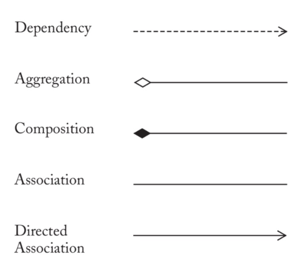

# COMP2511 Final Notes

## Table of Contents

- [COMP2511 Final Notes](#comp2511-final-notes)
  - [Table of Contents](#table-of-contents)
  - [Object Oriented Programming in Java](#object-oriented-programming-in-java)
    - [Inheritance](#inheritance)
      - [Is-a v.s Has-a](#is-a-vs-has-a)
    - [Classes and Abstract Classes](#classes-and-abstract-classes)
    - [Interfaces](#interfaces)
    - [Method Forwarding](#method-forwarding)
    - [Method Overriding](#method-overriding)
    - [Method Overloading](#method-overloading)
    - [Data Hiding and Encapsulation](#data-hiding-and-encapsulation)
  - [Design](#design)
    - [Domain Modelling](#domain-modelling)
    - [Design by Contract](#design-by-contract)
  - [Programming Patterns](#programming-patterns)
    - [Exceptions](#exceptions)
      - [Checked v.s unchecked exceptions](#checked-vs-unchecked-exceptions)
      - [Assertions](#assertions)
    - [Generics](#generics)
    - [Collections](#collections)
    - [Design Principles](#design-principles)
      - [Coupling](#coupling)
      - [Cohesion](#cohesion)
      - [SOLID](#solid)
      - [Law of Demeter (The Principle of Least Knowledge)](#law-of-demeter-the-principle-of-least-knowledge)
      - [Covariance and contravariance](#covariance-and-contravariance)
      - [Liskov Substitution Principle (LSP)](#liskov-substitution-principle-lsp)
    - [Functional Paradigm and Lambda Expressions](#functional-paradigm-and-lambda-expressions)
      - [Lambda Expressions](#lambda-expressions)
      - [Streams and functional programming](#streams-and-functional-programming)
  - [Design Patterns](#design-patterns)
    - [Strategy Pattern](#strategy-pattern)
    - [State Pattern](#state-pattern)
    - [Observer Pattern](#observer-pattern)
    - [Composite Pattern](#composite-pattern)
    - [Factory Pattern](#factory-pattern)
    - [Abstract Factory](#abstract-factory)
    - [Template Pattern](#template-pattern)
    - [Decorator Pattern](#decorator-pattern)
    - [Adapter Pattern](#adapter-pattern)
    - [Singleton Pattern](#singleton-pattern)
    - [Visitor Pattern](#visitor-pattern)
    - [Builder Patern](#builder-patern)
  - [Refactoring and Code Smells](#refactoring-and-code-smells)
    - [Code Smells](#code-smells)
      - [Bloaters](#bloaters)
      - [OO Abusers](#oo-abusers)
      - [Change Preventers](#change-preventers)
      - [Dispensables](#dispensables)
      - [Couplers](#couplers)

## Object Oriented Programming in Java
### Inheritance
- Inheritance is when a class adopts another class' functionality, affirming that the two classes are subtypes.
- It lets us reduce code repetition.
- The subclass (the class that is inheriting) is usually larger and has more features than the superclass (the class that is being inherited from).
- In Java, **multiple inheritance is not allowed**. Instead, this must be implemented using [interfaces](#interfaces).

#### Is-a v.s Has-a
- An `is-a` relationship defines inheritance; when one class "is a" another class, we can inherit from the class. A good example is that an 'Apple is a Fruit', therefore, we can extend the class `Apple` from `Fruit`.
- A `has-a` relationship defines composition/aggregation; where one class contains another class. A good example is that a 'Bike has a Wheel', therefore, we can contain the class `Wheel` inside of `Bike`.

### Classes and Abstract Classes
- Classes should be defined in their own files - however, a file can contain multiple classes as long as only one of them is public.
- Abstract classes are classes that cannot be instantiated, therefore, serve as templates for normal classes to extend from.

### Interfaces
- Interfaces define a *behaviour*. While classes define both *behaviour* and *data*, interfaces provide a multi-inheritance like structure but for Java. Classes may implement multiple interfaces.
- Any shared common behaviours you can identify in a program should be abstracted to an interface.

### Method Forwarding
- When a class composes another class, and yet is defined in a way such that it shares a common method(s), we can use method forwarding.
- Define the method `A` which is contained in the composed class `C` into our class `B`, that simply calls/returns `C.A()`.

### Method Overriding
- Method overriding is when you change the functionality of a method that has been inherited - this is called `polymorphism`, and is extremely useful to avoid code repetition.
- Importantly, you must not change the invariants (things that cannot change), you must not weaken preconditions nor strengthen post conditions. 
- We can override a method by declaring `@Override` on a given inherited method.
- You CANNOT go multiple super classes back, for example call `super.super.f()`.

### Method Overloading
- When we provide multiple parameters to the same function. This is useful as some functions may consist of using many different types, for example:
    - `double add(int, int)`
    - `double add (int, double)`
    - `...`

### Data Hiding and Encapsulation
- We can hide data using visibility modifiers, namely:
  - `public`: visible to everything
  - `private`: visible to only the class
  - `protected`: visible to the package and all subclasses
  - `No modifier (default)`: visible to the package

## Design
### Domain Modelling
<center> </center>

- Dependency is the weakest relationship, and defines some dependency on another class.
- Association means that the class 'uses' another class in some way; for example, using a method of another class.
- Aggregation defines the containment of a class into another class (where the container class is the end of the arrow), but such that the contained class can exist by itself.
- Composition is aggregation but with the condition that the contained class can only exist within the contained class.
- Multiplicites, defiend by `0..* -> 0..*`, can be thought of as "how many instances of the class A can belong to class B, and how many of the class B can class A exist in?"

### Design by Contract
- Design by contract defines an interaction between a developer and a client, such that the client defines a set of three conditions:
    - `Pre-condition`: What does the contract expect? (what domain do the parameters of a method take?)
    - `Post-condition`: What does the contract guarantee? (what does a method return?)
    - `Invariant`: What does the contract maintain? (what domains for state variables?)
- Design by contract (DbC) is very useful as it means the engineer has to think about less edge cases and bugs, and focus entirely on the functionality of the application with it's given conditions.
- Conditions are defined in JavaDoc comments using `@pre`, `@post`, `@inv`.

## Programming Patterns
### Exceptions
- An exception is an event, which occurs during the execution of a program that disrupts the normal flow of the program's instructions.
- There are three main kinds of exceptions in Java:
  - Checked exception: `IOException, SQLException, ...`
  - Error: `VirtualMachineError, OutOfMemoryError, ...`
  - Runtime exception: `ArrayIndexOutOfBoundsException, ArithmeticException, ...`
#### Checked v.s unchecked exceptions
- An exception's type determines whether it is checked or unchecked.
- All exceptions that are subclasses of `RuntimeException` or `Erro` are unchecked exceptions.
- All classes that inherit from `Exception` but not directly/indirectly from `RuntimeException` are considered to be checked.
- A checked exception means that it must be caught and dealt with.

#### Assertions
- An assert statement can be useful to consider whether a precondition, postcondition or an invariant has held true.
- `assert interval > 0 && interval <= MAX`.

### Generics
- Generics enable types to be parameters when defining:
  - classes,
  - interfaces and
  - methods.
- Generics can remove the need for casting, strengthen compile time type safety and the implementation of *generic algorithms* - algorithms that work on a subset of types.
- A generic type is a generic `class` or `interface` that is parameterised over types.
- A generic class is defined in the following way:
```java
public class <T> {
    ...
}
```
- You can declare multiple generics, which may be useful:
```java
public class <K, V> {
    ...
}
```
Generics can also be guarded by a `extends` or `super`. For example, `<T extends S>` means that `T` can only be `S` or a subclass of `S`. We can also use wildcards in method parameters to allow any type within a given domain.
- `<?>` means any type
- `<? extends T>` means any subtype of `T` (inclusive)
- `<? super T>` means any supertype of `T` (inclusive)

You can also have multiple bounds by using `&`. 

### Collections
- A collections framework is the framework for representing and manipulating collections. A collection is simply an object that groups multiple elements into a single unit.
- In Java, the collection interfaces consider the data structures, includinmg `Set, List, Queue and Deque`.


### Design Principles
- When writing good software we want to focus on two main concepts: *Coupling* and *Cohesion*.

#### Coupling
- Coupling is the interdependence between classes.
- High coupling is when a class `A` depends on the methods of `B` and also, is affected by state changes in `B`.
- Highly coupled software leads to complicated systems.
- Loosely coupled classes can depend on eachother's methods, but shouldn't be affected by eachother's states.
- No coupling is useless! We need our objects to interact with eachother to create functional software!

#### Cohesion
- Cohesion is a measure of which all elements of a class work together as a functional unit.
- Highly cohesive units are:
    - much easier to maintain and less frequently changed, and are highly reusable
- This is backed up by the Single Responsibility Principle - classes should have a single function to be cohesive.

#### SOLID
SOLID is a list of 5 principles you should follow when creating software.
- **Single responsibility principle**: A class should only have a single responsibility.
- **Open-closed principle**: Open for extension, closed for modification.
- **Liskov substitution principle**: Objects in a program should be replacable with instances of their subtypes without altering the correctness.
- **Interface segregation principle**: Many client-specific interfaces are better than one general-purpose interface (generalise interfaces!)
- **Dependency inversion principle**: Depend on *abstractions* not *concrections* - essentially, create APIs.

#### Law of Demeter (The Principle of Least Knowledge)
A method in an object should only invoke methods of:
- the object itself
- the object passed in as a parameter of a method
- objects instantiated within the method
- any components (aggregated/composed classes)
- and not those of objects returned by a method

Essentially, don't chain a bunch of getters. 

#### Covariance and contravariance
- Covariant: Usage of stricter variant, `Cat` in `Animal`
- Contravariant: Usage of larger variant, `Animal` in `Cat`.

#### Liskov Substitution Principle (LSP)
LSP is concerned with the interactions between classes and their subclasses. Importantly, subclasses should be able to be interacted with through their superclass, without losing meaning. There are important conditions that must hold true regarding pre and post conditions in overriden methods:
- Contravariance of pre-conditions; i.e, we can weaken pre-conditions.
  - This is because if we weaken our preconditions, our stronger preconditions in the superclass will always hold.
- Covariance of post-conditions; i.e, we can strengthen post-conditions.
  - This is because if we strengthen our post-conditions, our more general post-conditions in the superclass will always hold.

### Functional Paradigm and Lambda Expressions
#### Lambda Expressions
- Lambda expressions allow us to define anonymous methods in a clear and concise manner.
- A lambda expression is created from a `functional interface`, which is an interface which consists of one method.
```java
public interface FunctionalInterface {
    public int compute(int x, int y);
}

FunctionalInterface f1 = (x, y) -> x + y;

f1.compute(3, 4); // 3 + 4 = 7;
```
- Existing methods can be treated as functional interfaces by using the syntax `Class::Method`.
#### Streams and functional programming
- However, Java provides us with `stream`, which lets us create a stream of data to work with for a given data structure. Then, there are multiple useful methods:
  - `filter`: filters for the given lambda boolean expression
  - `map`: maps each element for the given lambda expression
  - `forEach`: does something... for each thing.
  - `mapToInt`: maps everything in the stream to an int, given some lambda expression (for example `Person::getAge`)
  - `collect`: can collect the final stream as a list, for example.
  - and a lot more.

## Design Patterns
### Strategy Pattern
**USAGE STATEMENT**: We need a way to adapt the behaviour of an algorithm at run time.
- We can do this by creating a `Strategy` class, which is extended from for a family of algorithms.
- We can then filter the strategy using a `Context` class, that chooses which strategy to use using a switch statement or something of the sort.

### State Pattern
**USAGE STATEMENT:** We need a way to represent state-like behaviour at run time.
- We can do this by create a `State` class, with methods such as `behaviour` and `change`. 
- We contain a state class within a `Context` class, and the `Context` class within the `State` class, such that any state class can change to the next state within itself.
- The state behaviour is defined in the `change` method, where some conditions are checked, and given a condition, changes to the next state.

### Observer Pattern
**USAGE STATEMENT**: We need a way to distribute events to many classes without unneeded complexity.
- We do this by holding a listen of `Observer`'s inside the class that is emitting some event.
- This means that instead of each observer going to the class for an emission, the class simply updates some state within `Observer` by some method call.

### Composite Pattern
**USAGE STATEMENT**: When a tree structure emerges in our design, and we a required to recursively compute through the structure, we need a way to do this without unneeded complexity.
- We do this by essentially create a tree and calling tree methods on it. 
- Often, we will dissect the tree into `Node` and `LeafNode`, where the leaf nodes will return a specific value. This is common where the evaluation of the composite is `boolean`, but the leaf nodes are some other type, like `Integer`.

### Factory Pattern
**USAGE STATEMENT**: We need to create alot of classes, but we want to do this while maintaing Open-Closed.
- We do this by creating a `Factory` interface, and then concrete classes can extend from it and define their own logic for returning specific items.

### Abstract Factory
**USAGE STATEMENT**: We want to be able to create classes without caring about the concrete definitions of them.
- For example, we might want to create chairs, but don't need to know whether they are an office or school chair.
- We do this by create an interface of creational methods, that are then extended upon by concrete classes.
- We then instantiate the concrete classes with usage of the interface, such that the code does not need to be aware of the concrete types.

### Template Pattern
**USAGE STATEMENT**: We have an algorithm that is mostly the same but with minor differences in partitionable logic clumps. We want to reduce code repetition.
- We can create a `Template` abstract class and define default implementations for shared methods, and abstract methods for the different parts.
- Create concretions for each of our specific algorithms, and we have greatly reduced code repetition.

### Decorator Pattern
**USAGE STATEMENT**: We want to add functionality to a class dynamically at run time.
- Decorate the class we want to add functionality to using a `Decorator` class, which can recursively call through an interfaced method i.e `compute`.
- By repeatedly wrapping the class in decorators, we call through all of our decorators and get our intended functionality. 

### Adapter Pattern
**USAGE STATEMENT**: We want incoming data/input to be in a specific form, but we have multiple different types of input. We create an adapter interface that can be implemented for each of the different input types.
- Create an `Adapter` interface, and for each different input type, implement the methods required to get data into the given form.

### Singleton Pattern
**USAGE STATEMENT**: We want only one instance of a class to exist.
- Create a `Singleton` class, with a method `getInstance()`. The `Singleton` class contains a variable `T`, which is our intended class that we want to use.
- `getInstance` checks whether `T` is null, and if so, creates a new instance. Else, it returns the already existing instance.
- `getInstance` should be synchronised in multi-threaded environments.

### Visitor Pattern
**USAGE STATEMENT**: A class interacts with many different classes and has different behaviours with each of them. Instead of type checking for each instance, use a `Visitor` and an `accept` function within those different classes to avoid type checking.
- Create a `visitor`, with a `visit` function for each different instance of type.
- Create an `accept` function within those different classes, which usually just calls `Visitor.visit(this)`.
- Apply the logic required.

### Builder Patern
**USAGE STATEMENT**: A class has many parameterised options for it's construction. Instead of making a huge constructor, create a `Builder` class that can construct our class parameter by parameter.
- Create a `Builder` class, which holds our intended constructed class as a variable.
- Create methods for each of our parameters with a given input (or not), that adds this component to the intended variable.
- Create a method that returns our finalised class.

## Refactoring and Code Smells
### Code Smells
#### Bloaters
- `Long method`: When a method is too long
  - Segment the method into logical parts
  - Consider using strategy pattern if there are distinguishable 
- `Large class`: When a class is too large - often violating SRP.
  - Segment the class into single responsibilities and use composition and method forwarding.
- `Long parameter list`: Too many parameters in a method
  - Builder pattern (if constructor); or replace these parameters with method calls instead. We shouldn't hold too much state!
- `Data clumps`: Different parts of the code contain identical groups of variables.
#### OO Abusers
- `Refused bequest`: When an inherited class does not use the methods it inherits.
  - Change from inheritance to composition - or change the inheritance structure such that only methods that are actually common are included. Interface methods that aren't common such that classes that use them implement them.
#### Change Preventers
- `Divergent change`: When one class is commonly changed along with multiple different class changes
  - Many behaviours have been put into one class. Split up the class to adhere to Single Responsibility Principle.
- `Shotgun surgery`: When many classes are changed due to one class changing (inappropiate coupling)
  - One responsibility has been split up into many classes. Move the offending behaviours into one class.
#### Dispensables
- `Data class`: A class that only has getters and setters, and no other functionalities.
  - We can move the data into the class that requires it, instead of having just a data class.
- `Duplicated code`: When there is lots of code duplication - same definitions in sibling classes
  - Move the method to a parent class - provide a default implementation...
  - Consider using Template pattern, to segment the logic into repeated blocks and unique blocks.
- `Lazy class`: A class that is very small and does very little functionality/no functionality.
  - Remove the class and move the required behaviours to apporpiate existing classes. We can collapse subclass hiearchies by moving methods into it's extended class/
#### Couplers
- `Feature envy`: A class uses methods from a composed/aggregated class more than it's own methods.
  - The method should be moved inside the class; or perhaps behaviours of the class should be moved to the composed/aggregated class.
- `Inappropiate intimacy`: A class uses the internal fields and methods of another class
  - Can be fixed my moving the method/fields
