# COMP9417: Machine Learning & Data Mining

- [COMP9417: Machine Learning \& Data Mining](#comp9417-machine-learning--data-mining)
    - [Preliminary definitions and objectives of machine learning](#preliminary-definitions-and-objectives-of-machine-learning)
  - [Regression](#regression)
    - [Preliminary knowledge](#preliminary-knowledge)
      - [Empirical Risk Minimisation (ERM)](#empirical-risk-minimisation-erm)
    - [Correlation](#correlation)
    - [Covariance](#covariance)
    - [Simple linear regression (SLR)](#simple-linear-regression-slr)
      - [Estimating parameters in SLR](#estimating-parameters-in-slr)
      - [Intuitions for the parameters](#intuitions-for-the-parameters)
    - [Multivariate Regression](#multivariate-regression)
      - [MSE in multiple variables](#mse-in-multiple-variables)
      - [The model](#the-model)
      - [Estimating the parameters with multiple variables](#estimating-the-parameters-with-multiple-variables)
      - [Showing that the analytic solution is a minimum; `Hessian` and `convex`](#showing-that-the-analytic-solution-is-a-minimum-hessian-and-convex)
    - [Shrinkage techniques: LASSO and Ridge](#shrinkage-techniques-lasso-and-ridge)
      - [`LASSO` (L1 regularisation)](#lasso-l1-regularisation)
      - [`Ridge` (L2 regularisation)](#ridge-l2-regularisation)
  - [Optimisation](#optimisation)
    - [How are optimisation algorithms generally structured?](#how-are-optimisation-algorithms-generally-structured)
    - [Gradient descent](#gradient-descent)
      - [Linear regression gradient descent](#linear-regression-gradient-descent)
    - [Maximum likelihood estimation (MLE)](#maximum-likelihood-estimation-mle)
      - [MLE for Linear Regression](#mle-for-linear-regression)
  - [Classification](#classification)
    - [Some different methods of learning and terminology](#some-different-methods-of-learning-and-terminology)
    - [Homogenous coordinates](#homogenous-coordinates)
    - [Linear classification](#linear-classification)
      - [Centroid classifier](#centroid-classifier)
      - [Perceptron](#perceptron)
      - [Perceptron learning in primal form](#perceptron-learning-in-primal-form)
    - [Evaluation of classification](#evaluation-of-classification)
      - [Classification accuracy](#classification-accuracy)
      - [Contigency tables](#contigency-tables)
      - [Evaluaton measures](#evaluaton-measures)
    - [Logisitic regression](#logisitic-regression)
      - [Derivation for gradient ascent](#derivation-for-gradient-ascent)
      - [Stochastic gradient ascent](#stochastic-gradient-ascent)
    - [Bayes theorem and maximum likelihood](#bayes-theorem-and-maximum-likelihood)
      - [Bayesian classification](#bayesian-classification)
  - [Non-parametric methods](#non-parametric-methods)
    - [Nearest neighbour](#nearest-neighbour)
      - [`K`-nearest neighbours](#k-nearest-neighbours)
      - [Test error in `K`-near neighbour](#test-error-in-k-near-neighbour)
      - [Distance measurements](#distance-measurements)
      - [Nearest neighbours algorithm](#nearest-neighbours-algorithm)
      - [Normalisation of attributes for nearest neighbours](#normalisation-of-attributes-for-nearest-neighbours)
      - [When to consider nearest neighbours](#when-to-consider-nearest-neighbours)
      - [Local regression](#local-regression)
      - [Distance-weighted KNN](#distance-weighted-knn)
    - [Tree learning](#tree-learning)
      - [Decision trees](#decision-trees)
      - [Entropy and information gain](#entropy-and-information-gain)
      - [Training trees using information gain](#training-trees-using-information-gain)
      - [Dealing with overfitting](#dealing-with-overfitting)
      - [Regression trees](#regression-trees)
      - [Model trees](#model-trees)
  - [Kernel Methods](#kernel-methods)
    - [Classification and it's connection to kernel methods](#classification-and-its-connection-to-kernel-methods)
      - [Margins and loss functions](#margins-and-loss-functions)
    - [Extending learning classification](#extending-learning-classification)
      - [What problems exist with non-linear mapping](#what-problems-exist-with-non-linear-mapping)
    - [Linear classifiers in dual form](#linear-classifiers-in-dual-form)
    - [Support vector machines](#support-vector-machines)
      - [Finding support vectors](#finding-support-vectors)
      - [Deriving the dual problem](#deriving-the-dual-problem)
      - [Noise](#noise)
      - [Sparse data](#sparse-data)
      - [The kernel trick](#the-kernel-trick)
  - [Ensemble Learning](#ensemble-learning)
    - [Bias-variance decomposition for ensemble learning](#bias-variance-decomposition-for-ensemble-learning)
      - [Bias-variance tradeoff](#bias-variance-tradeoff)
      - [Bias-variance in ensemble classification](#bias-variance-in-ensemble-classification)
    - [Stability](#stability)
      - [Instability in decision-tree learning](#instability-in-decision-tree-learning)
    - [Ensemble method 1: Bagging](#ensemble-method-1-bagging)
      - [Bootstrapping: sampling with replacement](#bootstrapping-sampling-with-replacement)
      - [Applications to models and proof of variance-lowering properties](#applications-to-models-and-proof-of-variance-lowering-properties)
    - [Ensemble method 2: Random Forests](#ensemble-method-2-random-forests)
    - [Ensemble method 3: Boosting](#ensemble-method-3-boosting)
      - [The strength of weak learnability](#the-strength-of-weak-learnability)
      - [Weighting in boosting](#weighting-in-boosting)
      - [Algorithm](#algorithm)
      - [Why that value of $\\alpha\_t$?](#why-that-value-of-alpha_t)
      - [Some features of boosting](#some-features-of-boosting)
    - [Stacking: meta-learning for ensemble predictions](#stacking-meta-learning-for-ensemble-predictions)
    - [Additive Regression](#additive-regression)
    - [Gradient boosting: `XGBoost`](#gradient-boosting-xgboost)
    - [Mixture of experts: learning to weight models](#mixture-of-experts-learning-to-weight-models)
  - [Neural Learning](#neural-learning)
    - [When to apply neural networks](#when-to-apply-neural-networks)
    - [Perceptron neural networks](#perceptron-neural-networks)
      - [Decision surface of a perceptron](#decision-surface-of-a-perceptron)
      - [Perceptron learning](#perceptron-learning)
    - [Gradient descent](#gradient-descent-1)
      - [Batch gradient descent](#batch-gradient-descent)
      - [Stochastic (Incremental) Gradient Descent](#stochastic-incremental-gradient-descent)
    - [Networks of units](#networks-of-units)
      - [Sigmoid Unit](#sigmoid-unit)
    - [Multi-layer perceptron training](#multi-layer-perceptron-training)
    - [Backpropagation algorithm](#backpropagation-algorithm)
      - [Convergence](#convergence)
      - [Overfitting](#overfitting)
    - [Neural networks for classification](#neural-networks-for-classification)
      - [Loss function](#loss-function)
    - [Deep learning](#deep-learning)
    - [Hidden units, activation functions, regularisation and layering](#hidden-units-activation-functions-regularisation-and-layering)
      - [Activation functions](#activation-functions)
      - [Regularisation](#regularisation)
      - [Universal Approximator Theorem](#universal-approximator-theorem)
  - [Unsupervised Learning](#unsupervised-learning)
    - [Clustering](#clustering)
      - [Clustering problem represention](#clustering-problem-represention)
    - [`k`-means clustering](#k-means-clustering)
      - [Practical `k`-means](#practical-k-means)
    - [Hierarchical clustering](#hierarchical-clustering)
      - [Generalised algorithm](#generalised-algorithm)
      - [*Average linkage*](#average-linkage)
      - [Dendograms](#dendograms)
    - [`DBSCAN` (Density-based spatial clustering with noise)](#dbscan-density-based-spatial-clustering-with-noise)
      - [Parameters and training](#parameters-and-training)
    - [Silhouette plot](#silhouette-plot)
    - [How many clusters?](#how-many-clusters)
      - [Elbow method](#elbow-method)
      - [Gap statistic](#gap-statistic)
    - [Dimensionality reduction](#dimensionality-reduction)
      - [Principal Component Analysis (`PCA`)](#principal-component-analysis-pca)
  - [Learning theory](#learning-theory)
    - [Learning from data: the Empirical Risk Minimisation (`ERM`) principle](#learning-from-data-the-empirical-risk-minimisation-erm-principle)
    - [No Free Lunch Theorem](#no-free-lunch-theorem)
      - [Conservation Theorem of Generalisation Performance](#conservation-theorem-of-generalisation-performance)
    - [Computational Learning Theory](#computational-learning-theory)
      - [Concept Learning](#concept-learning)
      - [Sample complexity](#sample-complexity)
      - [True error of a hypothesis](#true-error-of-a-hypothesis)
      - [Version space](#version-space)
    - [`PAC` (Probably Approximately Correct) Learning](#pac-probably-approximately-correct-learning)
      - [`PAC` Learning in a real-value hypothesis space](#pac-learning-in-a-real-value-hypothesis-space)
      - [Agnostic `PAC` learning](#agnostic-pac-learning)
      - [Infinite hypothesis spaces](#infinite-hypothesis-spaces)
    - [The Vapnik-Chervonenkis Dimension](#the-vapnik-chervonenkis-dimension)
      - [Shattering a set of instances](#shattering-a-set-of-instances)
      - [Definition](#definition)
      - [How to find the VC dimension](#how-to-find-the-vc-dimension)
      - [Example of linear decision surfaces](#example-of-linear-decision-surfaces)
    - [Mistake bounds](#mistake-bounds)
      - [`WINNOW` algorithm](#winnow-algorithm)
      - [`WEIGHTED MAJORITY` algorithm](#weighted-majority-algorithm)


### Preliminary definitions and objectives of machine learning

> A **loss function** defines the difference between a model's *predictions* and the *observed values*.

> What is the objective of machine learning?
> 
> **Given:** a problem to solve *with data*
> 1. Select a **class** of models and a loss function
> 2. Fit a model to training dataset to *minimise* loss function
> 3. Use model to predict for data **not in** training set

## Regression

> What does **regression** mean?
>
> It can indeed refer to two things:
> 1. The process of determining the weights (or parameters) for the regression equation
> 2. The regression equation (the prediction) itself

### Preliminary knowledge

#### Empirical Risk Minimisation (ERM)

> **Assume:** a class of functions $Y = f(X, \theta)$
>
> where:
> - $X$ is the input data
> - $\theta$ are the parameters
>
> **Assume:** a loss function $l(Y, \hat{Y})$
> where:
> - $Y$ known output values (or **labels**) from data
> - $\hat{Y}$ estimated output values predicted **using** $\hat{f}$ trained on data
>
> *Usually*, we don't know what the true values of $\theta$ are. So we need to find an estimate for them, $\hat{\theta}$ such that it minimises $l$; from this we get $\hat{f}$.
>
> The **empirical risk** is the average of the loss on such a dataset. 
> 
> **Empirical risk minimisation** tells us that minimising the empirical risk is a good thing *if we want to minimise error on data not used in training*.

Or more simply, we assume that minimise the risk in a training set, would lead to better predictions in the testing set.

### Correlation

> The **correlation coefficient** ($r$) is a number between -1 and 1 that indicates whether a pair of variables $X$ and $Y$ are associated or not, and whether the **scatter** in the association is high or low.
>
> $$ r = \frac{\text{cov}(X, Y)}{\sigma_X\sigma_Y}

### Covariance

> The sample variance of some vector of data $X = (x_1, \dots, x_n)$ is given by:
>
> $$ \sigma_X^2 =\frac{1}{n-1} \sum_{i=1}^n (x_i - \bar{x})^2$$
> where $\bar{x}$ is the sample mean of $X$.

Variance is how much the data varies from the mean, squared.

> The *covariance* of two vectors of data $X = (x_1, \dots, x_n)$ and $Y = (y_i, \dots, y_n)$ is given by:
> $$ \text{cov}(X, Y) = \frac{1}{n-1}\sum_{i=1}^n (x_i-\bar{x})(y_i - \bar{y})$$

Covariance is more of a measure of how the two vectors $X$ and $Y$ change *together* - that is, if $X$ and $Y$ differ from their respective means **at the same points**.

### Simple linear regression (SLR)

> For a set of data $(x_1, y_1), \dots, (x_n, y_n)$, where $x$ is the input and $y$ is the response, we define the simple linear regression model to be:
> $$ \hat{y} = a + bx$$
> For some estimated parameters $a, b \in \mathbb{R}$.

The predicted value at the $i$-th value pair would be denoted by 
$$ \hat{y}_i = a + bx_i$$
The difference, residual or *error* at the $i$-th value pair can be expressed by:
$$ e_i = y_i - \hat{y}_i$$

> The **residual sum of squares (RSS)** is given by:
> $$\begin{align*} RSS &= \sum_{i=1}^n e_i^2 \\ &= \sum_{i=1}^n (y_i - \hat{y})^2 \end{align*}$$
> The $RSS$ is then, a loss function, as it is a function defined by $Y$ and $\hat{Y}$.

#### Estimating parameters in SLR

Now consider the derivation of $a$ and $b$ through means of minimising the loss function $RSS$. We call RSS the **least squares criterion**.

$$ 
\begin{align*}
    RSS &= \sum_{i=1}^n (y_i -\hat{y})^2 \\
    &= \sum_{i=1}^n (y_i - a + bx_i)^2 \\ 
    \partial(RSS)_a &= -2 \sum_{i=1}^n(y_i - a - bx_i) \\
    \partial(RSS)_b &= -2\sum_{i=1}^nx_i(y_i - a - bx_i)
\end{align*}
$$
Now, since we want to minimise, we let these partial derivatives $= 0$.
$$ 
\begin{align*}
\partial(RSS)_a &= -2\sum_{i=1}^n(y_i - a + bx_i) = 0 \\
&= -\sum_{i=1}^n y_i + na + b\sum_{i=1}^n x_i =0 \\
&= a = \bar{y}  - b\bar{x}
\end{align*}
$$
And for $b$
$$
\begin{align*}
\partial(RSS)_b &= \sum_{i=1}^nx_i(y_i - a -bx_i) = 0 \\ 
&= \sum_{i=1}x_iy_i - \sum_{i=1}^nx_i(\bar{y} - b\bar{x}) + b\sum_{i=1}^nx_i^2 =0\\
&= b\left(\sum_{i=1}^n x_i^2 -x_i\bar{x}\right) =\sum_{i=1}^nx_i(y_i - \bar{y}) \\
&= b = \frac{\sum_{i=1}^n(x_i - \bar{x})(y_i - \bar{y})}{\sum_{i=1}^n (x_i - \bar{x})^2}
\end{align*}
$$

We can also take a maximum likelihood estimation (MLE) approach.

> **An aside**
>
> Let us prove that $\sum_{i=1}^n x_i(x_i - \bar{x}) = \sum_{i=1}^n (x_i - \bar{x})^2$
>
> $$ 
> \begin{align*}
>   \sum_{i=1}^n (x_i - \bar{x})^2 &= \sum_{i=1}^n x_i^2 - x_i\bar{x} - x_i\bar{x} +\bar{x}^2 \\
> &\text{Focusing on the RHS} \\
> &= -\bar{x}\sum_{i=1}^nx_i + \sum_{i=1}^n\bar{x}^2 \\ 
> &= -n\bar{x}^2 + n\bar{x}^2 \\
> &= 0
> \end{align*}
> $$

#### Intuitions for the parameters

> **Intuition for the regression coefficient $\hat{b}$**
>
> For a feature $x$ and a target variable $y$, the regression coefficient is the covariance between $x$ and $y$ in proportion to the variance of $x$
>
> $$ \hat{b} = \frac{\sigma_{XY}}{\sigma_{XX}}$$
>
> The covariance $\sigma_{XY}$ is measured in units of $x$ times units of $y$, and the variance is in units of $x^2$. Therefore, the quotient is measured in units of $\dfrac{y}{x}$, which is the rate of change.

> **Intuition for the intercept $\hat{a}$**
> 
> The intercept $\hat{a}$ is such that the regression line goes through $(\bar{x}, \bar{y})$.
>
> Adding a constant to all $x$ values will affect only the intercept but **not the regression coefficient**. We can indeed subtract $\bar{x}$ and $\bar{y}$ from all the points to get a zeroed dataset and regression.

> **Side-effects from outliers**
>
> Since the least squares solution is zero
>
> $$ \sum_{i=1}^n (y_i - (\hat{a} + \hat{b}x_i)) = 0 $$
>
> Outliers can adversely affect the intercepts, as larger residuals will more adversely impact the parameters (due to the squared effect). Therefore, when using linear regression, we must be very aware of what outliers exist.

### Multivariate Regression

> Multivariate regression is defined by the use of more than one input variable $x$. We will define inputs as **matrices** for the ease of mathematics. We then get the following:
> $$\hat{Y} = \hat{f}(\mathbf{X})$$
> The predicted vector of responses $\hat{Y}$, is given by the function with estimated parameters $\hat{f}$, and the matrix of input variables $\textbf{X}$.
> 
> It can also be the predicted **value**, if $\mathbf{X}$ is a vector of size $p \times 1$ for $p$ different input variables

#### MSE in multiple variables
> **Ordinary Least Squares (OLS)**
>
> Now minimising the mean squared error now changes
>
> $$ \frac{1}{n}\sum_{j=1}^n \left( y^{(j)} - \sum_{i=0}^p b_ix_i^{(j)}\right)$$
>
> Essentially for each $j$-th example, take the difference between the $j$-th observation $y^{(j)}$ and the multivariate prediction
> $$ \sum_{i=0}^pb_ix_i^{(j)}$$

#### The model

> **The loss function**
> $$ l(y - \hat{y}) = \frac{1}{n}\sum_{i=1}^n\left(y^{(i)} - \hat{y}^{(i)} \right)^2$$
> where $y$ is the observed response and $\hat{y}$ is the predicted response.

> The (**multivariate**) linear regression model is:
> $$ \hat{y} = \mathbf{X}\theta$$
> where:
> - $\mathbf{X}$: $(n, p+1)$ matrix of $n$ dataset values for input $p + 1$ variables
> - $\theta$: vector of $p + 1$ parameters learned from training data
> - $\mathbf{y}$: vector of $n$ actual values (labels) for input data

#### Estimating the parameters with multiple variables

We use matrix notation for ease of differentiation.

> **An aside for some matrix differentiation rules**
>
> There exists some tricks for matrix differentiation which prove useful for the derivation of parameters.
>
> > **Rule 1**
> > 
> > Consider a vector function
> > $$ f(x) = a^Tx$$
> > then
> > $$ \frac{\partial f(x)}{\partial x} = a$$
>
> > **Rule 2**
> > Consider a vector function
> > $$ f(x) = x^TAx$$
> > then
> > $$ \frac{\partial f(x)}{\partial x} = (A + A^T)x$$

> **Defining the matrix form loss function, and deriving parameters**
>
> The summation form is as such:
> $$ l(y - \hat{y}) = \frac{1}{n}\sum_{i=1}^n\left(y^{(i)} - \hat{y}^{(i)} \right)^2$$
> This can be expressed as:
> $$ l(y - \hat{y}) = \frac{1}{n}(y - X\theta)^T(y-X\theta)$$
> Expanding the loss function
> $$
> \begin{align*}
> &= \frac{1}{n}(y^T - \theta^TX^T)(y - X\theta) \\ 
> &= \frac{1}{n}(y^Ty - y^TX\theta - \theta^TX^Ty + \theta^TX^TX\theta)
> \end{align*}
> $$
> Now the dimensions of $y^TX\theta$ is $(1 \times n) \times (n \times p) \times (p \times 1) = 1$. Therefore, the two middle terms sum
> $$
> \begin{align*}
> &= \frac{1}{n}(y^Ty - 2y^TX\theta +  \theta^TX^TX\theta) \\
> \frac{1}{n}\partial(\theta)_l &= \frac{\partial}{\partial \theta}(- 2y^TX\theta  + \theta^T X^TX\theta) \\
> &= -2X^Ty + (X^TX + X^TX)\hat{\theta} \\
> &= -2X^Ty + 2X^TX\hat{\theta}
> \end{align*}
> $$
> Now equating to zero, to optimise
> $$
> \hat{\theta} = (X^TX)^{-1}(X^T y)
> $$

#### Showing that the analytic solution is a minimum; `Hessian` and `convex`

We utilise the *Hessian* which is a $p \times p$ matrix of second order partial derivaties, such that the $(k, l)$-th element of $H$ is
$$ H_{kl} = \frac{\partial \mathcal{L}(w)}{\partial w_k\partial w_l}$$
and say that a function is convex if *it's Hessian is positive semi-definite*, such that for any vector $u$
$$ u^THu \ge 0$$

$$
\begin{align*}
  \nabla_w^2\mathcal{L}(w) &= \nabla_w(\nabla_w\mathcal{L}) \\
  &= \nabla_w(-2X^Ty + 2X^TXw) \\
  &= 2X^TX
\end{align*}
$$

and thus for any vector $u$

$$ 
\begin{align*}
  2u^TX^TXu &= 2(Xu)^TXu \\
  &= 2||Xu||^2_2
\end{align*}
$$

therefore positive semi-definite.

### Shrinkage techniques: LASSO and Ridge

Shrinkage techniques such as `LASSO` and `Ridge` attempt to reduce overfitting by placing constraints on the sizes of the betas. The two differ in the *shape* of their constraints.

#### `LASSO` (L1 regularisation)

`LASSO`'s loss function is defined as such
$$ ||y - X\beta||_2^2 + \lambda ||\beta||_1$$
Geometrically, this is a diamond-like constraint on the magnitude of the $\beta$ values.

<center>
  
</center>

Consider the above contour plot, with the loss function values $L$ coming *out* of the page. The center of the paraboloid is the least squares solution.

> As `LASSO` implies a diamond like constraint, the optimal solution is likely to **shrink** some $\beta$ to 0.

Since `LASSO` shrinks $\beta$ values to $0$, we say that LASSO induces **sparsity**. Given a list of predictors
$$ \beta = (\beta_1, \dots, \beta_p)^T$$
LASSO's sparse nature can mean that depending on the penalty term $\lambda$, that a small subset of the predictors are chosen.

Sparsity means that over-fitting is less likely, and can lead to better performance given proper cross-validation.

#### `Ridge` (L2 regularisation)

Ridge's loss function is defined as such
$$ ||y - X\beta||^2_2 + \lambda||\beta||_2^2$$
With the squared magnitude of the $\beta$ values, Ridge behaviours like a sphere. Therefore, the optimal solution does **not shrink** $\beta$ values to $0$, but can get very close to $0$.

<center>
  
</center>

Consider the contour plot above - with the loss function values $L$ coming out of the page.

> As `Ridge` implies a spherical constraint, the optimal solution which is tangential to the paraboloid does not shrink $\beta$ values to exactly 0.

## Optimisation

> The problem of optimisation is expressed as such
> $$
> \begin{align*}
> 
> &\textbf{min}_{\mathbf{x}} & f(\mathbf{x}) \\
> &\text{subject to} & x\in \mathcal{X}
> \end{align*}
> $$
>
> - The problem is to find $\mathbf{x}$ which is called the `design point`. 
> - These values are changed by an optimisation algorithm to find a *minimiser*; a solution $\mathbf{x}^*$ that minimises the objective/loss function $f$
> - A solution must be an element of the feasible set $\mathcal{X}$.
>
> We could also choose to maximise an objective function... but this problem can be translated to a minimisation question by
> $$ \textbf{min}_{\mathbf{x}} \hspace{0.25cm} -f(\mathbf{x}) : \mathbf{x} \in \mathcal{X}$$
>
> Furthermore, the function $f(x)$ must be differentiable.

### How are optimisation algorithms generally structured? 

Generally, optimisation algorithms work as such:
```txt
start at x = x_0

1. select a search direction g, to decrease f(x)
2. select a step length a
3. s = ag
4. x = x + s [hopefully going towards a minima]

repeat until some convergence criteria
```

### Gradient descent

> Gradient descent is defined by the following update scheme. For some objective function $f$ and an input vector $\mathbf{x}$, we update the input vector w.r.t
>
> $$ \mathbf{x}_{\text{new}} = \mathbf{x}_{\text{old}} - \alpha \cdot \nabla f(\mathbf{x})$$
>
> $\alpha$ is called the *learning rate* - and details the sensitivity of the update. Note that the gradient of $f$ denotes the *steepest "uphill" direction* of the function $f$

#### Linear regression gradient descent

We can apply the gradient descent algorithm to the linear regression loss function (the mean squared error). Recall that the mean squared error is defined my
$$ \text{MSE} = \frac{1}{n}\sum_{i=1}^n(y_i - \hat{y}_i)^2$$
We can also express this in matrix form for the ease of differentiation
$$ \text{MSE} = \frac{1}{n}(y - X\beta)^T(y-X\beta)$$
Expanding this, we find
$$
\begin{align*}
    MSE &= \frac{1}{n}(y^T - \beta^TX^T)(y - X\beta) \\ 
        &= \frac{1}{n}(y^Ty - y^TX\beta - \beta^TX^Ty + \beta^TX^TX\beta) \\ 
        &= \frac{1}{n}(y^Ty - 2y^TX\beta + \beta^TX^TX\beta)
\end{align*}
$$
We now take the derivative to find the gradient
$$
\begin{align*}
    \nabla_\beta MSE &= \frac{1}{n}(-2X^Ty + 2X^TX\beta)
\end{align*}
$$

### Maximum likelihood estimation (MLE)

> Maximum likelihood estimation (MLE) is underpinned by the maximising of the likelihood of the data given the datas, under the assumption that the data follows some probability distribution.

#### MLE for Linear Regression

> We have that under the linear regression model:
> $$ y = X\beta + \epsilon$$
> So the $i$-th sample can be expressed as
> $$ y_i = x_i^T\beta + \epsilon_i$$
> We assume $y$ is normally distributed. Consider that
> $$ 
> \begin{align*}
>   \mathbb{E}(y_i) &= x_i^T\beta \\
>   \text{Var}(y_i) &= \sigma^2
> \end{align*}
> $$
> Under the assumption that $\epsilon \sim N(0, \sigma^2)$. Therefore
> $$ y_i \sim N(x_i^T\beta, \sigma^2)$$
> 
> or under a multivariate normal distribution
> $$ y \sim N(X\beta, \Sigma)$$
> Note that the normal distribution density function can be expressed as follows
> $$ f_{N(\mu, \Sigma)}(x) = \frac{1}{|\Sigma|^{1/2}\sqrt{2\pi}}e^{-\frac{1}{2}(x-\mu)^T\Sigma^{-1}(x-\mu)}$$
>
> The joint density function across all samples can then be expressed as
> $$
> L(\beta, \Sigma; y) = \frac{1}{|\Sigma|^{1/2}\sqrt{2\pi}}e^{-\frac{1}{2}(y-X\beta)^T \Sigma^{-1}(y-X\beta)}
> $$
> We call $L$ the "likelihood" of the whole data - the joint density function of the whole data. We take the log-likelihood
> $$
> l(\beta, \Sigma; y) = -\frac{1}{2}(y-X\beta)^T \Sigma^{-1}(y-X\beta) - \frac{1}{2}|\Sigma| - \frac{1}{2}2\pi
> $$
> First, remove the two right hand terms as they do not contain $\beta$ and exapnd.
> $$
> \begin{align*}
>   l(\beta, \Sigma; y) &=-\frac{1}{2}(y^T-\beta^TX^T)\Sigma^{-1}(y-X\beta) \\ 
>  &= -\frac{1}{2}(y^T\Sigma^{-1} - \beta^TX^T\Sigma^{-1})(y-X\beta) \\ 
> &= -\frac{1}{2}(y^T\Sigma^{-1}y - y^T\Sigma^{-1}X\beta - \beta^TX^T\Sigma^{-1}y + \beta^TX^T\Sigma^{-1}X\beta) \\ 
> &= -\frac{1}{2}(y^T\Sigma^{-1}y - 2y^T\Sigma^{-1}X\beta + \beta^TX^T\Sigma^{-1}X\beta) 
> \end{align*}
> $$
>
> We can now take the derivative w.r.t $\beta$
> $$
>   \frac{\partial l}{\partial \beta} = -\frac{1}{2}(-2X^T\Sigma^{-1}y + 2X^T\Sigma^{-1}X\beta)
> $$
> Now finding the **maximum likelihood estimator** we solve for $\frac{\partial l}{\partial \beta} = 0$
> $$
> \begin{align*}
>   X^T\Sigma^{-1}y - X^T\Sigma^{-1}X\hat{\beta} &= 0 \\
>   X^T\Sigma^{-1}X\hat{\beta} &= X^T\Sigma^{-1}y \\ 
>   \hat{\beta} &= (X^T\Sigma^{-1}X)^{-1}(X^T\Sigma^{-1}y)
> \end{align*}
> $$

## Classification

> The idea of classification is to learn a **classifier**, which is usually a function mapping from input data point (`predictors`) to one off a set of discrete outputs (`classes`).

### Some different methods of learning and terminology
> If the algorithm requires all of the training data to be present before the start of learning - we call this `batch learning`
>
> If it can learn as new data arrives, we call this `online learning`
>
> If the model has a fixed number of parameters, we call it `parameteric`
>
> If the number of parameters grows as part of training, it is considered as `non-parametric`


### Homogenous coordinates
> It is sometimes convenient to simplify notation further by introducing an extra **constant variable** $x_0 = 1$, the weight of which is fixed to $w_0 = -t$.
>
> The extended data point is then $x^\circ = (1, x_1, \dots, x_n)$ and the extended weight vector is $x^\circ = (-t, w_1, \dot, w_n)$.
>
> Using homogenous coordinates allows the decision boundary to pass through the origin. 

### Linear classification

An aside on mathematical notation. Note that
$$ w \cdot x = <w, x > = w^Tx$$

> A linear classifier is a *straight line* that separates $n$ `classes`.
>
> It is defined by
> $$ \mathbf{w} \cdot \mathbf{x_i} = t$$
> - $\mathbf{w}$ is perpendicular to the 'decision boundary'
> - $\mathbf{w}$ points to the direction of "positives"
> - $t$ is the decision threshold
> - $\mathbf{x} = (x_1, x_2, \dots, x_n)^T$ are samples of $x_1 \to x_{n-1}$ (predictor) and $x_n$ (response)
>
> <center>  </center>
>
> Consider a situation where $\mathbf{w} \cdot \mathbf{x}_{\text{sample}} > t$, we then assign this sample as a "positive" sample, and vice versa.
>
> Consider the following derivation for the 2D case
> $$
> \begin{align*}
> w^Tx &= \begin{pmatrix} w_1 \\ w_2\end{pmatrix}^T \begin{pmatrix} x_1 \\ x_2\end{pmatrix} = t\\
> &= w_1x_1 + w_2x_2 = t \\ 
> x_2 &= \frac{t}{w_2} - \frac{w_1}{w_2}x_1
> \end{align*}
> $$
> which is a linear model. The **classification** of $x_i$ comes down to:
>
> $$
> \text{Decision} = \begin{cases} w^Tx > 0 & \textit{positive} \\ 
> \text{else} & \text{negative} \end{cases}
> $$
>
> This can be derived solely from the fact that $w^Tx$, which is $\mathbf{w} \cdot \mathbf{x}$, can be extended to
> $$ \cos_{\mathbf{w}, \mathbf{x}}(\theta) = \frac{\mathbf{w} \cdot \mathbf{x}}{||\mathbf{x}||\cdot||\mathbf{w}||}$$
>
> Thereby, when $w^Tx$ is positive, it has a positive angle (and is thus positive above the decision boundary).

#### Centroid classifier

> **What is a centroid classifier and how to define it**
>
>Consider two classes $U$ and $V$. There exists paired 2D samples $(x, y)$ in these classes. We find the *mean* coordinate in these classes, and express them as $\bar{U}$ and $\bar{V}$.
>
> If $\bar{U}$ were to be the "positive" class, we can then describe $w$ to be $\bar{U} - \bar{V}$. The decision boundary is given as $w^Tx = t$. 
>
> **We wish to place the line through the midpoint of the averages**
> $$ \frac{\bar{U} + \bar{V}}{2}$$
>
> We know that when $x = (\bar{U}, \bar{V}) \implies w^Tx = t$. We can then solve for $t$, such that 
>
> $$ 
> \begin{align*}
> w^Tx &= (\bar{U}) - \bar{V})^T\left(\frac{\bar{U} + \bar{V}}{2} \right) \\ 
> &= \frac{1}{2}(\bar{U}^T\bar{U} - \bar{V}^T\bar{V}) \\
> &= \frac{1}{2}(||\bar{U}||^2 - ||\bar{V}||^2)
> \end{align*}
> $$
> and thus we find $t$.

#### Perceptron

> A linear classifier that can achieve perfect separation on linearly separable data is the `perceptron`.
>
> An output $o$ is a thresholded sum of products of inputs and their weights, such that
>
> $$o(x_1, \dots, x_n) = \begin{cases} +1 & \text{if } w_0 + w_1x_1 + \dots + w_nx_n > 0  \\
> -1 & \text{otherwise}\end{cases} $$
>
> Thereby the perceptron is a linear model.

#### Perceptron learning in primal form

> **Perceptron (primal form) training rule**
> 
> Everytime an example $\mathbf{x}_i$ is misclassified, add $y_i\mathbf{x}_i$ to the weight vector. That is, given $x \in \mathbb{R}^d$ the input vector, $w \in \mathbb{R}^d$ the weight vector and $\hat{y} \in \{-1, +1 \}$ the label, we train for the model
>
> $$ \hat{y} = \text{sign}(w^Tx)$$
>
> Given a trainign sample $(x_i, y_i)$ where $y_i \in \{-1, +1 \}$
> 1. Predict $\hat{y}_i = \text{sign}(w^Tx_i)$
> 2. If **incorrect**, then update
> $$ w \leftarrow w + \alpha y_ix_i$$
> What does this update step do? It pushes the hyperplane in the direction where a correct classification would have been made. 

Let's quickly prove that the update pushes it to the correct direction.

The new weights after an update is given by
$$ w' = w + \alpha yx$$
Therefore our prediction becomes
$$ w'^Tx = (w + \alpha yx)^Tx = w^Tx + \alpha y||x||^2$$
If $x$ was misclassified, then $yw^Tx \le 0$, as $\text{sign}(w^Tx) = y$ if it is a correct identification. Consider the new prediction, $yw'^Tx$.

$$ yw'^Tx = yw^Tx + \alpha||x||^2 > yw^Tx$$

Therefore, it pushes it towards a better prediction.

### Evaluation of classification

#### Classification accuracy

> Classification accuracy on a sample of labelled pairs $(x, c(x))$ given a learned classification model, is given by
>
> $$ \text{acc} = \frac{1}{|\text{Test}|}\sum_{x} I[\hat{c}(x) = c(x)]$$
> where Test is a test set, and $I[]$ is the indicator function where the value $1$ if the statemnet is true, and 0 otherwise.
>
> We can more simply express accuracy as
> <center> What proportion of our testing sample did we classify correctly? </center>

#### Contigency tables

> We often use *contingency tables* to consider where our errors occur.
>
> The two class scenario looks as below.
> <center> 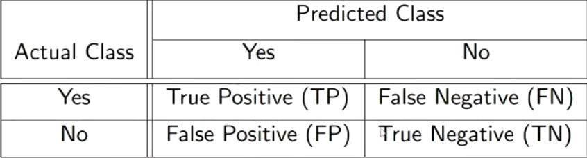 </center>
>
> This is important, as in many real life cases there exists many situations where one of `False Negative` and `False Positive` is preferred.

#### Evaluaton measures

Where:
- `TN` is true negative
- `TP` is true positive
- `FN` is false negative
- `FP` is false positive

<center>  </center>

### Logisitic regression

In the case of a two-class classification problem, we model the probability $P(Y = 1)$ of an instance $\mathbf{x}$ being a positive example like this

$$ P(Y = 1 | x) = \frac{1}{1 + e^{-\mathbf{w}^T\mathbf{x}}}$$

this probability versus the alternative $1 - P(Y = 1)$, can be written (for the training of a linear model)
$$ 
\ln \frac{P(Y = 1 | \mathbf{x})}{1 - P(Y = 1| \mathbf{x})} = \mathbf{w}^T\mathbf{x}
$$
The left hand $\ln$ term is called the 'logit' or the `log odds`. When the log odds are `0`, we predict nothing; that is, w don't know whether the input resolves to a positive or negative classification. When `> 0`, we classify positive, and vice versa.

#### Derivation for gradient ascent

We first set up the problem by considering the *loss function* for logistic regression. Whereas in linear regression we consider samples to be derived from the `normal` distribution, for logistic regression, we consider samples to be derived from the `bernoulli` distribution.

That is 
$$ y | x \sim\text{Bernoulli}(p)$$

Thus, we have the following likelihood function $\mathcal{L}$
$$ 
\begin{align*}
\mathcal{L} &= \prod_{i=1}^n p^{y_i}(1-p)^{1-y_i} \\ 
&= p^{\sum y_i}(1-p)^{n - \sum y_i}
\end{align*}
$$
Now the log-likelihood function $l$ is given by
$$ 
\begin{align*}
l &= \Sigma y_i\log p + (n - \Sigma y_i)\log{1-p} \\
&= \sum_{i=1}^ny_i\log p + (1 - y_i)\log{1-p}
\end{align*}
$$
Now, noting that
$$ \sigma(z) = \frac{1}{1 + e^{-z}}$$
and that $\sigma'(z) = \sigma(z)(1 - \sigma(z))$, we have the prediction
$$ p_i = \sigma(w^Tx_i)$$
where $w$ is the weight vector. We thus have the numerical optimisation problem
$$
\begin{align*}
  \hat{w} = \argmin_w -l
\end{align*}
$$
Now since $p_i = \sigma(w^Tx_i)$, we let $z = w^Tx_i$ and find that
$$ \frac{dp_i}{dw} = \frac{d\sigma(z)}{dz} \frac{dz}{dw} = p_i(1-p_i)x_i$$

Furthermore, considering
$$ 
\begin{align*}
\frac{d\log p_i}{dw} &= \frac{d}{dp}(\log p_i) \frac{dp}{dw} \\
&= \frac{1}{p_i}\frac{dp}{dw} = (1-p)x_i
\end{align*}
$$
and similarly 
$$ 
\frac{d\log 1 - p_i}{dw} = - \frac{1}{1-p_i}\frac{dp}{dw} = -p_ix_i
$$
*Subsituting back into the loss function, and deriving to find our descent step, we find*
$$ 
\begin{align*}
\frac{d(-l)}{dw} &= -\sum_{i=1}^ny_i \frac{d}{dw}\log p_i + (1-y_i)\frac{d}{dw}(1 - p_i)\\
&= -\sum_{i=1} y_i(1-p_i)x_i + (1-y_i)p_ix_i \\
&= -\sum_{i=1}^n (y_i - p_i)x_i
\end{align*}
$$

This can be shown to be convex using the *Hessian*.

#### Stochastic gradient ascent
>
> In a random shuffled training set:
> - compute derivatives for a given sample
> - update parameters
>
> ```
> for all x(i), 1 <= i <= n
>   compute p(i) for x(i) using current model parameters
>       for j = 0, ..., p
>           update w_j = w_j + alpha * [(y(i) - p(i))x(i, j)]

### Bayes theorem and maximum likelihood

> **Bayes theorem**
>
> Bayes Theorem for estimating probability of model $m$ from data $D$
>
> $$ P(m | d) = \frac{P(D|m)P(m)}{P(d)}$$
> - $P(m)$ - prior probability of model $m$
> - $P(D)$ - prior probability of training data $D$
> - $P(m|D)$ - probability of $m$ given $D$
> - $P(D|m)$ - probability fo $D$ given $m$

Generally, we want the most probably model given the training data in machine learning. So we can say that the *maximum a posteriori* hypothesis - or the hypothesis that is most probable given the observed data and prior belief, is
$$ 
\begin{align*}
m_{\text{MAP}} &= \argmax_{m \in M} P(m|D) \\
            &= \argmax_{m\in M} \frac{P(D|m)P(m)}{P(D)} \\ 
            &= \argmax_{m \in M} \frac{P(D|m)P(m)}{P(D)}\\
            &= \argmax_{m \in M} P(D | m) & [1]
\end{align*}
$$
`[1]` arises from the constancy of $P(D)$ across the models.

#### Bayesian classification

1. Define a prior on models
2. Define the likelihood - the probability of the data **given** the model
3. Learning is finding the required parameters by fitting models to data
4. Predict - using the MAP model

> The most probable model given the data $D$ is $m_{\text{MAP}}$
>
> Given a new instance $x$, what is the most probable classification?
> - $m_{\text{MAP}}(x)$ is not necesarily the most probably classifcation
>
> Consider three models (posterior probabilities) $P(m_1|D) = 0.4$, $P(m_2 | D) = 0.3$ and $P(m_3 | D) = 0.3$.
>
> Given an instance $x$, we have
> $m_1(x) = +, m_2(x) = -, m_3(x) = -$, what is the most probable classification?
>
> **Bayes Optimal Classifer**
>
> $$ \argmax_{y_j \in \mathcal{Y}} \sum_{m_i \in \mathcal{M}} P(y_j|m_i) P(m_i | D)$$
> - The probability of the class $y_j$ given the model $m_i$, and the prbability of the model $m_i$ given some data $D$ are multiplied
> - Across all the models, the most probable classification is taken, given the posterior probabilities

## Non-parametric methods

What does non-parametric mean?
- Non-parametric models generally refer to the fact that the number of parameters **are not fixed**
- Some non-parametric methods are *model free* - as in there exists no function to input parameters into for an out
  - An example of this is `Nearest Neighbours`, which is 'model-free'.
- `Tree learning` automatically selects parameters to include/leave out; and is thus non-parametric

### Nearest neighbour

In nearest neighbours, the *data itself* represents the target domain knowledge. That is, each instance provides some information to the inputs. It is called
- `instance-based`
- `memory-based`
- `case-based`
- `transductive learning`

The `similarity` or `distance` function defines "learning".

> **Instances that are close by** - or neighbours, should be classified similarly.

#### `K`-nearest neighbours

> Given a new input point - find the `K`-nearest training examples in the dataset.
>
> For classification:
> - Predict the most common class amongst the `K` neighbours
>
> For regression:
> - Predict the average value of teh `K` neighbours

<center> 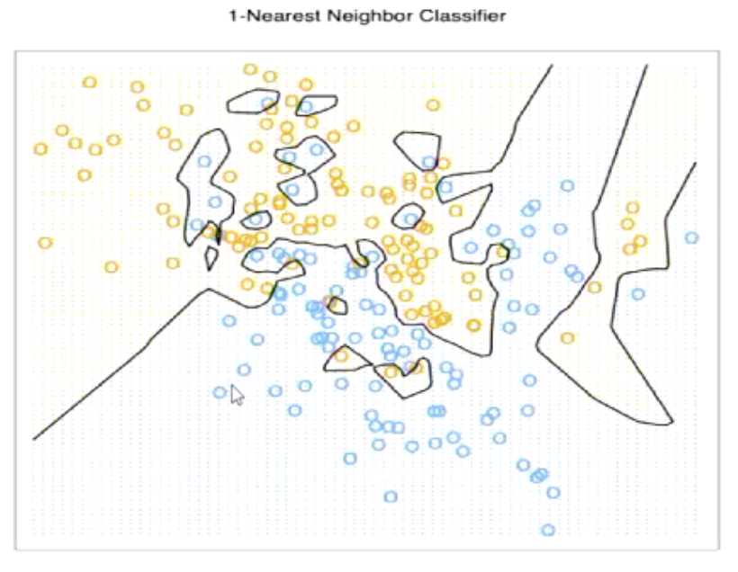 </center>

The above should motivate the usage of `K`-nearest neighbours. `K` represents how many neighbours will be used in the calculation of the distance function. As `K` increases, regions become bigger and more generalised - and thus appear 'smoother'

<center> 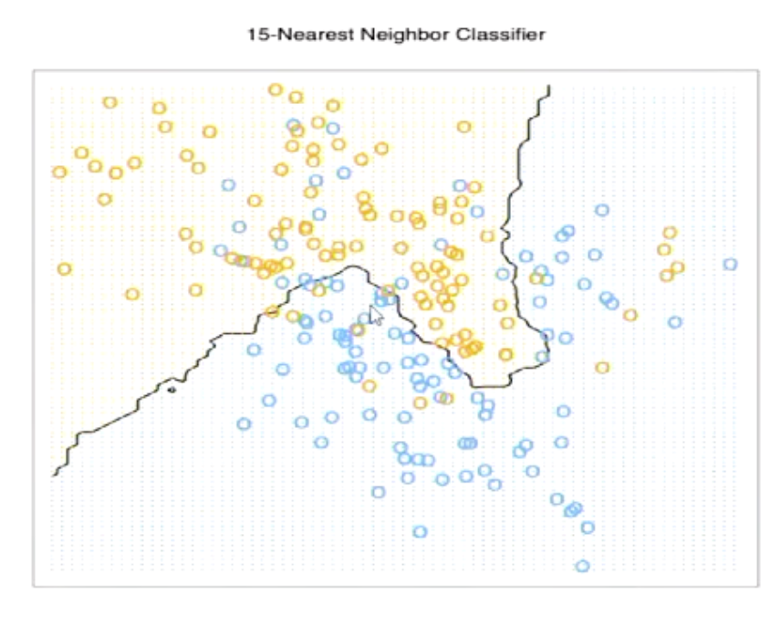 </center>

#### Test error in `K`-near neighbour

<center> 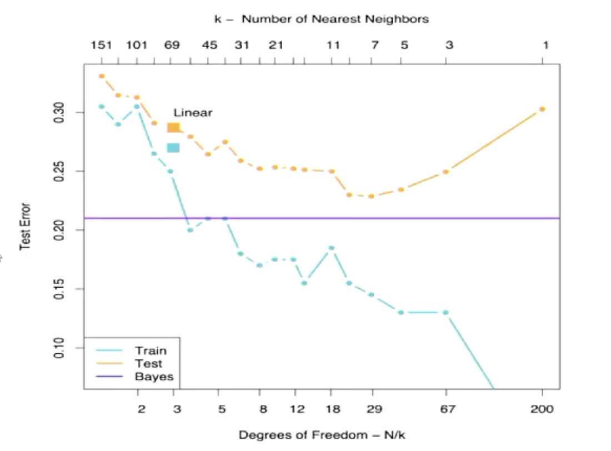 </center>

As `K` increases, training error will always increase - in `KNN`, `K=1` will always appear to be the best selection - however, for **testing error**, there exists some tradeoff (as we know in linear regression) for the complexity of adding new "degrees of freedom".

> **Degrees of freedom**
> 
> As we introduce larger `K` - we introduce "regions" which points will be classified/regressed into. With $N$ points and $K$, we have
> $$ \frac{N}{K} \text{ degrees of freedom}$$

#### Distance measurements

> **Minkowski distance**
>
> If $\mathcal{X} = \mathbb{R}^d$, the Minkowski distance of order $p > 0$ between $\mathbf{x, y} \in \mathcal{X}$ is defined as
>
> $$ Dis_p(\mathbf{x, y}) = \left(\sum_{j=1}^d |x_j - y_j|^p \right)^{1/p} = ||\mathbf{x - y}||_p$$
>
> or the $p$-norm.

The $2$-norm is the Euclidean distance $\sqrt{(\mathbf{x - y})^T(\mathbf{x - y})}$.

> **Theorem of arithmetic mean and Euclidean distance**
>
> The *arithmetic mean minimises the squared Euclidean distance*.
>
> The arithmetic mean $\mu$ of a set of data points $D$ in a Euclidean space is the unique point that minimises the sum of squared Euclidean distances to those data points.

#### Nearest neighbours algorithm

Store all training examples $(x_i, f(x_i))$

For nearest neighbour:
- Given some query instance $x_q$, locate nearest training example $x_n$, then estimate $\hat{f}(x_q) \leftarrow f(x_n)$
  
For $k$-nearest neighbour:
- Given $x_q$, take vote among its $k$ nearest neighbours (if discrete)
- For classification problems, the below is the estimator for $f(x_q)$
$$ \hat{f}(x_q) \leftarrow \argmax_{y \in \mathcal{Y}} \sum_{i=1}^k I[y, f(x_i)]$$

- Take mean of $f$ values amongst $k$ nearest neighbours (if real-valued)

#### Normalisation of attributes for nearest neighbours

> - Different features, or attributed are often measured on **different scales**.
> - These features need to be *normalised* or *scaled*
>   - This is because we use *distance functions*, which are of course sensitive to scale
>   - A change of $x$ for the feature Age, and the feature Income, will obviously affect the outcome differently.
> - A common example of this is `Min-Max` scaling
> $$ x_j = \frac{x_j - \min(x_j)}{\max(x_j) - \min(x_j)}$$
> - For discrete and nominal attributes, we require a distinct way to deal with these values

#### When to consider nearest neighbours

- Instances map to points $\in \mathbb{R}^d$
- Low dimensional data; for e.g, less than 20 features per instance
- **Lots** of training data
- Target function is "local" - so well approximated in sub-regions of the instance space
- No requirement for explanation

#### Local regression

Use $kNN$ to form a local approximation to $f$ for each query point $x_q$, using a linear function of the form
$$ \hat{f}(x) = b_0 + b_1x_1 + \dots + b_dx_d$$
where $x_j$ denotes the value of the $j$-th feature of instance $x$.

- Essentially find the nearest neighbours, and then
- Fit a linear regression model to the nearest neighbours - using the model to then predict $\hat{f}(x)$.

#### Distance-weighted KNN

- We may want to weight nearer neighbours more heavily
- So we use the distance function to construct weights $w_i$, to heavily weight closer points

$$ \hat{f}(x_q) \leftarrow \argmax_{y\in\mathcal{Y}} \sum_{i=1}^k w_i I[y, f(x_i)]$$
where
$$ w_i = \frac{1}{\text{Dis}(x_q, x_i)}$$

### Tree learning

#### Decision trees
> **What are decision trees?**
>
> <center>  </center>
>
> - Each itnernal node tests an attribute (`feature`)
> - Each branch corresponds to an attribute value or threshold
> - Each leaf node assigns a `classification` value
>
> But decision trees are not restricted to classification.
>
> ```txt
> Recursive partitioning algorithm
> 1. Select A as the 'best' decision attribute for next node
> 2. Assign A as decision attribute for node
> 3. For each value of A, create new descendant of node
> 4. Sort training examples of leaf nodes
> 5. If training examples perfectly classified, then STOP, else iterate over new leaf nodes
> ```

#### Entropy and information gain
> What is considered the "best attribute"?
>
> <center>  </center>
>
> We first consider 'entropy'.
>
> <center> 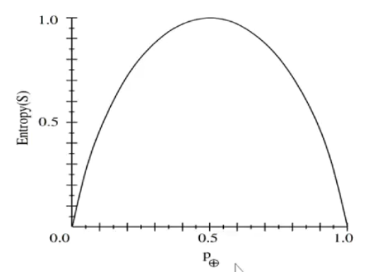 </center>
>
> Above, we have a chart with the `y`-axis as 'entropy', and the `x`-axis as the probability of a positive classification.
>
> So `entropy` is some concept of "randomness" - entropy is maximised at 0.5; the state of the input we are classifying is entirely random.
>
> **We wish to minimise entropy for our attributes**.
>
> $$ H(S) = -\sum_{i=1}^kp_i \log_2(p_i)$$
>
> Where:
> - $p_i$: is the fraction of samples in class $i$
> - $k$: is the number of classes
> - $S$ is the set of samples at a node


`Information gain` is defined by

$$ \text{Gain}(S, A) = H(S) - \sum_{v \in \text{Values}(A)} \frac{|S_v|}{|S|}H(S_v)$$

Here
- $S$ represents the data set at the current node
- $A$ represents the attribute we are considering for splitting
- $S_v$ is the subset of $S$ where attribute $A$ has value $v$

So essentially, this becomes
$$ \text{Information gain} = \text{Original entropy} - \text{Average entropy after splitting on A}$$

We can think that as $\text{Information gain} \uparrow$ that we are reducing randomness in our decisions.

More generally, we estimate class probabilities of class $k$ at node $m$ as
$$ \hat{p}_{mk} = \frac{|S_{mk}|}{|S_m|}$$
We classify at node $m$ by predicting the majority class, $\hat{p}_{mk}(m)$.
1. The misclassification error is given by
$$ 1 - \hat{p}_{mk}(m)$$
1. The entropy for $K$ class values is
$$ - \sum_{k=1}^K \hat{p}_{mk}\log\hat{p}_{mk}$$
1. CART uses the "Gini index"
$$ \sum_{k=1}^K \hat{p}_{mk}(1 - \hat{p}_{mk})$$

#### Training trees using information gain

Training trees with information gain works as such:
1. Consider the base groups `entropy` (the whole sample in the beginning)
2. Calculate every subgroups `entropy`
3. Calculate the information gain for each subgroup, and choose the subgroup with the largest information gain
4. Repeat steps `1 - 3` until recurisvely completed


Train a tree given the following data

<center>
  
</center>

We consider the entropy of the entire sample. There are `4` edible and `6` inedible samples, therefore having a starting entropy of
$$ H(S) = -0.4\log_20.4 - 0.6 \log_20.6 = 0.9710$$

We now consider the first split for each feature

$$ H(\text{Odor}) = \frac{3}{10} \cdot 0 + \frac{4}{10}\left(-\frac{3}{4}\log_2\frac{3}{4} -\frac{1}{4}\log_2\frac{1}{4}\right) + \frac{3}{10} \cdot 0 = 0.3245$$
$$ H(\text{Color}) = \frac{6}{10}\left(-\frac{4}{6}\log_2\frac{4}{6} - \frac{2}{6}\log_2\frac{2}{6} \right) = 0.5510 $$
$$ H(\text{Shape}) = \frac{4}{10}H(2/4) + \frac{3}{10}H(1/3) + \frac{2}{10}H(1/2) + \frac{1}{10}H(1) = 0.8755$$

Therefore, the highest information game is `Odor` for the first split. Consider the splits `Odor` creates.
1. Anything with odor `1` is **Yes**
2. Anything with odor `3` is **No**
3. Anything with odor `2` is still entropic, and can be split.

Therefore, consider for `Odor = 2`
$$ H(\text{Color}) = \frac{2}{4}H(1/2) = 0.5$$
$$ H(\text{Shape}) = \frac{2}{4}H(1/2) = 0.5$$

Both features have the same information gain, so we take the alphabetical ordering and choose *Color*.

Therefore consider the splits `Color | Odor = 2` creates:
1. Anything with `Color = U | Odor = 2` is No
2. Anything with `Color = G | Odor = 2` is No.
3. `Color = B` is still entropic.

We then have the two remaining samples. Shape `C -> Yes`, and Shape `D -> No`.


#### Dealing with overfitting

Tree learning algorithms are (generally) greedy. We choose the first best attribute, and then we find the next best attribute to that. 

We don't necessarily care whether a suboptimal local decision may lead to a more optimal attribute choice later on. This bias can overfit our data to specific attributes, which may end up not performing well in **testing data**. 

<center> 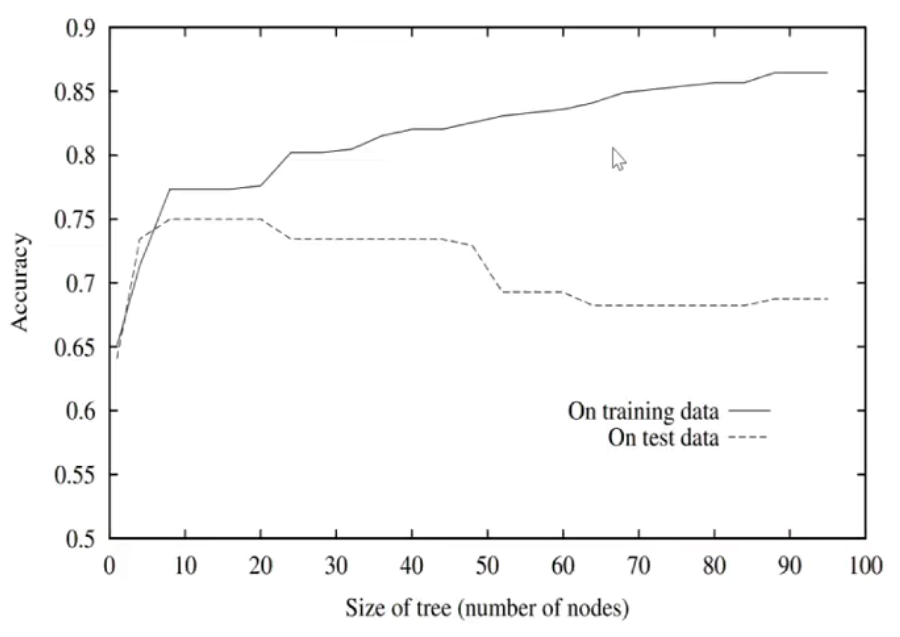 </center>

> **Pruning**
>
> To deal with overfitting, we can prune the tree. There are two main approaches:
> 1. `pre-pruning`: stop growing when further data splits are not useful
> 2. `post-pruning`: gro wthe full tree, remove sub-trees which may be overfitting
>
> In practice, `post-pruning`, is much more common.
>
> We have three parameters for pruning:
> - $f$: the actual (empirical) error
> - $e$: the estimated (pessimisitc) error
> - $c$: confidence
>
> Our pessimistic error is given by
> $$
> \begin{align*}
> e &= f + c\sqrt{\frac{f(1-f)}{N}} \\
> &= \text{Empirical error} + \text{std. of error}
>
> \end{align*}
> $$
> for the $N$ samples that are "under" or "within" the currnent attribute/node.
>
> Consider a parent node error $e_{parent}$ and a child node's error $e_{child}$. If
> $$ e_{child} \ge e_{parent} $$
> Then we can deduce that the child should be pruned away.

#### Regression trees
> Differences to decion trees:
> - Splitting criterion: minimising intra-subset variation
> - Pruning criterion: based on numeric error measure
>
> **Leaf node predicts average class values** of training instances reaching that node (a la `kNN`). By taking average values - we approximate piecewise constant functions.

We aim to train a tree that minimises the variance. In regression problems, we define the variance in the usual way:
$$ \text{Var}(Y) = \frac{1}{|Y|}\sum_{y\in Y} (y-\bar{y})^2$$
If a split partitions the set of target values $Y$ into mutually exclusive sets $\{Y_1, \dots, Y_l\}$, the weighted average variance is then
$$ \text{Var}(\{Y_1, \dots, Y_l \}) = \sum_{j=1}^l \frac{|Y_j|}{|Y|}\text{Var}(Y_j) = \frac{1}{|Y|}\sum_{y\in Y} y^2 - \sum_{j=1}^l \frac{|Y_j|}{|Y|}\bar{y_j}^2$$

#### Model trees
- Similar to regression trees, but with linear regression functions at each node
- Linear regresssion applied to instances that reach a node after full tree has been built

## Kernel Methods

### Classification and it's connection to kernel methods

A classifier is a mapping $\hat{C} : \mathcal{X} \to \mathcal{C}$, where $\mathcal{C} = \{C_1, C_2, \dots, C_k \}$ is a finite and usually small set of class labels.

A scoring classifier is mapping $\hat{\mathbf{s}} : \mathcal{X} \to \mathbb{R}^k$. The output of the scoring classifier is a vector noting how likely it is that class label $C_i$ applies.

#### Margins and loss functions

> **Margins**
> 
> If we take the true class $c(x)$ as $+1$ for positive examples and $-1$ for negative examples, then the quantity $z(x)= c(x) \cdot \hat{s}(x)$ is positive for correct predictions and negative for incorrect predictions. 
>
> The quantity $z(x)$ is called the margin assigned by the scoring classifier to the example.

> **Loss function**
>
> We would like to reward large *positive* margins, and penalise large *negative* values. This is achieved by the **loss function** $L : \mathbb{R} \to [0, \infty]$, which maps each example's margin $z(x)$ to an associated loss $L(z(x))$.
>
> We assume that $L(0) = 1$, which is the loss incurred by having an example on the decision boundary. We furthermore have $L(z) > 1$ for $z < 0$ and usually $0 \le L(z) < 1$ for $z > 0$.
> - That is, we want to penalise incorrect predictions ($L(z) > 1$)
> - And encourage correct predictions $0 \le L(z) < 1$
>   - There is clearly this trade off between how much we want to encourage positive predictions for varying margins.
>
> The average loss over a test set $T_e$ is then
>
> $$ \bar{L} = \frac{1}{|T_e|} \sum_{x\in T_e} L(z(x)) $$

### Extending learning classification

- Linear clasifiers can't model non-linear class boundaries
- **But**, there is a simple trick to allow them to do that
  - `Non-linear mapping`: map features into a new **higher-dimensional space** consisting of combinations of attribute values
  - For e.g: all products with $n$ factors that can be constructed from the features
- e.g of a transformation: for $2$ fetures, all products with $n = 3$ factors

$$ y = w_1x_1^3 + w_2x_1^2x_2 + w_3x_1x_2^2 + w_4x_2^3$$

#### What problems exist with non-linear mapping

- `Efficiency`:
  - With 10 features and $n = 5$, then there are more than `2000` coefficients
  - Fitting can be cubic in the number of features (for example `LASSO`)
- `Overfitting`:
  - "Too nonlinear" - number of coefficients large relative to number of training instances
  - Higher dimensionality leads to overfitting

### Linear classifiers in dual form

> **Perceptron training in dual form**
> 
> Everytime an example $\mathbf{x}_i$ is misclassified, add $y_i\mathbf{x}_i$ to the weight vector. After training has completed, each example has been misclassifed zero or more times. Denoting this number as $\alpha_i$ for example $\mathbf{x}_i$, the weight vector can be expressed as
>
> $$ \mathbf{w} = \sum_{i=1}^n \alpha_i y_i\mathbf{x}_i$$
>
> In the dual, instance-based view of linear classification, we are learning instance weights $\alpha_i$ rather than feature weights $w_j$. An instance $\mathbf{x}$ is classifed as
>
> $$ \hat{y} = \text{sign}\left(\sum_{i=1}^n\alpha_iy_i\mathbf{x_i} \cdot \mathbf{x} \right)$$
>
> Thereby, during training, the only information needed about the training data is all pairwise dot products. This is the **Gram Matrix**, or
> $$ G = XX^T$$
>
> Instead of changing the weights - training in dual form increases $\alpha_i$ by $1$ if it misclassified. We are essentially penalising the model for getting predictions wrong, and still pushing the hyperplane in the correct direction.

### Support vector machines
> **Support vector machines**
> <center>  </center>
> 
> The decision boundary learned by a support vector machine **maximises the margin** which is indicated by the doted lines.
> The circled data points are the *support vectors.* 
>   - The support vectors are the samples which maximise the margin.
>   - The model only relies on the support vectors

#### Finding support vectors

We want to find the decision boundary $w^Tx = w \cdot x$. We can simplify the question to finding $w \cdot x = 0$. Of course, $w$ is orthogonal to the decision boundary.

We find $x_i$, which maximises the margin to the decision boundary. Of course, we remember that $w \cdot x_i = ||w|| ||x_i|| \cos(\theta)$. We remember that
- $\theta = 0$ means that $x_i$ is on the decision boundary
- $\theta < 90$ means that $x_i$ is positive, as it is acute
- $\theta > 90$ means that $x_i$ is negative, as it is obtuse

<center>  </center>

The margin is indeed defined by the projection of $x_i$ onto $w$. Alternatively, we find $\theta$, the angle between $w$ and $x_i$ such that
$$ \theta = \arccos\left( \frac{w\cdot x_i}{||w|| ||x_i||}\right)$$
The angle opposite to the dotted line (the margin) in the above diagram is the $\pi/2 - \theta$. Thereby, we have that
$$ 
\begin{align*}
\sin\left(\frac{\pi}{2} - \theta\right) &= \frac{\gamma}{||x_i||} \\
\gamma&= ||x_i||\sin\left(\frac{\pi}{2} - \theta\right) \\
\gamma&= ||x_i||\cos\theta \\ 
\gamma &= ||x_i||\cos\left(\arccos\left( \frac{w\cdot x_i}{||w|| ||x_i||}\right)\right) \\
\gamma &= \frac{w\cdot x_i}{||w||}
\end{align*}
$$

Now $w \cdot x_i = m$, the signed distance from $x_i$ to the decision boundary. We generally let $m = 1$, leading to
$$ \gamma = \frac{1}{||w||}$$
> **The maximal margin classifier**
> 
> Now our goal is to maximise $\gamma$, or equivalently, minimise $||w||$. $t$ is the bias term in the linear decision boundary, such that
> $$ w\cdot x - t = 0$$
> We are free to rescale $t, ||w||$ and $m$. We minimise $||w||$, or more conveniently $\frac{1}{2}||w||^2$.
> This leads to a constrained optimisation problem
> $$ w^{*}, t^{*} = \argmin_{w, t} = \frac{1}{2}||w||^2$$
> subject to the constraints $y_i(w \cdot x_i - t) \ge 1, 1 \le i \le n$; which suggests that the margin should be **atleast** 1.

#### Deriving the dual problem

The maximal margin classifier in the above section has been defined by the *primal* problem; we can just see this as the "original" problem. The **dual** problem applies 'Lagrangian duality' to bring the constraint into the loss function. 

> The dual depends *only on dot products*, and is thus useful for kernel functions.

We begin with the dual problem
$$ \min_{\mathbf{w}, b} \frac{1}{2} ||\mathbf{w}||^2$$
subject to $y_i(\mathbf{w}^T\mathbf{x}_i + b) \ge 1$

We bring this constraint into the loss function, such that
$$ L(\mathbf{w}, b, \alpha) = \frac{1}{2}||\mathbf{w}||^2 - \sum_{i=1}^n\alpha_i\{y_i(\mathbf{w}^Tx_i + b) -1 \}$$
subject to $\alpha_i \ge 0$. Why must $\alpha_i \ge 0$? This relates to the Karush-Kuhn-Tucker (KKT) conditions.

We can derive w.r.t $\mathbf{w}$ and $b$ to get a cleaner results, such that
$$ \frac{\partial L}{\partial \mathbf{w}} = \mathbf{w} - \sum_{i=1}^n \alpha_i y_ix_i \implies \mathbf{w} = \sum_{i}\alpha_iy_ix_i$$
$$ \frac{\partial L}{\partial b} = -\sum_{i=1}^n\alpha_iy_i \implies \sum_{i}\alpha_iy_i = 0$$

Thus, in the $\frac{\partial L}{\partial b}$ we eliminate $b$ and uphold the constraint $\sum_{i}\alpha_iy_i = 0$. Substituting in, we have

$$ ||\mathbf{w}^2|| = \left|\left|\sum_{i}\alpha_iy_ix_i \right|\right|^2 = \sum_{i, j}\alpha_i\alpha_jy_iy_j\langle x_i, x_j\rangle$$

$$ \mathbf{w}^T\mathbf{x}_i = \sum_{j}\alpha_jy_jx_j^Tx_i$$

$$ \sum_{i}\alpha_i\{y_i(\mathbf{w}^T\mathbf{x}_i + b) - 1\} \implies \sum_{i, j}\alpha_i\alpha_jy_iy_j\langle x_i, x_j\rangle - \sum_{i}\alpha_i$$

Thereby, the dual problem
$$ L(\mathbf{w}, b, \alpha) = \sum_{i}\alpha_i - \frac{1}{2}\sum_{i, j}\alpha_i\alpha_jy_iy_j\langle x_i, x_j \rangle$$
subject to $\alpha_i \ge 0$ and $\sum_{i}\alpha_iy_i = 0$.


#### Noise
- So far, we have assumed that the data is separable
- Misclassified examples may break the separability assumption

> **Slack variables and the soft margin classifier/support vector classifier**
>
> The slack variable $\mathcal{E}_i$ allows misclassification of instances. Slack avriables allow SVMs to handle noisy data. However, our constraints now must change!
>
> We now allow some samples to be within the margin, and as well at the wrong side of the decision boundary. These are called **margin errors**. We change the constraints to
>
> $$ w \cdot x_i - t \ge 1 - \mathcal{E}_i$$
>
> and add the sum of all slack varaibles to the objective function to be minimised.
>
> $$ w^*, t^*, \mathcal{E}_i^* = \argmin_{w, t, \mathcal{E}_i} \frac{1}{2}||w||^2 + C\sum_{i=1}^n\mathcal{E}_i$$
>
> subject to $w \cdot x_i - t \ge 1 - \mathcal{E}_i$, $1 \le i \le n$.
>
> The variable $C$ is conventionally referred to as `complexity`. It is a trade off between margin maximistion against slack variable minimisation. As margins grow, it is more likely that more slack variables exist.
>
> As $C \to \infty$, margin error incurs a high penalty, and vice versa.

#### Sparse data

- SVM algorithms can be sped up dramatically if data is sparse
- They computes lots of dot products - and so can skip over zero values
- SVMs can process sparse datasets with tens of thousands of features

> SVMs are a good choice for $p \gg n$ problems, where
>   - $p$ is the number of features
>   - $n$ is the number of samples

#### The kernel trick
Let $\mathbf{x}_1 = (x_1, y_1)$ and $\mathbf{x}_2 = (x_2, y_2)$ be two datapoints, and consider the mapping $(x, y) \to (x^2, y^2, \sqrt{2}xy)$ to $\mathbb{R}^3$. The points in feature space are
$$ \mathbf{x}'_1 = (x_1^2, y_1^2, \sqrt{2}x_1y_1)$$ 
$$ \mathbf{x}'_2 = (x_2^2, y_2^2, \sqrt{2}x_2y_2)$$

The dot proudct of these two features simplifies to be
$$ \mathbf{x}_1' \cdot \mathbf{x}_2' = (\mathbf{x}_1 \cdot \mathbf{x}_2)^2$$

So by squaring teh dot product in the original space, we obtain the dot product in the **new space without actually constructing the feature space!**

> **Kernel**
>
> A function that calculates the dot product in `feature space` directly from the vectors in `original space` is called a **kernel**. The above is an example of a polynomial kernel with $p = 2$, where
>
> $$ \kappa(\mathbf{x}_i, \mathbf{x}_j) = (\mathbf{x}_i \cdot \mathbf{x}_j)^p$$
>
> Another commonly used kernel is the Gaussian kernel
>
> $$ \kappa(\mathbf{x}_i, \mathbf{x}_j) = \exp\left(\frac{-||\mathbf{x}_i - \mathbf{x}_j||^2}{2\sigma^2} \right)$$

## Ensemble Learning

Ensemble learning is a kind of `multi-level` learning algorithm.
1. Learn a number of base-level models from the data
2. Learn to combine these models as an ensemble

### Bias-variance decomposition for ensemble learning

Bias-variance decomposition is a theoretical tool for analysing how much any given training set affects performance of a learning algorithm.

> Assume we have an infinite number of models trained by the same learning algorithm on different sample datasets, all of the same size
>   - The `bias` for a learning algorithm is how far the average model's preidctions are from the true target function.
>   - The `variance` of a learning algorithm is the expected error due to the differences in the training datasets used.
>   - $\text{Total expected error} \approx \text{bias}^2 + \text{variance}$ 
>
> <center>
> <figure>
>   
>   <figcaption> Depictions of different combinations of bias and variance</figcaption>
> </figure>
> </center>
>
> In the above diagram
>   - The two left diagrams have low variance
>   - The two right diagrams have high variance
>   - The two upper diagrams are low bias (close to the middle)
>   - The two lower diagrams are high bias (far from the middle)

#### Bias-variance tradeoff

Bias-variance components of error typically show an error, such that
$$
\begin{align*}
  \text{Bias} &\uparrow \text{ and } \text{Variance} \downarrow \text{or} \\ 
  \text{Bias} &\downarrow \text{ and } \text{Variance} \uparrow
\end{align*}
$$

#### Bias-variance in ensemble classification

- Recall that we originally derived the bias-variance decomposition for regression; squared-error loss function
- We can decompose expected error of any individual ensemble member as follows
  - Bias = expected error of the ensemble classifier on new data
  - Variance = component of the expected error due to particular training set being used to build classifier
  - $\text{Total expected error} = \text{bias}^2 + \text{variance}$

### Stability

> For a given data distribution $\mathcal{D}$, train an algorithm $L$ on training sets $S_1, S_2 \in \mathcal{D}$.
> 
> If the model $L$ is the same, or similar on both $S_1$ and $S_2$, we say that $L$ is a `stable learning algorithm`. Otherwise, we deem the model *unstable*.
>
> Stability is of course desired - as we wish to have replicable models for different types of training sets.

#### Instability in decision-tree learning

Decision-tree learning is indeed quite unstable. Changing a single feature by even a small increment, can change the trees drastically.
We can imagine that this is the case, due to the 'splitting' nature
of decision trees. 

Rather than moving in small continuous steps, decision trees generally segregate points in large groupings that are discrete.

Thereby, small changes in groups and values can lead to high instability.

> **Stability and Bias-Variance**
>
> - Stable algorithms typically have high bias
> - Unstable algorithms typically have high variance
> - However, we need to consider the effects of the parameters
>   - decision trees typically have parameters to limit depth of tree
>   - Simple trees will be more stable
>
> You can think about this geometrically
>   - Low bias (high bias) models follow the points closely; and so when points move slightly, high variance behaviour can be observed.
>   - Low variance (high bias) models follow the points less closely, and so when points move slightly, high bias behaviour can be observed (as they adjust less).

### Ensemble method 1: Bagging

> "**B**oostrap **Agg**regation" - introduced by `Leo Breiman`
>
> - Employs simplest way of combining predictions: voting/averaging
> - Each modle receives *equal weight*
> - The standard version of baggining is:
>   - Sample several training sets of size `n` (how?)
>   - Build a classifier for each training set
>   - Combine the classifiers' predictions

```txt
Algorithm: Baggining (D, T, A)
Input: dataset D, ensemble size T, learning algorithm A
Output: set of models

for t = 1 to T do
  bootstrap sample D(t) from D by sampling |D| examples with replacement
  run A on D(t) to produce a model M(t)
end

return {M(t) | 1 <= t <= T}
```


#### Bootstrapping: sampling with replacement

Given a dataset $\mathcal{D} = \{x_1, x_2, \dots, x_n\}$ the idea is to
- Sample $n$ data points **with replacement** from $\mathcal{D}$ to create a new dataset $\mathcal{D}^*$
- Compute the statistic $theta^* = s(\mathcal{D^*})$
- Repeat steps 1-2 $B$ times to get $\theta_1^*, \theta_2^*, \dots, \theta_B^*$
- Use the distribution of these $\theta_b^*$s to estimate the uncertainity of the original statistic $\hat{\theta} = s(\mathcal{D})$

#### Applications to models and proof of variance-lowering properties

Bagging can be applied across a variety of models. In particular, bagging is useful for `high variance` models.

Consider the following argument.

> We have a dataset $\mathcal{D}$, and a learning algorithm that produces a predictor $f(d \in \mathcal{D})$. You train $B$ models $f_1(x), f_2(x), \dots, f_B(x)$ each ona different bootstrap sample $\mathcal{D}_b^*$.
>
> The predictor is then
> $$ \bar{f}(x) = \frac{1}{B} \sum_{b=1}^B f_b(x)$$
>
> Let us define 
> - $\mu(x) = E(f_b(X))$
> - $\text{Var}(f_b(x)) = \sigma^2$
> - $\text{Cov}(f_b(x), f_{b'}(x)) = \rho\sigma^2$, such that $\rho$ is the correlation between the models
>
> Thereby, the variance of the bagged predictor is 
>
> $$ \text{Var}(\bar{f}(x)) = \frac{1}{B^2}\sum_{b=1}^B \text{Var}(f_b(x)) + \sum_{b \ne b'}\text{Cov}(f_b(x), f_{b'}(x))$$
>
> Plugging in the definitions, we have
>
> $$ \sigma^2\left(\frac{1-\rho}{B} + \rho \right)$$
>
> Consider that $-1 \le \rho \le 1$. When $\rho = 0$, we have maximise reduction of the variance using bagging - $\sigma^2/B$. When all of the models are perfectly correlated (thereby equal), we have no improvement.

We can imagine that unstable models will improve the most from bagging as the correlation between the models with the lowest (as the differing samples change the models greatly) - in turn creating less correlation betwen the models.

### Ensemble method 2: Random Forests

The motivation for random forests comes from  introducing diversity into an ensemble. Most algorithms can be randomised;
in particular, greedy algorithms with `p` parameters can be randomised by seling `n < p` parameters at a time, and then combining
trained models.

``` txt
Algorithm RandomForest(D, T, d)
Input: data set D, ensemble size T, subspace dimension d
Output: set of models, predictions to be combined by voting or average

for t = 1 to T do
  bootstrap sample D(t) from D by sampling |D| examples with replacement
  select d features at random and reduce D(t) to only contain these features
  train a tree model M(t) on D(t) without pruning
end

return {M(t) | 1 <= t <= T}
```

The `Random Forests` algorithm is essentially like `bagging` for trees, except that the ensemble of
tree models is trained from bootstrap samples **and** random subspaces.
  - Each tree in the forst is learned from
    - A bootstrap sample, i.e sample from the training set with replacement
    - A subspace sample, i.e randomly sample a subset of features
  - This means that random forests **gain from**:
    - More diversity amongst trees in the sensemble
    - Less time to train since we only consider a subset o features

### Ensemble method 3: Boosting

Boosting also uses voting/averaging of an ensemble but each model is *weighted* according to their performance. In boosting,
new models are influenced by the performance of previously built ones.

New models are classify instances classified incorrectly by earlier models.

#### The strength of weak learnability

- Learner produces a binary $[-1, +1]$ classifer $h$ with error rate $\epsilon < 0.5$
- In some sense, $h$ is "useful", because it's better than random.
- A **strong** learner is if $\epsilon < 0.5$ and $\epsilon \to 0$.
- A **weak** leaner is if $\epsilon < 0.5$ and $\epsilon \to 0.5$

**Boosting** is the procedure of converting weak learners into strong learners.

#### Weighting in boosting

In boosting, a weight $w$ is passed into training to emphasise certain points for training. In particular, we wish to give
a $50\%$ weight to misclassified examples and $50\%$ to correctly classified examples. 

> **The goal is to adjust the weights for misclassified and correctly classified examples**.
>
> All of the weights start evenly distributed, that is 
> $$ w_i = \frac{1}{|D|}$$
> for some dataset $D$.
> Note that the error rate $\epsilon$ is defined by
>
> $$ \epsilon = \frac{\text{Misclassified}}{100}$$
>
> and thereby
> $$ \sum_{i \in \text{misclassified}} w_i = \epsilon$$
>
> Therefore, the correct classified weights sum to $1 - \epsilon$. We wish to have a multiplier that adjusts these weights for these points, such that misclassified and correctly classified points get $50\%$ equal weightings. So we have some multipliers $\lambda_{\epsilon}$ and $\lambda_{1 - \epsilon}$ such that
>
> $$ \lambda_{\epsilon}\epsilon = \lambda_{1-\epsilon}(1-\epsilon) = \frac{1}{2}$$
>
> So we multiply each correctly classified example weighting by
> $$ \lambda_{1-\epsilon} = \frac{1}{2(1-\epsilon)}$$
>
> and each misclassified example weighting by
>
> $$ \lambda_{\epsilon} = \frac{1}{2\epsilon}$$


#### Algorithm

```txt
Algorithm Boosting(D, T, A)
Input: data set D, ensemble size T, learning algorithm A
Output: weighted ensemble of models

// initial weights
w(1, t) <- 1 / |D|

for t = 1 to T do
  run A on D with weights w_(t, i) to produce a model M(t)
  calculate weighted error e(t)

  if e(t) >= 1/2 then
    set T <- t - 1 and break
  end
  
  // alpha weight
  a(t) <- 1/2 * ln((1 - e(t)) / e(t))

  // readjust weights
  w(t+1, i) <- w(t, i) / (2 * e(t)) for misclassified instances x(i) in D
  w(t+1, j) <- w(t, j) / (2 * (1 - e(t))) for correctly classified instances x(j) in D
end

return M(x) = sum(alpha(t) * M(t)(x))
```

#### Why that value of $\alpha_t$?

The weight updates for can be represented using $\delta_t$ and $\frac{1}{\delta_t}$ normalised by $z_t$, such that

$$ \frac{1}{2\epsilon_t} = \frac{\delta_t}{Z_t}$$
$$ \frac{1}{2(1 - \epsilon_t)} = \frac{1/\delta_t}{Z_t}$$
This means that
$$ Z_t = 2\sqrt{\epsilon_t(1-\epsilon_t)}$$
$$ \delta_t = \sqrt{\frac{1 - \epsilon_t}{\epsilon_t}} = \exp(\alpha_t)$$

Thereby, the weight updated for misclassified instances is $\exp(\alpha_t) / Z_t$ and for correctly classfied examples $\exp(-\alpha_t)/Z_t$. Since $y_iM_t(x_i) = +1$ for correctly classified instances and $-1$ otherwise, we can write the update as
$$ w_{(t+1)i} = w_{ti} \frac{\exp(-\alpha_ty_iM_t(x_i))}{Z_t}$$

#### Some features of boosting

- Boosting *reduces error*; it focuses on improving the model iteratively and by combining models together.
- Boosting can then be seen as adding more *information*, particularly when bagging may proudce more homogenous ensembles.
- Since boosting considers the residuals (or errors) of previously trained models, they provide more `orthogonal` or *new* information.

### Stacking: meta-learning for ensemble predictions

In the above mentioned ensemble methods, we have taken an average/voted for the result from the ensemble. Instead, stacking
uses a `meta-learner` or a level-1 model, which takes in an input from the base learners trained in an ensemble method, and then
finds the best way to *combine them* for the output.

Since the `meta-learner` is one layer above the predictions, we can instead use a **mixture of different models** instead of
having the same model as the base learner. 

> *Most commonly, linear models are used as the base learners reduce complexity in the model*.

### Additive Regression

- Using statistical terminoloy, boosting is a greedy algorithm for fitting an additive model.
- More specifically, it implements forward stagewise additive modelling.
- Forward stagewise additive modelling for numeric prediction:
  - Building standard regression model
  - Gather residuals, learn model predicting residuals and repeat
- To predict, simply sum up individual predictions from all regression models

### Gradient boosting: `XGBoost`
- Boosting algorithms learn a form of *additive model*
- At each boosting iteration, a new *weighted* component function is added to the boosted model
- In **gradient boosting**, this approach is used to solve an optimisation problem
  - Informally, need to minimise loss over all components over all training examples
- A simpler approximation to this optimisation is a forward stepwise procedure
  - At each iteration, minimise loss summed over all previously added components, plus the current one
  - In gradient boosting, a regression tree is learned at each iteration to minimise the loss for predicting the *negative gradient* at each leaf.

```txt
Algorithm GradientBoosting(D, T, A, L)
Input: data set D = {(x_i, y_i)}, number of rounds T, base learner A, loss function L(y, f)
Output: prediction function F(x)

Initialize model:
  F0(x) <- argmin_c sum_i L(y_i, c)   // For squared loss: mean(y)
  F(x) <- F0(x)

for t = 1 to T do
  // Compute pseudo-residuals (negative gradient)
  for each i in D:
    r_i <- -∂L(y_i, F(x_i)) / ∂F(x_i)

  // Fit base learner to residuals
  M_t(x) <- A({(x_i, r_i)})

  // Compute step size (line search or fixed shrinkage rate)
  a_t <- argmin_a sum_i L(y_i, F(x_i) + a * M_t(x_i))

  // Update model
  F(x) <- F(x) + a_t * M_t(x)
end

return F(x)
```

### Mixture of experts: learning to weight models

Mixture of experts is a frame for learning given data generated by a *mixture model*. Each component models an "expert" for
some component of the problem (different models excel at different things); and all component outputs are pooled for ensemble output.

<center> 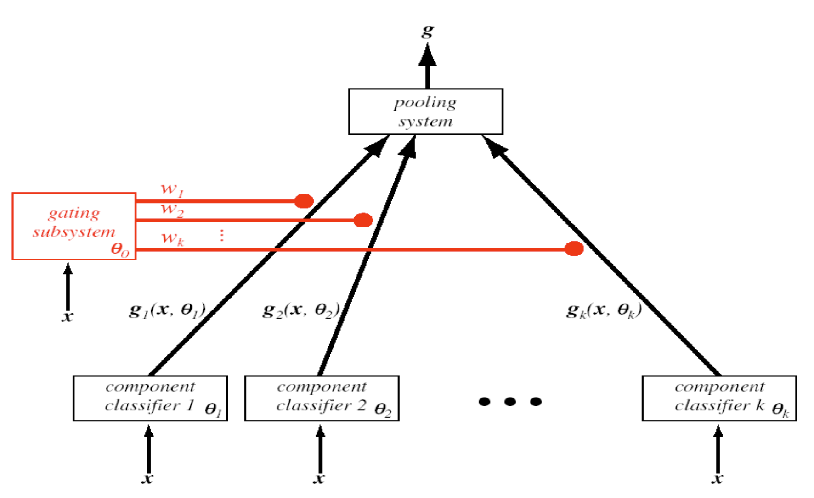 </center>


## Neural Learning

Neural learning is based on `Artifical Neural Networks (ANNs)`
- They are 'inspired by' `Biological Neural Networks (BNNs)`
- However, the *structure* and *learning method* are different
- `ANNs` are the basis of deep learning (`DL`)

`Artificial Neural Networks (ANNs)` have the following properties:
- Many neuron-like threshold switching units
- Many weighte interconnections among units
- Highly parallel, distributed process of learning
- Emphasis on tuning weights automatically
- `ANNs` learn *distributed representations* of target functions

### When to apply neural networks
Neural networks are strong when many of following conditions are met. Neural networks take *significant compute time*, and thus aren't necessarily appropiate for all problems.
- Input is high-dimensional discrete or real valued
- Output can be discrete or real valued
- Output can be a vector of values
- Possibly noisy data
- Features and form of target function is unknown
- Human readability of result is unimportant

### Perceptron neural networks
<center>
  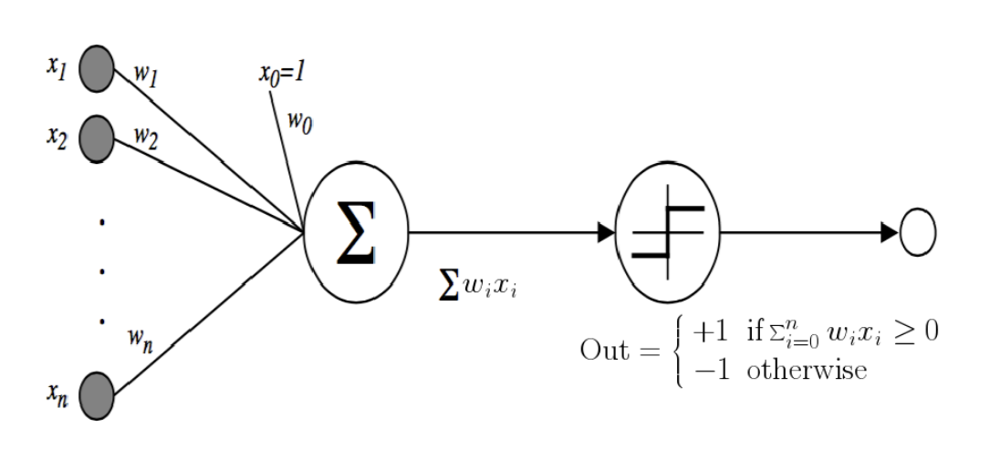
</center>

Perceptions are essentially a mathematical model of a neuron. The $\text{Out}$ function, which is defined by

$$ \text{Out} = \begin{cases} +1 & \text{if }\sum_{i=0}^n w_ix_i \ge 0  \\ -1 & \text{otherwise}\end{cases}$$

is called the **activation function**. Note that the activation function is *non-linear*. 

> **Key observation**: if we did not have an activation function - or if the activation function was linear, then the perception above is just a `linear regression`.

#### Decision surface of a perceptron

Unfortunately, perceptrons are linear classifiers $\implies$ limited expressive power. Some functions are not representible with linear classifiers (for example, `XOR`).

<center>
  <figure>
    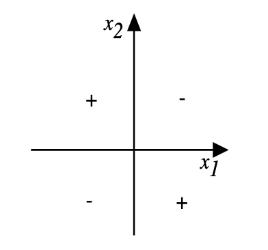
    <figcaption> There is no straight line which separates XOR </figcaption>
  </figure>
</center>

So for non-linearly seperable data, we need *something else*. 

>**The principal idea of neural networks is to combine multiple perceptrons to create a `multilayer peceptron`** - which then can model non-linear behaviour

#### Perceptron learning

Perceptron learning is simply an iterative weight update scheme

$$ w_i \leftarrow w_i + \Delta w_i$$

However, how do we train for multilayer perceptrons? Since perceptron outputs are *discontinuous*, they are no differentiable. So we require another unit.

### Gradient descent 

#### Batch gradient descent

Consider a linear unit where the eoutput $o$ is a linear combination of weights and inputs

$$ o = w_0 + w_1x_1 + \dots + w_nx_n$$

We can then train $w$ with the squared error loss function

$$ E[\mathbf{w}] = \frac{1}{2}\sum_{d \in D} (t_d - o_d)^2$$

where $D$ is the set of training examples, $t_d$ is the label of example $d$ and output $o_d$ is the prediction. Let the vector of inputs be $\mathbf{X}$ Note we can represent these elements as the vectors $\mathbf{t}$ and $\mathbf{o}$ such that
$$
\begin{align*}
E[\mathbf{w}] &= \frac{1}{2}(\mathbf{t} - \mathbf{o})^T(\mathbf{t} - \mathbf{o}) \\ 
&= \frac{1}{2}(\mathbf{t}^T\mathbf{t} - 2\mathbf{t}^T\mathbf{o} + \mathbf{o}^T\mathbf{o}) \\
&= \frac{1}{2}(\mathbf{t}^T\mathbf{t} - 2\mathbf{t}^T\mathbf{Xw} + \mathbf{w}^T\mathbf{X}^T\mathbf{X}\mathbf{w})
\end{align*}
$$
We can then see that the derivative of this loss function w.r.t $\mathbf{w}$ is
$$
\begin{align*}
\frac{\partial E}{\partial \mathbf{w}}  &= \frac{1}{2}(-2\mathbf{X}^T\mathbf{t} + 2\mathbf{X}^T\mathbf{X}\mathbf{w}) \\
&= -\mathbf{X}^T(\mathbf{t} - \mathbf{X}\mathbf{w})
\end{align*}
$$

Thus this is our 'gradient step'. Plugging back in $\mathbf{o} = \mathbf{X}\mathbf{w}$, we have
$$ \frac{\partial E}{\partial \mathbf{w}} = -\mathbf{X}^T(\mathbf{t} - \mathbf{o})$$
and therefore this is our update step.
```txt
Gradient Descent(D, n)

Each training example in D is a pair <x, t>, where x is the vector of input values t is the target output value. n is the learning rate.

Initialise w(i) to some small random value

Until terminate do {
  Initialise each grad(w(i)) to 0
  For each <x, t> in D, do {
    Input the instance x(i) into the unit and compute o
    For each linear unit weight w(i) {
      grad(w(i)) <- grad(w(i)) + n(t - o)x(i)
    }
  }

  For each linear unit weight w(i) {
    w(i) <- w(i) + grad(w(i)) 
  }
}
```

#### Stochastic (Incremental) Gradient Descent
We instead compute the descent **per-example** and update the 
weights per-point; as to *per-batch*.
```
Do until satisfied {
  For each training example d in D {
    Compute the gradient grad(E(w))
    w <- w - n * grad(E(w))
  }
}

where grad(E(W)) defined the pointwise gradient
```

The incremental 
$$ E_d[\mathbf{w}] = \frac{1}{2}(t_d - o_d)^2$$


### Networks of units
The issue with our perceptron was that the function is discontinuous, and thus could not be differentiable in a multi-layered way. **Linear units** are differentiable, but do not have a non-linear activation function and thus are just a linear model.

#### Sigmoid Unit

The sigmoid unit is essentially a smoothed version of the step function. 

> **Note:** in the practical application of neural networks, sigmoid units are rarely used - and rather functions such as `Rectified Linear Unit (ReLU)` and it's variants are used.

The sigmoid function is
$$ \sigma(x) = \frac{1}{1 + e^{-x}}$$

The derivative is nice to work with

$$ \frac{d\sigma(x)}{dx} = \sigma(x)(1 - \sigma(x))$$

### Multi-layer perceptron training

Consider the following notation:
- $x_{ji}$ = the $i$-th input to unit $j$
- $w_{ji}$ = weight associated ith $i$-th input to unit $j$
- $\text{net}_j$ = $\sum_{i} w_{ji}x_{ji}$, weighted sum of inputs for unit $j$
- $o_j$ = output computed by unit $j$
- $t_j$ = the target output for unit $j$
- $\sigma$ = the sigmoid function

> **Weight updates**
>
> Update each weight $w_{ji}$ by adding to it $\Delta w_{ji}$ where 
>
> $$ \Delta w_{ji} = -\eta \frac{\partial E_{d}}{\partial w_{ji}}$$
>
> where $E_d$ is error on example $d$, summed over all output units in the network
>
> $$ E_d(\mathbf{w}) = \frac{1}{2}\sum_{k}(t_k - o_k)^2$$

Consider the influence of $w_{ji}$. It can only influence the rest of the network through $\text{net}_j$. Applying the chain rule

$$ \frac{\partial E_d}{\partial w_{ji}} = \frac{\partial E_d}{\partial \text{net}_j}\frac{\partial \text{net}_j}{\partial w_{ji}} = \frac{\partial E_d}{\partial \text{net}_j}x_{ji}$$

How do we consider $\frac{\partial E_d}{\partial \text{net}_j}$? Two cases to consider:
1. unit $j$ is an output node of the network
2. unit $j$ is an internal node

> **Case 1: Training rule for output unit weights**
>
> $\text{net}_j$ can influence the network only through $o_j$ so apply chain rule again
>
> $$ \frac{\partial E_d}{\partial \text{net}_j} = \frac{\partial E_d}{\partial o_j} \frac{\partial o_j }{\partial\text{net}_j}$$
>
> The **first term** we can calculate using the chain rule
>
> $$ 
> \begin{align*}
> \frac{\partial E_d}{\partial o_j} &= \frac{\partial}{\partial o_j}\frac{1}{2}\sum_{k}(t_k - o_k)^2 \\
> &= -(t_j - o_j)
> \end{align*}
> $$
> This makes sense, since we should only consider the $j$-th output's impact on the error.
>
> For the **second term**, note that $o_j = \sigma(\text{net}_j)$ and recall that the derivative $\partial o_j/ \partial\text{net}_j$ is the derivative of the sigmoid function, that is
>
> $$
> \begin{align*}
>   \frac{\partial o_j}{\partial \text{net}_j} &= \frac{\sigma(\text{net}_j)}{\partial \text{net}_j} \\ 
>   &= o_j(1 - o_j)
> \end{align*}
> $$
>
> Combining the two terms, we find that
>
> $$ \frac{\partial E_d}{\partial \text{net}_j} = -(t_j - o_j)o_j(1 - o_j)$$
>
> The weight update for the output unit is then
>
> $$\partial w_{ji} = -\eta\frac{\partial E_d}{\partial w_{ji}} = \eta(t_j-o_J)o_j(1-o_j)x_{ji}$$
>
> Denote $\delta_i = -\frac{\partial E_d}{\partial \text{net}_i}$ for unit $i$

> **Case 2: Training rule for hidden unit weights**
>
> Internal unit $j$ can only influence the output of all paths through $\text{Downstream}(j)$; or otherwise **all nodes directly connected to $\text{net}_j$**
>
> $$
> \begin{align*}
>   \frac{\partial E_d}{\partial \text{net}_j} &= \sum_{k\in\text{Downstream}(j)} \frac{\partial E_d}{\partial \text{net}_k}\frac{\partial \text{net}_k}{\partial \text{net}_j} \\ 
>   &= \sum_k -\delta_k \frac{\partial \text{net}_k}{\partial o_j}\frac{\partial o_j}{\partial\text{net}_j} \\
>   &= \sum_k -\delta_k w_{kj} \frac{\partial o_j}{\partial \text{net}_j} \\
>   &= \sum_k -\delta_k w_{kj} o_j(1 - o_j)
> \end{align*}
> $$
>
> We can then define $\delta_j$ as
> $$ \delta_j = o_j(1-o_j)\sum_{k \in\text{Downstream}(j)}\delta_k w_{kj}$$
>
> and weight update
> $$ \Delta w_{ji} = \eta\delta_jx_{ji}$$

### Backpropagation algorithm
```txt
Initialise all weights to small random numbers

Until termination condition satisfied, do {
  For each training example, do {
    Input training example <x, t> to the network and compute network outputs

    For each output unit k {
      delta(k) <- o(k) * (1 - o(k)) * (t(k) - o(k))
    }

    For each hidden unit h {
      delta(h) <- o(h) * (1 - o(h)) * sum(w(k, h) * delta(k))
    }

    Update each network weight w(j, i) {
      w(j, i) <- w(j, i) + grad(w(j, i))

      # where grad(w(j, i)) = n * delta(j) * x(j, i)
    }
  }
}
```

The backpropagation algorithm is a solution for learning *highly complex* models. 
- Gradient descent over entire *network* weight vector
- Easily generalised to arbitrary directed graphs
- Can learn probabilistic models by maximising likelihood

Minimises error over **all** training examples
- Training can take thousands of iterations
- However, actually applying the network after training is very fast

#### Convergence

Backpropagation *converges to a local, not necessarily global*, error minimum.
- They could be many local minima; but in practice backpropagation works well
- Often include a weight momentum $\alpha$
$$ \Delta w_{ji}(n) = \eta \delta_jx_{ji} + \alpha \Delta w_{ji}(n-1)$$
> The momentum parameter $\alpha$ adds a portion of the previous weight update to the current one, which allows it to keep a certain *momentum* towards a minima. Without momentum, weight updates may be very sporadic.

#### Overfitting

Models can be very complex, which may lead to over and under-fitting. There are many ways to regularise the network,
making it less likely to overfit.

> We could add a term to the error that increasing with the **magnitude** of the weight vector (and) thus, encouraging the weight vectors to contribute relatively to their contribution to reducing error
>
> $$ E(\mathbf{w}) = \frac{1}{2}\sum_{d \in D}\sum_{k\in\text{outputs}}(t_{kd} - o_{kd})^2 + \gamma \sum_{i, j} w_{ji}^2$$

### Neural networks for classification

Sigmoid unit computes output $o(\mathbf{x}) = \sigma(\mathbf{w} \cdot \mathbf{x})$. Output ranges from $0$ to $1$. We could perform binary classification by
$$ o(\mathbf{x}) = \begin{cases} \text{predict class 1} &\text{if } o(\mathbf{x}) \ge 0.5 \\ 
\text{predict class 0} & \text{otherwise} \end{cases}$$

#### Loss function

*What loss function should be used*? Clearly, the squared error loss definition no longer works appropiately. If we take the output $o(\mathbf{x})$ as the probability of the class of $x$ being $1$, then the preferred loss function is the `cross-entropy`

$$ -\sum_{d \in D} t_d\log o_d + (1-t_d)\log(1 - o_d)$$

where
- $t_d \in \{0, 1\}$ is the class label for training example $d$
- $o_d$ is the output of the sigmoid unit, interpreted as the probability of training example $d$ being 1

With this loss function, we can use **gradient ascent** with a similar weight update rule.

### Deep learning

*Most successful deep networks* do not use the fullyconnected network architecture we outliend above.

Instead, they use more specialised architectures for the applications of interest. 

> **Example: Convolutional Neural Networks (`CNN`s)**
> <center>
>   <figure>
>      </img>
>     <figcaption> A convolutional neural network </figcaption>
>   </figure>
> </center>
> 
> Alternating layer-wise architecture inspired by the brain's visual cortex. Works well for image procesing tasks, but also for text processing.

> **Example: Long short-term memory (`LSTM`)**
>
> `LSTM` networks have recurrent network structure designed to capture long-range dependencies in *sequential* data, as found.

### Hidden units, activation functions, regularisation and layering

Hidden units are the layers of a neural network before the output layer. Most of the time, `rectified activation functions` are used. This is because we required gradients with 'nice properties'. 

#### Activation functions

> **Why sigmoid functions aren't appropiate for large networks**
>
> In very large networks, sigmoid activation functions can *saturate*, and be driven very close to 0 or 1. This means that the gradient becomes very close to 0, essentially **halting learning for these units**.
>
> The *solution* to this problem is to use non-saturating activation functions, for example `Recified Linear Unit (ReLu)`.
> $$ \verb|ReLu| : f(x) = \text{max}(0, x)$$
>
> We can 

> **Sigmoid functions being non-zero centered**
>
> Sigmoid activation functions are also not zero-centred, which can cause gradients and weight updates to become "non-smooth". We can instead use $\tan h$, with range $[-1, +1]$. Note that $\tan h$ is essentially a re-scaled sigmoid.

#### Regularisation

Deep networks can have millions or billions of parameters. They are hard to train, and prone to overfit. 

> **`dropout`: a technique to regularise neural networks**
>
> - For each unit $u$ in the network, with probability $p$, "drop" it; i.e, ignore it and it's adjacent edges during training.
> - This will simplify the network and prevent overfitting
> - Can take longer to converge
> - Quicker to update on each epoch
> - Forces exploration of different sub-networks by remove $p$ of the units on any training run

#### Universal Approximator Theorem

One hidden layer is usually enough to represent (not learn) an approximation of **any function** to an arbitrary degree of accuracy. We use deeper networks because:
- Shallow networks may need exponentially more width
- Shallow networks may overfit more
  
<center>
  <figure>
    
    <figcaption> As layers increases, test accuracy increases, motivating the want for deeper networks </figcaption>
  </figure>
</center>

## Unsupervised Learning

Unsupervised learning refers to a type of machine learning method where classes are initially *unknown* and need to be "discovered" with their definitions from the data (`predictors`). Some well known unsupervised learning methods are:
- Cluster analysis
- Class discovery
- Unsupervised pattern recognition

> Unsupervised learning is of course extremely useful as most of the world's data is **unlabelled**.

### Clustering

> `Clustering` is the problem of finding groups of items that are similar. 
>
> `Clustering` is an unsupervised task (otherwise we would already know the classes!)

Clustering algorithms for *two broad categories:*
1. Hierarchical methods
2. Partitioning methods

> **Hierarchical methods**
>
> Hierarchical methods build a *tree-like* structure of clusters. They work in two forms:
> 1. The data starts as individual clusters, and merge up to one cluster
> 2. The data starts as one, and split into smaller subgroups

> **Partitioning methods**
>
> Partitioning methods directly partition the dataset into a pre-specified number of clusters. They work by
> - Starting with some initial guess of clusters, then
> - Iteratively optimise some criterion
>
> Partitioning methods generally require the number of clusters beforehand

#### Clustering problem represention

Let $X = \{e_1, e_2, \dots, e_n\}$ be a set of elements.

Let $C = (C_1, \dots, C_l)$ be a partition of $X$ into subsets. Each subset is called a cluster, and $C$ is called a *clustering*. 

Input data can have two forms:
1. Each element is associated with a real-valued vector of $p$ features
2. Pairwise similarity data between elements (e.g correlation, distance)

Feature vectors have more information, but similarity is *generic* (give an appropiate function).
- Feature-vector matrix: $n \times p$
- Similarity matrix: $n \times n$.

Often, $n \gg p$.

> **Homogeneity and separation**
>
> Elements in the same cluster should be *homogenous*, while elements from different clusters should be well seperated.

### `k`-means clustering

> **Motivation:** form $k$ clusters from $k$ centroids, which cluster numerical data around them.

> **What is `k`-means?**
> 
> $P(i)$ is the cluster assigned to element $i$, $c(j)$ is the centroid of cluster $j$ and $d(v_1, v_2)$ is the Euclidean distance between feature vectors $v_1$ and $v_2$. 
> 
> *The goal is to find a partition $P$, for which the error function $E_P = \sum_{i=1}^n d(i, c(P(i)))$ is a minimum.*
> 
> The centroid is the mean or weighted average of the point in the cluster

```txt
Algorithm k-means
/* feature-vector matrix M(i, j) is given */

1. Start with an arbitrary partition P of X into k clusters
2. For each element i and cluster j != P(i) let E[P](i, j) be the cost of a solution in which i is moved to j
  - If E[p](i*, j*) = min(E[P](i, j)) < E[P] then move i* to cluster j* and repeat step 2 else halt
```

#### Practical `k`-means

- Algorithm can get trapped in a local minimum
- Results can vary significantly based on initial choice of seeds
- Simple way of increasing chance of finding a global optimum: *restart with random seeds*
- Or use the `k`-means`++` algorithm, which initialises `k` centroids to be maximally distant from eachother

### Hierarchical clustering

`Bottom-up`: at each step, join the two closest clusters (starting with single-instance clusters)

`Top-down`: find two clusters and then proceed recursively for the two subsets.

> **Both methods** produce a `dendogram` (a 'tree of clusters')

#### Generalised algorithm
```txt
Algorithm: Hierarchical Agglomerative
/* Distance matrix D(i, j) is given */

1. Find minimal entry d(i, j) in D and merge clusters i and j
2. Update D be deleting column i and row j, and adding new row and column i U j
3. Revise entries in D be recalculating distance between new cluster and existing clusters
4. If there is more than one cluster then go to step 1
```

#### *Average linkage*

`Average-linkage` distance computation is a common method in hierarchical agglomerative clustering. One version is known as "Unweighted pair-group method using arithmetic mean"

We need a method to compute distance between a new node $w$ formed by combining two clusers $u$ and $v$ and all other clusters $x$

$$ D_{w, x} = \frac{m_uD_{u, x} + m_v D_{v, x}}{m_u + m_v}$$

where $m_u$ is the number of objects in the cluster $u$. $D_{w, x}$ is a weighted mean of the distance between the cluster $w$ and other clusters $x$

We need a method to calculate the distances on the new edges $(v, w)$ and $(u, w)$ in the dendogram:
$$ L_{v, w} = \frac{1}{2}D_{u, v} - L_{v, y_v}$$
where $y_v$ is a leaf of the sub-tree with root $v$. $L_{v, w}$ is the edge length of the vertical line that we see from a node to it's parent.

<center>
  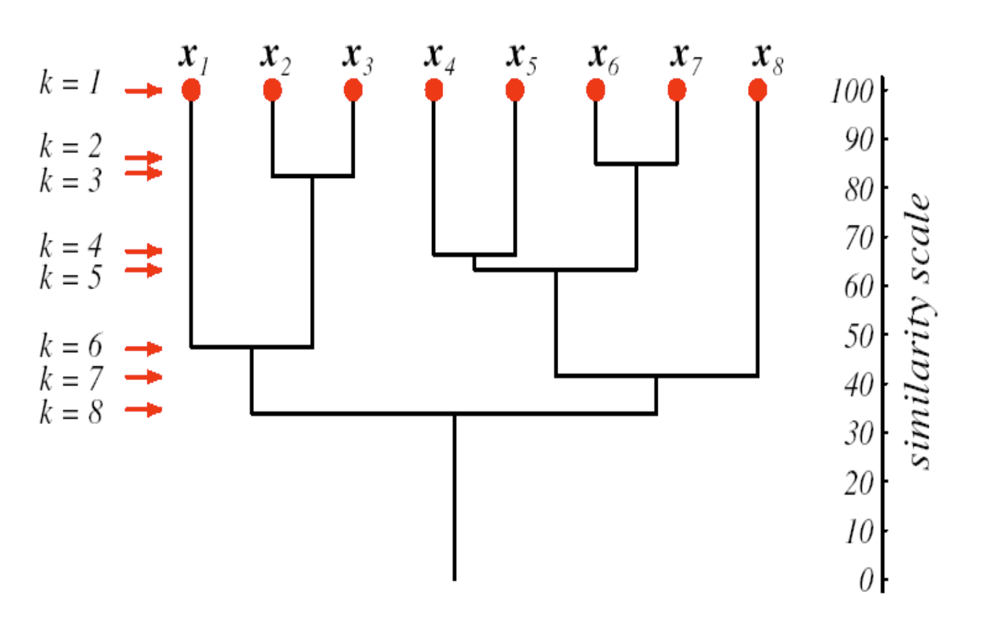
</center>

The length of the vertical lines ($L_{v, w}$) shows the *similarity* of the two groups. The *shorter* they are, the closer they are to the parent cluster.

#### Dendograms

There are two things to beware of when using dendograms
1. Tree structure is not unique for given clustering, for each bottom-up merge the sub-tree to the right or left must be specified; $2^{n-1}$ ways to permute $n$ leaves in a dendogram
2. Hierarchical clustering imposes a **bias**, the clustering forms a dendogram despite the possible lack of an implicit hierarchcical structuring in the data

### `DBSCAN` (Density-based spatial clustering with noise)

`DBSCAN` *does not* require the number of clusters upfront, and also does not impose a bias that the data is organised in a hierarchical manner. `DBSCAN` is lagely based on **density**; how many points are close to eachother.

#### Parameters and training

`DBSCAN` relies on a few parameters:
- $\epsilon$, which defines the minimum distance for two points to be considered neighbours
- `MinPts`, which defines the minimum number of points required to form a *densse region*

It then forms three classifications of `points`:
1. A `core point` has more than `MinPts` neighbours within $\epsilon$
2. A `border point` has fewer neighbours within `MinPts` within $\epsilon$ but is within $\epsilon$ of a `core point`
3. All other points are `noise point`s

> **Creating the clusters**
>
> Clusters are created by labelling all the points as defined above. Then:
> 1. Make a cluster for each `core point` by connecting them
>     - `core point`s are connected if they are within $\epsilon$ of eachother
> 2. Assign each border point to the cluster of the corresponding `core point`

### Silhouette plot

> **Key idea:** compare each object's separation from other clusters relative to the homogeneity of it's cluster. 
>
> For each object $i$, define it's silhouette width $s(i) \in [-1, 1]$.
>
> Let $a(i)$ be the average dissimilarity between $i$ and elements of $P(i)$ where $P(i)$ is the cluster to which $i$ belongs.
>
> Let $d(i, C)$ be the average dissimilarity of $i$ to elements of some other cluster $C$. Let $b(i) = \min_C d(i, C)$.
>
> The **silhouette width** is
>
> $$ \frac{b(i) - a(i)}{\text{max}(a(i), b(i))}$$

Therefore $a(i)$ is the dissimilarity to objects in their own cluster, and $b(i)$ is the minimum dissimilarity to objects in other clusters. Thereby as
$$ b(i) - a(i) \to 1$$
we have that the object $i$ is well separated from other clusters and homogenous with their cluster.On the otherhand, as
$$ b(i) - a(i) \to -1$$
The point can be considered more *misclassified* as the point is closer to other clusters than it's own.

### How many clusters?

For many clustering methods such as `k`-means clustering, we are required to give the number of clusters to the algorithm. 

#### Elbow method

This method looks at how the **within-cluster dispersion** (often measured by the sum of squared distances to centroids) decreases as you increase the number of clusters $k$.

```txt
Algorithm Elbow Method

1. Start with all data in 1 cluster, compute dispersion
2. Try 2 clusters, compute new dispersion
3. Repeat for increasing k
4. Plot dispersion versus k
```

Consider the interpretation of the dispersion:
- Dispersion always decreases as $k$ increases
- However, the **rate of decrease** slows down at some point
- That point is the `elbow`, the point beyond which adding more clusters **does not** significantly improve the fit
- You choose the $k$ at the elbow as the optimal number

#### Gap statistic

This method compares the **within-cluster dispersion** for your data to that of a random reference dataset.

The `gap` is the log difference between the expected dispersion in the random reference data set and the actual data. Consider $W_k$ as the within-cluster dispersion for $k$ clusters. We have the gap statistic

$$ \text{Gap}(k) = \mathbb{E}[\log(W_k^{\text{ref}})] - \log(W_k^{\text{data}})$$

Choose the **smallest** $k$ such that
$$ \text{Gap}(k) \ge \text{Gap}(k + 1) - s_{k+1}$$
where $s_{k+1}$ is a standard deviation term for stability, defined by

$$ s_k = \sqrt{\frac{1}{B}\sum_{b=1}^B(\log(W_{kb}^{\text{ref}}) - \mathbb{E}[\log(W_k^{\text{ref}})])^2}\cdot \sqrt{1 + \frac{1}{B}}$$

```txt
Algorithm Gap Statistic

1. Generate a reference dataset
2. For each k, compute:
  - Dispersion of your real data
  - Expected dispersion of the reference data
3. Compute the gap
```

**Intuitively**, we can think that:
- $s_k$ tells you how much variability there is in the reference dispersion
- A small $s_k$ means the gap is reliable
- A large $s_k$ means that the gap might just be due to chance

### Dimensionality reduction

Each numeric feature in a dataset is a *dimension* - as dimensionality grows, there exist problems in models with the `Curse of Dimensionality`. Features could be related, and considering a pool of $\{f_1, f_2, \dots, f_n \}$ $n$ parameters, it may be found that a small subset of the features represents the rest of the features very well.

#### Principal Component Analysis (`PCA`)

> **Key idea:** look for features in a transformed space so that each dimension in the new space captures the most variation in the original data when it is projected onto that dimension.
>
> Any new features shouild be highly correlated with (some set) of the original features, but not with any of the other new features.
>
> <center> 
>   
> </center>

Consider `PCA` through the lens of eigenvectors. We have the covariance matrix for some data matrix $X \in \mathbb{R}^{n\times d}$ (with $n$ samples and $d$ features) and the data is **centred** (mean-subtracted).

$$ \Sigma = \frac{1}{n}X^TX$$

such that $\Sigma$ is the covariance matrix. We then find the eigenvectors $v_i = \{v_1, \dots, v_n \}$ such that

$$ \Sigma v_i = \lambda_i v_i$$

where $\lambda_i$ is the eigenvalue - and represents the amount of variance in that direction. We can then
1. Sort eigenvectors in decreasing eigenvalue (we want to maximise the variance we explain)
2. Take top $k$ eigenvectors $v_1, \dots, v_k$
3. These from a matrix $V_k \in \mathbb{R}^{d \times k}$

*Finally*, we project the data into the lower dimension once more by applying
$$ Z = XV_k$$
where **each row of $Z$ is a projection of the original sample into the new space**.

> **Explained variance for a principal component (`PC`)**
>
> The explained variance by the $i$-th principal component is given by
> $$ \text{Explained variance ratio} = \frac{\lambda_i}{\sum_{j=1}^d \lambda_j}$$
>
> For all $i = 1, \dots, d$.

## Learning theory
> Learning theory aims at a body of theory that captures all important aspects of the fundamentals of the learning process and any algorithm or class of algorithms designed to do learning. We wish to:
> - provide elegenat frameworks leading to results on what can or cannot be learned algorithmically
>   - however for practically useful machine learning methods and applications this is difficult

### Learning from data: the Empirical Risk Minimisation (`ERM`) principle

> **Empirical Risk Minimisation (ERM)**
> 
> *Objective*: learner $L$ should output a hypothesis $h \in H$ as an estimate of a target concept $c$ such that
> $$ h = \argmin_{h \in H} \text{error}_\text{train}(h)$$
> Then $h$ will be evaluated on subsequent instances $x$ from distribution $\mathcal{D}$ over $X$. That is, we learn some $h$ to minimise the trainning error or **empirical risk**.

If the learner $L$ can fit *any* hypothesis $h \in H$ and applies ERM, then this may overfit to the training data.

Rather, we could restrict the hypothesis space $H$ when applying the ERM principle
- ideally, select $H$ before $L$ applied to the data using priors
- to select $H$, consider underfitting versus overfitting

### No Free Lunch Theorem

> Assuming that the training set $\mathcal{D}$ can be learned correctly by all algorithms, averaged over all target functions no learning algorithm gives an off-training set error superior to any other
>
> $$ \sum_F [\mathbf{E}_1(E | F, \mathcal{D}) - \mathbf{E}_2(E|F, \mathcal{D})] = 0$$
>
> where $F$ is the set of possible target functions. 

<center>
  <figure>
    
    <figcaption> An example which demonstrates the no free lunch theorem </figcaption>
  </figure>
</center>

Consider a data set with three boolean features, labelled by a target function $F$. Suppose there exists two different deterministic algorithms that generates two hypotheses $h_1$ and $h_2$, which fit $\mathcal{D}$ exactly. 

The first algorithm assumes all instances $x$ are in the target function $F$, unless labelled otherwise in training set $\mathcal{D}$. The second assumes the opposite. For **this particular** target function $F$, the first algorithm is clearly *superior*.

> If we have *no prior knowledge* about which $F$ we are trying to learn, neither algorithm is superior to the other. Both fit the training data correctly, but there are a total of $2^5$ target functions consistent with $\mathcal{D}$.

#### Conservation Theorem of Generalisation Performance

Therefore, for every possible learning algorithm for binary classification the sum of performance over **all possible target functions is exactly zero**.

- On some problems, we get positive performance
- Therefore this means taht for other problems we must get an `equal and opposite` amount of negative performance.

*Key takeaways*:
- Even popular and theoretically well founded algorithms will perform poorly on some domains
- It is the *assumptions* about the learning domains (i.e the `hidden target functions`) that are relevant
- Experience with a *broad range of techniques* is the best insurance for solving arbitrary new classifcation problems

### Computational Learning Theory
> In `computational learning theory`, we seek theory to consider:
> - probability of successful learning
> - number of training examples
> - complexity of the hypothesis space
> - time complexity of learning algorithms
> - accuracy to which target concept is approximated
> - etc.

Consider foor key areas of interest in computational learning theory:
1. `Sample complexity`: how many training examples for the learner to converge?
2. `Computational complexity`: how much computational effort required to converge?
3. `Hypothesis complexity`: How do we measure the complexity of a hypothesis?
4. `Mistake bounds`: How many training examples will the learner misclassify before converging?

#### Concept Learning

Let
- $\mathcal{X}$ be a set of objects or instances in some domains, represented by a set of features
- $\mathcal{Y}$ be a set of labels, often $\{0, 1\}$ or $\{-1, 1\}$

Then
- **Training data**: a finite sequence of label instances in $\mathcal{X} \times \mathcal{Y}$
- **Learning algorithm**: must output a model or prediction rule $h: \mathcal{X} \to \mathcal{Y}$

A concept is a *binary classifier*. Target function is drawn from a class of concepts $C = \{c: \mathcal{X} \to \mathcal{Y}\}$ and used to label training data.

#### Sample complexity

Given:
- A set of instances $X$
- A set of hypotheses $H$
- A set of possible target concepts $C$
- Training instances generated by a fixed, unknown probability distribution $\mathcal{D}$ over $X$

The learner observes a sequence D of training examples of form $x, c(x)$ for some target concept $c \in C$
> Instances $x$ are drawn from distribution $\mathcal{D}$
>
> Teacher provides target value $c(x)$ for each

Learner must output a hypothesis $h$ estimating $c$

> $h$ is evaluated by it's performance on subsequence instances drawn accoding to $\mathcal{D}$

#### True error of a hypothesis
> **Definition:** The *true error* (denoted $\text{error}_\mathcal{D}(h)$) of hypothesis $h$ with respect to target concept $c$ and distribution $\mathcal{D}$ is the probability that $h$ will misclassify an instance drawn at random according to $\mathcal{D}$
> 
> $$ \text{error}_\mathcal{D}(h) = \text{Pr}_{x \in \mathcal{D}}[c(x) \ne h(x)]$$

There are thus two notions of `error`
1. *Training error*: how often $h(x) \ne c(x)$ over training instances.
2. *True error*: how often $h(x) \ne c(x)$ over future randomly-drawn instances


#### Version space

> A hypothesis $h$ is **consistent** with a set of training examples $D$ of target concept $c$ if and only if $h(x) = c(x)$ for each training example $(x, c(x)) \in D$
>
> $$ \text{Consistent}(h, D) = (\forall (x, c(x)) \in D) \hspace{0.05cm}h(x) = c(x)$$
> 
> Therefore a hypothesis is *consistent* if it is correct on all the **training data**.
>
> The **version space** $\text{VS}_{H, D}$ with respect to hypothesis space $H$ and training examples $D$ is the subset of hypotheses from $H$ consistent with all training examples in $D$
>
> $$\text{VS}_{H, D} = \{h \in H | \text{Consistent}(H, D)\}$$
> 
> Therefore the version space is the set of all hypotheses that are *consistent*.

<center>
  <figure>
    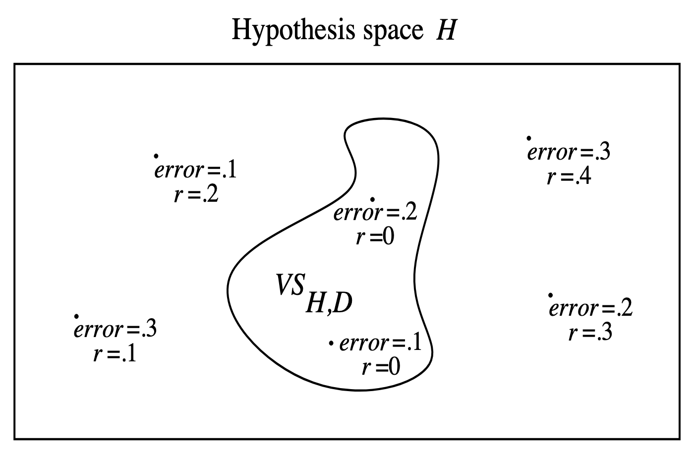
    <figcaption> Exhausting of the version space; r is training error and error is true error</figcaption>
  </figure>
</center>

> We say that the version space $\text{VS}_{H, D}$ is said to be $\epsilon$-exhausted with respect to $c$ and $\mathcal{D}$ if every hypothesis in $\text{VS}_{H, D}$ has error less than $\epsilon$ with respect to $c$ and $\mathcal{D}$.
>
> If the hypothesis space $H$ is finite, and $D$ is a sequence of $m \ge 1$ independent random examples of some target concept $c$, then for any $0 \le \epsilon \le 1$, the probability that the version space with respect to $H$ and $D$ is not $\epsilon$-exhausted is less than
>
> $$ |H|e^{-\epsilon m}$$

And so $\epsilon$ exhaustion simply gives more *leeway* to consistency, allowing for some error.

This provides a useful bound for how *tolerant we are for a non-$\epsilon$-exhausted* version space. If we wish this probability to be below $\delta$, we have
$$ |H|e^{-\epsilon m} \le \delta$$
then
$$ m \ge \frac{1}{\epsilon}(\ln|H| + \ln(1/\delta))$$

> **Example: learning conjunctions of boolean literals**
>
> Suppose $H$ contains conjunctions of up to $n$ Boolean literals (i.e constraints on boolean features, such as $x_3 = \verb|true|$). Any $h \in H$ can contain a literal, or it's negation, or neither - therefore $h$ can be one of $3$ values.
>
> This means our hypothesis set is $|H| = 3^n$, and therefore
> $$ 
> \begin{align*}
> m &\ge \frac{1}{\epsilon}(\ln 3^n + \ln(1/\delta)) \\
> &\ge \frac{1}{\epsilon}(n\ln 3 + \ln(1/\delta))
> \end{align*}
> $$
>
> Now consider the case where $n = 10$, and that we wish to ensure that $\epsilon = 0.1$ with a probability of $0.95$, and therefore we have
>
> $$ m \ge \frac{1}{0.1}(10\ln 3 + \ln(1/0.05))$$
> $$ m \ge 140$$

### `PAC` (Probably Approximately Correct) Learning

`PAC` learning integrates the idea of $\epsilon$-exhaustion. The naming comes from:
1. `Approximately correct`: we add some leeway to the consistency with the $\epsilon$ parameter
2. `Probably`: $\delta$ is the maximum probability of failure - the chance that the algorithm outputs a hypothesis with greater than $\epsilon$

> Consider a class $C$ of possible target concepts, defined over a set of instances $X$ of length $n$, and a learner $L$ using hypothesis space $H$
> 
> $C$ is $\textit{PAC-learnable}$ by $L$ using $H$ if:
> - for all $c \in C$
> - distributions $\mathcal{D}$ over $X$
> - $\epsilon$ such that $0 < \epsilon < \frac{1}{2}$
> - $\delta$ such that $0 < \delta < \frac{1}{2}$
>
> The learner $L$ will will with probability *atleast* $(1 - \delta)$ output a hypothesis $h \in H$ such that $\text{error}_\mathcal{D}(h) \le \epsilon$, in time that is polynomial in $1 / \epsilon, 1/\delta, n$ and $|c|$.

What does this mean in simple terms?
- We call some algorithm $L$ "probably approximately correct", if for all
  - labeled points ($c \in C$)
  - testing sets and their distributions (distributions $\mathcal{D}$ over $X$)
  
  We are able to output a hypothesis $h$ in the hypothesis space $H$, with error less than $\epsilon$ and with probability $(1 - \delta)$

#### `PAC` Learning in a real-value hypothesis space

In a real-valued hypothesis space, a *ray* is a one-dimensional threshold function defined for a real-value $\theta$ by
$$ r_\theta(x) = 1 \iff x \ge \theta$$

A learning algorithm for rays should find the smallest ray containing all the positive examples in the training set. *Intuitively*, a ray is a linear classifier in `1D`.

So we essentially want to find the optimal value $\theta$. Given training examples $D = \{(x_1, c(x_1)), \dots, (x_m, c(x_m))\}$ the hypothesis output by the learning $L(D)$ should be $r_\lambda$, where

$$ \lambda = \argmin_{1\le i \le m} \{ x_i | c(x_i) = 1\}$$

We can simply learn this $\lambda$ by the following learning algorithm
```txt
Set lambda to infinity
For x in samples
  If c(x) = 1 and (lambda is infinity or x < lambda)
    lambda <- x

return lambda
```

So essentially find the *smallest value of $x_i$* such that $c(x_i)$ is a positive class. Consider the `PAC`-ness of this algorithm:

> If the training set is for some target (true) concept $r_\theta$, then our trained hypothesis $\lambda$ should uphold
> $$ \lambda \ge \theta$$
> Where if $\lambda = \theta$, we have the optimal estimator for $\theta$. As the size of the training set increases, we should expect the error to decrease. Therefore
> $$ \epsilon \sim \lambda \ge \theta$$
>
> The probability of *not* seeing a single example in the training set in this interval is $1 - \theta$. For $m$ examples this is $(1 - \epsilon)^m$. 

#### Agnostic `PAC` learning

So far, we have assumed that $c \in H$ - that is our labels are within the expected hypothesis space.

It can be shown that by making the realizability assumption, a learner applying the ERM principle will given sufficently large training data and finite hypothesis space, with probability $(1 - \delta)$ find a hypothesis correct up to $\epsilon$.

> **Agnostic learning setting:** relax the realizability assumption; i.e dont assume $c \in H$

The sample complexity for an agnostic PAC learning space is
$$ m \ge \frac{1}{2\epsilon^2}(\ln |H| + \ln(1/\delta))$$

#### Infinite hypothesis spaces

What if our hypothesis space is infite (like a real-valued hypothesis?). In our sample complexity, we use the size of set $H$ ($|H|$), so what should we use instead of $|H|$.

> We should use the size of the largest subset of $X$ for which $H$ can guarantee zero training error, regardless of target function $c$

### The Vapnik-Chervonenkis Dimension
#### Shattering a set of instances
A *dichotomy* of a set $S$ is a partition of $S$ into two disjoint subsets.

> Or more simply, a dichotomy is just way to split some elements into two subsets. So $x \in \{0, 1\}$, for example.

A set of instances $S$ is **shattered** by a hypothesis space $H$ if and only if for every dichotomy of $S$ there exists some hypothesis in $H$ consistent with this dichotomy

> A set of instances $S$ is shattered if there exists a hypothesis $h$ which correctly labels every dichotomy (disjoint subsets)

#### Definition

> The **Vapnik-Chervonenkis dimension** $VC(H)$ of hypothesis space $H$ defined over instance space $X$ is the size of the largest finite subset of $X$ shattered by $H$. If arbitrarily large finite sets of $X$ can be shattered by $H$, the $VC(H) = \infty$

#### How to find the VC dimension

1. Understand the hypothesis class $\mathcal{H}$
   1. We want to understand what patterns these hypotheses are capable of expressing
2. Try to find a set it can shatter
   1. Start small and build up - 1 points? 2 points?
   2. For a given set of points, consider all the disjoint subset labellings possible
   3. For each lebelling, consider whether there exists a hypothesis $H$ which matches it
3. Try to find a set it cannot shatter
   1. Build the sets until it cannot shatter - usually the questions are small enough such that this is possible.

#### Example of linear decision surfaces

Consider the hypothesis class $\mathcal{H}$ of linear classifiers in $\mathbb{R}^d$ (that is, a hypothesis $\in \mathbb{R}^2$ is a line, for example). What is the VC dimension?

We can follow the steps above to systematically figure out the VC dimension. Consider what $h \in \mathbb{R}^2$ can seperate

1. With `1` point, this is trivial - we can obviously linearly classify one point (with some arbitrary line)
2. With `2` points, this is also trivial
3. With `3` points, we have
   1. `TTF`, `FFT`, `TTT`, `FFF` and there combinations - these are all linearly seperable
4. With `4` points, they are *not* linearly seperable. We can imagine the below example

<center>
  
</center>

There exists no linear classifier for $\mathbb{R}^2$ to sepearte $4$ points. Therefore

$$ \text{VC}(\mathcal{H}) = d + 1$$

### Mistake bounds

> The research of mistake bounds aims to consider:
>
> <center>
>   How many mistakes before convergence?
> </center>
> We consider a similar setting to `PAC` learning:
> - Instances are drawn at random from $X$ according to distribution $\mathcal{D}$
> - Learner must classify each instance before receiving correct classification from teacher
> - Can we bound the number of mistakes learn makes before converging?
#### `WINNOW` algorithm

Mistake bounds are derived from `WINNOW` algorithms

1. `WINNOW` is an online, mistake-driven algorithm
2. Designed to learn in the presence of many *irrelevant* attributes
3. Key idea: use a multiplicative weight update scheme (like boosting)

```txt
whilst some instances are misclassified
  for each instance x
    classify x using current weights w
    if prediction is incorrent
      if x has class 1
        for each x(i) = 1, w(i) <- a * w(i)       # promotion
      else
        for each x(i) = 1, w(i) <- w(i) / a       # demotion
```

where $x$ and $w$ are vectors of attributes and weights. $x(i) = 1$ means that the feature was present for this instance. What's occuring here?
1. If the example was misclassified and it *is* correct
   1. The attributes which were present for the classification should be `promoted`
2. Otherwise
   1. The attributes which were present for the classification should be `demoted`

#### `WEIGHTED MAJORITY` algorithm

In `WEIGHTED MAJORITY`, we learn to predict by a weighted vote of set of prediction algorithms.

We learn by updating weights of the prediction algorithms. If there exists incosistency between the prediction algorithm and the training example, then reduce the weight of prediction algorithms.

> Bound the number if mistakes of ensemble by number of mistakes made by the *best* prediction algorithm

```txt
a(i) is the i-th prediction algorithm
w(i) is the weight associated with a(i)

for all i: initialise w(i) <- 1

for each training example (x, c(x))
  # the vote counts for class 0 or class 1
  q(0) <- 0
  q(1) <- 0

  for each prediction algorithm a(i)
    if a(i)(x) = 0, then q(0) <- q(0) + w(i)
    if a(i)(x) = 1, then q(1) <- q(1) + w(i)

  if q(1) > q(0) then predict c(x) = 1
  if q(0) > q(1) then predict c(x) = 0
  if q(0) = q(1) then predict at random c(x) = 0 or 1

  for each prediction algorithm a(i)
    if a(i)(x) != c(x) then w(i) <- b * w(i)
```

where $0 \le b \le 1$ - this can be seen as `demotion`, as seen in `WINNOW`.