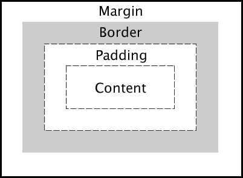
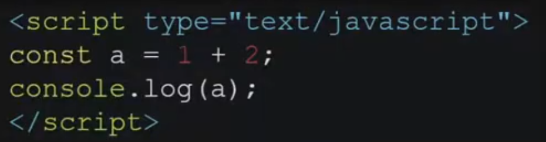
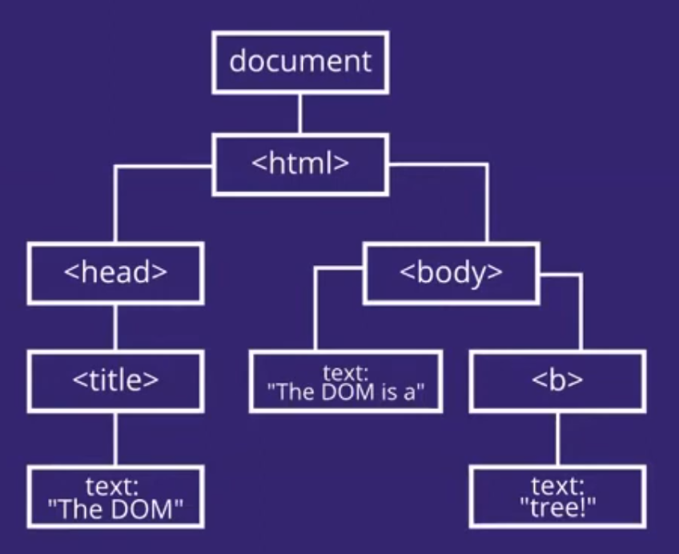
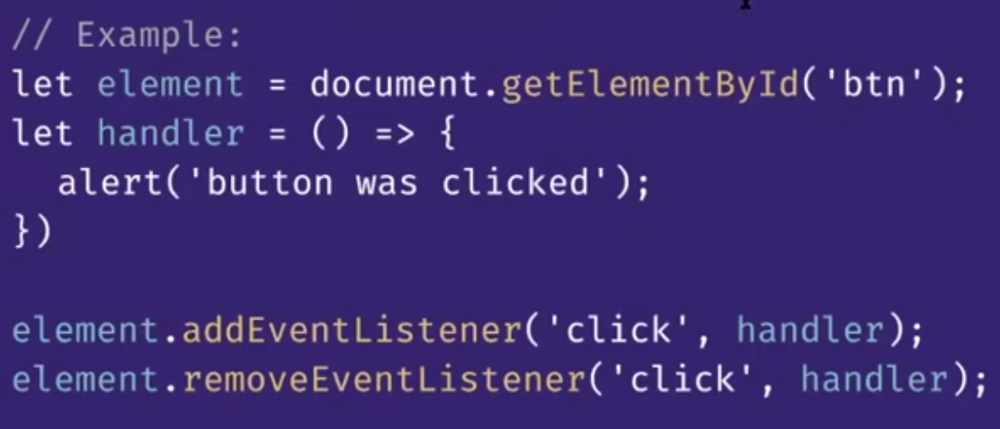
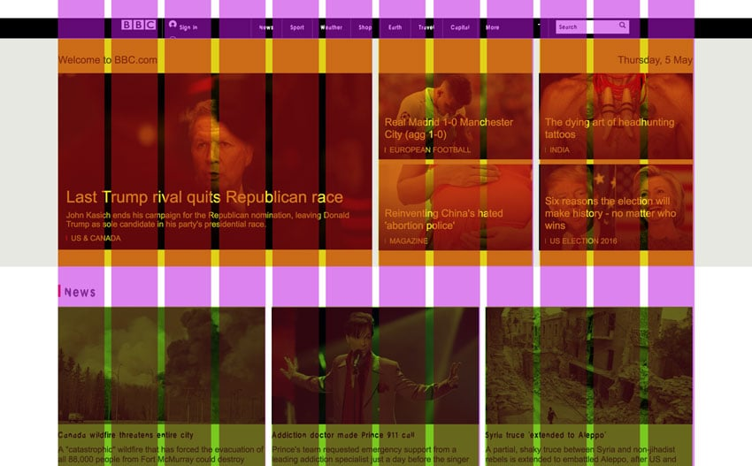
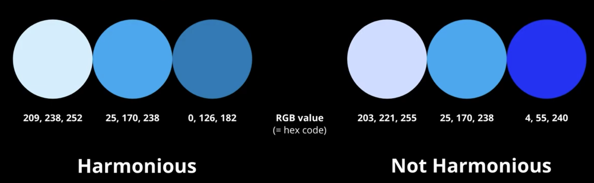

# COMP6080: Web front-end programming

- [COMP6080: Web front-end programming](#comp6080-web-front-end-programming)
  - [HTML \& CSS](#html--css)
    - [HTML fundamentals](#html-fundamentals)
      - [`<!DOCTYPE HTML>` and `<html> ... </html>` (`html` declarer)](#doctype-html-and-html--html-html-declarer)
      - [`<head> ... </head>` (`head`)](#head--head-head)
      - [`<body> ... </body>` (`body`)](#body--body-body)
      - [Layout and formatting tags](#layout-and-formatting-tags)
      - [Links: `<a> </a>`](#links-a-a)
      - [Images: ``](#images-img-)
      - [Line breaks: `<br />`](#line-breaks-br-)
      - [Forms: `<form> </form>`](#forms-form-form)
    - [CSS Rules](#css-rules)
      - [CSS Structure: how to define a `CSS` rule](#css-structure-how-to-define-a-css-rule)
      - [Types of selectors](#types-of-selectors)
      - [Combinators](#combinators)
      - [Pseudo-classes](#pseudo-classes)
      - [Pseudo-elements](#pseudo-elements)
      - [Cascading, inheritance and specificity](#cascading-inheritance-and-specificity)
    - [CSS Formatting](#css-formatting)
      - [Text](#text)
      - [Background image](#background-image)
    - [CSS Layout](#css-layout)
      - [The `Box` model](#the-box-model)
      - [Different types of `display` choices](#different-types-of-display-choices)
      - [Float and positions](#float-and-positions)
      - [Overflow](#overflow)
      - [`Flexbox` display](#flexbox-display)
    - [Mobile CSS and Design](#mobile-css-and-design)
      - [Media queries](#media-queries)
      - [Media types](#media-types)
      - [Media features](#media-features)
      - [Media query conditions and combinations](#media-query-conditions-and-combinations)
      - [Viewport, the viewport meta tag and viewport units](#viewport-the-viewport-meta-tag-and-viewport-units)
  - [Javascript and Dynamic Web](#javascript-and-dynamic-web)
    - [WebJS](#webjs)
      - [Javascript in HTML](#javascript-in-html)
    - [`Document Object Model` (DOM)](#document-object-model-dom)
      - [The tree-like struct of the `DOM`](#the-tree-like-struct-of-the-dom)
      - [`DOM` Data Types](#dom-data-types)
      - [What does the `Element` interface/data type allow us to do?](#what-does-the-element-interfacedata-type-allow-us-to-do)
      - [Reading the `DOM`](#reading-the-dom)
      - [Writing to the `DOM`, getting/writing style and modifying classes](#writing-to-the-dom-gettingwriting-style-and-modifying-classes)
      - [Scrolling](#scrolling)
    - [Events](#events)
      - [Event handlers](#event-handlers)
      - [Event loop](#event-loop)
      - [Event capturing and bubbling](#event-capturing-and-bubbling)
      - [Prevent default](#prevent-default)
    - [Forms](#forms)
      - [HTML Forms](#html-forms)
      - [Interacting with forms in `javascript`](#interacting-with-forms-in-javascript)
      - [Dealing with submits](#dealing-with-submits)
    - [Persistence and local storage](#persistence-and-local-storage)
      - [What is `localStorage`?](#what-is-localstorage)
      - [Using the `localStorage` API](#using-the-localstorage-api)
    - [Closures](#closures)
      - [Example: creating an incrementing timer](#example-creating-an-incrementing-timer)
    - [Asynchronous Programming](#asynchronous-programming)
      - [Callbacks and forcing synchronicity](#callbacks-and-forcing-synchronicity)
      - [Promises: an evolution of callbacks](#promises-an-evolution-of-callbacks)
      - [Writing custom promises](#writing-custom-promises)
      - [Promise chaining](#promise-chaining)
      - [Error handling and `.finally()`](#error-handling-and-finally)
      - [Promise orchestration](#promise-orchestration)
      - [`await`/`async` syntactic sugar for Promises](#awaitasync-syntactic-sugar-for-promises)
    - [Working with server requests; `fetch()`](#working-with-server-requests-fetch)
  - [User interface (UI) and user experience (UX)](#user-interface-ui-and-user-experience-ux)
    - [Making things look good](#making-things-look-good)
      - [Alignment](#alignment)
      - [Fonts](#fonts)
      - [Colors](#colors)
    - [Making things easier to find](#making-things-easier-to-find)
      - [Elements of the visual hierarchy](#elements-of-the-visual-hierarchy)
    - [Making things easer to do](#making-things-easer-to-do)
      - [Types of affordances](#types-of-affordances)
    - [Assessing the UI quality of a website](#assessing-the-ui-quality-of-a-website)
      - [Visibility](#visibility)
      - [Affordance](#affordance)
      - [Feedback](#feedback)
      - [Consistency](#consistency)
      - [Constraints](#constraints)
      - [Effectiveness \& Utility](#effectiveness--utility)
      - [Efficiency](#efficiency)
      - [Safety](#safety)
      - [Learnability](#learnability)
      - [Common standards \& conventions](#common-standards--conventions)
      - [Catering to all](#catering-to-all)
      - [Aesthetics \& minimalism](#aesthetics--minimalism)
    - [Accessibility](#accessibility)
      - [Web Content Accessibility Guidelines (WCAG)](#web-content-accessibility-guidelines-wcag)
      - [Perceivability](#perceivability)
      - [Operability](#operability)
      - [Understandability](#understandability)
      - [Robustness](#robustness)
  - [ReactJS \& Modern Web Development](#reactjs--modern-web-development)
    - [What is declarative rendering and the React lifecycle?](#what-is-declarative-rendering-and-the-react-lifecycle)
      - [Why declarative rendering becomes simpler with complexity](#why-declarative-rendering-becomes-simpler-with-complexity)
      - [Re-rendering in React](#re-rendering-in-react)
    - [`useState` hook](#usestate-hook)
    - [`useEffect` hook](#useeffect-hook)
    - [Components, props and reusability](#components-props-and-reusability)
      - [React components](#react-components)
      - [React props](#react-props)
      - [React component and props gotchas](#react-component-and-props-gotchas)
    - [Routing \& Single-Page Applications (SPAs)](#routing--single-page-applications-spas)
      - [Associating components with routes](#associating-components-with-routes)
      - [Preventing full re-renders on page changes](#preventing-full-re-renders-on-page-changes)
      - [Capturing wildcards and state information in pages](#capturing-wildcards-and-state-information-in-pages)
    - [Memoisation for performance improvements](#memoisation-for-performance-improvements)
      - [`useMemo`](#usememo)
      - [`memo`](#memo)
      - [`useCallback`](#usecallback)
    - [Higher Order ComponentsA](#higher-order-componentsa)
      - [A demonstrative example: I want to print the props of *any* component when instantiated](#a-demonstrative-example-i-want-to-print-the-props-of-any-component-when-instantiated)
      - [Why HOCs?](#why-hocs)
    - [`useContext`: managing state *between* components](#usecontext-managing-state-between-components)
      - [A demonstrative example: theming a website with light and dark mode](#a-demonstrative-example-theming-a-website-with-light-and-dark-mode)
  - [Frontend testing](#frontend-testing)
    - [Component testing](#component-testing)
      - [Basics of writing tests using `vitest` and `React`](#basics-of-writing-tests-using-vitest-and-react)
      - [Writing interactive tests with actions (clicks, etc.), and checking for existing elements](#writing-interactive-tests-with-actions-clicks-etc-and-checking-for-existing-elements)
    - [Automated UI testing and Integration Testing](#automated-ui-testing-and-integration-testing)
      - [Browser Automation](#browser-automation)
      - [Dealing with backend errors with stubs](#dealing-with-backend-errors-with-stubs)
      - [Browser performance and solutions](#browser-performance-and-solutions)
      - [Cypress (testing framework)](#cypress-testing-framework)


## HTML & CSS

### HTML fundamentals

HTML is esssentially the webpage 'scaffold' on (almost) every website on the internet. 

> **What actually is HTML?**
>
> HTML stands for `Hypertext Markup Language`. It is a markup language that provides the structure for webpages.
> It does *not* provides the aesthetics/style and it does not deal with *dynamic* state.

HTML is broken up into `tags`; blocks of web-page logics. A tag is given by:
1. A tag name
2. (optionally) series of attribute/value pairs
3. (optionally) nested inner HTML

```html
<tag1 attr='value'>
    <tag2> Hello, world! </tag2>
</tag1>
```

> **What 'compiles' HTML?**
>
> When we deal with languages like `C`, we use compilers like `clang` or `gcc` to compile our code. For HTML, the web browser *is* the compiler - something like Google Chrome is what compiles the HTML to display the code we've written.

Now let us go through some fundamental tags.

#### `<!DOCTYPE HTML>` and `<html> ... </html>` (`html` declarer)

`<!DOCTYPE html>` is a tag included at the top of `html` source code, that essentially defines that the source code is `html`. This gives context to the browser so that it can render it as `html`. In modern web browsers, it can generally be omitted (but it is still best practice to include it).

There is also a `<html>` take which the entire source code that is in `html` should be wrapped around.

#### `<head> ... </head>` (`head`)

`<head>` contains meta information of the page. **Nothing in this section is rendered on the page**. In the head, we generally do:
- Give meta-information about the page
- Load in `CSS` style sheets (gives our webpages nicer styling!)
- Load in `JavaScript` code (for dynamic state)

#### `<body> ... </body>` (`body`)

`<body>` contains the actual information which appears on the page. The `<body>` information only begins rendering once the `<head>` has been processed by the web browser. Most of the tags in `<body>` focus on rendering something.

#### Layout and formatting tags

There are a variety of tags used to separate our page into separate structures
- `<div>`: a generic 'box grouping' element
- `<span>`: a generic 'grouping' element
- `<p>`: a paragraph
- `<h1>`: the largest header
- `<h6>`: the smallest header; `<h2>, <h3>, ..., <h5>` also exist
- `<ul> <li> ... </li> <li> ... </li> </ul>`: an unordered list of elements
- `<ol> <li> ... </li> <li> ... </li> </ol>`: an ordered list of elements
- `<table>`: a table of information
- `<b>`: bold text
- `<i>`: italics text
- `<u>`: underlined text

An interesting tag is `<div>` and `<span>` - these have no distinct "styles". `<span>` is a *truly* styleless element, whereas `<div>` are *block*-like. So when we need block-like behaviour, we use `<div>`s.

#### Links: `<a> </a>`

`<a>`, the anchor tag, is used for referencing external links within the tag. For example:

```html
<a href="https://youtube.com" title="YouTube" target="_blank"> Click me! </a>
```

This would present as a clickable text element, which when clicked, would direct to `youtube`. `target="_blank"` tells the browser to open a new tab for this page. `title` is the text displayed when the anchor is hovered over.

#### Images: `` 

The image tag is one of many HTML properties known as a `void` tag; we don't put anything within the tag, so we don't need a close tag. Therefore, we close the tag in the first tag by adding `/` before the closing bracket.

```html

```
The `alt` tag replaces the image in the case that the image does not load. `src` can reference a link where the image is hosted, or a local path to the image.

#### Line breaks: `<br />`

If we want a new line, we can use the `<br />` tag - this differs from the way a paragraph breaks up the text, as the new line is much smaller for a break tag.

#### Forms: `<form> </form>`

Forms provide the structure to collect information from a user and then submit it. The key components of forms include:
- inputs and labels
- text area
- select
- button
- submit

> `<input />`
>
> Form inputs consist of a number of properties:
> - `type`: the type of the field (text, radio, checkbox)
> - `name`: name of the attribute during submission
> - `value`: the default value of the field that will be sent when submitting
> - `placeholder`: background text to hint what value to input
> - `disabled`: boolean to as to whether the field is disabled
>
> `radio` and `checkbox` are both boxes users can click to infer a decision - but `radio`s are for one-selection forms, whereas checkboxes can have multiple selections.

> `<textarea> </textarea>`
>
> Text areas are for the long response submissions within a form. This will allow for multi-line text, unlike a text `<input >`.

> `<select> </select>`
>
> A select is a dropdown - and can be seen as an alternative to `radio`. `radio` can become quite cumbersome for large lists, and therefore `select` can make the webpage more compact by making the selections a drop-down list.
>
> ```html
> <select>
>  <option selected> </option>
> </select>
> ```
> We can use a `selected` value within the option (`<option selected> </option>`) to make it the default choice in the form.

> `<label> </label>`
>
> Labels are good for inferring relationships to other form attributes. A very easy example to consider is making the text next to a `radio` button clickable. Consider
>
> ```html
> <label for="example"> Example: </label> <input type = "radio" id = "example">
> ```
> Now, the text `Example:` in the webpage when clicked, acts as a radio button for the input with id `example`.

> `<button> </button>`
>
> A button is very simply, a button. 
>
> ```html
> <button> Click me! </button>
> ```
> We can also alternatively just use a `submit` type for an `<input>` tag - which will essentially have the same button. In general, `<form>`s have a `method` and an `action` - where `method` is some HTTP method (like `get`) and `action` is the endpoint for the form - any information within the form is packaged and sent to the end point using `method`. 

### CSS Rules

Cascading Style Sheets (`CSS`) is used to describe *how* we should present a `HTML` document. `HTML` defines the *structure* of a webpage, whereas `CSS` defines the *presentation*/*styling* of it. Recall the `<span>` tag - the span tag is styleless, and therefore we can use `span`s to have specially styled lines of text. The same logic applies to `div`s, we are able to apply soem styling through `CSS`, and have different types of 'block groupings' throughout our webpage.

> **How do we use CSS files?**
>
> CSS files can be imported as *meta-information* through the `<head>` block.
>
> ```html
> <link rel="stylesheet" href="style.css">
> ```
> This lets the web browser know that it is loading in a style sheet, at the path `./style.css`. There are also different ways to style tags; adding a `<style>` block to the document, or adding a `style` attribute directly to tags.

#### CSS Structure: how to define a `CSS` rule

A `CSS` rule has 3 parts:
- `selector`: define the elements to which the rule applies
- `property`: one of the style properties
- `value`: one of the possible values for the given property

```css
[selector] {
    [property1]: [value1];
    [property2]: [value2];
    ...
}
```

#### Types of selectors

There are many types of different selectors.

> `*`: the universal selector
>
> Using `*` as the selector in a `CSS` rule means that the styles would be applied to every single element.
> ``` css
> * {
>   color: red;
> }
> ```
> The above would make all of the text on the web page red.


> The *type* selector
>
> The type selector refers to a specific tag that is defined in `html` - for example, anchor tags `a`.
>
> ``` css
> a {
>   color: yellow;
> }
> ```
> This will make all of the text in all anchor tags in the webpage yellow. This is quite useful for things like headers, which programmers might wish to make it into different sizes and fonts.

> The *class* selector
>
> The class selector selects all the elements within the given class, defined by the inner-tag attribute `class="className"`.
> For class selectors, we must put a `.` before the class name - otherwise the browser will look for a specific `html` tag called `className` (which does not exist).
>
> ```css
> .text {
>   margin-top: 10px;
> }
> ```
> The above styles a class called `text`, such that there is a 10 pixel margin with the top of the browser.

> The *ID* selector
>
> An *ID* selector behaves very similarly to classes - instead of a `.` before the name, we use a `#`.
>
> ```css
> #error {
>   color: red;
> }
> ```
> This will style any classes with `id="error"` with red text. What is the difference?
> - An `id` should be used if the class only exists once
> - A `class` should be used if the class is used multiple times
>
> These are just semantics, and the functionality between the two are generally the same.

> The *attribute* selector
>
> Attribute selectors style specific attributes that are nested *within* tags - for example, a `radio` input button within a form. We can define attribute selectors like below, considering the example of a `radio` input
>
> ```css
> input[type=radio] {
>   width: 300px;
>   height: 300px;
> }
> ```
> This would make the size of the radio button huge - the attribute selector is important as the size of the *text* input or *checkbox* input might not necessarily want the same attributes as the *radio* button.

#### Combinators

Combinators establish a relationship *between* selectors. There are four main types of relationships.
```css
/* Descendant: all .B elements inside .A */
.A .B { color: red;}

/* Child: all .B which are direct children of .A */
.A > .B { color: red;}

/* Adjacent sibling: .B that follows IMMEDIATELY after a .C */
.C + .B { color: red;}

/* General sibling: all sibling .B that follows after a .C */
.C ~ .B { color: red;}
```
Combinators are not *necessary*, but may make styling relationships much more concise.

#### Pseudo-classes

These are for selectors in a *special state*; for example how a button behaves when it is *hovered*. This is quite useful for dynamic designs, and in particular, the hover-over behaviour of a button is extremely common in the modern webdesign.
```css
/* The color of a button when it is hovered over */
button:hover { background-color: blue; }

/* A disabled input */
input:disabled { background-color: white; }

/* A link that has been visited (clicked) */
a:visited { color: red; }
```
We can also generally apply this to classes. There are many different actions/relationships that can be defined as pseudo-classes, which add more dynamic styling to the web page.

#### Pseudo-elements

Create a cosmetic element for the element or allows a style to a *specific part* of the element. Pseudo-elements are rarely used.

```css
/* The first letter of the text class will be red. */
.text::first-letter {
    color: red;
}
```

#### Cascading, inheritance and specificity

> What is *cascading?*
> In CSS rules, style is applied to an element in the **order in which they are written in the document**. This means that the value of the property from the last rule will override values of the same property for all other rules which are targeting the element.
> - This has implications for importing stylesheets from external sources - if you want to change the definitions of some style properties, than this is possibl with cascading
> - Only *specific styles* are cascaded, not the entire class - so if only the text size is changed, than the other styles in the original class is the same.

> What is *inheritance?*
>
> Many properties are inherting their values from the parents of the element. Thereby, nested elements will generally adopt any styling that is defined for the parent element.

> What is *specificity?* What does `!important` do?
>
> If an element has multiple rules for some property, to decide what value should be used, browseers will look on the *specificty* of each selector and choose the **highest one**.
>
> Specificity is calculated by the number of each selector type:
> 1. Inline styles have more specificty than any selectors
> 2. `id` selectors
> 3. `class` sectors
> 4. Then `type` selectors
>
> Each of the above "powers" are given a number in format `a-b-c-d`, and then the highest "powered" selector wins - going down in precedence. An interesting property that can be used to *override* this precedence is `!important`
> ```css
> .class1 {
>   color: green!important
> }
> ```
> The `!important` flag overrides any other declarations of the property applied to the element, even in-line styles. Although, `!important` makes things hard to debug, so it's best to avoid.

### CSS Formatting

#### Text

CSS has various ways to style text. There are 6 common properties that are styled for text:
1. `color`: change the color of the text
2. `font-size`: change the size of the text
   1. There are many ways to express `font-size`
   2. `1em` is the normal font-size, and from there we can scale `1` to get smaller or larger
3. `font-family`: specify the list of fonts that will be used to render the text
4. `font-weight`: set the boldness of the text
   1. For example, `bold` is a `font-weight` value
5. `font-style`: sets whether to render the text as italic or normal
   1. For example, `italic`
6. `text-decoration`: adds decorative lines to the text
   1. For example, `underline` is a `text-decoration` value

#### Background image

We can manipulate the background properties of classes, to give unique looks to certain `div` - including making images the background of the `div`s themselves (instead of a solid color, for example). For backgrounds, there exist a few commonly
used properties:

- `width`: the size of the `element`
- `height`: the width of the `element`
- `border`: border settings for the image (`<thickness> <type> <color>`, e.g `5px solid blue`)
- `background-image`: the path to the image (`url(path/to/img)`)
- `background-size`: the size of the image - can also contain keywords like `contain` (stretches to fit)
- `background-position`: the position of the image relative to the element/div
- `background-repeat`: if the image is smaller than the div, should it repeat?

### CSS Layout

#### The `Box` model

The box model is asbout how each element can be represented as a *rectangular box for rendering*.

<center>
    
</center>

Above, we can see that the box model includes multiple *layers* - including the actual content of the `div`, padding, border and margin. In the below code snippet, we can see all of the components of a `div`

```css
#box {
    width: 200px;
    height: 200px;
    background: yellow;
    border: 1px solid black;
    padding: 10px;
    margin: 20px;
}
```

- Padding is space between the content and the the edge of the `box`. 
- Border is an aesthetic choice for the box to have a border. 
- *Margin* is the space between the box and the content around it (likely, the edges of the browser).

#### Different types of `display` choices

The setting `display` in a class determines how the box-grouping element (`div`) behaves.

> `block` display
>
> The `block` display starts on a new line, and streteches to the full width of the container. The block element can contain `block` and `inline` elements.
>
> Some properties can be applied *only* to block elements:
> - `width`
> - `height`
> - `margin`
> - `padding`
>
> You may be asking - if it spans the entire page, why can we adjust the width? We can change how the block is displayed in width - but if it is shorter than the entire page, the rest of the page essentially just becomes a *large margin*.

> `inline` and `inline-block` display
>
> Inline display does not break any lines - and therefore continues the natural flow of information. This means that if there is an `inline` span with just a `color` modification, the text will naturally flow with the surrounding text.
>
> An `inline-block` is an inline version of a block; it follows the flow but allows you to use block element properties like `border`s, margin etc.

> `none` display and `hidden` visibility
>
> A `display: none` essentially hides things from the display. This is useful for dynamic websites, which will be discussed later in `JavaScript`.
>
> `visibility: hidden` keeps the block within the web page, but just does not display it (so there is an empty block).

#### Float and positions

> *Float*
> 
> Floats remove an element from the normal flow of displayed web objects, and puts it to the *left*/*right* of the container, and allows other inline elements to wrap around it.
> ```css
> .float {
>    float: left;
>    width: 50px;
> }
> ```
> Floats are *generally avoided* in modern web development - mainly due to the fact that their behaviour is quite finnicky. A common usage for `float`s were for side bars and menu bars.

There are four types of positions:
- `static` (default)
- `relative`
- `absolute`
- `fixed`

> `Relative` position
>
> Position an element based on the normal flow - offset the position of the content on it's *default* (static) position.
> That is, a relative position of `top: 20px left: 20px` would be `20px` right and `20px` down of the original position.
>
> We can also use `bottom` and `right` - this may have confusing behaviour, but **always remember it is relative to it's original, static position.**

> `Absolute` position
>
> Positions an element based on the closest parent element with a *not* static position. This is a little confusing, but it essentially means that you can move it around within the actual `div`.
>
> In a `div`, the `relative` position would move it around the top left (or wherever the normal float is) - but `absolute` allows you to move it anywhere on the `div` using `top, right, bottom, left`. This means you can move around an element move around the actual web page - as the `<body>` could be the closest non-static `element`.

> `Fixed` position
>
> The fixed position removes an element from the normal fox, and fixes it to a location on the webpage. This means that it will always stay on a fixed location within the *viewport* (the "window" that the user sees).

Now we get to the classic question of *centering a div* - that is, how do we get a div to sit in the middle of the `viewport`?

> *Centering a `div`*
>
> There are different approaches to centering a div, but perhaps the simplest option is to use `auto` margins:
> ```css
> .centered_div {
>    margin-left: auto;
>    margin-right: auto 
> }
> ```
> `auto` essentially fills in the margin automatically, and thus having auto left and right margins centers the divs as they fill in the margin with equal magnitude on both sides. We can alternatively define this as `margin: 0 auto;`, which indicates `0` margin on the top and bottom and `auto` on the left and right.

#### Overflow

Overflow sets how an element will show its content when it overflows the edges.
- `visible`: content will be rendered outside the edge (default)
- `hidden`: hide the content outside the edges
- `auto`: hide the content outsidfe the edges, but allows scrolling to the hidden content
- `scroll`: hide the content outside the edges. *Always shows scrollbars even when content fits the element*

#### `Flexbox` display

`Flexbox` deals with the issue of having responsive websites. With the variety of internet devices (phones, computers, fridges and more) which can interact with browser content, flexboxes aim to create an easy-to-use and responsive grouping element.

> Flexboxes *define a layout where children could be positioned in any direction* and change their size based on the available space. To modify the aesthetic behaviour of parents and children, we must modify:
> - The properties of the parent container (defines the ordering of children, etc)
> - The property of the children

Consider some important properties for the *container*:
- `justify-content`: how to space out the child elements within the `flexbox` (e.g `space-between`)
- `flex-direction`: the direction in which child elements should be placed (e.g `row`, `column`, `column-reverse`)
- `align-items`: defines how the items will be positioned *within* the flex container
  - `center`: vertically centers the child elements
  - `start`: vertically aligns the child elements at the *top* of the div
  - and many more...
- `flex-wrap`: when there is not enough room, how should the elements behave?
  - `wrap`: wrap around the elements in the container
- and many more...

### Mobile CSS and Design

Mobile CSS aims to make websites that are generally designed for computers (with larger monitors) responsive to their smaller displays.

#### Media queries

Media queries allows us to create `CSS` rules that are applied to the document only when the device reaches a specific criteria.

```css
.article {
  padding: 5px 10px;
}

@media (min-width: 600px) {
  .article {
    padding: 10px 20px;
  }
}
```

The media query can be seen as an *if*-statement, which applies given the condition within the brackets. In the above example, if the width of the device is less than or equal to 600 pixels, then the article padding changes to `10px 20px`.

#### Media types

There are also special media *types*, which respond differently given scenarios. They refer to different types of devices and functions on a device (like printing), to give special behaviour to these subsets.
- `@media all`: applies to all devices
- `@media print`: applies for printing
- `@media screen`: applies for screen devices
- `@media speech`: applies to speech synthesisers

#### Media features

Media features target specific features of the media devices, like the width of the screen and/or behaviours that are present on the device (like hovering, dark mode, etc.)

- `@media (max-width: 500px)`: 500 pixels and narrower
- `@media (min-width: 501px)`: 501px and wider
- `@media (hover: hover)`: primary input *can* hover
- `@media (prefers-color-scheme: dark)`: dark mode preference

#### Media query conditions and combinations

We are able to use multiple criteria by appending the statement `and`.

```css
@media screen
  and (min-width: 320px)
  and (orientation: portrait) {
    /* ... */
  }
```

We can also negate queries and conditions using `not`

```css
/* This negates the entire media query */
@media not screen
  and (min-width: 320px)
  and (orientation: portrait) {
    /* ... */
  }
```

We can also combine media types, by listing out the media types that the query will be applied to (e.g `@media screen, print`).

#### Viewport, the viewport meta tag and viewport units

The *viewport* represents the currently viewed area of the page. The viewport is represented in '*CSS pixels*' - higher resoluation displays will just fit multiple pixels into a single 'CSS pixel'. Mobile viewports are not always equal to the size of the device by default - it is wider than the screen and renders zoomed out.

> *Controlling the viewport with meta tags*
>
> The **size** and **scale** of the viewport can be adjusted by the viewport meta tag. The meta tag is seen below
> ```html
> <!-- Controls the viewport size to the actual size of the device; this is very important! -->
> <meta name="viewport" content="width=device-width">
> 
> <!-- Controls the zoom of the page -->
> <meta name="viewport" content="initial-scale=1, maximum-scale=2">

Viewport *units* are units that can be used in `CSS` rules that are *relative* to the actual view port - this makes websites more flexible and reactive, as they are styled on the basis of the size of the *viewport*. We use:
- `<x>vw`: `x` % of the viewport *width*
- `<y>vh`: `y` % of the viewport *height*

## Javascript and Dynamic Web

JavaScript is used alongside `HTML` to provide more dynamic interactions with websites.

### WebJS

Javascript is a programming language that has two main uses:
1. Javascript is used to manipualte the DOM in a web browser
2. Javascript is used to write scripts with NodeJS

We consider how Javascript interacts with a page run by a web browser. Where should we put the Javascript and how does it interact with the page?

#### Javascript in HTML

There are two options to include Javascript in HTML - `inline` and `external`. `External` simply takes in a `javascript` file written elsewhere and imports it into the `html` file at the prescribed location. `inline` has the actual `javascript` written in a `<script>` tag.

<center>
  
  
</center>

Now what trade-offs exist for each of the methods?

- Linking the `javascript` externally means:
  - Improvements in performance when browser cache is utilised
  - Reduces the time it takes for initial `html` document to be received
- Placing the `javascript` inline means:
  - Avoids possible network calls (to fetch the `javascript` file)
  - Potentially costly depending on the size of the `javascript` file

So first-time loads for `externally` linked `javascript` can be slow if the file is hosted in another network, as this requires a fetch; but further calls are cached if the browser cache is being utilised. Externalising small files is quite inefficient as HTTP relies on TCP connections which require setup and teardown.

> *Where should code be included?*
>
> There are different points where `javascript` code should be included.
>
> 1. Include it in the `<head>`, or at the top of the `<body>` *if* you need you `javascript` to run **prior** to your DOM (page) elements doing initial render
> 2. Include at the end of `<body>` if you *do not need* your `javascript` to run prior to your DOM elements initially rendering
>
> Depending on what your `javascript` file is doing and the size of it, putting the script before the body might mean that the user sees significant latency before the page renders. This is **very important** for user experience.

### `Document Object Model` (DOM)

The Document Object Model (DOM) is an interface that allows JavaScript to interact with the HTML through the browser. This allows for dynamic behaviour to occur, and allows the `javascript` code to dynamically access and update the **content, structure and style** of a page.

#### The tree-like struct of the `DOM`

Consider the following `html` 
```html
<!DOCTYPE html>
<html>
  <head>
    <title> The DOM </title>
  </head>

  <body>
    The dom is a <b> tree! </b>
  </body>
</html>

```

In the DOM, our `html` gets translated to a tree-like structure, that can be traversed.

<center>
  
</center>

#### `DOM` Data Types

The `DOM` holds a few different data types.

> `Document`
>
> The type of the *document* object. Represents the root of the entire `DOM`

> `Element`
>
> A node in the `DOM` tree. Objects of thist ype implement an interface that allows interacting with the documnet

> `NodeList`
>
> An array of elements like the kind that is returned by the method.

DOM elements are the *base class* for all types of objects in the document. Different `HTML` tags/elements correspond to different element types in `javascript`. Some basic types include:
- `HTMLInputElement`
- `HTMLSpanElement`
- `HTMLDivElement`
- `HTMLScriptElement`
- `HTMLHeadingElement`
- `HTMLImageElement`

#### What does the `Element` interface/data type allow us to do?

The `Element` type in a `DOM` allows us to do two main things - *read* and *write* things to a `html` element.

- Ways of *reading* things:
  - Get the size, position, color, etc..
- Ways of *writing* things
  - Set an attribute, change styling, etc...

An example of the *actual* attributes within javascript are:
```txt
HTMLElement {
  .style        # holds the styling
  .offsetLeft   # positioning elements
  .offsetTop    # positioning elements
  etc...
}

# and then the child elements have further attributes
HTMLImageElement {
  .alt          # holds the alt text
  .src          # the source of the image
  etc...
}
```

#### Reading the `DOM`

We now know what some `DOM` elements contain; but how do we actually get the elements?

```js
// html object id's are unique and can be user-defined
// e.g 
document.getElementById(id);

// Returns a DOM HTMLCollection of all matches
// - tag name, eg. <p>, <div>
// - class name, which are user-defined
document.getElementsByTagName(name);
document.getElementsByClassName(className);

// a custom query
document.querySelector(query);
```

How does the query selector work?
```js
// by id
document.querySelector('#puppy')

// by class name
document.querySelector('.box')

// to get all that match the query
document.querySelectorAll('.box')
```

#### Writing to the `DOM`, getting/writing style and modifying classes

Now we know how to find elements, how do we write to the `DOM`?

```js
// create a div
let element = document.createElement("div");
let textNode = document.createTextNode("Some text");

// adding and removing elements
element.appendChild(textNode);
element.removeChild(textNode);

// changing attributes of a button
button.setAttribute("disabled", "");
```

Therefore we access some API which allows us to create `html` elements through javascript, and append/remove them in a list-like fashion. Then consider modifying the style of an element.

```js
// considering changing the left style attribute from 50 to 55
element.style.left = "50px";
let newLeft = parseInt(element.style.left, 10) + 5 + "px";
element.style.left = newLeft;

// changing the background color to red
element.style.backgroundColor = "red"; // do note we use camel case for css style!
```

Now to get the style of an element.

```js
let computedStyle = window.getComputedStyle(element, null);
let bgColor = computedStyle.getPropertyValue("background-color");
```

We can also modify the behaviour of classes on elements by adding classes, removing classes, toggling classes and also checking whether a class is acting on an element.

```js
element.classList.add("class");
element.classList.remove("class");
element.classList.toggle("class");
element.classList.contains("class");
```

#### Scrolling

We are also able to scroll to a certain position using `javascript`, using the `window` object.

```js
// get the current positions of the scroll
console.log(window.scrollX);
console.log(window.scrollY);

// scroll to a certain position on the page;
window.scrollTo({
  top: 100,
  left: 0,
  behavior: "smooth"
});
```

### Events

An *event* is a signal that something has happened to some `DOM` element. Commonly, events are *loading*, *clicks* or *key-presses*, but have much more forms. Some examples are:
- `click`
- `dblclick`
- `mouseup`
- `mouseenter`
- `mousedown`
- `keydown`
- `keypress`
- and much more.

#### Event handlers

Event handlers are `javascript` properties which 'listen' for events to occur, and then perform some action accordingly. There are three main ways to add event handlers.

> **In-`HTML` event handlers**
>
> We can have event handlers in-html by using a specific event handling attribute, for e.g `onclick`.
>
> `<input value="Click me" onclick="alert('Clicked!')" type="button">`
>
> The above runs the `javascript` code found within the quotation marks when the button is clicked.

> **`DOM` property**
>
> We can also add event handlers to a `DOM` element, as they have similar event handling class attributes, like `html`.
>
> ```js
> let element = document.getElementById('btn');
> 
> element.onclick = () => {
>   alert('Button was clicked!');
> }
> ```
>
> If you wish to abstract the code within the `DOM` event handler into a function - you must pass in the function name (almost like a function pointer) instead of calling the function.

> **`addEventListener`**
>
> A more involved way is to directly add a event listener. Event listeners are defined like below
> ```js
> target.addEventListener(
>   type, // e.g 'click', 'mousemove'
>   listener, // the callback function
>   [options] 
> )
> ```
> 
> <center>  </center>

The parameter that is fed into an event handler (the function that does something with the event that has occured) is an `event object`.

> **Event object**
>
> The event object is passed into the handler as such:
> ```js
> target.addEventListener('click', (event) => { /* code... */ })
> ```
> But what actually is in the event object? Some examples of properties include
> 1. `currentTarget`: current lemenet the handler is running on
> 2. `timeStamp`: time the event was created (in `ms`)
> 3. `type`: name of the event, e.g 'click'
>
> Different types of events have specific properties - for example
> - `clientX`: a `MouseEvent` has the X and Y coordinate of the mouse
> - `key`: a `KeyboardEvent` has the keycode of the key that was pressed

#### Event loop

The *event loop* is a single-threaded loop which runs in the browser, and manages all events. When an event is triggered, the event is added to the queue. Essentialy, the event loop resembles the following:
```js
while (queue.waitForMessage()) {
  queue.processNextMessage();
}
```

This means that events must wait their turn to be processed - and that events are *synchronous*. A new event **cannot** be handled until the current event has been completed.

#### Event capturing and bubbling

We have learnt that the `DOM` is a tree-like structure, and thus has hiearchy. Events interact *first* with the highest level node, which is the `window` - but how does the event reach the target node and what occurs to any updates that occur to the node?

> *Event capturing and bubbling* refers to the idea that
> - When an event occurs, it is *captured* and then propagates downwards to the desired target node
> - When the event reaches the target node, the handler function is ran on the target node, and then *bubbles up* to each parent element above it.

But we might not *want* this functionality - we may have a button within a div, but we may only want the handler to be called on the button itself. This is where **stopPropgation** comes in.
```js
first.onclick = (event) => {
  alert('First!');
}

second.onclick = (event) => {
  event.stopPropagation();
  alert('Second!');
}
```

If `second` was a div within `first`, then `second` would activate first, and then bubble up to `first` - but with stop propagation, it does not bubble up and only runs the event handler in `second`.

#### Prevent default

Soem type of `DOM` elements have *default behaviour*, for example:
1. Clicking on an input checkbox toggles the checkbox
2. Images have a default drag-and-drop behaviour
3. Key presses into a text input field has the default behaviour of entering that text into the input field

> **To stop the default event of a behaviour, simply use** `event.preventDefault()`

### Forms

Forms are useful, structured formats of data that are represented by `<form>` in `html`. This is useful to sending off data to some `backend`, which do something with the data and then possibly send a response dependent on the data.

#### HTML Forms

- A html `<form>` element is a way of defining a form which is used to get user input
- They consist of different types of input elements:
  - text fields
  - checkboxes
  - radio buttons
  - submit buttons
- We specify the type of input element using the type attribute

```html
<form name="user-form">
  First name: <br/>
  <input type="text" name="firstname">
  Last name: <br/>
  <input type="text" name="lastname">
</form>
```

#### Interacting with forms in `javascript`

We can interact with forms that are within our document using `document.forms`, which contains all of the forms. 

We can find *specific* forms using `document.forms.<form_name>`, for example `document.forms.test` returns the form with the name `test`. We can also access it in the following different ways
```js
document.forms.test     // the form with the name 'test'
document.forms["test"]  // also the form with name 'test'
document.forms[0]       // array indexing; first form of the document
```

> **`form` elements**
>
> We can then access specific values and elements of the form using the `form` object. Similarly to how we could access different forms in a document using `document.forms.<form_name>`, we can access form elements by name; `form.<element_name>`.
> ```js
> const form = document.forms[0];
> 
> // get form element with name 'fname'
> const firstName = form.elements.fname;
> 
> // if there are multiple form elements with the name 'age',
> // then a collection is returned
> const ages = form.elements.age;
> ```

> *Back-referencing* form elements
>
> Form elements store a 'back-reference' to the form that they are from; and therefore we can access the parent of a form element from the form element itself.
> ```js
> const form = document.forms[0];
> const login = form.login;
> console.log(login.form);        // this is the back-reference!
> ```
> *Form* element attributes and values
>
> Depending on the element type (e.g text, radio, etc.), the value of the form element is found in different attribute(s).
> ```js
> // to get the text of an input/textarea
> input.value;
> 
> // to get the boolean of a checkbox/radio
> input.checked;
> 
> // for a <select> tag
> select.options        // the collection of options
> select.value          // the value of the currently selected option
> select.selectedIndex  // the index of the currently selected option
> ```

#### Dealing with submits

We should only send forms when the user submits the form - but how do we deal with the `submit` event? Like any other event, we use an event listener that then deals with the event (by for e.g, sending the form data to a backend).

```js
form.addEventListener('submit', (event) => {
  event.preventDefault();
  // form validation can go here
});
```

### Persistence and local storage

State in `React` and `Javascript` is *transient*, and thus we lose data after a page refresh - modern web generally has many characteristics of a page that developers may wish to be *persistent* across sessions. There are two approaches to this:
- Storing data client-side, using `localStorage`
- Storing data server-side, on a database

Local storage is fast and simple for limited levels of persistence.

#### What is `localStorage`?

`localStorage` is an API that you can access through the `window` DOM element, that allows you to read and write to a storage object in the document. This means are able to save and retrieve data when the user closes their tab or browser.

*When should you use local storage?*
- When there is no server
- For data which is not crucial if it is lost
- For data specific to *one user* only

*When should you not use local storage?*
- When security of data is important
- For large amounts of data
- For complex data (`localStorage` only stores strings)
- Data needed on multiple devices (only local!)

#### Using the `localStorage` API

`localStorage` data exists as key-value pairs. 

```js
// add a new key-value pair into local storage
localStorage.setItem(key, value);

// retrieve an item given a key
const value = localStorage.getItem(key);

// remove the item defined by key
localStorage.removeItem(key);

// remove all items from local storage
localStorage.clear();
```

### Closures

Closures are 'execution environments', similar to what *objects* are to classes. Closures were required in JavaScript and web development before the introduction of ES6. They essentially allow function-like pieces of code to have inner state, like objects.

#### Example: creating an incrementing timer

To show why closures are used, consider creating a mock website where you can add multiple timers, which count from 0. We can use DOM manipulation to do this. Consider the scaffold below.
```html
<body>
  <button id="createTimer">Create timer</button>
  <div id="timers"> </div>
</body>

<script type="text/javascript">
  let time = 0;
  let timerButton = document.getElementById("createTimer");

  // create the on-click behaviour
  timerButton.addEventListener('click', () => {
    const newTimer = document.createElement('div');
    newTimer.innerText = time;

    setInterval(() => {
      time++;
      newTimer.innerText = time;
    }, 1000);

    document.getElementById('timers').appendChild(newTimer);
  });
</script>
```

While for the first timer this functionality works fine, what occurs when more timers are added? Each timer is incrementing the same time variable, and therefore they increment in 5s. 

> A simple fix could be to use an array of timers, but this might become inefficient as the program grows.

Instead, we can use a *closure*. A closure is defined like a function within a function.

```html
<script type="text/javascript">
  const createTime = () => {
    let time = 0;
    return {
      getTime: function () {
        console.log(time);
      },

      incrementTime: function () {
        time++;
      }
    }
  }
  


  timerButton.addEventListener('click', () => {
    const thisTimer = createTime();
    const newTimer = document.createElement("div");
    newTimer.innerText = thisTimer.getTime();
    setInterval(() => {
      thisTimer.incTime();
      newTimer.innerText = thisTimer.getTime();
    }, 1000);

    document.getElementById('timers').appendChild(newTimer);
  });
  
</script>
```

> Definitionally, a *closure* is when you are able to access an outer functions scope from an inner function.

We can see this occuring in `createTime`. It's useful beceause we can keep some state within a function, like an object!

### Asynchronous Programming

#### Callbacks and forcing synchronicity

We now consider how to deal with asynchronicity in `javascript` effecetively, and the different methods to apply asynchronicity. *Most things in javascript are `async` by default*. A simple example is `fs` methods for file systems.

```js
const fs = require('fs');

fs.readFile("chapter1.txt", 'utf-8', (err, data) => {
  if (err) {
    console.log("Error: ", err);
  } else {
    console.log("Chapter 1: ", data);
  }
});
```

You can observe that the read file function has a *callback*, defined by the anonymous function `(err, data) => {}`. If we had multiple `file reads` in sequence, it is not guaranteed that they will print their chapters in sequence, as the `read`s are occuring asynchronously. An easy way to make things synchronous is to chain the asynchronous functions.

```js
asyncFunction(..., (dataOne) => {
  ...

  asyncFunction(..., (dataTwo) => {
    ...

    asyncFunction(..., (dataThree) => {

    });
  });
});
```

Of course the above becomes quite cumbersome and defeats the purpose of asynchronous programming.

#### Promises: an evolution of callbacks

Promises, like callbacks, assist with the management of delayed completing of *blocking* code (think `I/O`, network, API calls, etc).

Promises provide us with a very similar environment to callback patterns, but with much more capabilities. To compare how promises syntactically work, we consider reading the same file as before using *promises*.
```js
fs.readFile('chapter1.txt', 'utf-8')
  .then(data => {
    console.log('Chapter 1: ', data);
  })
  .catch(err => {
    console.log('Error: ', err);
  });
```
We observe that there are two distinct functions `.then` and `.catch`:
- `.then` deals with a *successful* call
- `.catch` deals with an *unsuccessful* call (an error)

So the behaviour of the event is split up into a `success` or `error`, and dealt with independently in two blocks of code.

> *What exactly are promises and how are they written*?
>
> A promise exists of an *instantiation*, and then a declaration of `.then` and `.catch`.
>
> `const myPromise = new Promise((resolve, reject) = {...})`
>
> In the above, we create a promise that runs `resolve` if the action succeeds and `reject` otherwise. Then, within the promise
>
> `myPromise.then(() => {}, () => {})`
>
> The first anonymous function is ran when `myPromise` is fulfilled, and the second anonymous function is ran when `myPromise` is rejected
>
> `myPromise.catch(() => {})`
>
> In addition to the second callback function in `.then` which handles errors, `.catch` is a catch-all error handler.

We can then say that a promise is simply a *wrapper* around a callback. A promise can then be in three states:

> *Promise states*
>
> The three states of a promise (grouped into two major states) are:
>
> 1. Pending: Not evaluated and still processing
> 2. Settled: Either rejected *or* fulfilled
>   - Fulfilled: The promise is completed, call `resolve()`
>   - Rejected: an error occured, call `reject()`

#### Writing custom promises

Below, we can see that promises are essentially wrappers around callbacks that provide extra functionality, and the different ways to define a custom promise.

```js
// A verbose way to write promises
function readFilePromise(filename, encoding) {
  function promiseHandler(resolve, reject) {
    // We define the callback function instead of passing in as an anonymous
    // function.
    function callback(err, data) {
      if (err) {
        reject(err);
      } else {
        resolve(data);
      }
    }

    fs.readFile(filename, encoding, callback);
  }

  // Therefore a new promise is defined by callback handler
  return new Promise(promiseHandler);
}

// A concise way to write promises
const readFilePromiseConcise = (filename, encoding) => {
  // Again, the promise is just a wrapper around a standard callback,
  // which calls resolve and reject on success/failure.
  return new Promise((resolve, reject) => {
    fs.readFile(filename, encoding, (err, data) => {
      if (err) reject(err);
      else resolve(data);
    });
  });
}

const myPromise = readFilePromise('chapter1.txt', 'utf-8')
  .then(data => {console.log('Chapter 1:', data)})
  .catch(err => {console.log('Error: ', err)});
```

#### Promise chaining

Instead of chaining promises similarly to the way we promised callbacks, we can instead use the fact that in a resolution of a promise in `.then`, it is able to return another promise that runs, to chain promises effectively.

```js
promiseOne
  .then(data => {
    ...
    return promiseTwo;
  }).then(data => {
    ...
    return promiseThree;
  }).then(data => {
    ...
    return promiseFour;
  }).then(data => {
    ...
  }).catch(err => {
    console.log('Error: ', err);
  });
```

Certainly, this is syntactically cleaner than both callback chaining and our original nesting of promises, as we only require one `.catch`, and that `.then`'s are run in sequence using returns.

#### Error handling and `.finally()`

In promises:
- Errors and exceptions always cause rejections
- You can call *explicit* rejections via calling `reject`
- Any exceptions cause an *implicit* rejection
- `.catch` can handle errors, or pass them by re-throwing the error
- `.finally()` is available to run whether the program ended in success or failure

```js
promise
  .then(/* success */)
  .catch(/* error */)
  .finally(/* either way, run this */)
```

#### Promise orchestration

Dealing with the orchestration (the sequencing) of promises is difficult, but there are a few utilities provided by `javascript` to make it easier.

- `Promise.all([promises])`: returns a promise that resolves `iff` all of the promises passed to it fulfilled
- `Promise.allSettled([promises])`: returns a promise that a resolves once all of the promises passed to it are settled (either reject or resolve)
- `Promise.any([promises])`: returns a promise that resolves if at least one of the promises resolves
- `Promise.race()`: returns a promise which resolves as soon as one of the promises passed to it resolves
- `Promise.reject()`: immediately return a rejected promise with a value
- `Promise.resolve()`: immediately return a resolved promise witha  value

#### `await`/`async` syntactic sugar for Promises

Promises are great for code that is asynchronous, but there are certainly many examples of business logic that may required to be synchronous in the first place (waiting for an API request with no background work, for e.g). In these cases, promises can be quite verbose.

Compare these two blocks of code

```js
// Promises
fs.readFile('chapter1.txt', 'utf-8')
  .then(data => {
    console.log('Chapter 1:', data);
  })
  .catch(err => {
    console.log('Error: ', err);
  });
```

```js
// async/await
const readFiles = async () => {
  let data = '';

  try {
    data = await fs.readFile('chapter1.txt', 'utf-8');
    console.log('Chapter 1: ', data);
  } catch (err) {
    console.log('Error: ', err);
  }
}
```

We can see that `async/await` behaves *more* like synchronous languages that we may be used to, like `Python` or `C`. This is great, as we can have much more readable and concise code for synchronous environments.

> `async` *environment*
>
> What does `async` before the function do? Actually - `async` turns the entire function into a *promise*, and that is the underlying syntactic sugar that makes `await` works.
>
> The reason for this is:
> - We want the function to be a `Promise`, so that we either *reject* or *resolve*
> - `await` simply pauses the function until the `Promise` called within the function settles

### Working with server requests; `fetch()`

`fetch` is an API that is `Promise`-based, and allows us to fetch remote resources (hosted on servers). 
- `fetch` resolves *any* response, even if the response is not status code `200`
- *Rejects* any network errors

Results can be nicely parsed, and interpreted using the chaining of `.then()`s.

```js
fetch("http://example.com/movies.json", {
  method="POST"
})
  // return the body as a JSON
  .then(res => res.json())

  // access the JSON
  .then(js => console.log(js));
```

Therefore, we can work easily with server-returned data using the `fetch` API's promise-based functionality. `XMLHTTPRequest`, an older alternative to `fetch`, works with a much more verbose declarative way, defining `.onload` and `.onerror` as callbacks.

## User interface (UI) and user experience (UX)

*User interface* referes to the graphics, copy-writing, and visual design. User interface generally has 3 core goals:

1. *Ensuring users aren't scared*
2. *Make it easier to find things*
3. *Make it easier to do something*

### Making things look good

> *Alignment*
>
> Humans like *aligned* and consistent patterns.
>
> - Using a grid helps great alignment

> *Fonts*
>
> Having consistent fonts reduces confusion.
>
> - Less fonts is more!

> *Colors*
>
> Using a harmonious set of colors can makes a design look right.
>
> - Use maths for colors that look great *together*.

#### Alignment

Using a *column* and *gutter* system (where the columns define areas of content and gutters define gaps between columns)
is a common approach in modern web design - content can span across multiple columns, to allow for variable sized content
cards.

*Grids* are perhaps the most prominent, modern way to create great, aligned and visually appealing design. When we talk about grids, we do not necessarily speak specifically of `CSS grids`.

<center>
  
</center>

#### Fonts

For fonts, we want *consistency*, and also to limit the number of font options. 

> **At most, use at most 2 different font families**.

Creating a palette/table of types can ensure consistency throughout a project, and ensure that fonts are used for *specific* purposes 
- For example, a specific font size should mean generally the same thing across all pages.

#### Colors

*Generally*, we want apps to have a constrained color palette.

<center>
  
</center>

Why do we as humans believe that the left color palette is more 'harmonious'? Analysing the RGB values of the colors do not provide us much clarity on why this may be. However, there are other color mappings which are more useful. 

<center>
  
</center>

HSL is a color mapping that is defined by `Hue, Saturation, Luminosity (HSL)`. In HSL mapping, we can see that the hue of all the colors in the 'harmonious' palette are the same, whereas  in the right palette they are not.

> Therefore, *hue* is a good component to keep the same to ensure a more 'harmonious' color palette for human eyes. This is an easy heuristic to keep color palettes easier on the eyes.

### Making things easier to find

In graphic design and user interface considerations, we use *visual hierarchy* to make what's most important stand out. 

In general, we use the concept of a *visual hierarchy* - the idea that people view things in different orders depending on the color, size, etc. of the contnet.


#### Elements of the visual hierarchy

1. Size (bigger means more important)
2. Color (brighter means more important)
3. Contrast (contrasting things draw attention)
4. Spacing (big margins create importance)
5. Alignment (misaligned things draw attention)
6. Repetition (repetitive things are generally ignored)

### Making things easer to do

An *affordance* is the visual properties of an element that let the user know they can do something
with it.

For example:
- A handle on a door tells our brain that we can *open it*
- A button on a web page shows us we can interact with it
- An arrow on a button shows us we can slide the button

#### Types of affordances

Affordance are useful to guide users in how to interact with the website.

> *Explicit*
>
> An *explicit* afforance tells people how to interact. For example:
> - 'Click here to do something'

> *Pattern*
>
> A pattern affordance uses a common *pattern* to imply an interaction is possible
> - For example, underlined blue text generally implies a link
> - A hamburger (three lines) implies a menu
> - A cog implies settings

> *False*
>
> A false affordance looks like it would do something it can't do.
>
> **We want to avoid all false afffordances** - as they make websites confusing to use.

### Assessing the UI quality of a website

To assess the UI quality of a website, we rely on 12 main components of UI
1. Visibility
2. Affordance
3. Feedback
4. Consistency
5. Constraints
6. Effectiveness & Utility
7. Efficiency
8. Safety
9. Learnability
10. Common standards & conventions
11. Catering to all
12. Aesthetics

#### Visibility

> **How visible are functions, options and controls?**
>
> Does a first-time user need to guess or click on random things to figure out where the controls are?
> - Prioritise buttons > burger menus
> - Check different screen dimensions, make sure controls don't disappear
> - Make sure users know what page they're on

#### Affordance

> **Is it clear what each button does?**
>
> What hints are given that suggest how a control is supposed to be used?
>
> If icons are used, is it intuitive and/or universal?
>
> - Links are often underlined
> - Links should be a different color to normal text
> - Buttons are outlined or change style when hovered over

#### Feedback

> **Once my user has completed an action, how do they know the system has acknowledged it?**
>
> - When a user does something, give them feedback (e.g popup, success message)
> - For buttons or links, make it change color once pressed
> - If the system is doing something in the background for a long time, show the user a loading message or pinwheel

#### Consistency

> **Do different screens look the same?**
>
> Are buttons, controls, cards, etc. consistent and the same?
>
> Is my colour scheme consistent throughout the application?
>
> - Ensure text has consistent fonts and sizes
> - Stick to one font with different weights or styles - two if necessary
> - Controls should use the *same styles*

#### Constraints

> **Am I limiting the errors my users can make by restricting controls?**
>
> Do users have access to controls they shouldn't have permissions for?
>
> - If the user has an empty input, disable buttons to continue
> - If the user enters incorrect input, don't let them complete the registration
> - If the user is not logged in, don't show functions only registered users can do

#### Effectiveness & Utility

> **Can my users complete their tasks?**
>
> - Make sure users can access all the controls they need
> - Understand user goals and stories for each checkpoint

#### Efficiency

> **Can my user carry out tasks in minimal steps?**
>
> - Don't make using your app tedious - limit and simplify steps as much as you can

#### Safety

> **Are my users protected from making errors?**
>
> - If a user does something by accent, make sure they are able to undo it
> - If this isn't possible, make sure warnings are provided for potentially dangerous actions (e.g delte, publish)
> - Don't place buttons too close together

#### Learnability

> **Is my application intuitive?**
>
> - Use placeholders in inputs to demonstrate what the user should type
> - For complicated functions, that might be unclear, tell the user what to do

#### Common standards & conventions

> **Is my interface somewhat familiar to the user?**
>
> - User profile controls are usually in the top right corners
> - Clicking on the logo usually leads to the homepage
> - Symbols should match their real-world applications

#### Catering to all

> **Do I give new users enough support or instructions?**
>
> **Am I slowing down my expert users?**
>
> - Experts no longer need tips, tutorials, warnings, etc.
> - Give expert users options to turn off tutorials

#### Aesthetics & minimalism

> **Do I show only essential informations/controls on a page?**
> - Ask yourself: 'Is this information relevant now?'
> - Move rarely needed functions to another page

### Accessibility

Accessibility has different preferences for how they live their life, and accessibility ias about accomodating everyone. It is *not* necessarily about disabilities.

#### Web Content Accessibility Guidelines (WCAG)

The WCAG have specific guidelines and criteria that outline what websites required to be considered accessible, and there exists different levels.

- Level `A`: Criterions that are likely to be a block for certain user groups
- Level `AA`: Standard that most companies aim to achieve
- Level `AAA`: This is typically used for sites that are specifically targeting people with disabilities

There are four core principles of accessibility in WCAG:
- Perceivable
- Operable
- Understandable
- Robust

#### Perceivability

**Components must be presentable to users in ways they can perceive**. 

That is, users across many different preferences must be able to actually use your website.

> *Non-text content*
>
> Not all users will be able to see non-text content. Therefore, we require text alternatives.
> This means that images, icons, video, audio, charts, etc. must require a alternative that are *perceivable* by different users:
> - Images -> `alt text`
>   - Describe the image
>   - Match it to the context of the page (is it a header of an article?)
>   - Mark decorative images (if the image is decorative, a blank alt string is preffered)

Text on the web page must also be *distinguishable* - this means that color choices between text and background colors must be appropiate to a level where text is easily distinguishable.

In practice, this means that:
- `4.5:1` contrast ratio for text smaller than `18pt`
- `3:1` contrast ratio for text `18pt` or larger


#### Operability

**Components and navigation must be operable.**

Not everyone who interacts with a webpage, will prefer using mouse or a touch device. This generally comes default without disabling, but more complex interactions will require custom definitions.

> *Don't set keyboard traps*
>
> Tabbing from the top of the page should hit every interactive element and after the last interactive element, cycle to the top. Setting keyboard events must be done very carefully.

> *Use standard HTML objects over `div` abuse*
>
> Using standard HTML elements means that browsers know how to appopriately deal with these elements with respects to using non-mouse inputs (like keyboard).
> - Another example is using form `onSubmit` versus `onClick` for button.
>
> One exception in industry is `select` elements - `HTML`'s definitions are often quite restriction for select elements.

> *Use headers, sections, asides and footers*
>
> These improve the operability of a page. Remember that some users cannot *see* the screen, and thus having logical partitioning of a page can help these users greatly.

> *Use a skip-link to bypass repeated content*
>
> If there exists repated content, there should be options to skip over large amounts of repeated content. For example, a large carousel without mouse input would have to be entirely iterated over.
>
> This is annoying for those using keyboard input - and thus you should add a button to skip through any elements like carousels.

#### Understandability

**Information and the operation of user interface must be understandable**.

> *Setting languages on websites*
>
> One part of understandability is that the language is defined. This makes a big difference for screen readers and voice assistants.
>
> `<html lang="en">`

> *Predictable*
>
> To aid accessibility tools, keep IDs consistent. 
>
> To aid low-bandwidth users, content should make as much sense **without CSS**.
>
> Don't cause page changes or form submissions on focus or input - this should generally occur with very obvious actions (like a `button`).

> *Site navigation: setting titles and description*
>
> Our websites should have titles and descriptions, so that they are serachable by search engines. 

> *Link purpose: links and where they land should be obvious*
>
> For links, a level `A` requirement is that it should be understandable in the context of the sentence. A Level `AAA` requirement is that it's understandable with the *link text alone*.
>
> `<p> I accept the <a href="/privacy"/> terms </p>`

> *Labelling: ensuring form inputs are understandable*
>
> We should generally label form inputs to know what form inputs are for without having to *visually* see - these are useful for screen readers.
>
> ```html
> <label for={someInput}> Name </label>
> <input id={someInput}>
> ```
>
> Placeholders, while useful for visual interaction, are pretty bad with *screen readers*. You should use place holders as examples and still include a label.

> *Descriptions: using `aria` to describe inputs*
>
> We can describe the usage of form inputs using `ARIA`, which add extra attributes on top of `html` to increase accessibility on the internet.
>
> ```html
> <input id={someInput} aria-describedBy={someDesc}/>
> ```

#### Robustness

**Content must be robust enough that it can be interpreted reliably by a wide variety of user agents, including assistive technologies.**

> *Parseable HTML*
>
> To allow rendering from various web browsers and engines, the HTML must be parseable.

> *Elements with roles*
>
> Interactive elements must either have a role or use a special tag that implies a role. As long as you're using buttons, inputs, and links, this should not be a problem. If you define your own custom *interactive elements*, you **must** add a role.
>
> ```html
> <!-- this is invalid; divs don't have interactive elements -->
> <div onClick={...}> update </div>
> 
> <!-- this is much better-->
> <button onClick={...}> update </button>
> ````

## ReactJS & Modern Web Development

*React* is a web development framework for building user interfaces. The two main ideas are:
- *Declarative* rendering
- Components

### What is declarative rendering and the React lifecycle?

To understand what *declarative* rendering is, we must first consider what *imperative* programming is.
- Imperative: specify the process, not the outcome
- Declarative: specify the outcome, not the process

#### Why declarative rendering becomes simpler with complexity

Say we want to change the background color of the body to 'green'.
```jsx
// the vanilla js way; imperative
document.body.style.backgroundColor = 'green';

// the react way; declarative
return (
  <>
    <body style={{ backgroundColor: 'green' }}> </body>
  </>
)
```

The *react* way seems much more verbose for this simple task - and we also need to include the react library too. 
If we consider a bit more of a complicated example, we can then see the power of declarative rendering.

Say we want to render a green background - and also have a second page to transition to with three buttons and a white background.
```js
/* the vanilla js way */
document.body.style.backgroundColor = 'white';
const buttonOne = document.createElement('button');
// buttonTwo
// buttonThree

document.body.appendChild(buttonOne);
// buttonTwo
// buttonThree

/* the react way */
function App(props) {
  if (props.pageType === 'one') {
    return (
      <body style={{ backgroundColor: 'green' }}> </body>
    )
  } else {
    return (
      <body style={{ backgroundColor: 'white' }}>
        <button/> <button/> <button/>
      </body>
    )
  }
}
```

We can see that `react` is doing a *lot* of work for us in the above here.

> **The main benefit of declarative programming** is reducing the complexity in the state machine.
>
> In state transitions, there is a *combinatorial* amount of state transitions, and therefore a *lot* to events to manage in vanilla `js`. Using declarative rendering in `react` reduces our complexity by abstracting away the state transitions.

#### Re-rendering in React

So declarative rendering is more efficient due to state transition logic being simplified - but how does it re-render dependent on different condition changes? Imperative programming is computationally efficient, because we must only describe the processes to modify components that *specifically* change.

*Do we wipe the entire DOM and re-render?*

No, this is very computationally expensive for larger websites, and calculations can get very expensive.

> **Virtual DOM**
>
> The virtual DOM is a *copy* of the DOM kept internally in javascript, that is then *diffed* with the rendered HTML to then only update the components of the DOM that have changed.
>
> This makes the performance of `react` and declarative rendering much better.

### `useState` hook

So `react` can effectively respond to changes in variables to re-render components in our DOM. But how do we actually signal a change in state, and thus a re-rendering of components?

`useState` is the most important 'hook' in `react`, which allows the rendering engine in `react` to keep track of state variables which may require a re-render.

```jsx
function App() {
  const [count, setCount] = useState(0);
  const increment = () => setCount(count + 1);

  return (
    <button onClick={increment}>
      count: { count }
    </button>
  )
}
```
Above, you can see that `useState` returns *two* variables - the actual state variable (with initial value `0`), and a `set` function which allows you to set the variable to new values (and also notify this to the rendering engine).

In the above - the *diff* will be the `count: { count }` text content (the button is not changed), and thus only the content will be re-rendered.

> **How `setState` works**
>
> When `setState` gets calledd:
> - The `state` is updated asychronously
> - After the state finishes updating, `render` is called again, with the new value of `state`
> - The result of the `render` function with the new state is what React must render

### `useEffect` hook

`useEffect` reacts to *changes* in our component. It lets us pass in a function - the function will be triggered if certain conditions are met within the component.

This allows us to react to changes in the component with *custom functions*. Consider building a `useEffect` hook:

```jsx
const [seconds, setSeconds] = React.useState(0);

React.useEffect(() => {
  window.setInterval(() => {
    setSeconds(s => s + 1);
  }, 1000);
}, []);
```

We can see that the function inside is what will *run* when our component re-renders. The empty list that is passed in as our second argument in `useEffect` is the *dependency list* - which we can pass in props and/or state objects into. 

This means that any time any object in the *dependency list* is updated, the useEffect will run. With an empty dependency list, the useEffect hook runs every time the page renders.

### Components, props and reusability

#### React components

In React, we can build encapsulated components that manage their own state, then compose them to make complex UIs. 

```jsx
function App() {
  return (
    <>
      Hello, world!
    </>
  )
}

export default App;
```

Our `App` function here, is a *component* **and** a *page*. In our case, the `App` component is the main component of our website, and the first component that the user sees. Say we want to add a button, which does some action. We could then add:
```js
function Button() {
  return (
    <button> Click me! </button>
  );
}

function App() {
  return (
    <>
      Hello, world!
      <Button />
    </>
  )
}
```

This gives our button a single source of truth - but what if some buttons have slightly different needs? What if one of the buttons need to be disabled by default at page render, for example?

#### React props

React components can be customised when created, with different parameters. We refer to these parameters as `properties` or `props`. We can take in properties through the arguments of the component's function. Back to our `Button` component, we can
add props to the component:

```jsx
function Button(props) {
  const { btnText, btnBackgroundColor, onBtnClick } = props;
  return (
    <button
      onclick = { onBtnClick }
      style = {{ backgroundColor: btnBackgroundColor }}
    >
      { btnText }
    </button>
  )
}

// or you can explicitly declare the props
// function Button({ btnText, btnBackgroundColor, onBtnClick })
```
We can see that props are passed as *objects* and thus must be deconstructed as objects. To utilise *props*, we use the attributes of the "tags" - similar to adding `html` attributes to a `html` tag.
```jsx
function App() {
  return (
    <>
      <Button 
        btnText="Click me!" 
        btnBackgroundColor="green"
        onBtnClick=handleClick
      />
    </>
  )
}
```

What about the components and objects we *encapsulate* into our components? These are passed as the `children` prop - this can be extremely useful for nested components and or `javascript`-driven text.

```jsx
function Button({ btnText, btnBackgroundColor, onBtnClick, children }) { /* ... */ }

function App() {
  return (
    <>
      <Button> Children are passed here! </Button>
    </>
  )
}
```
`children` could be other components, text, etc.

#### React component and props gotchas

> **All react components must act like pure functions**
>
> React components *should not* mutate parameters.

### Routing & Single-Page Applications (SPAs)

In COMP6080, we utilise `react-router-dom` to solve the routing issue.

#### Associating components with routes

In the usage of the `react-router-dom`, we associate *components* (pages) with *routes*.

```jsx
function App() {
  return (
    <BrowserRouter>
      <Routes>
        <Route path ="/" element={<Home />}>
        <Route path="/profile" element={<Profile />}>
      </Routes>
    </BrowserRouter>
  )
}
```

We can see the *App* component, which is the root component of our `React` application, has now been populated
with a *router*. This router links different routes in our browser to different components - and so the component that is at `/` will be the **first to be rendered**.

Another interesting feature is the ability to add common elements of a website across all of these components, by simply adding the component in `App.jsx` outside of the router.

```jsx
function App() {
  <>
    <div> /* enter navbar here*/ </div>

    /* router stuff here */
  </>
}
```

#### Preventing full re-renders on page changes

We want to reduce the amount of times the entire page has to *reload* - particularly when there are many common elements on differing pages (say, a navbar). `react-router-dom` gives us the solution to this - we use `Link` instead of the `html` solution `href`.

```jsx
// Note this component should be within BrowserRouter (but not within Routes)
// react-router-dom requires that <Link> should be used within the BrowserRouter scope.
const Nav = () => {
  return (
    <>
      <span>
        <Link to = "/"> Home </Link>
      </span>
    </>
  );
}
```

This ensures that when we "change pages" - we don't need a full refresh.

#### Capturing wildcards and state information in pages

It is commonly useful to capture information in routes (for example `/user/{userId}`) to then be used in API calls, or other auxiliary loading functions to then display new information that is **specific** to users, groups, etc. How do we do this in `react-router-dom`?

```jsx
function App() {
  return (
    <>
      <BrowserRouter>
        <Routes>
          <Route path="/profile/:userId" element={<Profile />}>
        </Routes>
      </BrowserRouter>
    </>
  )
}
```

Now *any* route in the form `/profile/{insert anything here}` will load, with the wildcard being a param we can access in the `Profile` component using `useParams`

```jsx
const Profile = () => {
  const params = useParams();
  const { userId } = params;

  /* fetch user information and load below */
}
```

### Memoisation for performance improvements

We have learnt previously in the React lifecycle that everytime a `useState` hook is updated, where that hook exists and the components under it will be re-evaluated and re-rendered. Even if the code doesn't use the updated hook, it would still be re-rendered.

*This can get very slow* - and is undesirable for large pages or pages that do a lot of API work. Consider the following "tree" of components:

```jsx
const App = () => {
  const [number, setNumber] = React.useState(0);

  const example = number * 5;

  return (
    <>
      <Header />
      <Profile />
      <HelperComponent />
    <>
  )
}
```

In the above, **every time** number is updated, the entire component tree under App must *also* be updated, which can become extremely expensive for larger scale projects. 

#### `useMemo`

`useMemo` is a ReactJS hook that allows you to cache a result for *subsequent re-renders* if you know it isn't changing **constantly**. Consider the below example:

```jsx
const App = () => {
  const [toolTipShow, setToolTipShow] = useState(false);

  const filteredList = useMemo(() => {
      filteredListOfItems(list, filter);
  }), [];

  return (
    <>
      <ToolTip set={setToolTipShow} show={toolTipShow}>
      <List items={filteredList}>
    </>
  )
}
```

Now every time someone turns on or off the tool tip - without `useMemo`, the **list of items** would be re-rendered and re-fetched from an API *every time*. `useMemo` instead first checks that the item has changed before pulling and re-rendering. When should we use `useMemo`?
- When there is a considerable delay in re-renders
- Use ReactJS debugger to find the expensive component or function causing the rendering delay

Note that using `useMemo` without understanding the full effects may lead to unintended consequences to front end behaviour.

#### `memo`

`memo` is a higher order component that you wrap your React components with, which has a function to access the old props passed into the component and the new props. This allows you to only update the component when a certain prop updates and not just *any* prop updates.

```jsx
import { memo, useState } from 'react';

const Greeting = memo(function Greeting({ name }) {
  return <h3> Hello { name && ', '}{name}!</h3>;
});

export default function App() {
  const [name, setName] = useState('');
  const [address, setAddress] = useState('');

  /* below displays the name and address, using the Greeting component */
}
```
In the above code, if we did not use `memo` - then any time the **address** was updated in the input form which has been omitted, then the greeting would *also update* - this is not a behaviour we wish to have and is unrequired re-rendering. 

#### `useCallback`

`useCallback` has a very similar functionality to `useMemo`, but is specifically for *functions* instead of *values*. Thus it is for *caching function definitions*.

```jsx

const MyComponent = ({ onClick }) => {
  return <button onClick={onClick}>Click me</button>;
}

const ParentComponent = ({ someProp }) => {
  const [count, setCount] = useState(0);
  const [otherState, setOtherState] = useState(false);

  const handleClick = () => {
    setCount(count + 1);
  };

  const memoizedHandleClick = useCallBack(() => {
    setCount(count + 1);
  }, [count]);

  return (
    <>
      Count: { count }
      <MyComponent onClick={ handleClick }>
      <MyComponent onClick={ memoizedHandleClick }>
    </>
  )
};
```

So what's happening here? Any time `someProp` or `otherState` is updated, it **re-defines** the `handleClick` function, which can then trigger a re-render in `MyComponent` - this **ripple effect** is what we are trying to stop with memoisation. 

If `MyComponent` was a large component which took a single, simple function like above - there could be significant performance limitations if other state in `ParentComponent` was updated frequently.


### Higher Order ComponentsA

A Higher Order Component (HOC) is a function that takes in a component, and returns a new component (typically with more functionality). This is essentially a `decorator` pattern.

They are at the core, functions that *return components*.

#### A demonstrative example: I want to print the props of *any* component when instantiated

Say for debugging purposes, that we want to print any and all input into a component (it's props) before returning the usual component's functionality. We can write this as below:

```jsx
const withPropsLogger = (WrappedComponent) => {
  return (props) => {
    console.log('Current props:', props);
    return <WrappedComponent {...props} />;
  };
}

function Car(props) {
  return <h2>Hello, I am a {props.colour} Car!</h2>;
}

export default withPropsLogger(Car);
```

As you can see, the higher-order component `withPropsLogger` takes in a component, and also **returns** a component, after printing out the props. This is the nature of the decorator pattern - take in the class (component), apply some action and then return the modified (or unmodified) object.

#### Why HOCs?

Higher-order components can greatly reduce the amount of code we have to write for repeatable patterns and actions - for example, making components expandible/hideable, debug classes as shown above and much more.

### `useContext`: managing state *between* components

We've talked about how to manage state *within* components using `useState` - but what about state *between* components? This is where `useContext` comes into play - alongside two other key options:
1. Passing props down to subsequent components with `useState`
2. Using a state management tool like `mobx` or `redux`

Option 2 is out of the scope of the course.

#### A demonstrative example: theming a website with light and dark mode

Consider the folowing code:

```jsx
import React, { createContext, useContext, useState } from "react";

// Step 1: Create a context object
const ThemeContext = createContext();

// Step 2: Create a provider component - which wraps parts of the app that should have access to the context
function ThemeProvider({ children }) {
  const [theme, setTheme] = useState("light");

  const toggleTheme = () => {
    setTheme((prev) => (prev === "light" ? "dark" : "light"));
  };

  return (
    <ThemeContext.Provider value={{ theme, toggleTheme }}>
      {children}
    </ThemeContext.Provider>
  );
}

// Step 3: Use the context is a CHILD component
function ThemeButton() {
  const { theme, toggleTheme } = useContext(ThemeContext);

  return (
    <button
      onClick={toggleTheme}
      style={{
        background: theme === "light" ? "#fff" : "#333",
        color: theme === "light" ? "#333" : "#fff",
        padding: "10px 20px",
        border: "none",
        borderRadius: "8px",
      }}
    >
      Current theme: {theme.toUpperCase()}
    </button>
  );
}

// Step 4: Wrap the child component with the context providing parent component
function App() {
  return (
    <ThemeProvider>
      <h1>useContext Example</h1>
      <ThemeButton />
    </ThemeProvider>
  );
}

export default App;
```

As you can see, `useContext` works by creating some component called a `context component`, which provides information about certai props that it's *child* components will use. We can then use these props freely by using `useContext(ParentContextComponent)`, and then instantiate these components by wrapping the child component with the parent context component.

## Frontend testing

### Component testing

Component testing focuses on evaluating *individual parts* of a user interface to ensure they function correctly **in isolation**. This type of testing targets the *smallest testable units* of an appliaction. Using `ReactJS + Vite`, we can use the following tools:
- `Vitest` - a JavaScript unit testing framework
- `React Testing Library` - a testing framework specific to `ReactJS` that further extends testing capabilities

#### Basics of writing tests using `vitest` and `React` 

Tests are written in a declarative manner for `vitest` and `React Testing Framework` tests.

```jsx
import App from '../App';
import { render, screen } from '@testing-library/react';

describe('App', () => {
  it('renders the App component', () => {
    render(<App />)
  });
});
```

The above test itself just *tries* to render the App component, and then if it successfully renders, the test passes. We can see that
- `describe` describes what component the test is testing
- `it` describes what the testing is actually testing within the component
- `render` actually renders the component

#### Writing interactive tests with actions (clicks, etc.), and checking for existing elements

Now consider we are testing the below component, which is a button which interacts with the `DOM` to render a dark mode version of the application.

```jsx
function CustomButton({ onClick, title = "Click me!", mode }) {
  const [buttonClass, _] = useState(mode === "dark" ? "dark-mode" : "light-mode")

  return (
    <button onClick={onClick} className={buttonClass}>
      { title }
    </button>
  )
}
```

Now how do we test the functionalities of this button - how do we test that the title is rendered properly, that clicking actually does the behaviour we want to test, etc?

```jsx
// customButton.test.jsx

describe('CustomButton', () => {
  it('renders button with default title', () => {
    render(<CustomButton />);

    // we first want to check that the button element actually exists
    expect(screen.getByRole('button').toBeInTheDocument());

    // we also want to check that this specific button with the specific name exists
    expect(screen.getByRole('button', { name: /click me!/i })).toBeInTheDocument();
  });

  it('renders button with a custom title', () => {
    render(<CustomButton title="Custom title" />);

    // checks that a passed in title prop renders properly
    expect(screen.getByRole('button', { name: /custom title/i })).toBeInTheDocument();
  });

  it('check button has light mode class', () => {
    render(<CustomButton />);

    // this checks that a component has a specific class
    expect(screen.getByRole('button', { name: /click me!/i})).toHaveClass('light-mode');
  });

  it('check button click works and changes class', () => {
    // vi.fn() creates a mock function that we can pass in to components as a prop
    // and check different properties of the function (how many times called, etc.`)
    const onClick = vi.fn();
    render(<CustomButton onClick={onClick}/>);

    await userEvent.click(screen.getByRole('button', { name: /click me!/i}));
    expect(onClick).toHaveBeenCalledTimes(1);
  });
});

```

### Automated UI testing and Integration Testing

Integration testing is a method of testing *that our application works as a whole*. Intesting of testing individual units of code (like in unit testing), we test how these units integerate with eachother. 

UI testing is a subset of *integration testing*, and are *black box tests* that test **against the DOM** output of our application. We realistically want to test paths of unit interactions which are used the most by users. We can simulate the browser to testing these 'paths'.

#### Browser Automation

All *mainstream browsers can be automated*. `Selenium` is a project responsible for automating the browser. At the core of `Selenium`, is a specification called `WebDriver` which exposes a common set of APIs used by programming languages for automation.

How does it work?
- At the core level, `WebDriver` talks to a browser through the *driver*. The driver sits between the browser and your code, and acts like a proxy between the two.
- Drivers are generally specific to the browser.
- The driver **must always run on the same machine as the browser it is speaking to** - but the code can sit anywhere.
- Therefore, the `driver` is essentially a translation layer for the `code -> browser` interactions.

> *Locators* 
>
> Locators allow us to navigate and traverse through the DOM, by giving us the ability to find DOM elements by different methods.
> - By CSS id
> - By CSS class name
> - By the name attribute
> - and much more..
>
> This lets us test whether certain elements exist, and interact with them.

#### Dealing with backend errors with stubs

It's reasonable to also assume that backends are not always error-free; so what if our integration testing for the frontend fails due to a backend error?

To avoid this, we use `stubs` in our tests, to always reliably return the correct information we need for frontend testing.

> *What is a stub?*
>
> A stub is an object that provide a fake response for a *real object* - and implements all required methods in the original real stub with a deterministic, correct response.

#### Browser performance and solutions

Commonly, we interact with the frontend with some automated code, and wait for some element to appear to *complete* our test. However, there are certain considerations to browser automation:
- Browsers can be subject to specific constraints regarding compute and memory
- Thus, the way a browser executes a frontend on a certain run is not the same as another run
- This means that certain elements may take longer or shorter to render in different circumstances

As our tests are black box; that is, we make no assumptions and have no information on the actual *implementation* - we cannot simply just *wait longer*. We can however implement `timeout`s.

> `Timeout`
>
> Test steps can provide a *timeout threshold*, after which the test will fail. 
> - Elements during testing can render at different times on different runs, and thus using a timeout provides more leniency and reliabilty to tests.
> - If a specific test step consistently fails, we can increase the test timeout limit.

#### Cypress (testing framework)

Cypress consists of two components:
- A test runner
- A dashboard service that can be integrated with github

```jsx
context('Signup flow - happy path', () => {
  beforeEach(() => {
    // render the root page
    cy.visit('localhost:3000');
  });

  it('Signs up successfully', () => {
    const name = 'Jane Doe';
    const email = 'jane.doe@example.com';
    const password = 'password';

    // get the input with name 'name', and focus it (click it)
    // then, type our name in
    cy.get('input[name=name]')
      .focus()
      .type(name);

    // same for email
    cy.get('input[name=email]')
      .focus()
      .type(email);

    // same for password
    cy.get('input[name=password]')
      .focus()
      .type(password);

    // now get the button, and click it
    cy.get('button[type=submit]')
      .click();
  });
});

```
