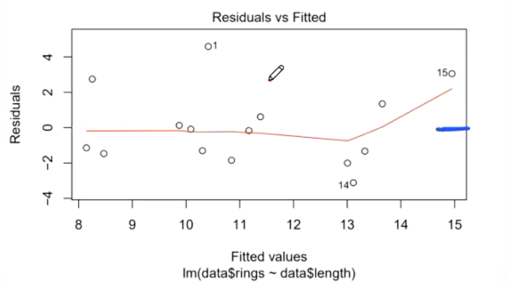

# MATH2831: Linear Models

## Table of contents

- [MATH2831: Linear Models](#math2831-linear-models)
  - [Table of contents](#table-of-contents)
  - [Simple Linear Regression](#simple-linear-regression)
    - [Introduction](#introduction)
    - [The model](#the-model)
    - [Least squares estimation](#least-squares-estimation)
      - [Some lemmas](#some-lemmas)
    - [Linear regressions in `R`](#linear-regressions-in-r)
    - [Estimation of the error variance](#estimation-of-the-error-variance)
    - [MLE of Linear Regression Parameters](#mle-of-linear-regression-parameters)
    - [Summary of notations](#summary-of-notations)
    - [The Fundamental Identity](#the-fundamental-identity)
      - [Proof](#proof)
    - [Coefficient of Determination](#coefficient-of-determination)
      - [An example using R](#an-example-using-r)
    - [Analysis of residuals and error terms](#analysis-of-residuals-and-error-terms)
      - [Things to look out for](#things-to-look-out-for)
    - [Revision of distributions derived from normal](#revision-of-distributions-derived-from-normal)
      - [Chi-squared distribution](#chi-squared-distribution)
      - [t-distribution](#t-distribution)
      - [F-distribution](#f-distribution)
    - [Distribution theory of estimators the betas and variance](#distribution-theory-of-estimators-the-betas-and-variance)
      - [Some lemmas](#some-lemmas-1)
    - [Hypothesis testing for the betas](#hypothesis-testing-for-the-betas)
    - [Analysis of Variance (ANOVA) table](#analysis-of-variance-anova-table)
    - [Making a new prediction](#making-a-new-prediction)
      - [Finding the components](#finding-the-components)
      - [Confidence interval for a new prediction](#confidence-interval-for-a-new-prediction)
    - [Simultaneous estimation of the betas](#simultaneous-estimation-of-the-betas)
    - [Bonferroni inequality](#bonferroni-inequality)
      - [Bonferroni adjustment](#bonferroni-adjustment)
  - [General Linear Model](#general-linear-model)
    - [Matrix formulation of the GLM](#matrix-formulation-of-the-glm)
	-  [Least squares estimation](#least-squares-estimation-1)
      - [Matrix form resolution](#matrix-form-resolution)
    - [Vector function differentiation](#vector-function-differentiation)
      - [Deriving beta using the least squares criterion](#deriving-beta-using-the-least-squares-criterion)
    - [Reminders from linear algebra](#reminders-from-linear-algebra)
    - [Full rank model](#full-rank-model)
    - [Random vectors](#random-vectors)
      - [Mean vector](#mean-vector)
      - [Covariance matrix](#covariance-matrix)
    - [Mean vector and covariance matrix of b](#mean-vector-and-covariance-matrix-of-b)
      - [Proofs](#proofs)
    - [Gauss Markov Theorem](#gauss-markov-theorem)
    - [Maximum likelihood estimation of parameters](#maximum-likelihood-estimation-of-parameters)
      - [Beta](#beta)
      - [Variance](#variance)
    - [Traces](#traces)
    - [Unbiased estimator of variance](#unbiased-estimator-of-variance)
    - [Inference in the general linear model](#inference-in-the-general-linear-model)
    - [Distribution of parameters](#distribution-of-parameters)
      - [Distribution of b](#distribution-of-b)
      - [Distribution of sigma](#distribution-of-sigma)
    - [Confidence interval for betas](#confidence-interval-for-betas)
      - [Joint confidence region for the coefficients (confidence ellipse)](#joint-confidence-region-for-the-coefficients-confidence-ellipse)
    - [Hypothesis testing for betas](#hypothesis-testing-for-betas)
    - [Confidence interval for the mean response and the prediction interval](#confidence-interval-for-the-mean-response-and-the-prediction-interval)
    - [Prediction interval](#prediction-interval)
    - [Adjusted R squared](#adjusted-r-squared)
    - [Sequential sum of squares](#sequential-sum-of-squares)
    - [Hypothesis testing in the GLM](#hypothesis-testing-in-the-glm)
    - [Testing model quality](#testing-model-quality)
      - [Single model quality](#single-model-quality)
      - [Comparing models](#comparing-models)
      - [Sequential F-test](#sequential-f-test)
      - [R-code](#r-code)
  - [Model Selection](#model-selection)
    - [Model selection for prediction](#model-selection-for-prediction)
      - [The components of model selection](#the-components-of-model-selection)
    - [Leverage and the hat matrix](#leverage-and-the-hat-matrix)
    - [PRESS residuals/statistic](#press-residualsstatistic)
      - [R code](#r-code-1)
      - [Leverage computation](#leverage-computation)
      - [Interpretation of the PRESS statistic](#interpretation-of-the-press-statistic)
    - [Cross validation](#cross-validation)
      - [Validation set](#validation-set)
      - [K-fold cross validation](#k-fold-cross-validation)
      - [The conceptual predictive criterion (Mallow's criterion)](#the-conceptual-predictive-criterion-mallows-criterion)
      - [Akaike information criterion (AIC)](#akaike-information-criterion-aic)
    - [Sequential variable selection procedures](#sequential-variable-selection-procedures)
      - [Forward selection](#forward-selection)
      - [Backward selection](#backward-selection)
    - [Least absolute shrinkage and selection operator (LASSO)](#least-absolute-shrinkage-and-selection-operator-lasso)
  - [Residuals and Diagnostics](#residuals-and-diagnostics)
    - [Residual plots](#residual-plots)
    - [Properties of residuals](#properties-of-residuals)
      - [Residuals and detecting outlying points](#residuals-and-detecting-outlying-points)
    - [Standardised PRESS residuals](#standardised-press-residuals)
    - [Externally studentized residuals](#externally-studentized-residuals)
      - [Hypothesis testing using externally studentized residuals](#hypothesis-testing-using-externally-studentized-residuals)
    - [Measures of influence](#measures-of-influence)
      - [A demonstrative example](#a-demonstrative-example)
    - [Metrics for influence](#metrics-for-influence)
      - [Cook's distance](#cooks-distance)
      - [DFFITS](#dffits)
      - [DFBETAS](#dfbetas)
        - [COVRATIO](#covratio)
      - [Computation in R](#computation-in-r)
    - [Dealing with violations of assumptions](#dealing-with-violations-of-assumptions)
      - [Variance stabilising transformations of the response](#variance-stabilising-transformations-of-the-response)
      - [Evaluating transformations](#evaluating-transformations)
      - [Weighted Least Squares Regression](#weighted-least-squares-regression)
  - [Categorical predictors and interactions](#categorical-predictors-and-interactions)
    - [Categorical predictors with two levels](#categorical-predictors-with-two-levels)
    - [Interactions](#interactions)
    - [Categorical predictors with three or more levels](#categorical-predictors-with-three-or-more-levels)
      - [Example](#example)
  - [Less than full rank linear models](#less-than-full-rank-linear-models)
    - [One way classification models](#one-way-classification-models)
    - [A demonstrative example](#a-demonstrative-example-1)
    - [Re-parameterisation](#re-parameterisation)
      - [Dummy coding](#dummy-coding)
      - [Per-group mean](#per-group-mean)

## Simple Linear Regression
### Introduction
We often think that there exists an inherent relationship between variables.

We will be concerned with building statistical models which describe the dependence of variable of interest (called **the response, outcome, dependent variable, ...**) on a colleciton of other related variables (called **predictors, regressors, covariates, ...**)

### The model
> This course studies the relationship between the mean/average response and the predictor in a linear framework, e.g,
> $$ E(y |x) = \beta_0 +\beta_1x$$
> where $\beta_0$ is the intercept and $\beta_1$ is the slope.
>
> More qualtitatively, we can attribute this as:
> $$ \text{Response = Noise + Signal}$$
> The *signal* is the variation in response explained in terms of predictors, and a small number of unknown parameters (the systematic part of themodel).
>
> The *noise* is residual variation unexplained in the systematic part of the model (this part may also describe some unknown parameters.)
>
> Almost no systems that we encounter in the real world can be explained by two variables - thus we always expect some noise.

Consider fitting the regression line to all the points. In this case, we assume *no noise*; but this is **overfitting** the model.

Consider fitting the regression line as a flat horizontol line of $\bar{Y}$. This is **underfitting**, as we have not tried to predict $y$ with our predictor.

> The simple linear regression model is built of the premise of *distance from the regression line*. In particular, the *y* value in an `(x, y)` point pair and it's vertical distance from the line is how we find the regression line.
> 
> Consider the list of vectors `(x0, y0), (x1, y1), ...` which represents our observed sample. Also consider some regression line:
> $$ \beta_0 + \beta_1x$$
> Then, our *epsilons*, are calculated by:
> $$ \epsilon_i = |y_i - (\beta_0 + \beta_1x_i)|$$
> $\epsilon_i$ is considered our *random error*.
> Thus, an observed value of $y$ is given by:
> $$ y = \beta_0 + \beta_1 x + \epsilon$$

We assume the following:
- $E(\epsilon_i) = 0$
- $\text{Var}(\epsilon_i) = \sigma^2$

### Least squares estimation
> Choose the *least squares estimators* $b_0$ and $b_1$ to minimise the goodness of fit criterion
> $$ S(\beta_0, \beta_1) = \sum_{i=1}^n (y_i - E(y_i))^2 = \sum_{i=1}^n (y_i - \beta_0 - \beta_1x_i)^2$$
> 
> The *sum of squares* notation is given by:
> 
> Given the vector of responses $y = (y_1, ..., y_n)$ and predictors $x = (x_1, ..., x_n)$ , we write:
> $$ S_{yy} = \sum_{i=1}^n (y_i - \bar{y})^2$$
> $$ S_{xx} = \sum_{i=1}^n (x_i - \bar{x})^2$$
> $$ S_{xy} = \sum_{i=1}^n (x_i - \bar{x})(y_i - \bar{y})$$
>
> Therefore, our values of $b_0$ and $b_1$ are given by:
> - $b_0 = \bar{y} - b_1\bar{x}$
> - $b_1 = \frac{S_{xy}}{S_{xx}}$

Let us prove this to ourselves for more clarity.
First, declare:
$$ S(\beta_0, \beta_1) = \sum_{i=1}^n (y_i - \beta_0 - \beta_1x_i)^2$$
We must find the partial derivatives for $\beta_0$ and $\beta_1$.
$$ \begin{align*}
  \partial_{\beta_0} &= - \sum_{i=1}^n2(y_i - \beta_0 - \beta_1x_i) \\ 
  \partial_{\beta_1} &= - \sum_{i=1}^n2x_i(y_i - \beta_0 - \beta_1x_i)
\end{align*}$$
Letting the partial derivatives $= 0$, we find the normal equations:
$$ \begin{align*}
  \sum_{i=1}^n2(y_i - \beta_0 - \beta_1x_i) &= 0 \\
\sum_{i=1}^n2x_i(y_i - \beta_0 - \beta_1x_i) &= 0
\end{align*}$$
Then, by resolving these summations, we get to the values of ebta listed above.

#### Some lemmas
For some estimators $b_0$ and $b_1$ of $\beta_0$ and $\beta_1$:
$$ E(b_i) = \beta_i$$

The variance of $b_1$ is given by 
$$\frac{\sigma^2}{S_{xx}}$$
The variance of $b_0$ is given by
$$\frac{\sigma^2}{n} + \frac{\sigma^2\bar{x}^2}{S_{xx}}$$
The covariance of $b_1$ and $b_0$ is given by 
$$-\frac{\sigma^2\bar{x}^2}{S_{xx}}$$

### Linear regressions in `R`
The below example is for the market data example.
```r
setwd("~/data") # or whatever the working dir of your data is.
market <- read.table("Market.txt", header=T)
plt(market$Market, market$Host_International)
beta <- lm(Host_International ~ market,data=market) # regress y ~ x, from a data variable market.
summary(beta) # gives a summary of the regression analysis
beta$residuals # gives us the residuals; the error for each observed value
coef(beta) # the coefficients
beta$coefficients # another way of seeing the coefficients
```

### Estimation of the error variance
- Since $\epsilon_i = y_i - b_0 - b_1x_i$ and the variance of epsilon is $\sigma^2$, a natural estimator is:
$$ \hat{\sigma}^2 = \frac{1}{n}\sum_{i=1}^n(y_i - b_0 - b_1x_i)^2$$
- However, this estimator is biased.
- We can modify the estimator to:
  $$ \frac{1}{n-2}\sum_{i=1}^n(y_i - b_0 - b_1x_i)^2$$
- By losing two degrees of freedom, we make the estimator unbiased.

### MLE of Linear Regression Parameters
First, assume that $\epsilon_i  \sim N(0, \sigma^2)$. By the linear regression model, this means that $y_i \sim N(\beta_0 + \beta_1x_i, \sigma^2)$.

Thus, we can find the density function of $y_i$ by:
$$ f_Y(y_i)= \frac{1}{\sqrt{2\pi\sigma^2}}e^{-\frac{1}{2\sigma^2}(y_i-\beta_0 - \beta_1x_i^2)}$$
Therefore, our likelihood function becomes:
$$ L(\beta_0, \beta_1, \sigma^2; y) = \prod_{i=1}^n ...$$
$$ L = \exp\left( -\frac{1}{2\sigma^2}S(\beta_0, \beta_1)\right)\left( \frac{1}{\sqrt{2\pi\sigma^2}}\right)^n$$
By applying the log likelihood, and then finding for the maximum value of the first derivative, we arrive at:
$$ \sum_{i=1}^n(y_i - \beta_0 - \beta_1x_i)^2$$
otherwise, the same estimator as we were given earlier. Thus, this estimator is the MLE of $y_i$.

You can use the same log function as found above and then derive partially with respects to $\sigma^2$, and then find the value that maximises $\hat{\sigma}^2$.

### Summary of notations
The *response* is denoted by $y_i$ and the model assumption tells us that:
$$ y_i = \beta_0 + \beta_1x_i + \epsilon_i$$
The *mean response* $E(y_i)$ is given by
$$ E(y_i) = \beta_0 + \beta_1x_i$$
The *fitted values of the response* are given by $\hat{y_i}$ for $i=1,..., n$
$$ \hat{y_i}=b_0 + b_1x_i$$
The *residuals* of the fitted model are given by $e_i, i=1,..., n$
$$ e_i = y_i - \hat{y_i}$$

### The Fundamental Identity
$$SS_\text{total} = SS_\text{reg} + SS_\text{res}$$
or, in plain terms:
$$ \text{total sum of squares} = \text{regression sum of squares} + \text{residual sum of squares}$$

where subbing in the identities we get
$$ \sum (y_i - \bar{y})^2 = \sum (\hat{y_i} - \bar{y})^2 + \sum(y_i - \hat{y})^2$$
#### Proof
$$ 
\begin{align*}
  \sum(y_i -\bar{y})^2 &= \sum (y_i - \hat{y_i} + y_i - \bar{y}) \\ 
  &= \sum(y_i-\hat{y_i})^2 + \sum (\hat{y_i} - \bar{y})^2 + 2\sum (y_i-\hat{y_i})(\hat{y_i} -\bar{y})
\end{align*}
$$
So we must prove that the last element is 0.
Since
$$ \sum (y_i - \hat{y_i}) = \sum (y_i - b_0 - b_1x_i) = 0$$
and by a similar argument, the LHS multiple of the term is also zero; thus, proving our identity.

### Coefficient of Determination
> One way to assess the goodness of fit of a model is by looking at the **coefficient of determination** $R^2$ given by:
> $$ R^2 = \frac{SS_{reg}}{SS_{total}}$$
> We want $R^2$ to be close to 1 to have a good goodness of fit.
> It essentially finds how much our regression explains the variance of the total variance.
>
> Thus, the higher the $R^2$ value, the less noise (given by our residuals) we have.

#### An example using R
```r
setwd("~/data")
market <- read.table("Abalone.txt", header=T)
model <- lm(Host_International ~ market,data=market)
summary(model)$r.squared # This will contain the R-squared value.
```

### Analysis of residuals and error terms
We have previously talked about residuals, the difference between the observed value and then model value
$$ e_i = y_i - \hat{y}_i$$
```R
plot(predict(model), model$residuals)
```
<center>  </center>

```R
plot(model) # This takes you through 6 plots for residuals analysis.
```
<center>  </center>
We want the red line (which considers the plot of the residuals) to be as close to as zero as possible.

The second plot is a QQ plot of the residuals - we want the residuals to be distributed normally, as we assume that the error term is normally distributed.

#### Things to look out for
- **Shape in the residual vs fitted**: If there is any shape in the residuals vs fitted graph, then there is some signal that you have not accounted for in your model yet.
- **Cone shape:** If there is a cone shape or a tapering shape in your residuals vs fitted graph - the assumption that the variance in your error term is constant throughout your model is not correct.
- **Violation of normality:** If there is a large violation of normality (on the QQ plot analysis); then our linear model assumptions are again violated.

### Revision of distributions derived from normal
#### Chi-squared distribution
> The **chi-squared distribution** with $n$-degrees of freedom, denoted by $\chi_n^2$, is defined as the sum of squares of $n$ independent standard normal random variables $Z_1, ..., Z_n$
> $$ \sum_{i=1}^n Z_i^2 \sim \chi_n^2$$

- Suppose $Z \sim N(0, 1)$ then $Z^2 \sim \chi_1^2$
- Suppose $X \sim \chi_n^2$ and $Y \sim \chi_m^2$ and X and Y are independent, then
$$ X + Y \sim \chi_{n+m}^2$$
- If $X \sim \chi_n^2$ then $E(X) = n$ and $\text{Var}(X) = 2n$.

#### t-distribution
> The **t-distribution** with $n$ degrees of freedom, denoted by $t_n$ is defined as the ratio of two independent random variables
> $$ T = \frac{Z}{\sqrt{X/n}}$$
> or
>$$ \frac{\bar{X} -\mu}{S/\sqrt{n}} \sim t_{n-1}$$
> but we must consider the degrees of freedom removed (consider that in the linear regression model, there are two degrees of freedom used.)
> 
> where $Z \sim N(0, 1)$ and $X \sim \chi_n^2$ is independent of $Z$.
>
> Write $T \sim t_n$, we say $T$ has $t$ distribution with n degrees of freedom.

#### F-distribution
> The Fisher's **F-distribution** with m and n degrees of freedom, denoted by $F_{m, n}$ is defined as a ratio of two independent chi-squared random variables, each divided by its degrees of freedom
> $$ F = \frac{X_1/m}{X_2/n}$$
> where $X_1\sim\chi_m^2$, $X_2 \sim \chi_n^2$ and $X_1$, $X_2$ are independent.

### Distribution theory of estimators the betas and variance
> In the simple linear regression model
> $$ y_i = \beta_0 + \beta_1x_i + \epsilon_i$$
> under the assumption that the errors $\epsilon_i, i=1, ..., n$ are independent and **normally distributed**, $e_i \sim N(0, \sigma^2)$, the least square estimators $b_0$ and $b_1$ are normally distributed, $\hat{\sigma}^2$ is independent of $b_0$ and $b_1$ and
> $$ 
\begin{aligned}
  b_0 &\sim N(\beta_0, \sigma^2\left( \frac{1}{n} + \frac{\bar{x}^2}{S_{xx}}\right)) \\ 
  b_1 &\sim N(\beta_1, \frac{\sigma^2}{S_xx}) \\ 
  \frac{(n-2)\hat{\sigma}^2}{\sigma^2} &\sim\chi_{n-2}^2
\end{aligned}
$$ 

#### Some lemmas
> Considering the above properties:
> $$ \frac{b_0-\beta_0}{\hat{\sigma}\sqrt{\frac{1}{n}+\frac{\bar{x}^2}{S_{xx}}}}\sim t_{n-2}$$
> $$ \frac{b_1-\beta_1}{\frac{\hat{\sigma}}{\sqrt{S_{xx}}}}\sim t_{n-2}$$

Thus, inference on $\beta_0$ and $\beta_1$ can be done by:
$$ \left( b_1 - t_{\alpha,n-2} \frac{\hat{\sigma}}{\sqrt{S_{xx}}} , b_1 + t_{\alpha/2;n-2}\frac{\sigma}{\sqrt{S_{xx}}}\right)$$
### Hypothesis testing for the betas
> Use the results for the distributions of $b_0, b_1$ and $\hat{\sigma}^2$ to test hypotheses about $\beta_0$ and $\beta_1$.
>
> To test the hypothesis
> $$ H_0 : \beta_j = \beta$$
> versus the alternative
> $$ H_1 : \beta_j \neq \beta$$
> (j = 0, 1) we use the test statistic
> $$ T = \frac{b_j - \beta}{\hat{\text{se}}(b_j)}$$
> which has a $t_{n-2}$ distribution under $H_0$.

**Importantly**, to test for a *linear* relationship between $x$ and $y$, we want to test:
$$ H_0 : \beta_1 = 0$$
$$ H_1 : \beta_1 \neq 0$$
The output of the `lm()` function in R gives you the test statistic and p-value for this test.

### Analysis of Variance (ANOVA) table
Another way to test the hypotheses:
$$ H_0 : \beta_1 = 0$$
$$ H_1 : \beta_1 \neq 0$$
is with an **F-test**. When we test the hypothesis with an **F-test**, we are asking ourselves:
> Is the predictor in the linear regression model *at all useful* for explaining variation in the response?

In the simple linear regression model, the F-test gives us the same values as the t-test, but this is not necessarily true for general linear models. Recall that:
$$ T = \frac{b_1}{\hat{\sigma}/\sqrt{S_xx}}\sim t_{n-2}$$
squaring $T$, we get an $F$ statistic:
$$ T^2 = F = \frac{b_1^2 S_xx}{\hat{\sigma}^2} \sim F_{1, n-2}$$
In a simple linear regression model, $SS_{reg} = b_1^2S_xx$, and $\hat{\sigma}^2 = SS_{res}/(n-2)$. So we now have an $F$ test statistic and its distribution under $H_0 : \beta_1 = 0$ give by:
$$ F = \frac{SS_{reg}}{SS_{res}/(n-2)} = \frac{MS_{reg}}{MS_{res}} \sim F_{1, n-2}$$
where $MS$ is the mean sum of squared, the sum of squares divided by the numbers of degrees of freedom.

It can be seen that the $F$ statistic is a ratio of the regression and residual sums of squares. If the variation explained by the model is much larger than the residual variation, then $F$ will have ea largue value, and we will reject the null hypothesis that the predictors are not useful in predicting the response.

To find the $p$-value with the $F$ statistic, we find:
$$ P(F > F_{\alpha, 1, n-2})$$

The **analysis of variance (ANOVA) table** below shows the decomposition of total variation into $SS_{reg}$ and $SS_{res}$ and the computation of the $F$ statistic.
![[anova.png]]
### Making a new prediction
Under our linear regression model, a new response $y_0 = y(x_0)$ when the predictor is $x_0$ can be expressed as:
$$ y(x_0) = \beta_0 + \beta_1x_0 + \epsilon_0$$
The true mean response at a value $x_0$ is (which is the value from the model):
$$ E(y(x_0)) = \beta_0 + \beta_1x_0$$
We can predict the mean response at a value $x_0$ by:
$$ \hat{y}(x_0) = b_0 + b_1x_0$$
and from this, our aim is to find a confidence interval for $E(y(x_0)) = \beta_0 + \beta_1x_0$ as well as a prediction interval for $y_0$.

#### Finding the components
The expectation of $\hat{y}$ is:
$$
\begin{align*}
  E(\hat{y}(x_0)) &= E(b_0 + b_1x_0) \\
  &= \beta_0 + \beta_1x_0
\end{align*} 
$$
The variance of $\hat{y}$ is:
$$ \begin{align*}
  \text{Var}(\hat{y}(x_0)) &= \text{Var}(b_0 + b_1x_0) \\
  &= \text{Var}(b_0) + x_0^2\text{Var}(b_1) + 2x_0\text{Cov}(b_1, b_0) \\ 
  &= \frac{\sigma^2}{n} + \frac{\sigma^2\bar{x}^2}{S_xx} + x_0^2\frac{\sigma^2}{S_{xx}} - 2x_0\frac{\sigma^2\bar{x}}{S_{xx}} \\ 
  &= \sigma^2\left(\frac{1}{n} + \frac{(x_0 - \bar{x}^2)}{S_{xx}} \right)
\end{align*}
$$
#### Confidence interval for a new prediction
Therefore:
$$ \hat{y}(x_0) \sim N\left(\beta_0 + \beta_1x_0, \sigma^2\left(\frac{1}{n} + \frac{(x_0 - \bar{x}^2)}{S_{xx}} \right)\right)$$

Thereby:
$$ \frac{\hat{y}(x_0) - \beta_0 - \beta_1x_0}{\hat{\sigma}\sqrt{\frac{1}{n} + \frac{(x_0-\bar{x})^2}{S_{xx}}}} \sim t_{n-2}$$
and thus, creating a confidence interval is fairly straight forward from here.
### Simultaneous estimation of the betas
There arises an issue with the simultaneous estimation of $
\beta_0$ and $\beta_1$.

> Suppose we have separate 95% confidence intervals constructed for $\beta_0$ and $\beta_1$. This implies that in 5% of the samples, calculated confidence intervals may not cover the true slope and another, possibly 5% may not cover the true intercept. In fact, as much as 10% of the samples could be incorrect for either or both parameters!

### Bonferroni inequality
Consider the simultaneous estimation of $\beta_0$ and $\beta_1$. Suppose we set that:
$$ A_0 = \{ \beta_0 \notin CI_{0, \alpha} \}$$
$$ A_1 = \{ \beta_1 \notin CI_{1, \alpha} \}$$
where $CI_{i, \alpha}$ is a $100(1 - \alpha)\%$ confidence interval for $B_i, i=0, 1$. This implies that:
- $P(\beta_0 \in CI_{0, \alpha}) = 1-\alpha$
- $P(\beta_1 \in CI_{1, \alpha}) = 1-\alpha$
- $P(\beta_0 \in CI_{0, \alpha} \cap \beta_1 \in CI_{1, \alpha}) = P(A_0^c \cap A_1^C)$

The **Bonferroni inequality** is defined by:
$$P(A_0^c \cap A_1^c) \ge 1 - 2\alpha$$
#### Bonferroni adjustment
> - In general, suppose we have parameters $\theta_0, ..., \theta_k$. It can be shown that if we construct pointwise $100(1-\alpha/k)\%$ confidence intervals for all the parameters, then the joint coverage of these estimators has a CI of $100(1-\alpha)\%$
> - Thus, the correction for our confidence interval is to divide our desired significane level $\alpha$ by the number of parameters $k$.
> - The Bonferroni adjustment is **conservative**.

## General Linear Model
Previously we considered having one predictor - however, in real experiments, there may be multiple parameters. The general linear model allows for multiple predictors. 

Given $n$ responses $y_1, ..., y_n$ and the values of $k$ predictor variables, we have:
$$ y_i = \beta_0 + \beta_1x_{i1} + \beta_2x_{i2} + ... + \beta_kx_{ik} + \epsilon_i$$
where $\beta_0, ..., \beta_k$ are unknown parameters and $\epsilon_i$ is a collection of independent errors with zero mean and variance $\sigma^2$.

### Matrix formulation of the GLM
Consider the above general linear model. We have some new notation:
$$
\begin{align*}
  y &= (y_1, ..., y_n)^T \\ 
  x_j &= (x_{1j}, ..., x_{nj})^T \\ 
  \beta &= (\beta_0, ..., \beta_k)^T \\ 
  \epsilon &= (\epsilon_1, ..., \epsilon_n)^T
\end{align*}
$$
such that these are all column vectors. 
- Let $p = k + 1$, such that $p$ is the length of $\beta$.
- Write $X$ for the $n \times p$ matrix whose 1st column is a column of 1's and the (j + 1)th column is the vector $x_j = (x_{1j}, ..., x_{nj})^T, j=1, ..., k$
- In other words, the first column is 1's, and the rest of the column vectors are each of the predictors observations.

In matrix form, the general linear model is given by:
$$ 
\begin{pmatrix}
  y_1 \\
  ...  \\ 
  y_n
\end{pmatrix}
=
\begin{pmatrix}
  1 & x_{11} & ... & x_{1k} \\ 
  ... & ... & ... & ... \\ 
  1 & x_{n1} & ... & x_{nk}
\end{pmatrix}
\begin{pmatrix}
  \beta_0 \\ 
  ... \\ 
  \beta_k
\end{pmatrix} + 
\begin{pmatrix}
  \epsilon_i \\ 
  ...  \\ 
  \epsilon_n
\end{pmatrix}
$$
or more simply:
$$ y = X\beta + \epsilon$$

### Least squares estimation
A natural extension of the goodness of fit criterion considered for the simple linear regression model is to minimise the sum of squared deviations between responses $y$ and their predictions (expected values) $X\beta$ given by:
$$ S(\beta)=\sum_{i=1}^n (y_i - (X\beta))^2 = \sum_{i=1}^n(y_i - \sum_{j=0}^k x_{ij}\beta_{j})^2$$
$$ S(\beta) = (y - X\beta)^T(y-X\beta)$$
The objective stays the same: we wish to *minimise* the sum of the squares, which will lead to our least squares estimation.
#### Matrix form resolution
Observe that:
$$ 
\begin{align*}
  (y-X\beta)^T(y-X\beta) &= y^T(y-X\beta) - (X\beta)^T(y-X\beta) \\ 
  &= y^Ty - y^TX\beta - \beta^TX^Ty + \beta^TX^TX\beta \\ 
  &= y^Ty - (X^Ty)^T\beta - \beta^TX^Ty + \beta^TX^TX\beta
\end{align*}
$$
however we know that $\beta^TX^Ty$ is a scalar. 
We know that the transpose of a scalar is itself, thus:
$$ \beta^T(X^Ty) = (X^Ty)^T\beta$$
Therefore, the least squares criterion becomes:
$$ (y-X\beta)^T(y-X\beta) = y^Ty - 2(X^ty)^T\beta + \beta^TX^TX\beta$$
An important identity is: $X^TX$, which we denote $X^TX = A$. 

### Vector function differentiation
> For a real valued **vector function** $f$, which maps a $p$-dimensional vector of real numbers $x = (x_1, ..., x_p)^T$ to a real number $f(x)$, we define the derivative of $f$ with respect to $x$ as the vector:
> $$ \frac{\partial f(x)}{\partial x} = \left( \frac{\partial f(x)}{\partial x_1}, ..., \frac{\partial f(x)}{\partial x_p}\right)^T$$

Vector differentiation essentially works in some given vector space 

#### Deriving beta using the least squares criterion
$$
\begin{align*}
\frac{\partial}{\partial\beta}(y-X\beta)^T(y-X\beta) &= \frac{\partial}{\partial\beta}(y^Ty - 2(X^Ty)^T\beta + \beta^TX^TX\beta) \\ 
&= -2X^Ty + (X^TX + (X^TX)^T)\beta \\ 
&= -2X^Ty + 2X^TX\beta
\end{align*}
$$
Therefore the least squares estimator $b$ of $\beta$ satisfies:
$$ -2X^Ty + 2X^TXb = 0$$
Which we have the normal equations:
$$ (X^TX)b = X^Ty$$
If the model is full rank, then $(X^TX)$ is invertible and the normal equations have a unique solution given by:
$$ b = (X^TX)^{-1}(X^Ty)$$

### Reminders from linear algebra
Vectors $v_1, ...,,v_p$ are said to be linearly dependent if there are some constants $a_1, ..., a_p$ not all zero such that:
$$ a_1v_1 + ... + a_pv_p = 0$$

The **rank** of a metrix is the maximal number of linearly independent columns; or all the leading rows in a matrix after row reduction.

### Full rank model
A **full rank model** is a model which has $n$ rows and $p$ columns; and then has a rank of $p$. This means that all of the regressors are *linearly indepdendent*, and define their own signal.

### Random vectors
> We consider a random vector, which is a column vector of:
> $$ \begin{pmatrix}
  Y_1 \\ Y_2 \\ ... \\ Y_n
\end{pmatrix}$$
> The elements of which are jointly distributed random variables $Y_i$ with:
> $$ E(Y_i) = \mu_i$$
> for $i = 1, 2, ..., n$ and
> $$ Cov(y_i, y_j) = \sigma_{i, j}$$
> for $i, j = 1, 2, ..., n$

#### Mean vector
The mean vector, is then defined by:
$$E(Y) = \mu = (\mu_1, ..., \mu_n)^T$$

Some results are:
- If $a$ is a k x 1 vector of constants, then $E(a) = a$
- If $a$ is a k x 1 vector of constants and $Y$ is an n x 1 random vector with $E(Y) = \mu$, then $E(a^TY) = a^T\mu$
- If $A$ is a p x n matrix of constants and $Y$ is a random vector with $E(Y) = \mu$, then $E(AY) = A\mu$.

Thus, $E(y = X\beta + \epsilon) = X\beta$.

#### Covariance matrix 
The covariance matrix of $Y$ denoted by $\text{Var}(Y)$ is defined to be a square $n\times n$ matrix containing the covariance of $Y_i$ and $Y_j$ at the $(i, j)$-th cell.

It can be defined as the matrix, for some random vector $Y$, as:
$$ (Y-\mu)(Y-\mu)^T$$
such that the $(i, j)$-th entry is defined by: $(Y_i - \mu_i)(Y_j - \mu_j)$.

*Lemma:* Let $Y$ be a $n \times 1$ random vector with $\text{Var}(Y) = V$.
1. If $a$ is a $n \times 1$ vector of real numbers, then
$$ \text{Var}(a^TY) = a^TVa $$
2. Let $A$ be a $p \times n$ matrix. If $Z = AY$, then:
$$ \text{Var}(Z) = AVA^T$$ 

### Mean vector and covariance matrix of b
We found earlier that in the full rank model, the least squares estimator is $b = (X^TX)^{-1}X^Ty$. $b$ is unbiased, such that:
$$ \mathbb{E}(b) = \beta$$
with covariance matrix
$$ \text{Var}(b) = \sigma^2(X^TX)^{-1}$$

#### Proofs
$$ 
\begin{align*}
  \mathbb{E}(b) &= \mathbb{E}((X^TX)^{-1}X^Ty) \\ 
  &= (X^TX){-1}X^T\mathbb{E}(y) \\ 
  &= (X^TX){-1}X^TX\beta \\ 
  &= X^{-1}X^{-T}X^TX\beta \\ 
  &= \beta
\end{align*}
$$

Using the fact that for a nonsingular matrix $A$, $(A^T)^{-1} = (A^{-1})^T$:
$$ 
\begin{align*}
  \text{Var}(b) &= (X^TX)^{-1}X^T\text{Var}(y)((X^TX)^{-1}X^T)^T \\ 
  &= (X^TX)^{-1}X^T (\sigma^2I)((X^TX)^{-1}X^T)^T \\ 
  &= \sigma^2(X^TX)^{-1}X^T(X^{-1}X^{-T}X^T)^T \\
  &= \sigma^2(X^TX)^{-1}X^T(X^{-1})^T \\ 
  &= \sigma^2(X^TX)^{-1}
\end{align*}
$$

### Gauss Markov Theorem
$b$ is an example of a lienar estimator, which is an estimator of the form $Ay$ for some $p\times n$ matrix A.
> The **Gauss-Markov Theorem** states that if $b^{*}$ is any unbiased linear estimator of $\beta$, and if $b$ is the least squares estimator, then $\text{Var}(b_i) \le \text{Var}(b_i^{*}), i = 1, ..., p$.

*We say that $b$ is the **best linear unbiased estimator (BLUE)** of $\beta$*.

*Proof.* Let $b^{*}$ be an arbitrary linear unbiased estimator of $\beta$. We can write this estimator in the form:
$$ b^{*} = ((X^TX)^{-1}X^T + B)y$$
for some $p \times n$ matrix $B$

The expectation of the estimator is given by:
$$ \mathbb{E}(b^{*}) = ((X^TX)^{-1}X^T + B)X\beta$$
$$ = \beta + BX\beta$$
Since we know that $b^{*}$ is unbiased, we know that $BX\beta = 0$. For this to hold for arbitrary $\beta$, we must have $BX = 0$.

Now consider:
$$
\begin{align*}
  \text{Var}(b^{*}) &= \text{Var}(((X^TX)^{-1}X^T+B)y) \\
  &= ((X^TX)^{-1}X^T + B)\sigma^2I((X^TX)^{-1}X^T + B)^T \\ 
  &= \sigma^2((X^TX)^{-1}X^T + B)(X(X^TX)^{-1} + B^T) \\ 
  &= \sigma^2((X^TX)^{-1}X^TX(X^TX)^{-1} + (X^TX)^{-1}X^TB^T \\ &+ BX(X^TX)^{-1} + BB^T)
\end{align*}
$$
But we previously deduced that $BX=0$, and equally, that $X^TB^T=0$, hence:
$$ \text{Var}(b^{*}) =\sigma^2((X^TX)^{-1} + BB^T)$$
Thus, the variance of $b^{*}$ is just the variance of $b$ with an added positive element, as:
$$ BB^T = \sum_{i=1}^n B_{ij}^2$$
Thereby, $b$ is **BLUE**.
### Maximum likelihood estimation of parameters
Assuming that $\epsilon_i \sim N(0, \sigma^2).$
#### Beta
$$
\begin{align*}
  L(\beta, \sigma^2; y) &= \prod_{i=1}^n \frac{1}{\sqrt{2\pi\sigma^2}} \exp\left( -\frac{1}{2\sigma^2}(y_i - (X\beta)_i)^2\right) \\ 
  &= (2\pi \sigma^2)^{-n/2}\exp\left(-\frac{1}{2\sigma^2}\sum_{i=1}(y_i - (X\beta)_i)^2 \right) \\
  &= (2\pi \sigma^2)^{-n/2}\exp\left(-\frac{1}{2}(y-X\beta)^T(y-X\beta)\right)
\end{align*}
$$
where the log-likelihood becomes:
$$
-\frac{n}{2}\log(2\pi) - \frac{n}{2}\log(\sigma^2) - \frac{1}{2\sigma^2}(y-X\beta)^T(y-X\beta)
$$
Thus, we arrive at the OLS (when derived w.r.t $\beta$); meaning that the least square estimator $b$ is also the MLE.
#### Variance
Differentiating the above log-likelihood function with respects to $\sigma^2$, we get:
$$ 
\begin{align*}
\partial_{\sigma^2} &= -\frac{n}{2\sigma^2} + \frac{1}{2\sigma^4}(y-X\beta)^T(y-X\beta) \\ 
\end{align*}
$$
Solving for $0$, we get:
$$
\begin{align*}
\frac{n}{2\tilde{\sigma}^2} &= \frac{1}{2\tilde{\sigma}^4}(y-X\beta)^T(y-X\beta) \\ 
\tilde{\sigma}^2 &= \frac{1}{n}(y-X\beta)^T(y-X\beta)
\end{align*}
$$

### Traces
> For a $k \times k$ matrix $X$, the trace of $X$, written $\text{tr}(X)$, is the sum of the diagonal elements of $X$:
> $$ \text{tr}(X) = \sum_{i=1}^kX_{ii}$$

Let $y$ be a $k \times 1$ random vector with $\mathbb{E}(y) = \mu$ and $\text{Var}(y) = V$. Let $A$ be a $k \times k$ matrix of real numbers. Then
$$ \mathbb{E}(y^TAy) = \text{tr}(AV) + \mu^TA\mu$$

### Unbiased estimator of variance
> The unbiased estimator of $\sigma^2$ is given by:
> $$ \hat{\sigma}^2 = \frac{1}{n-p}(y-Xb)^T(y-Xb)$$
> where $p$ is the total number of parameters in the model.

### Inference in the general linear model
First let us define a multivariate normal distribution, which is required for us to make inferences on a multi-parameter model.
> A random vector $Y (n \times 1)$ is said to have a **multivariate normal distribution with mean vector $\mu$ and covariance matrix $\Sigma$** if it's density $f(y; \mu, \Sigma)$ is given by:
> $$ f(y; \mu, \Sigma) = \frac{1}{(2\pi)^{n/2}|\Sigma|^{1/2}}\exp\left(-\frac{1}{2}(y - \mu)^T\Sigma^{-1}(y- \mu)\right)$$
> where $|\Sigma|$ denotes the determinant of $\Sigma$.

Comments:
- $\Sigma$ is invertible, symmetrical and positive definite.
- Marginal distribution of each $Y_i$ is univariate normal, $Y_i \sim N(\mu_i, \Sigma_ii)$.
- The mean vector $\mu$ and covariance matrix $\Sigma$ completely characterize a multivariate normal distribution.
- The **bivariate normal** distribution corresponds to the case $n=2$.

Lemmas:
> Let $Y \sim N(\mu, \Sigma)$, where $Y$ is a $n \times 1$ multivaraite random normal vector.
>
> Let $A$ be a $p \times n$ matrix. Then $Z= AY$ is a multivariate random vector with mean $A\mu$ and covariance matrix $A\Sigma A^T$:
> $$ Z \sim N(A\mu, A\Sigma A^T)$$

> Suppose that $Y$ is a $n \times 1$ multivariate normal random vector, $Y \sim N(\mu, \Sigma)$, where, as usual, the covariance matrix $\Sigma$ is non-singular and positive definite, and it's inverse is $\Sigma^{-1}$. Then the random variable $(y - \mu)^T\Sigma^{-1}(y- \mu)$ (of quadratic form) has a $\chi_n^2$ distribution.

### Distribution of parameters
#### Distribution of b
> In the full rank linear model, under the normality assumption $\epsilon \sim N(0, \sigma^2I)$, the least squares estimator $b$ of $\beta$ has a multivariate normal distribution with mean $\beta$ and covariance matrix $\sigma^2(X^TX)^{-1}$
> $$ b \sim N(\beta, \sigma^2(X^TX)^{-1})$$

#### Distribution of sigma
> $\hat{\sigma}^2$ is distributed by:
> $$ \frac{(n-p)\hat{\sigma}^2}{\sigma^2} \sim \chi_{n-p}^2$$
> and $b$ and $\hat{\sigma}^2$ are independent.

### Confidence interval for betas
Write $c_{jj}, j=0, ..., k$ for the diagonal elements of $(X^TX)^{-1}$. It follows from the previous theorem that:
$$ \frac{b_j - \beta_j}{\sigma\sqrt{c_{jj}}}\sim N(0, 1)$$
Dividing through with the distribution we found for $\hat{\sigma}^2$, we get:
$$ \left(  \frac{b_j - \beta_j}{\sigma\sqrt{c_{jj}}}\right) \div \sqrt{\frac{\frac{(n-p)\hat{\sigma}^2}{\sigma^2}}{n-p}} \sim t_{n-p}$$
so
$$ \frac{b_j - \beta_j}{\hat{\sigma}\sqrt{c_{jj}}} \sim t_{n-p}$$

Thereby, a **$100(1-\alpha)\%$** confidence interval for $\beta_j$ is given by
$$ (b_j - t_{\alpha/2, n-p}\hat{\sigma}\sqrt{c_{jj}}, b_j + t_{\alpha/2, n-p}\hat{\sigma}\sqrt{c_{jj}}$$

#### Joint confidence region for the coefficients (confidence ellipse)
Previously we used Bonferroni adjustments to obtain a confidence region with a guaranteed coverage level by adjusting coverage of pointwise intervals.

In the general linear model, there is an alternative way of delivering confidence regions which have exact coverage $(1 - \alpha)$ for the parameter vector $\beta$.

It can be shown that:
$$ \frac{(b - \beta)^T X^TX(b - \beta)}{\sigma^2} \sim \chi_p^2$$
We can then show that the statistic:
$$ \frac{(b-\beta)^TX^TX(b-\beta)}{p\hat{\sigma}^2}$$
has an $F_{p, n-p}$ distribution.

Therefore:
$$ P\left[(b-\beta)^TX^TX(b-\beta)/(p\hat{\sigma}^2) \le F_{\alpha;p, n-p}\right] = 1-\alpha$$

### Hypothesis testing for betas
To test
$$ H_0 : \beta_j = \gamma$$
and
$$ H_1 : \beta_j \neq \gamma$$
we use the test statistic:
$$ T = \frac{b_j - \gamma}{\hat{\sigma}\sqrt{c_{jj}}}$$
which has a $t_{n-p}$ distribution under $H_0$.

The rejection region then becomes:
$$ T<-t_{\alpha/2;n-p} \text{ or } T > t_{\alpha/2;n-p}$$

### Confidence interval for the mean response and the prediction interval 
Consider a set of new predictors $x_{*} = (x_{i1}, ..., x_{ik})^T$. 

A new response in the fitted model, $y_{*}$ for which the values of the predictor variables are $x_{*1}, ..., x_{*k}$. Then:
$$ y_* = x_*^T\beta + \epsilon_{*}$$
Thus, the fitted value becomes:
$$ \hat{y}(x_{*}) = x_{*}^T\beta$$
We know from preivous results that $b$ is a random normal vector, and $x_{*}^T$ is a vector of real values; thus, $\hat{y}(x_*)$. We can find it's distribution by finding the expected value and it's variance:
$$ \mathbb{E}(x_{*}^T\beta) = x_{*}^T\beta$$
$$ 
\begin{align*}
  \text{Var}(x_{*}^Tb) &= x_{*}^T\text{Var}(b)x_{*} \\
  &= \sigma^2x_{*}^T(X^TX)^{-1}x_{*}
\end{align*}
$$
Therefore, $x_{*}^Tb \sim N(x_{*}^T\beta, \sigma^2x_{*}^T(X^TX)^{-1}x_*)$.

> Thereby, normalising our distribution, we arrive to:
> $$ \frac{x_{*}^Tb - x_{*}^T\beta}{\sigma\sqrt{x_{*}^T(X^TX)^{-1}x_*}} \sim N(0,1)$$
> and by the following derivation:
> $$ 
\begin{align*}
  \frac{(n-p)\hat{\sigma}^2}{\sigma^2} &\sim \chi_{n-p}^2 \\
  \frac{x_{*}^Tb - x_{*}^T\beta}{\sigma\sqrt{x_{*}^T(X^TX)^{-1}x_*}} \div \sqrt{\frac{\frac{(n-p)\hat{\sigma}^2}{\sigma^2}}{n-p}} &\sim \chi_{n-p}^2 \\ 
  \frac{x_{*}^Tb - x_{*}^T\beta}{\hat{\sigma}\sqrt{x_{*}^T(X^TX)^{-1}x_*}} &\sim \chi_{n-p}^2
\end{align*}$$
> Therefore the **confidence interval** for a fitted value $\hat{y}(x_{*}) = x_{*}^Tb$ is given by:
> $$ (x_{*}^T \pm t_{\alpha/2;n-p}\hat{\sigma}\sqrt{x_{*}^T(X^TX)^{-1}x_*})$$

### Prediction interval
Similarly, the prediction interval or the error interval, given by:
$$ y_* - \hat{y}_* = x_{*}^T  \beta + \epsilon_{*} - x_{*}^Tb$$
The mean is clearly $0$. To compute the variance:
$$ 
\begin{align*}
  \text{Var}(y_* - \hat{y}_*) &= \text{Var}(\epsilon_*) + \text{Var}(x_{*}^Tb) \\ 
  &= \sigma^2 + \sigma^2x_{*}^T(X^TX)^{-1}x_* \\ 
  &= \sigma^2(1 + x_{*}^T(X^TX)^{-1}x_*)
\end{align*}
$$
Thereby, from a similar logic as above:
$$ \frac{y_* - \hat{y}_*}{\hat{\sigma}\sqrt{1 + x_{*}^T(X^TX)^{-1}X_*}} \sim t_{n-p}$$

### Adjusted R squared
The more factors we add, the more we risk overfitting. In fact, as we add more factors, our $R^2$ will continue to get better. For general linear models, we have the *adjusted* $R^2$, written $\bar{R}^2$.

> $\bar{R}^2$ is given by scaling the residual and total sum of squares by the degrees of freedom they encounter:
> $$ \bar{R}^2 = 1 - \frac{(n-1)SS_{res}}{(n-p)SS_{total}} = 1 - \frac{\hat{\sigma}(n-1)}{SS_{total}}$$
> or in terms of $R^2$:
> $$ \bar{R}^2 = 1 - \frac{n-1}{n-p}(1-R^2)$$

### Sequential sum of squares
The `anova` table in `R` for general linear models has the sum of squares as a *sequential sum of squares*.

> The **sequential sum of squares** is achieved by the following process:
> - For each variable, compared the fitted model with the current variable *and all the variables that precede it*, with the model with just the variables that precede it.
> - This means that for each variable, we are able to consider the effect that the current varaible had on the model's fit.

Consider a list of betas $(\beta_1, ..., \beta_k)$. We partition $\beta$ into two groups, $B = (\beta^{(0)}, \beta^{(1)})$.
- We write $R(\beta^{(1)} | \beta^{(0)})$ for the increase in $SS_{reg}$ when the predictors are corresponding to the parameters $\beta^{(1)}$ compared to the model with just the $\beta^{(0)}$ parameter.
- Note that:
  $$R(\beta_1, ..., \beta_k|\beta_0) = R(\beta_1|\beta_0) + R(\beta_2|\beta_0, \beta_1) + ... + R(\beta_k|\beta_0, ..., \beta_{k-1})$$

### Hypothesis testing in the GLM
- Partial $F$-tests on a group of predictors compared with the model with all predictors let's us see how much the group of predictors composes the total variation
- This is useful to see which groups of predictors are useful; which groups of predictors are useful together, etc.

> In the general linear model, the **$F$**-test tests the null hypothesis:
> $$ H_0 : \beta_1 = ... = \beta_k = 0$$
> versus
> $$ H_1 : \text{Not all } B_j = 0, j = 1, ..., k$$
> The statistic is given by:
> $$ F =  \frac{MS_{reg}}{MS_{res}} = \frac{SS_{reg}/(p-1)}{SS_{res}/(n-p)} \sim F_{p-1,n-p}$$
> where $p = k + 1$ for $k$ parameters, as the regression uses $k$ estimators of $\beta$ and $1$ estimator of $\sigma^2$, and where the critical region is given by:
> $$ F \ge F_{\alpha;p-1, n-p}$$

### Testing model quality
#### Single model quality
By testing:
$$ H_0: \beta_1 = ... = \beta_k =0 $$
We consider if the model with just an intercept is better than the model with all the predictors. This is a good indicator of model quality.

#### Comparing models
We can compare a model of form:
$$ y_i = \beta_0 + \beta_1x_{i1} + ... + \beta_{r-1}x_{i(r-1)} + \epsilon_i$$
with a model:
$$ y_i = \beta_0 + \beta_1x_{i1} + ... + \beta_{r-1}x_{i(r-1)} + \beta_{r}x_{ir} + ... + \beta_{k}x_{ik} + \epsilon_i$$
we consider the null hypothesis:
$$ H_0: \beta_r = \beta_{r+1} = ... = \beta_{k} = 0$$
and
$$ H_1: \text{not all betas are zero}$$
which considers if the extra predictors have significant predictive ability.

#### Sequential F-test
> To describe a **sequential $F$-test**, consider the model
> $$ y_i = \beta_0 + \beta_1x_{i1} + ... + \beta_{j-1}x_{i(j-1)} + \beta_jx_{ij} + \epsilon_i$$
> where we test the hypothesis whether or not to include the $j$-th predictor in this model:
> $$ H_0: \beta_j = 0 \text{ and } H_1 : \beta_j \ne 0$$
> We can then use the following test statistic and its null distribution:
> $$ F = \frac{R(\beta_j | \beta_0, ..., \beta_{j-1})}{MS_{res}} \sim F_{1,n - (j+1 )}$$
> $MS_{res}$ **here refers to the residuals + the rest of the predictors that are not considered.**

#### R-code
```
model1 <- lm(risk~Div+Ratio, data=risk)
model2 <- lm(risk~Div+Ratio+Size, data=risk)
anova(model1,model2)
```
Output:
```
Analysis of Variance Table

Response: INF
          Df Sum Sq Mean Sq F value   Pr(>F)   
DEV        1 6222.7  6222.7 11.4884 0.003267 **
QUES       1 1122.5  1122.5  2.0724 0.167150   
LEGAL      1    0.3     0.3  0.0006 0.981197   
Residuals 18 9749.7   541.7
```
The `Sum of Sq` column gives the sequential sum of squares with the new predictor being compared with the predictors 
that are before it in the ANOVA table. For example, in the above lab question example; we get:
$$ 
R(\verb|DEV| | B_0) \\ 
R(\verb|QUES| | \verb|DEV|, B_0) \\ 
...
$$
We *generally* want to keep the residuals (or any predictors we might want to discard) towards the end, because:
1. The $MS_{res}$ calculation becomes a lot easier.
2. We can also check the sequential F-test that considers if it is additive to the model in any way.

## Model Selection
*We must manage a trade off between goodness of fit and complexity; or so called bias-variance tradeoff.*

### Model selection for prediction
> We write $M_0$ for the model:
> $$ y_i = \beta_0 + \epsilon_i$$
> in which the predictor $x_i$ is excluded, and write $M_1$ for the full model:
> $$ y_i = \beta_0 + \beta_1x_i + \epsilon_i$$

Which model is better based on **predictive** performance? We can of course find the estimators for $b_0, b_1$ for each respective model using the ordinary least squares method.

In the end, we get two predictions:
$$ \hat{y}_*^0(x_*) = \bar{y}$$
$$ \hat{y}_*^1(x_*) = b_0 + b_1x_*$$

Now to *compare* predictive performance, we consider the expected value of the squared errors:
$$ 
\begin{align*}
  E[(y_* - \hat{y}_*^0(x_*))^2] = E((y_* - \bar{y})^2)
\end{align*}
$$
and
$$
E[(y_* - \hat{y}_*^1(x_*))^2] = E((y_* - b_0 - b_1x_*)^2)
$$
Expanding the first identity:
$$
\begin{align*}
  E[(y_* - \hat{y}_*^0(x_*))^2] &= \text{Var}(y_* - \hat{y}^0(x_*)) + E(y_* - \hat{y}^0(x_*))^2 \\ 
  &= \text{Var}(y_*) + \text{Var}(\hat{y}^0(x_*)) + E(y_* - \hat{y}^0(x_*))^2 \\ 
  &= \sigma^2 + \text{Var}(\hat{y}^0(x_*)) + E(y_* - \hat{y}^0(x_*))^2 \\ 
  &= \sigma^2 + \text{Var}(\hat{y}^0(x_*))+ \text{Bias}(\hat{y}^0(x_*))^2
\end{align*}
$$
And by a similar reasoning:
$$
\begin{align*}
  E[(y_* - \hat{y}^1(x_*))^2] = \sigma^2 + \text{Var}(\hat{y}^1(x_*)) + [E(y_* - \hat{y}^1(x_*))]^2
\end{align*}
$$
#### The components of model selection
Thereby, as long as we are trying to minimise the squared errors, we can decompose models into three parts:
- Error variance
- Variance of prediction
- Squared bias

Thus we must try to *minimise* all three of these values.

Continuing further:
$$ 
\text{Var}(\hat{y}^0(x_*)) = \frac{\sigma^2}{n}
$$
$$ 
\text{Var}(\hat{y}^1(x_*)) = \sigma^2\left(\frac{1}{n} + \frac{(x_* - \bar{x})^2}{S_{xx}}\right)
$$
thereby, prediction variance becomes larger for the more complex model.  Consider bias:
- If $M_1$ is the correct model then $E(y_* - \hat{y}^1(x_*)) = 0$. If we fit the model $M_0$ when model $M_1$ holds with a nonzero $\beta_1$, then the bias term may be non-zero.
- If $M_0$ holds, then the bias term will be zero for both models.

So the bias term is *always* smaller (or equal) for the more complex model (as if $M_0$ holds, then $M_1$ must always hold).

> **The key idea:** to make it worthwhile to add a predictor, the additional increase in prediction variance must be outweighed by a *reduction* in bias.

### Leverage and the hat matrix
First define the hat matrix $H$, where:
$$ H = X(X^TX)^{-1}X^T$$
**Leverages** are the diagonal elements of the hat matrix $H$.

> The **hat matrix** (also called the projection matrix), if multiplied by a response given by the model, gives the values of the predictors that formed the response. 

To interpret the hat matrix, we just observe that the vector of fitted values is:
$$ \hat{y} = Xb = X(X^TX)^{-1}X^Ty = Hy$$
It follows that the i-th fitted value $\hat{y}_i$ can be written as:
$$ \hat{y}_i = h_{ii}y_i + \sum_{j\ne i}h_{ij}y_j$$
> **The leverage is some measure of the influence of $y_i$ on the fit at the $i$-th set of predictor values.**

Consider the following properties:
- The matrix $H$ is a real, symmetric and idempotent $n \times n$ matrix
- $HX = X$
- $(I - H)X = 0$ and $H(I - H) = 0$
- The diagonal entries of $H$ always lie between zero and one.

We can also write the leverage as:
$$h_{ii} = x_i^T(X^TX)^{-1}x_i$$
and it is derivable, through the above identity that:
$$\text{Var}(\hat{y}(x_i)) = \sigma^2h_{ii}$$

### PRESS residuals/statistic
> It is unwise to fit a model and then test it's goodness of fit using it's residuals on the same sample.
> 
> A better approach is to fit a model to all the data except the $i$-th observation and then calculate a new kind of residual, so called the $i$-th **PRESS residual**, given by:
> $$ e_{i, -i} = y_i - \hat{y}_{i, -i}$$
> where $\hat{y}_{i, -i}$ is the prediction of the $i$-th observation obtained by fitting a model to the data using all observations except the $i$-th.
>
> A global measure of goodness of fit based on the PRESS residuals is the **PRESS statistic** (predicted residual error sum of squares) which is the sum of the squared PRESS residuals:
> $$ \text{PRESS} = \sum_{i=1}^n e_{i, -i}^2$$

#### R code
```r
i <- 3

# Model without the i-th point only.
hospital_mod_mi <- lm(y~x1+x2+x3+x4+x%, data=hospital[-i,])

# Model with just the i-th point.
nd <- hospital[i,]

# Find the single PRESS residual
e_mi <- hospital$y[i] - predict(hospital_mod_mi, newdata=nd)
e_mi
```
#### Leverage computation
> If $e_i$ is the ordinary residual for the $i$-th observation, $h_{ii}$ is the $i$-th leverage value, and if $e_{i, -i}$ is the $i$-th PRESS residual, then it can be shown that:
> $$ e_{i, -i} = \frac{e_i}{1 - h_{ii}}$$

#### Interpretation of the PRESS statistic
1. Gather all your models, and fit them
2. For each model, calculate the PRESS statistic
3. Choose the model with the *smallest* PRESS statistic - which indicates that the model has the smallest out of sample prediction error.

### Cross validation
Cross validation is related to the PRESS statistic. Model selection via the PRESS statistic is sometimes called *leave one out cross validation* (LOOCV).
#### Validation set
Instead of leaving out one sample, we divide the sample into two samples, a training sample and a validation sample. Selection of a model is based on the prediction of the validation sample.

1. Divide the data set into two parts randomly. We do this by dividing the index set $I :=i=1, \dots N$ into two disjoint sets $I_{tr}$ and $I_{test}$.
2. Fit each candidate model we want to select from to the training data only, i.e to all $(x_i, y_i)$ such that $i \in I_{tr}$, to obtain $b^{tr}$.
3. Predict to the test data only, i.e for $i \in I_{test}$ calculate:
$$ \hat{y}_i = b_0^{tr} + b_1^{tr}x_i$$
$$ e_i = y_i - \hat{y}_i$$
$$ VC = \sum_{i\in I_{test}}e_{i}^2$$
4. Take the model with the lowest validation criteria ($VC$) value. 

There are some difficulties with the validation set approach - name:
- How do we split the data? 
- Do we have enough data points to split the data?

#### K-fold cross validation
The term cross validation technically refers to randomly splitting the data into $K$ (often 5 to 10) subsets of approximately equal size. Then each of the subsets are considered as testing data once, while fitting the data to the remaining $K-1$ subsets.

This process results in $K$ estimates of the mean squared error, $MSE_1, ..., MSE_K$.

The $K$-fold CV estimate for the test MSE is computed by averaging these $K$ estimates:
$$ CV_{(K)} = \frac{1}{K}\sum_{i=1}^K \text{MSE}_i$$

#### The conceptual predictive criterion (Mallow's criterion)
We can instead create some arbitrary criterion, and then for each model we have, compute the criterion.

> Importantly, this criterion/testing framework can only be useful to compare sub-models in a larger full model.

- For a current model with $p$ parameters, derive and minimise an estimate of the theoretical quantity
$$ \sum_{i=1}^n \frac{\text{MSE}(\hat{y}(x_i))}{\sigma^2}$$
- Now using the formula $E(Z^2) = \text{Var}(Z) + E(Z)^2$:
$$ \text{MSE}(\hat{y}(x_i)) = \text{Var}(\hat{y}(x_i)) + \text{Bias}(\hat{y}(x_i))^2$$
- Hence the criterion becomes:
$$ \frac{1}{\sigma^2}\left( \sum_{i=1}^n \text{Var}(\hat{y}(x_i)) + \text{Bias}(\hat{y}(x_i))^2\right)$$
- It can be shown that:
$$ \frac{1}{\sigma^2}\sum_{i=1}^n\text{Var}(\hat{y}(x_i)) = p$$
- And also that $(n-p)(\hat{\sigma}_p - \sigma^2)$ is an unbiased estimator of the RHS, thereby, we finally get:
$$ C_p = p + \frac{(\hat{\sigma}_p^2 - \hat{\sigma}_F^2)(n-p)}{\sigma_F^2}$$

We can use a library called `leaps` to calculate the Mallow's criterion.
```r
library(leaps)
cp = leaps(x=X columns, y=Y column,names=names of the X columns, method=['Cp', 'r2', 'adjr2'])
```

#### Akaike information criterion (AIC)
The Akaike information criterion (AIC) is the **most commonly used criteria** for model selection for applied statistician, and is defined as:
$$ AIC =  -2 \log \hat{L} + 2K$$
where $K = p + 1$ is the number of estimated parameters in the model ($p$ $\beta$'s, plus $\sigma$ estimated), and $\hat{L} = L(\hat{\beta}_0, \hat{\beta}_1, ..., \hat{\beta}_k, \hat{\sigma}^2)$.

For all Gaussian models, we know that the log-likelihood is given by:
$$ \log L = -\frac{n}{2}\log(2\pi) - \frac{n}{2}\log(\sigma^2) - \frac{1}{2\sigma^2}S(\beta)$$
Substituting $(y-Xb)^T(y-Xb) = SS_{res}$ and $\sigma^2 = SS_{res}/n$, we can derive:
$$ AIC = n\log\left( \frac{SS_{res}}{n}\right) + 2p$$
`R`'s `extractAIC` uses the above expression to find the AIC value, whereas `AIC` uses the full expression.
```r
model <- lm(...)
AIC(model)
```
### Sequential variable selection procedures
- The approaches we have seen so far compute some criterion for a possible subset of models and then choose the model with the minimum criterion
- If the number of criterion is even moderately large (say ~100), the number of possibly models is enormous.
- So how can we solve this issue?
#### Forward selection
Start with the simplest model, just the intercept model ($\beta_0$).
1. We calculate a model criterion for the current model
2. We then try every model that has one more predictor than the current model, and calculate a model selection criteria for each of these.
3. If any of these have a better criterion value, this becomes our new current model, and we go back to step 1.

```r
# We can use the MASS library to do stepwise selection easily.
library(MASS)
step <- stepAIC(cheese_mod_0, scope=~Acetic+H2S+Lactic, direction="forward")
step$coefficients
```

#### Backward selection
Start with the fullest model, which uses every predictor
1. We calculate a model criterion for the current model
2. We then try every model that has one *less* predictor than the current model, and calculate the selection criteria for each of these
3. If any of these have a better criterion value, this becomes our new current model, and we go back to step 1.

```r
# We can use the MASS library to do stepwise selection easily.
library(MASS)
step <- stepAIC(cheese_mod_0, scope=~Acetic+H2S+Lactic, direction="backward")
step$coefficients
```

### Least absolute shrinkage and selection operator (LASSO)
> LASSO is a method that effectively performs model selection AND regression coefficient estimation **simultaneously**, is the recent development in model selection.
> In the general linear model, we minimise the least squares criterion:
> $$ S(\beta) = \sum_{i=1}^n\left(y_i - \beta_0 - \sum_{j=1}^kx_{ij}\beta{j}\right)^2$$
> to estimate $\beta$.
> The LASSO estimator of a linear model minimises the same sum of squares $S(\beta)$, but subject to a constraint:
> $$ \sum_{j=1}^k |\beta_j| \le t$$
> for some t. Thereby LASSO actually estimates for:
> $$ S(\beta) + \lambda\sum_{i=1}^k |\beta_j|$$
>  This bounds our optimisations to one of the vertices of our simplex (or square). The penalty term pushes insignificant betas to 0 by our choice of $\lambda$.
>
> $\lambda$ is referred to as the *tuning* parameter.
> <center>  </center>

```r
library(glmnet)
cheese <- read.table("cheese.txt", header=T)
x <- as.matrix(cheese[,-1])
y <- cheese$taste

# cross validation path
path_cv <- cv.glmnet(x, y)
cheese_mod=glmnet(x, y,lambda=path_cv$lambda.min)
coef(cheese_mod)
```

## Residuals and Diagnostics
Previously in *model selection*, we talked about critcism of models 
based on the estimation of parameters and how well they are 
"fit" based on some criterion. 

In this chapter, we talk about another way of model criticism - through
the analysis of residuals.

### Residual plots
Residual plots can be used to visually see if residuals follow:
1. The assumption of constantcy
2. The assumption of normalcy
   
> **Assumptions**
> 
> In the general linear model:
> $$ y = XB + \epsilon$$
> we assume:
> 1. The errors $\epsilon_i$ and hence the responses $y_i$ are uncorrelated, $i=1, \dots, n$.
> 2. The mean of the response $y_i$ is a linear combination of predictors
> 3. The variance of the errors and hence the variance of $y_i$ is constant
> 4. (For fitting) the errors and hence $y_i$ is normally distributed.
> 
> $\epsilon_i$ is a theoretical value. In practice, we use the residuals $e_i = y_i - \hat{y}_i$ to estimate our errors.

- In `MATH2831`, we do not study ways of checking assumption 1. 
-  Assumption 2 can be checked by using the residuals v.s fitted values plot - which will have some shape. 
- Assumption 3 can be checked by looking for a fan shape (or more complex shape) in the spread of the residuals 
- Assumption 4 can be checked by looking for deviations from a straight line in the Q-Q plot.

### Properties of residuals
Consider the general linear model with $b$ as the least squares estimator. The fitted values are:
$$
\begin{align*}
\hat{y} &= Xb \\ 
&= X(X^TX)^{-1}X^Ty \\
&= Hy
\end{align*}
$$
The vector of residuals is given by:
$$ 
\begin{align*}
  e &= y - \hat{y} \\ 
  &= y - Hy \\ 
  &= (I - H)y
\end{align*}
$$
Then, the following must be true:
$$ 
E(e) = (I - H)X\beta = 0
$$
$$ 
\text{Var}(e) = \sigma^2(I-H)
$$
While we assumed that $\epsilon$ had constant variance, it is clear from above that $e$'s variance is not constant. Recall that the leverages $h_{ii}$ are positive such that $0 \le h_{ii} \le 1$, so that the variances:
$$ \text{Var}(e_i) = \sigma^2(1 - h_{ii})$$
are smaller than $\text{Var}(\epsilon_i) = \sigma^2$.

> In general, the values of $h_{ii}$ tend to zero as the value of $n$ (the number of observations) grow; and thus the more samples we have, the strong our assumption of constancy is.

We can also write $e$ as:
$$ e = (I - H)\epsilon$$
$$ e_i = \epsilon_I - \sum_{j=1}^nh_{ij}\epsilon_j$$
Therefore, if $\epsilon_i$ is normally distributed, $e$ is also normally distributed by:
$$ e_i \sim N(0, \sigma^2(1 - h_{ii}))$$
$$ \text{Cov}(e_i, e_j) = -\sigma^2h_{ij}, i \ne j$$
*NOTE:* We cannot actually say that the vector of $e$ has a joint normal distribution as $(I - H)$ is not invertible. 

We *still* have the problem that $e_i$ does not have constant variance; we can instead standardise the residual to hold this assumptio. The $i$-th standardised residual can be represented as:
$$ \frac{e_i}{\sigma\sqrt{1 - h_{ii}}} \sim N(0, 1)$$
But since we must estimated the actual error variance:
$$ \frac{e_i}{\hat{\sigma}\sqrt{1- h_{ii}}}$$

#### Residuals and detecting outlying points
We call outlying points the single points which do not fit the overall pattern of the data, such as outliers and/or high leverage observations. 

- Raw residuals are not necessarily the most useful quantities for detecting outlying points
- One problem is that variance of the raw residuals is not constant, even if the errors do.
- The variance at $e_i$ can be much less that at $\epsilon_i$.

### Standardised PRESS residuals
What about PRESS residuals? We could use PRESS residuals as a diagnostic tool too.

Remember that:
$$ e_{i, -i} = \frac{e_i}{1 - h_{ii}}$$
The raw residuals are normally distributed by
$$ e_i \sim N(0, \sigma^2(1-h_{ii}))$$
and therefore PRESS residuals are too normally distributed.
$$ \text{Var}(e_{i, -i}) = \frac{\sigma^2}{1 - h_{ii}}$$
Thereby, standardising for the variance, we get:
$$ \frac{e_i}{\sigma \sqrt{1 - h_{ii}}}$$
So our standardised PRESS residuals and raw residuals are the same! This should be motivation for why residuals are a good diagnostic in the first place.

### Externally studentized residuals
> The $i$th externally studentized residual is given by:
> $$ t_i =  \frac{e_i}{\hat{\sigma}_{-i}\sqrt{1-h_{ii}}}$$
> where $\hat{\sigma}_{-i}$ is the estimated error variance in the model without the $i$-th observation.
> This is distributed by $t_{n-p-1}$, as the $\chi^2$ is given by all the residuals besides one point.
>
> The *internally* stuentized residual is given by:
> $$ \frac{e_i}{\hat{\sigma}\sqrt{1-h_{ii}}}$$
> However since $\hat{\sigma}$ uses $e_i$ in it's calculation, we have that they are dependent. This makes it very difficult to do robust analysis; which is why we remove the $i$-th point for the sigma caclulation.

Now we begin to consider the notion of detecting outliers using $t_i$; if the $i$-th observation is an outlier, then there is the danger that $\hat{\sigma}^2$ is over estimated.

$$ \hat{\sigma}_{-i} = \sqrt{\frac{(n-p)\hat{\sigma}^2 - \frac{e_i}{1-h_{ii}}}{n-p-1}}$$
Remember that we assume that $\epsilon$ has zero mean and constant variance. We can use the $i$-th externally studentized residual to detect these problems.

#### Hypothesis testing using externally studentized residuals
Note for below that we define:
1. $E(\epsilon_i) = \Delta_i \ne 0$
2. $\text{Var}(\epsilon_i) = \sigma^2 + \sigma_i^2$

Remembering that:
$$ t_i = \frac{e_i}{\hat{\sigma}_{-i}\sqrt{1-h_{ii}}} \sim t_{n-p-1}$$
The *mean shift model* is:
$$ H_0: \Delta_i = 0 \text{ v.s } H_1:\Delta_i \ne 0$$
where $E(\epsilon_i) = \Delta_i$.

The *variance departure model* is:
$$ H_0 : \sigma_i^2 = 0 \text{ v.s } H_1: \sigma_i^2 \ne 0$$

To test **both** of these models, we can test:
$$ p = P(|T| \ge |t_i|)$$
where $T ~ t_{n-p-1}$. If $p$-value is less than $\alpha$ then a need for futher investigation of the $i$-th investigation is indicated.

> Importantly, we should choose the most **prominent** datapoint (the largest outlier) in the studentised residuals, to test whether the mean shift model and variance departure model hold.
>
> On `R`, we can use `rstudent(model)` to do this.

### Measures of influence
- A particular observation is said to be *influential*, if it's inclusion/exclusion has a large impact on the inferences of interest in a study.
- *Externally studentiszed residuals* and *leverages* can help to identify influential observations.
<center> 
  
</center>

- In the figure above we see the removal of two points and the influence it has on the regression (red line). 
- While visually it seems both would have a similar amount of influence when removed, it is clear that the first point removed has much more influence.
- This illustrates that **both** high leverage and residuals are required to be influential.

#### A demonstrative example
Consider a study where we want to investigate the amount of a drug that is present in the liver of a rat. The rats were given a dose relative to their body weight.

It we hypothesised that there is **no relationship** between the dose in the liver ($y$) and the body weight ($x_1$), liver weight ($x_2$) and relative dose ($x_3$).

When we ran `lm` on the dataset, we get a p-value of `0.072` on the F-test, which means that there is no significant relationship. But how can we explain this?

First we check `hatvalues()` using `dotchart(hatvalues(model))` which yields:
<center>
  
</center>

There is clearly a lot of influence on the 3rd leverage. Also considering the externally studentized residuals using `dotchart(rstudent(model))`:

<center>
  
</center>

Nothing stands out in the residuals plot. To test whether these values are unusually large, there are various approaches:
- For leverages, we could say anything larger than $\frac{2p}{n}$ is large; as $\frac{p}{n}$ is the average residual value.
- For standardised residuals, we can check for observations greater than 2 in absolute value
- For externally studentised residuals, we can compare with the $t$ distribution.

Removing the 3rd point, we see the F-test p-value become `0.958` (!!!). The single point had an immense amount of influence which lead the model to seem more accurate than it should have.

A more automated way to find high influence observations is `influence.measure(model)`.

### Metrics for influence
#### Cook's distance
> The motivation for Cook's distance comes from an attempt to measure the change in the estimated parameters when an observation is deleted.

- $b_{-i}$ is the fit parameters without the $i$-th observation
- $b$ is the usual fit parameters for all observations.
- $\hat{\sigma}^2$ is the unbiased estimator of $\sigma^2$
- then, Cook's distance is given by:
$$ D_i = \frac{(b - b_{-i})^TX^TX(b - b_i)}{p\hat{\sigma}^2}$$
or a more computationally easy calculation is:
$$ D_i = \frac{r_i^2}{p} \times \frac{h_{ii}}{1-h_{ii}}$$

Remember the confidence ellipsoid defined by:
$$ \frac{(b-\beta)^TX^X(b-\beta)}{p\hat{\sigma}^2} \sim F_{p, n-p}$$

Given this, if we compare Cook's distance to the 50 percentage point of the F-distribution, we are saying that the deletion of the $i$-th case moves the estimate of the parameters outside a 50 percent confidence interval for $\beta$ based on how we fit the data.

Any observation with a Cook distance > 1 is an influential point, and anything above > 0.5 may want to be looked at.

#### DFFITS
DFFITS looks at the change in the fitted value at the i-th point upon deletion of the i-th case. DFFITS is defined to be:
$$ \text{DFFITS}_i = \frac{\hat{y}_i - \hat{y}_{i, -i}}{\hat{\sigma}_{-i}\sqrt{h_{ii}}}$$
DFFITS is estimating the number of standard errors the prediction moves at the deletion of the $i$-th observation.
DFFITS can also be computed without refitting the model, by:
$$ \text{DFFITS}_i = t_i \sqrt{\frac{h_{ii}}{1 - h_{ii}}}$$
where $t_i$ is the externally studentized residual for the $i$-th point.

#### DFBETAS
DFBETAS instead considers how much the $j$-th coefficient estimate changes at the deletion of the $i$-th observation. This is defined by:
$$ \text{DFBETAS}_{j, i} = \frac{b_j - b_{j, -i}}{\hat{\sigma}_{-i}\sqrt{c_{jj}}}$$
where $b_j$ is the $j$-th element of $b$, and $b_{j, -i}, \sigma_{-i}$ is the fitted values of b and estimated $\sigma$ without the $i$-th observation.

##### COVRATIO
COVRATIO measures the effect of deletion of observations on the estimated standard errors of the coefficients $\beta$. 

The COVRATIO for the $i$-th observation is given by:
$$ \text{COVRATIO}_i = \frac{|\hat{\sigma}_{-i}^2(X_{-i}^TX_{-i})^{-1}|}{|\hat{\sigma}^2(X^TX)^{-1}|} = \frac{\text{Det}(\hat{\sigma}_{-i}^2(X_{-i}^TX_{-i}))}{\text{Det}(\hat{\sigma}^2(X^TX)^{-1})}$$
COVRATIO can also be defined by:
$$ \text{COVRATIO}_i = \frac{\hat{\sigma}^{2p}_{-i}}{\hat{\sigma}^{2p}}\frac{1}{1-h_{ii}}$$

#### Computation in R
All of these influence metrics can be found in one command using
```r
infl <- influence.measures(model)$infmat

# if you just do influence.measures(model), you will get a 
# matrix of all the values for each i-th observation
```
To chart them, consider the following example:
```r
dotchart(infl[,"dfb.Livr"],xlab="dfb.Livr",ylab="observation")
```

### Dealing with violations of assumptions
When we detect violations in assumptions we can fix them in two main ways:
1. Transformation
2. Modelling solution

#### Variance stabilising transformations of the response
We first consider transformations available to use when the assumption of constant error variance is violated. 
> It is common for the variance in a linear regression to rely on the mean level.

This of course means the variance grows and shrinks with the mean level, which is particularly alarming in something like a time series. 

Common transformation include:
- square root transformation $y \to \sqrt{y}$
- log transform $y \to \log(y)$ or $y \to \log(1 + y)$
- reciprocal transform to $y \to \frac{1}{y}$ or $y \to \frac{1}{1 + y}$
- Logit transform $y \to \log\left(\frac{y}{1-y}\right)$ when $y \in (0, 1)$

In general, to justify the above transformations, suppose $f$ is a smooth function. Then the first order Taylor series expansion of $f(y_i)$ around $E(y_i)$ is given by:
$$ f(y_i) = f(E(y_i)) + f'(E(y_i))(y_i - E(y_i))$$
and the variance is then given by:
$$ \text{Var}(f(y_i)) = f'(E(y_i))^2\text{Var}(y_i)$$
You then sub in the appropiate values for the distribution of $Y$, for example $Y \sim \text{Poisson}(\lambda)$.

#### Evaluating transformations
- **If we are interested in inference**, then we want to check if the transformed linear model now meets the assumptions of a linear model. 
- It is of course important to realise that the transformation moves the scale, and that $R^2$ values and error standard deviation's definitions change under transformation.
- **If we are interested in prediction**, we might want to check the PRESS statistics for the transformed and untransformed models. However since the data is on different scales:
  - We apply the variance stabilising transformation $z=f(y)$ and fit a linear regression to $z$
  - Write $\hat{z}_{i, -i}$ for $z_i - \hat{z}_{i, -i}$ for the PRESS residual on the new $z$ scale.
  - However we are interested in prediction in the original scale, so consider the PRESS residual on the original scale is: $y_i - f^{-1}(\hat{z}_{i, -i})$.
  - We can calculate and compare for the original model:
  $$ \sum_{i=1}^n(y_i - f^{-1}(\hat{z}_{i, -i}))^2$$

#### Weighted Least Squares Regression
When constant error variance assumptions are violated, transformations are a *common* way of dealing with them.
> However, another approach is to change the model to allow a variance which is **not constant**.
> 
> Suppose we know that the errors $\epsilon$ have mean 0, but have $\text{Var}(\epsilon_i) = \sigma_i^2$, or in other words, suppose $\text{Var}(\epsilon_i) = \frac{\sigma^2}{w_i}$ where $w_i$ is some weight. In this case, *weighted least squares* can be applied.
>
> Write $V$ for the covariance matrix of errors - V is a diagonal matrix with diagonal elements $\sigma_i^2$ or $\sigma^2/w_i$, in which case $V = \sigma^2W^{-1}$, where $W$ is the diagonal matrix of weights.
>
> Given a diagonal matrix $W$ of positive weights, the weighted least squares problem is to minimise:
> $$ \begin{align*} S(\beta, W) &= (y - X\beta)^TW(y-X\beta) \\ &= \sum_{i=1}^n w_i(y_i - x_i^T\beta)^2\end{align*}$$
>
> or alternatively, with the covariance matrix $V$ approach, it can be proven with likelihood functions that the maximum likelihood estimator of $\beta$ is given by:
> $$ \hat{\beta} = (X^TV^{-1}X)^{-1}(X^TV^{-1}y)$$
> and for the weighted approach:
> $$ b^{w} = (X^TWX)^{-1}(X^TWy)$$

When the weights or $\sigma_i^2$ are known, weighted regression may be preferred over transformations. Weighted least squares is an extension of a much broader topic, **generalised least squares**, which takes the form:
$$ S(\beta, V) = (y-X\beta)^TV^{-1}(y-X\beta)$$

## Categorical predictors and interactions
We have investigated quantitative predictors with quantitative responses for the entire course. This module investigates
how we investigate *categorical* predictors with quantitative responses; revising ways to analyse categorical 
predictors in their statistical significance and more.

### Categorical predictors with two levels
To consider categorical predictors, we code them with numerical values. Consider the `inflation` data, where 
`DEV` is a categorical variable which considers if the country is developed or developing. We "code" the 
predictor as:
$$ w_i = \begin{cases}
  1 & \text{country i is developed} \\ 
  0 & \text{country i is developing}
\end{cases}$$
We have coded (`DEV`) into a quantitative predictor which takes value 0 or 1. Now the model becomes:
$$ y_i = \beta_0 + \beta_1x_i + \beta_2w_i + \epsilon_i$$
where the $\beta_0, \beta_1$ and $\beta_2$ are unknown parameters and $\epsilon_i \sim N(0, \sigma^2)$.

The expectation becomes:
$$ E(y_i) = \begin{cases}
  \beta_0 + \beta_2 + \beta_1x_i & \text{country i is developed} \\
  \beta_0 + \beta_1x_i & \text{country i is developing}
\end{cases}$$
So $\beta_2$ is the expected change in the response between the two groups. Now that we have codified our predictor,
we can do hypothesis testing on $\beta_2$ as with any other predictor using `summary(model)`. `R` is also 
able to codify our categorical predictors for us.

A two-level categorical predictor essentially creates two parallel lines for the model. One where the predictor 
holds one value and one where the predictor holds the other. It should be a linear transformation of the
$\beta$ to the predictor.

### Interactions 
Interactions, however, *allows us to have non-parallel lines* for different categorical variables. It essentially
considers the **interaction** between a categorical predictor and another predictor - does one influence the other?

The previous model *with* interaction now looks like:
$$ y_i = \beta_0 + \beta_1x_i + \beta_2w_i + \beta_3w_ix_i + \epsilon_i$$
where $\beta_3w_ix_i$ is the interaction term.

The expectation is given by:
$$ E(y_i) = \begin{cases}
  \beta_0 + \beta_2 + (\beta_1 + \beta_3)x_i &\text{country i is developed} \\
  \beta_0 + \beta_1x_i &\text{country i is developing} 
\end{cases}$$
$\beta_2$ is the change in y-intercept between the groups where $\beta_3$ is the change in slope between in the groups.

We can test the two using hypothesis testing:
- If $\beta_3 \ne 0$ then there is an interaction between the two groups
- If $\beta_2 \ne \beta_3 \ne 0$, then there is a difference between the groups

In `R`, we write interacting variables as `Predictor1:Predictor2`.

### Categorical predictors with three or more levels 
For `r` categories, we require `r-1` dummy variables. We define it the same as the 2 level categorical 
predictor, where `1` is some category and `0` is without category. For example, for a categorical predictor 
with values `electricity, heating oil or natural gas`, we have:
$$ w_1 = \begin{cases}
  1 & \text{if z is "electricity"} \\ 
  0 & \text{otherwise}
\end{cases}$$

$$ w_2 = \begin{cases}
  1 & \text{if z is "heating oil"} \\
  0 & \text{otherwise}
\end{cases}$$
If $z$ is gas, then both would be 0. If $z$ is electricity, then only $w_1$ would be 1, etc.

#### Example 
```
Call:
lm(formula = Price ~ Size + Heating, data = real)

Residuals:
     Min       1Q   Median       3Q      Max 
 -8.7490  -4.2030  -1.4700   3.6880  15.6530 

Coefficients:
                   Estimate Std. Error t value Pr(>|t|)    
(Intercept)         21.4064     8.2510   2.594  0.0249 
Size                 3.6882     0.4138   8.913  2.31e-06
Heatingheating_oil -12.4455     4.2834  -2.905  0.0143
Heatingnatural_gas  13.6639     4.2649   3.204  0.0084 
---
Signif. codes:  0 ‘***’ 0.001 ‘**’ 0.01 ‘*’ 0.05 ‘.’ 0.1 ‘ ’ 1

Residual standard error: 6.742 on 11 degrees of freedom
Multiple R-squared:  0.9197,    Adjusted R-squared:  0.8978 
F-statistic: 42.02 on 3 and 11 DF,  p-value: 2.571e-06
```
$$
\begin{cases}
  \beta_0 + \beta_{\text{size}}x_i + \beta_{\text{oil}} & \text{oil} \\ 
  \beta_0 + \beta_{\text{size}}x_i + \beta_{\text{gas}} & \text{gas} \\ 
  \beta_0 + \beta_{\text{size}}x_i & \text{electricty}
\end{cases}
$$

How can we consider if there is a difference between `oil` and `electricity` prices? Well since `electricity` 
is our "reference" category (it does not have a dummy variable as it represents when all the variables are 0), we 
can simply use the t-test output of `0.0143` to consider the hypothesis.
- This may be a little confusing as usually for t-tests we consider the variable being 0 in the presence of
other variables, so isn't gas included?
- But in the way we have defined our variables, if it's oil, we will always have gas = 0. So the t-test just 
considers electricty vs oil.

If we were to consider `oil` and `gas`, we'd need to use an `ANOVA` output.

## Less than full rank linear models
The assumption that we have made in previous weeks of the course is that our design matrix $X$:
$$ X = \begin{pmatrix}
  1 & x_{11} & \dots & x_{1p} \\ 
  \dots & \dots & \dots & \dots \\ 
  1 & x_{n1} & \dots & x_{np}
\end{pmatrix}$$
was a full rank model. If this was not the case, then there would be non-unique estimates of $\beta$.
A column of the design matrix represents one predictor, so if one predictor is a linear combination of 
another predictor, then we have problems with our $\beta$ derivations.

It is still however possible to estimate functions of $\beta$. 

### One way classification models
A one-way classification of data refers to data sets containing measurements of a response variable 
that are grouped according to the levels of one criterion (e.g gender, age, etc). The aim is to check if there are significant 
differences in response values across different groups.

> An example of this is data that is grouped by gender. 

Suppose we collect random samples from $k$ different populations. Write $n_i$ for the size of samples from 
population $i = 1, \dots, k$. $y_{ij}$ is the random sample collection from population $i = 1, \dots, k$ for the 
$j$-th sample.

The one-way classification model with fixed effects is given by:
$$ y_{ij} = \mu + a_i + \epsilon_{ij}$$
where $\mu$ and $a_{i}$ are unknown parameters and the errors are normally distribution around $(0, \sigma^2)$.
- $\mu$ represents the total mean of all responses 
- $a_i$ denotes the group effect for the $i$-th group.

The expectation of the response is $\mu + a_i$. This represents the grand mean, and then the deviation from the mean.
We need to reparameterise the response to be suitable for linear regression. A natural way of formulating 
the model can be seen as:
$$ y_{ij} = \mu + \sum_{v=1}^k a_vx_{vj} + \epsilon_{ij}$$
where we set for $v=1, ..., k$
$$ x_{vj} = \begin{cases}
  1 & \text{if $v=i$} \\ 
  0 & \text{otherwise}
\end{cases}$$

### A demonstrative example
Consider the heights of a sample of Australians grouped by gender.
<center>  </center>
Using the previous parameterisation of the model, the response vector $y$ and the design matrix $X$ is given
by:

$$ 
y = \begin{pmatrix}
  172 \\ 174 \\ 176 \\ 171 \\ 166 \\ 165 \\ 173 \\ 164
  \end{pmatrix}
  X= \begin{pmatrix}
  1 & 1 & 0 \\
  1 & 1 & 0 \\ 
  1 & 1 & 0 \\ 
  1 & 1 & 0 \\ 
  1 & 0 & 1 \\
  1 & 0 & 1 \\
  1 & 0 & 1 \\
  1 & 0 & 1
\end{pmatrix}
\text{ and }
\beta = \begin{pmatrix}
  \mu \\ 
  a_1 \\ 
  a_2
\end{pmatrix}
$$
The matrix X is not full rank as the first column is the sum of the second and third column. The parameter
$\mu$ is the mean of all Australia.s $a_1$ is the male deviation, where $a_2$ is the female deviation. How
can we fix the full rank problem?

### Re-parameterisation
#### Dummy coding
A specific group is selected to be the reference group. The $j$-th response from the $i$-th group is 
modelled by taking out the $m$-th group from the model. 

$$
y_{ij} = \mu_m + \sum_{v=1,v\ne m}^k a_vx_{vj} + \epsilon_{ij}
$$
where $\mu_m = \mu + a_mx_{mj}$.
The mean response is now given by:
$$
\begin{cases}
  \mu_m & i=m\\
  \mu_m + a_i & i \ne m
\end{cases}
$$
The parameter $\mu_m$ is the mean of the reference group, and now $a_i$ is the deviation of the $i$-th group 
mean from the mean of the reference group. We now have:
$$ 
y = \begin{pmatrix}
  172 \\ 174 \\ 176 \\ 171 \\ 166 \\ 165 \\ 173 \\ 164
  \end{pmatrix}
  X= \begin{pmatrix}
  1  & 0 \\
  1  & 0 \\ 
  1  & 0 \\ 
  1  & 0 \\ 
  1 & 1 \\
  1  & 1 \\
  1  & 1 \\
  1  & 1
\end{pmatrix}
\text{ and }
\beta = \begin{pmatrix}
  \mu \\ 
  a_2
\end{pmatrix}
$$
if we choose the males as the reference group. $X$ is now full rank.

#### Per-group mean
If one is interested directly in the group means, we can instead re-write the model for response as:
$$
\begin{align*}
y_{ij} &= \sum_{v=1}^k(\mu + a_v)x_{vj} + \epsilon_{ij} \\ 
&= \sum_{v=1}^k(\mu_v)x_{vj} + \epsilon_{ij}
\end{align*}
$$
where $\mu_v = (\mu + a_v)$. The expectation of this response is now just the mean of the group. We are however
no longer able to test things as we are able to previously - the tests now are $\mu_v = 0$; which is not
too useful for data that is not bound around 0.

Rather, testing for a difference in the mean levels can give useful results,for example:
$$ H_0 : \mu_1 - \mu_2 = 0$$
We can represent this as a matrix multiplication by:
$$ 
c = \begin{pmatrix}
  1 \\ -1
\end{pmatrix} \hspace{0.5cm}
\beta = \begin{pmatrix}
  \mu_1 \\ \mu_2
\end{pmatrix} \hspace{0.5cm}
d = 0
$$
$$ H_0 : c^T\beta = d \hspace{1cm} H_1:c^T\beta\ne d$$
Since $b \sim N(\beta, \sigma^2(X^TX)^{-1})$, we have that $c^Tb \sim N(c^T\beta, \sigma^2c^T(X^TX)^{-1}c)$.
We can standardise to:
$$
\frac{(c^Tb - c^T\beta)(c^T(X^TX)^{-1}c)^{-1/2}}{\sigma} \sim N(0,1)
$$
and by applying the chi-squared (done by squaring $N(0, 1)$) and then F-distribution (done by substituting the $\sigma^2$ estimator) transformations:
$$
F = \frac{(c^Tb - c^T\beta)(c^T(X^TX)^{-1}c)^{-1}(c^Tb - c^T\beta)}{\hat{\sigma}^2}
$$

For general linear hypothesis testing (when $d$ is m-dimensional, we have):
$$ 
F = \frac{(Cb - d)^T(C(X^TX)^{-1}C^T)^{-1}(Cb - d)}{m\hat{\sigma}^2}
$$